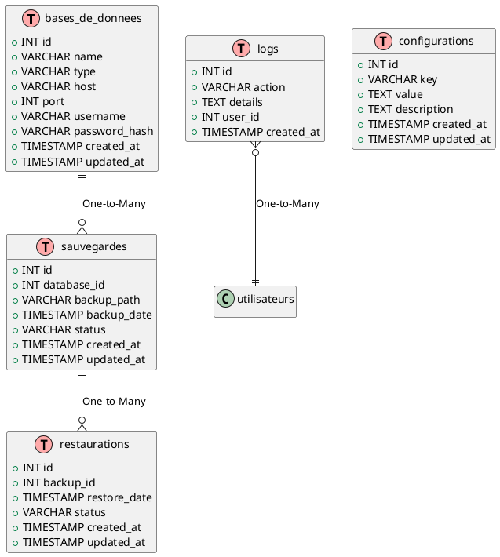

# Design de l'Architecture de la Base de Données

## Introduction

Ce document décrit la conception des tables de la base de données MySQL pour SafeBase, en détaillant les tables nécessaires, leurs colonnes, types de données, relations, et le code SQL correspondant.

## Table des Bases de Données

Cette table stocke les informations de connexion des bases gérées par SafeBase.

- **Nom de la table** : `bases_de_donnees`
- **Colonnes** :
  - `id` (INT, PRIMARY KEY, AUTO_INCREMENT) : Identifiant unique de la base de données.
  - `name` (VARCHAR(255), NOT NULL) : Nom de la base de données.
  - `type` (VARCHAR(50), NOT NULL) : Type de la base de données (ex. : MySQL, PostgreSQL).
  - `host` (VARCHAR(255), NOT NULL) : Adresse hôte de la base de données.
  - `port` (INT, NOT NULL) : Port de connexion.
  - `username` (VARCHAR(255), NOT NULL) : Nom d'utilisateur pour la connexion.
  - `password_hash` (VARCHAR(255), NOT NULL) : Hash du mot de passe pour un accès sécurisé.
  - `created_at` (TIMESTAMP, DEFAULT CURRENT_TIMESTAMP) : Date de création de l'entrée.
  - `updated_at` (TIMESTAMP, DEFAULT CURRENT_TIMESTAMP ON UPDATE CURRENT_TIMESTAMP) : Dernière mise à jour.

**Code SQL** :

```sql
CREATE TABLE bases_de_donnees (
    id INT AUTO_INCREMENT PRIMARY KEY,
    name VARCHAR(255) NOT NULL,
    type VARCHAR(50) NOT NULL,
    host VARCHAR(255) NOT NULL,
    port INT NOT NULL,
    username VARCHAR(255) NOT NULL,
    password_hash VARCHAR(255) NOT NULL,
    created_at TIMESTAMP DEFAULT CURRENT_TIMESTAMP,
    updated_at TIMESTAMP DEFAULT CURRENT_TIMESTAMP ON UPDATE CURRENT_TIMESTAMP
);
```

## Table des Sauvegardes

Cette table enregistre les informations des sauvegardes de bases de données.

- **Nom de la table** : `sauvegardes`
- **Colonnes** :
  - `id` (INT, PRIMARY KEY, AUTO_INCREMENT) : Identifiant unique de la sauvegarde.
  - `database_id` (INT, FOREIGN KEY) : Référence à l'ID de la base de données dans `bases_de_donnees`.
  - `backup_path` (VARCHAR(255), NOT NULL) : Chemin de stockage de la sauvegarde.
  - `backup_date` (TIMESTAMP, DEFAULT CURRENT_TIMESTAMP) : Date de la sauvegarde.
  - `status` (VARCHAR(50)) : Statut de la sauvegarde (ex. : succès, échec).
  - `created_at` (TIMESTAMP, DEFAULT CURRENT_TIMESTAMP) : Date de création de l'entrée.
  - `updated_at` (TIMESTAMP, DEFAULT CURRENT_TIMESTAMP ON UPDATE CURRENT_TIMESTAMP) : Dernière mise à jour.

**Code SQL** :

```sql
CREATE TABLE sauvegardes (
    id INT AUTO_INCREMENT PRIMARY KEY,
    database_id INT,
    backup_path VARCHAR(255) NOT NULL,
    backup_date TIMESTAMP DEFAULT CURRENT_TIMESTAMP,
    status VARCHAR(50),
    created_at TIMESTAMP DEFAULT CURRENT_TIMESTAMP,
    updated_at TIMESTAMP DEFAULT CURRENT_TIMESTAMP ON UPDATE CURRENT_TIMESTAMP,
    FOREIGN KEY (database_id) REFERENCES bases_de_donnees(id) ON DELETE CASCADE
);
```

## Table des Restaurations

Cette table suit les restaurations effectuées à partir des sauvegardes.

- **Nom de la table** : `restaurations`
- **Colonnes** :
  - `id` (INT, PRIMARY KEY, AUTO_INCREMENT) : Identifiant unique de la restauration.
  - `backup_id` (INT, FOREIGN KEY) : Référence à l'ID de la sauvegarde dans `sauvegardes`.
  - `restore_date` (TIMESTAMP, DEFAULT CURRENT_TIMESTAMP) : Date de la restauration.
  - `status` (VARCHAR(50)) : Statut de la restauration (ex. : succès, échec).
  - `created_at` (TIMESTAMP, DEFAULT CURRENT_TIMESTAMP) : Date de création de l'entrée.
  - `updated_at` (TIMESTAMP, DEFAULT CURRENT_TIMESTAMP ON UPDATE CURRENT_TIMESTAMP) : Dernière mise à jour.

**Code SQL** :

```sql
CREATE TABLE restaurations (
    id INT AUTO_INCREMENT PRIMARY KEY,
    backup_id INT,
    restore_date TIMESTAMP DEFAULT CURRENT_TIMESTAMP,
    status VARCHAR(50),
    created_at TIMESTAMP DEFAULT CURRENT_TIMESTAMP,
    updated_at TIMESTAMP DEFAULT CURRENT_TIMESTAMP ON UPDATE CURRENT_TIMESTAMP,
    FOREIGN KEY (backup_id) REFERENCES sauvegardes(id) ON DELETE CASCADE
);
```

## Table des Utilisateurs

Cette table stocke les informations des utilisateurs du système SafeBase.

- **Nom de la table** : `utilisateurs`
- **Colonnes** :
  - `id` (INT, PRIMARY KEY, AUTO_INCREMENT) : Identifiant unique de l'utilisateur.
  - `username` (VARCHAR(255), NOT NULL) : Nom d'utilisateur.
  - `email` (VARCHAR(255), NOT NULL) : Adresse email de l'utilisateur.
  - `password_hash` (VARCHAR(255), NOT NULL) : Hash du mot de passe de l'utilisateur pour un accès sécurisé.
  - `created_at` (TIMESTAMP, DEFAULT CURRENT_TIMESTAMP) : Date de création de l'entrée.
  - `updated_at` (TIMESTAMP, DEFAULT CURRENT_TIMESTAMP ON UPDATE CURRENT_TIMESTAMP) : Dernière mise à jour.

**Code SQL** :

```sql
CREATE TABLE utilisateurs (
    id INT AUTO_INCREMENT PRIMARY KEY,
    username VARCHAR(255) NOT NULL,
    email VARCHAR(255) NOT NULL,
    password_hash VARCHAR(255) NOT NULL,
    created_at TIMESTAMP DEFAULT CURRENT_TIMESTAMP,
    updated_at TIMESTAMP DEFAULT CURRENT_TIMESTAMP ON UPDATE CURRENT_TIMESTAMP
);
```

## Table des Logs

Cette table enregistre les actions importantes effectuées dans le système.

- **Nom de la table** : `logs`
- **Colonnes** :
  - `id` (INT, PRIMARY KEY, AUTO_INCREMENT) : Identifiant unique du log.
  - `action` (VARCHAR(255), NOT NULL) : Action réalisée (ex. : sauvegarde, restauration).
  - `details` (TEXT) : Détails supplémentaires sur l'action.
  - `user_id` (INT, FOREIGN KEY) : Référence à l'utilisateur ayant généré le log.
  - `created_at` (TIMESTAMP, DEFAULT CURRENT_TIMESTAMP) : Date de création du log.

**Code SQL** :

```sql
CREATE TABLE logs (
    id INT AUTO_INCREMENT PRIMARY KEY,
    action VARCHAR(255) NOT NULL,
    details TEXT,
    user_id INT,
    created_at TIMESTAMP DEFAULT CURRENT_TIMESTAMP,
    FOREIGN KEY (user_id) REFERENCES utilisateurs(id) ON DELETE SET NULL
);
```

## Table des Configurations

Cette table stocke les paramètres de configuration globaux du système.

- **Nom de la table** : `configurations`
- **Colonnes** :
  - `id` (INT, PRIMARY KEY, AUTO_INCREMENT) : Identifiant unique de la configuration.
  - `key` (VARCHAR(255), NOT NULL) : Clé de configuration.
  - `value` (TEXT) : Valeur de la configuration.
  - `description` (TEXT) : Description de la configuration.
  - `created_at` (TIMESTAMP, DEFAULT CURRENT_TIMESTAMP) : Date de création de l'entrée.
  - `updated_at` (TIMESTAMP, DEFAULT CURRENT_TIMESTAMP ON UPDATE CURRENT_TIMESTAMP) : Dernière mise à jour.

**Code SQL** :

```sql
CREATE TABLE configurations (
    id INT AUTO_INCREMENT PRIMARY KEY,
    key VARCHAR(255) NOT NULL,
    value TEXT,
    description TEXT,
    created_at TIMESTAMP DEFAULT CURRENT_TIMESTAMP,
    updated_at TIMESTAMP DEFAULT CURRENT_TIMESTAMP ON UPDATE CURRENT_TIMESTAMP
);
```

## Planification des Relations entre les Tables

### Relation entre les Bases de Données et les Sauvegardes

- **Type de relation** : One-to-Many
- **Explication** : Une base de données peut avoir plusieurs sauvegardes associées. Cela signifie que chaque enregistrement dans la table `bases_de_donnees` peut être lié à plusieurs enregistrements dans la table `sauvegardes`.
- **Clé étrangère** : La colonne `database_id` dans la table `sauvegardes` fait référence à la colonne `id` dans la table `bases_de_donnees`.

**SQL :**

```sql
ALTER TABLE sauvegardes
ADD CONSTRAINT fk_database
FOREIGN KEY (database_id) REFERENCES bases_de_donnees(id)
ON DELETE CASCADE;
```

### Relation entre les Sauvegardes et les Restaurations

- **Type de relation** : One-to-Many
- **Explication** : Une sauvegarde peut être utilisée pour plusieurs restaurations. Chaque enregistrement dans la table `sauvegardes` peut être lié à plusieurs enregistrements dans la table `restaurations`.
- **Clé étrangère** : La colonne `backup_id` dans la table `restaurations` fait référence à la colonne `id` dans la table `sauvegardes`.

**SQL :**

```sql
ALTER TABLE restaurations
ADD CONSTRAINT fk_backup
FOREIGN KEY (backup_id) REFERENCES sauvegardes(id)
ON DELETE CASCADE;
```

### Relation entre les Actions Utilisateur et les Logs

- **Type de relation** : One-to-Many
- **Explication** : Un utilisateur peut générer plusieurs logs d'activité dans le système. Chaque enregistrement dans la table `utilisateurs` (ou équivalent) peut être lié à plusieurs enregistrements dans la table `logs`.
- **Clé étrangère** : La colonne `user_id` dans la table `logs` fait référence à la colonne `id` dans la table `utilisateurs` (ou une table similaire).

**SQL :**

```sql
ALTER TABLE logs
ADD CONSTRAINT fk_user
FOREIGN KEY (user_id) REFERENCES utilisateurs(id)
ON DELETE SET NULL;
```

### Intégrité des Données et Clés Étrangères

Pour garantir l'intégrité des données entre les tables liées, nous utilisons des clés étrangères avec des actions spécifiques en cas de suppression d'un enregistrement :

- **ON DELETE CASCADE** : Si un enregistrement de la table parent (ex. : `bases_de_donnees` ou `sauvegardes`) est supprimé, tous les enregistrements associés dans les tables enfant (`sauvegardes`, `restaurations`) seront également supprimés.
- **ON DELETE SET NULL** : Pour la table `logs`, si l'utilisateur est supprimé, les logs associés ne seront pas supprimés mais leur champ `user_id` sera mis à `NULL`.

## Concevoir les Schémas de Bases de Données

### 1. **Diagramme Entité-Relation (ERD)**

Le diagramme ci-dessous montre la structure des tables de la base de données SafeBase et les relations entre elles. Il représente les entités principales et leurs associations dans le système.



### 2. **Optimisation des Index**

Pour améliorer les performances des requêtes SQL, des index sont ajoutés sur les colonnes fréquemment utilisées dans les jointures ou les filtres.

#### Index ajoutés

- **Index sur `database_id`** dans la table `sauvegardes` pour optimiser les recherches de sauvegardes d'une base spécifique.
- **Index sur `backup_id`** dans la table `restaurations` pour améliorer les requêtes récupérant les restaurations associées à une sauvegarde.

**SQL pour la création des index :**

```sql
-- Index sur database_id dans la table sauvegardes
CREATE INDEX idx_database_id ON sauvegardes(database_id);

-- Index sur backup_id dans la table restaurations
CREATE INDEX idx_backup_id ON restaurations(backup_id);
```

### 3. **Planification des Migrations de Schéma**

Pour gérer les évolutions du schéma de la base de données (ajout, modification, suppression de colonnes ou de tables), nous recommandons l'utilisation de **Flyway** pour orchestrer les migrations.

#### Étapes principales pour utiliser Flyway

1. **Installation de Flyway** : Téléchargez Flyway et configurez-le pour interagir avec votre base de données.
2. **Création des fichiers de migration** : Chaque changement de schéma est enregistré dans un fichier SQL versionné (`V1__Create_initial_schema.sql`).
3. **Exécution des migrations** : Flyway applique les migrations dans l'ordre pour garantir la cohérence des modifications.

#### Exemple de migration SQL

```sql
-- V1__Create_initial_schema.sql
CREATE TABLE exemples (
    id INT PRIMARY KEY,
    nom VARCHAR(255)
);
```
