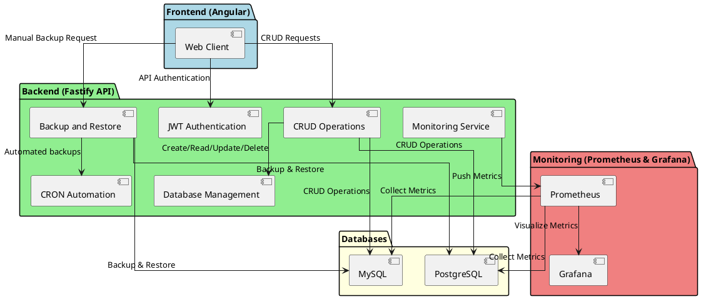
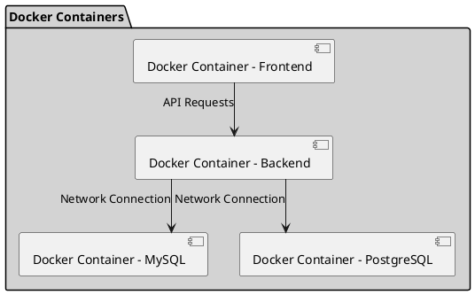
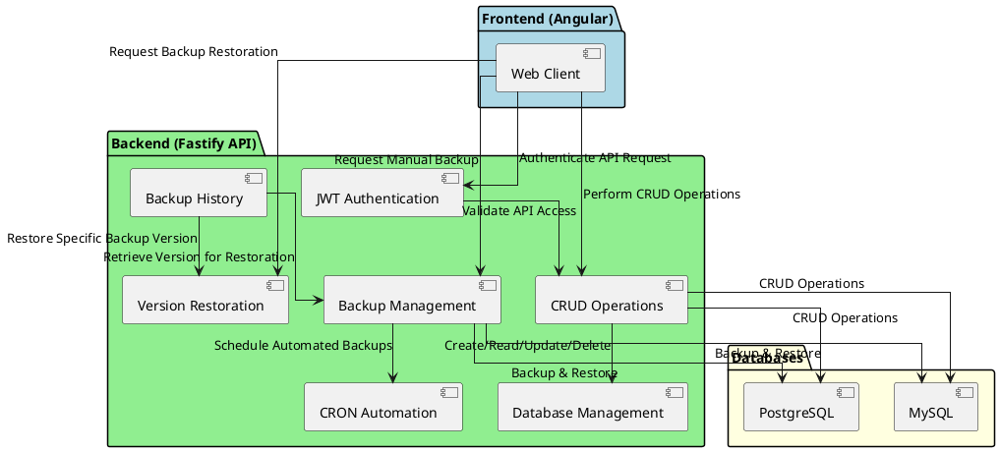
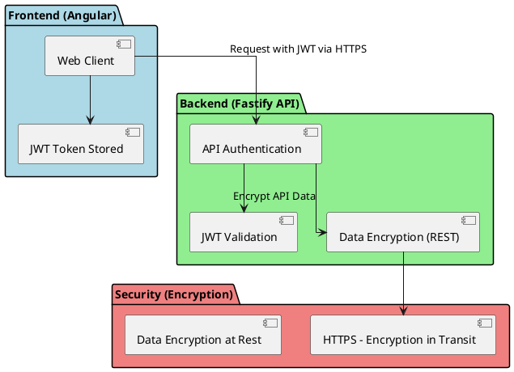
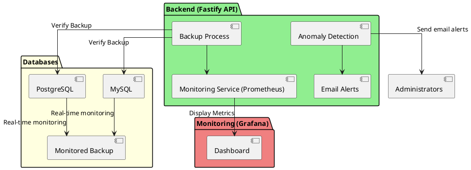
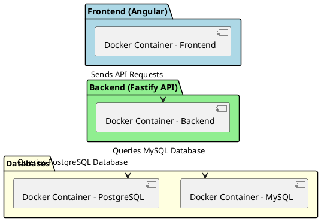
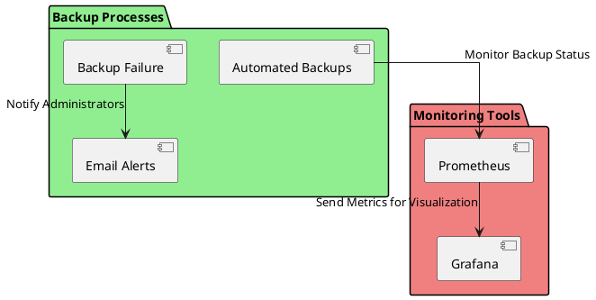

# **Document des Exigences Techniques (TRD) - SafeBase**

# **1. Introduction**

SafeBase est une solution intégrée de gestion de bases de données, spécifiquement conçue pour automatiser les processus critiques de sauvegarde, restauration et surveillance en temps réel. Ce projet s'articule autour d'une API REST simple, sécurisée et performante. SafeBase permet aux administrateurs de bases de données de configurer facilement des sauvegardes automatiques, de surveiller les erreurs et de restaurer des versions antérieures en cas de besoin.

### 1.1 **Contexte**

Dans le cadre de la gestion des bases de données, les entreprises font face à des risques élevés en cas de perte de données. Que ce soit pour des raisons de pannes matérielles, d'erreurs humaines ou de cyberattaques, la récupération rapide et fiable des données est primordiale. SafeBase répond à ce besoin en offrant un système complet pour assurer la continuité de service.

### 1.2 **Objectifs du Projet**

Les objectifs de SafeBase sont :

- Automatiser les sauvegardes et restaurations des bases de données MySQL et PostgreSQL.
- Fournir une interface de gestion simple et intuitive pour les administrateurs.
- Surveiller les erreurs en temps réel et notifier les administrateurs en cas de problème.

### 1.3 **Public cible**

Ce projet s'adresse principalement aux administrateurs de bases de données, responsables IT, et développeurs qui souhaitent automatiser les tâches de sauvegarde et garantir une sécurité optimale des données.

### **2. Technologies et Outils**

SafeBase utilise des technologies modernes pour garantir performance, sécurité et simplicité.

#### **Backend : Fastify**

- **Fastify** est un framework Node.js performant, utilisé pour gérer l'API REST.
- **Avantages :** Faible latence, support des schémas JSON pour la validation, extensibilité et modularité.
  
#### **Frontend : Angular**

- **Angular** est un framework frontend de Google, idéal pour les interfaces interactives et performantes.
- **Avantages :** Gestion efficace des interfaces dynamiques, structure adaptée aux grands projets, large écosystème et documentation.

#### **Bases de Données : MySQL et PostgreSQL**

SafeBase supporte **MySQL** et **PostgreSQL**, deux SGBD largement utilisés.

- **MySQL** : Très adopté, performant pour les applications web, compatible avec de nombreux outils.
- **PostgreSQL** : Robuste, gestion des données complexes et transactions ACID.

#### **Conteneurisation : Docker**

**Docker** permet d’isoler et de déployer des applications de manière reproductible.

- **Avantages :** Simplifie le déploiement, assure un environnement stable pour tous les services, facilite les tests en local et en production.

#### **Orchestration des Services : Docker Compose**

**Docker Compose** orchestre les services (backend, frontend, bases de données) via un fichier unique.

- **Avantages :** Simplifie la gestion des environnements multi-conteneurs et permet un déploiement facile avec une seule commande.

#### **Surveillance et Monitoring : Prometheus et Grafana**

SafeBase utilise **Prometheus** pour la collecte des métriques et **Grafana** pour la visualisation en temps réel.

- **Avantages :**
  - **Prometheus** : Collecte des métriques et alerte en cas d'incident.
  - **Grafana** : Visualisation des performances via des tableaux de bord interactifs.

### **2.7 Schéma d'Architecture Technique**

Les schémas suivants illustrent l'architecture globale de SafeBase, montrant les interactions entre le **frontend**, le **backend**, les **bases de données**, et le **système de monitoring**. Un deuxième schéma présente l'infrastructure Docker de manière isolée pour une meilleure lisibilité.

---

#### **Schéma d'Architecture Système Principal**

Ce schéma montre les interactions entre les composants principaux : **Angular frontend**, **Fastify backend**, **bases de données** (MySQL, PostgreSQL), et le système de **monitoring** (Prometheus, Grafana).

---

#### **Schéma de l'Infrastructure Docker**

Ce schéma montre les conteneurs Docker qui hébergent les différents services (frontend, backend, bases de données) et leurs connexions réseau.

---

### Explication

1. **Schéma d'Architecture Système Principal** :
   - **Frontend (Angular)** : Le client Web interagit avec l'API pour l'authentification, les opérations CRUD et la gestion des sauvegardes.
   - **Backend (Fastify API)** : Gère l'authentification (JWT), les opérations CRUD, les tâches de sauvegarde/restauration, et l'envoi des métriques au système de monitoring.
   - **Bases de Données** : MySQL et PostgreSQL, utilisées pour stocker et restaurer les données.
   - **Monitoring** : Prometheus collecte les métriques et Grafana les visualise.

2. **Schéma de l'Infrastructure Docker** :
   - Montre les **conteneurs Docker** qui isolent chaque service (frontend, backend, bases de données) et leurs connexions réseau pour une communication fluide.

# **3. Exigences Techniques**

### **3.1 API REST**

L'API REST de SafeBase permet la gestion complète des bases de données, des sauvegardes manuelles et automatisées, ainsi que la restauration de versions spécifiques des sauvegardes, avec un contrôle sécurisé par JWT.

---

#### **Routes CRUD**

L'API REST gère les opérations **Create, Read, Update, Delete (CRUD)** pour MySQL et PostgreSQL, permettant :

- La création, modification et suppression de connexions à des bases de données.
- La consultation des bases de données disponibles.

---

#### **Sauvegardes**

- **Manuelles** : L'utilisateur peut déclencher une sauvegarde à tout moment via une requête API.
- **Automatisées** : Des tâches **CRON** sont configurées pour des sauvegardes automatiques à intervalles réguliers.

---

#### **Versions de Sauvegarde**

L'API REST garde un historique des sauvegardes et permet la **restauration de versions spécifiques** via une requête API dédiée.

---

#### **Schéma d'Architecture Technique : API REST**

Voici le schéma représentant le fonctionnement détaillé de l'API REST, sans inclure d'autres composants comme le monitoring. Ce schéma met l'accent sur les interactions de l'API avec les bases de données pour les opérations CRUD, la gestion des sauvegardes et des versions.

### **Explications** :

1. **Frontend (Angular)** : Le client web interagit avec l'API REST pour effectuer des opérations CRUD, des sauvegardes, et restaurer des versions spécifiques.
2. **Backend (Fastify API)** :
   - **CRUD Operations** : Gestion des bases de données MySQL et PostgreSQL (création, lecture, modification, suppression).
   - **Backup Management** : Sauvegardes manuelles ou automatisées via des tâches CRON.
   - **Backup History** : Historisation des sauvegardes et possibilité de restaurer une version spécifique.
   - **JWT Authentication** : Authentification des requêtes pour sécuriser l'accès aux fonctionnalités API.
3. **Databases (MySQL, PostgreSQL)** : Interactions avec les bases de données pour réaliser les opérations CRUD et les sauvegardes.

### **3.2 Sécurité**

SafeBase garantit la protection des données et des accès via des mécanismes de **sécurité avancés**, y compris l'authentification sécurisée et le chiffrement des communications et des données.

---

#### **Authentification avec JWT**

L'authentification repose sur des **JSON Web Tokens (JWT)** :

- L'utilisateur s'authentifie avec ses identifiants.
- Un **jeton JWT** est généré et stocké côté client.
- Ce jeton est ensuite inclus dans chaque requête pour valider l'accès aux services API.

---

#### **Chiffrement**

- **Chiffrement en transit** : Toutes les communications entre le client et le serveur sont protégées par **HTTPS**.
- **Chiffrement au repos** : Les données sensibles, y compris les sauvegardes, sont **chiffrées** lorsqu'elles sont stockées.

---

#### **Schéma d'Architecture Technique : Sécurité et Chiffrement**

Ce schéma est dédié aux **mécanismes de sécurité** et au **chiffrement** utilisés dans SafeBase, illustrant l'authentification via JWT et la protection des communications.

### Explications supplémentaires :

1. **Frontend (Angular)** : 
   - Le **Web Client** stocke le jeton JWT après l'authentification, et ce jeton est inclus dans chaque requête pour accéder aux services API.
   
2. **Backend (Fastify API)** : 
   - Valide chaque requête API avec le **JWT** pour garantir que l'utilisateur est authentifié.
   - Chiffre les données en transit via HTTPS avant de les envoyer.

3. **Chiffrement** :
   - **HTTPS** est utilisé pour **chiffrer les communications en transit** entre le client et le serveur.
   - Les **données sensibles** et les **sauvegardes** sont également **chiffrées lorsqu'elles sont stockées** pour garantir leur sécurité.

### **3.3 Surveillance et Alertes**

SafeBase surveille en temps réel les bases de données et les processus de sauvegarde. En cas d'anomalie, le système envoie des **alertes automatiques** pour permettre une intervention rapide.

---

#### **Monitoring**

Le système de **monitoring** surveille en temps réel l'état des bases de données et des sauvegardes, et enregistre les anomalies sur un tableau de bord via **Grafana**.

---

#### **Notifications**

Lorsqu'une anomalie est détectée, des **alertes** sont envoyées par email aux administrateurs pour une intervention immédiate.

---

#### **Schéma d'Architecture Technique : Surveillance et Alertes**

Le schéma suivant représente le **système de surveillance** de SafeBase, avec la gestion des **métriques** et l'envoi des **alertes** en cas d'anomalie.

### Explications supplémentaires :

1. **Backend (Fastify API)** :
   - Le **processus de sauvegarde** est surveillé en temps réel. Si une anomalie est détectée (échec de sauvegarde, déconnexion), elle est transmise au service de monitoring.
   - La **détection d'anomalies** déclenche l'envoi d'**alertes par email** aux administrateurs.

2. **Bases de Données (MySQL, PostgreSQL)** :
   - Les bases de données sont **surveillées en temps réel** pendant le processus de sauvegarde.

3. **Monitoring (Prometheus & Grafana)** :
   - **Prometheus** collecte les métriques liées aux bases de données et aux sauvegardes, qui sont affichées en temps réel dans un **tableau de bord Grafana**.
   - Lorsqu'une anomalie est détectée, une alerte est envoyée automatiquement aux administrateurs par email.

# **4. Conteneurisation et Déploiement**

La conteneurisation est au cœur de la stratégie de déploiement de SafeBase, permettant une gestion efficace et modulaire des services. L'utilisation de **Docker** et **Docker Compose** garantit un déploiement rapide et une isolation complète des composants, que ce soit pour le développement local ou la production.

---

### **4.1 Dockerfiles**

Chaque composant de SafeBase est conteneurisé de manière indépendante à l'aide de **Dockerfiles**, assurant l'isolation et la portabilité des services.

- **Backend (Fastify) :** Un Dockerfile est créé pour l'API REST du backend, qui comprend toutes les dépendances nécessaires, comme Node.js et les modules utilisés pour gérer les bases de données MySQL et PostgreSQL.
  
- **Frontend (Angular) :** Le Dockerfile du frontend est responsable de la compilation de l'application Angular et de son déploiement dans un serveur web léger (NGINX), garantissant une interface utilisateur performante et disponible.

- **Bases de données (MySQL et PostgreSQL) :** Les bases de données sont soit basées sur des images Docker officielles, soit personnalisées avec des Dockerfiles spécifiques pour gérer des configurations avancées (comme la gestion des volumes de persistance et la sécurité).

---

### **4.2 Docker Compose**

**Docker Compose** orchestre tous les services SafeBase (backend, frontend, bases de données) via un fichier de configuration unique (`docker-compose.yml`). Cela permet un déploiement simplifié de l'ensemble de l'application et assure une communication fluide entre les différents conteneurs.

- **Orchestration des services :** Le fichier `docker-compose.yml` définit les services nécessaires (API backend, application frontend, bases de données) et configure les volumes, réseaux et variables d'environnement, garantissant une isolation complète et une persistance des données des bases de données.

- **Simplification du déploiement :** Une seule commande (`docker-compose up`) permet de déployer l'ensemble des services, facilitant ainsi le déploiement en environnement local ou en production. Cela assure également une reproductibilité complète de l'environnement de travail, réduisant les erreurs liées aux incompatibilités.

---

**Schéma de l’architecture technique :**  
Le schéma suivant montre l'orchestration des services backend, frontend, et bases de données, et leur interconnexion via Docker Compose.

### **5. Maintenance et Monitoring**

SafeBase utilise des outils de **surveillance en temps réel** et met en place des processus de **maintenance automatisés** pour assurer la stabilité des services et la fiabilité des sauvegardes.

---

#### **Monitoring**

SafeBase intègre **Prometheus** pour la collecte des métriques et **Grafana** pour la visualisation en temps réel. Ces outils permettent de suivre l’état des bases de données et des performances globales du système.

---

#### **Maintenance**

Les sauvegardes sont effectuées régulièrement pour assurer la **disponibilité des données**. En cas de problème, des **notifications automatiques** sont envoyées aux administrateurs pour permettre une intervention rapide.

---

#### **Schéma d'Architecture Technique : Maintenance et Monitoring**

Le schéma suivant montre comment **Prometheus** et **Grafana** sont utilisés pour surveiller l’état du système et comment les processus de sauvegardes automatisées assurent la stabilité du service.

### Explications supplémentaires :

1. **Backend (Fastify API)** :
   - Le **Backend** gère les processus de **sauvegardes automatisées** des bases de données.
   - En cas d'**échec de sauvegarde**, des **alertes par email** sont envoyées aux administrateurs pour notifier l'erreur.

2. **Monitoring Tools (Prometheus & Grafana)** :
   - **Prometheus** surveille en temps réel les processus et collecte des métriques sur l’état du système.
   - **Grafana** affiche ces métriques sur des **tableaux de bord** interactifs pour permettre une meilleure visualisation des performances.

3. **Bases de Données (MySQL/PostgreSQL)** :
   - Les bases de données sont régulièrement sauvegardées, et les sauvegardes sont stockées pour garantir la disponibilité des données.
