# **Étude UML des Cas d'Utilisation pour le Projet SafeBase**

## Table des matières

1. [Introduction](#1-introduction)
2. [Contexte du projet](#2-contexte-du-projet)
3. [Diagramme de Cas d'Utilisation Global](#3-diagramme-de-cas-dutilisation-global)
4. [Description détaillée des Cas d'Utilisation](#4-description-détaillée-des-cas-dutilisation)
   - [Gérer les bases de données (CRUD)](#41-gérer-les-bases-de-données-crud)
   - [Automatiser les sauvegardes](#42-automatiser-les-sauvegardes)
   - [Effectuer une sauvegarde manuelle](#43-effectuer-une-sauvegarde-manuelle)
   - [Restaurer une base de données](#44-restaurer-une-base-de-données)
   - [Surveiller le système (bases de données et processus de sauvegarde)](#45-surveiller-le-système-bases-de-données-et-processus-de-sauvegarde)
   - [Recevoir des alertes en cas d'anomalies](#46-recevoir-des-alertes-en-cas-danomalies)
5. [Cas d'Utilisation Supplémentaires](#5-cas-dutilisation-supplémentaires)
   - [Gérer les utilisateurs et permissions](#51-gérer-les-utilisateurs-et-permissions)
   - [Consulter les logs et rapports système](#52-consulter-les-logs-et-rapports-système)
   - [Configurer les alertes](#53-configurer-les-alertes)
   - [Exporter et importer des bases de données](#54-exporter-et-importer-des-bases-de-données)
   - [Gérer les quotas de stockage pour les sauvegardes](#55-gérer-les-quotas-de-stockage-pour-les-sauvegardes)
6. [Conclusion](#6-conclusion)

## Introduction

SafeBase est une solution de gestion de sauvegardes et de restauration de bases de données via une API REST. Le système permet aux administrateurs de planifier, surveiller et restaurer les bases de données tout en automatisant les processus critiques à l'aide de tâches CRON.

Les acteurs principaux sont :

- **Administrateur** : Responsable de la gestion des bases de données, des sauvegardes et de la surveillance.
- **Utilisateur** : Accès limité pour consulter ou restaurer les bases de données.

Les fonctionnalités principales incluent :

- Gestion des bases de données (CRUD)
- Automatisation des sauvegardes
- Restauration des bases de données
- Surveillance du système et alertes en cas de problème

[Retour au sommaire](#table-des-matières)

## 2. Contexte du Projet

SafeBase propose une API REST permettant de gérer la sauvegarde et la restauration des bases de données. Le système utilise des technologies comme MySQL, Postgres et les tâches CRON pour automatiser les processus de sauvegarde.

### Fonctionnalités principales

- **Sauvegarde automatisée** : Utilisation de CRON pour programmer des sauvegardes périodiques des bases de données.
- **Gestion des versions** : Historique des versions sauvegardées, avec possibilité de restaurer une version spécifique.
- **Surveillance en temps réel** : Génération d'alertes en cas d'erreurs lors des sauvegardes ou des restaurations.
- **Interface utilisateur** : Gestion facile des sauvegardes et restaurations via une interface dédiée.

Les administrateurs sont responsables de la configuration des sauvegardes, de la gestion des bases de données, et du suivi des processus via les alertes et les logs.

[Retour au sommaire](#table-des-matières)

## 3. Diagramme de Cas d'Utilisation Global

Le diagramme suivant représente les interactions entre les acteurs principaux (Administrateur, Utilisateur) et le système SafeBase. Il montre également les relations avec les systèmes automatisés (CRON et Système de surveillance).

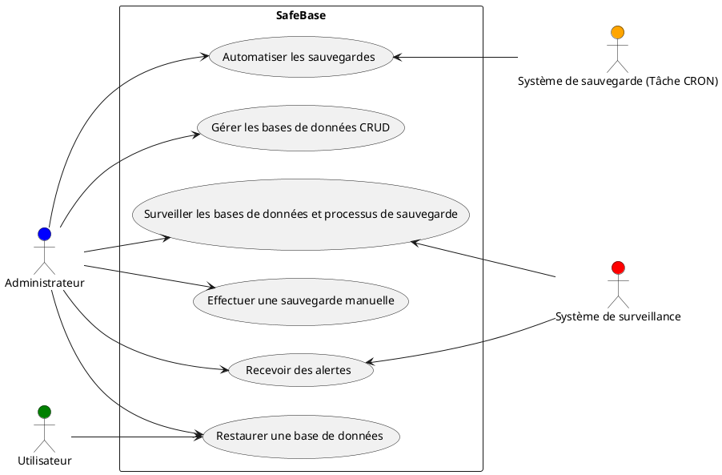

### Explication des acteurs

- **Administrateur** : Gère les bases de données, configure les sauvegardes, surveille le système et reçoit les alertes.
- **Utilisateur** : Peut uniquement restaurer les bases de données.
- **Système CRON** : Automatiser les sauvegardes à intervalle régulier.
- **Système de surveillance** : Surveille les bases de données et les sauvegardes, génère des alertes en cas d'anomalie.

[Retour au sommaire](#table-des-matières)

Passons à la **section 4 : Description Détaillée des Cas d'Utilisation**. Nous allons simplifier chaque sous-section, en mettant l'accent sur les aspects techniques et les diagrammes UML.

---

## 4. Description Détaillée des Cas d'Utilisation

### 4.1 Gérer les bases de données (CRUD)

**Acteur principal** : Administrateur  
**Pré-conditions** : Administrateur authentifié, bases accessibles  
**Post-conditions** : Modifications effectuées avec succès

**Scénario** :  

1. L'administrateur accède à l'interface de gestion des bases de données.  
2. Il sélectionne une base existante ou en ajoute une nouvelle.  
3. Il consulte, modifie ou supprime les informations de la base.  
4. Le système confirme les modifications.

**Diagramme UML** :

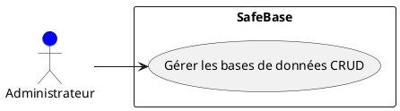

---

### 4.2 Automatiser les sauvegardes

**Acteur principal** : Administrateur  
**Acteur secondaire** : Système de sauvegarde (CRON)  
**Pré-conditions** : Administrateur authentifié, bases accessibles  
**Post-conditions** : Sauvegardes automatiques configurées

**Scénario** :  

1. L'administrateur configure la fréquence des sauvegardes via une tâche CRON.  
2. Le système sauvegarde automatiquement à l'heure prévue.  
3. Le système génère un rapport pour l'administrateur.

**Diagramme UML** :

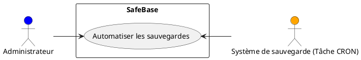

---

### 4.3 Effectuer une sauvegarde manuelle

**Acteur principal** : Administrateur  
**Pré-conditions** : Administrateur authentifié, base accessible  
**Post-conditions** : Sauvegarde effectuée avec succès

**Scénario** :  

1. L'administrateur déclenche manuellement une sauvegarde.  
2. Le système sauvegarde la base sélectionnée.  
3. Un rapport est généré pour confirmer la réussite.

**Diagramme UML** :

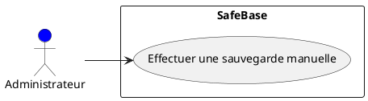

---

### 4.4 Restaurer une base de données

**Acteurs principaux** : Administrateur, Utilisateur  
**Pré-conditions** : Authentification requise, versions de sauvegarde disponibles  
**Post-conditions** : Base restaurée avec succès

**Scénario** :  

1. L'utilisateur sélectionne une version sauvegardée.  
2. Le système restaure la base de données à l'état sélectionné.  
3. Un rapport est généré pour confirmer le succès.

**Diagramme UML** :

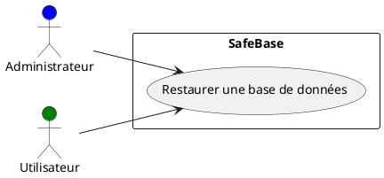

---

### 4.5 Surveiller les bases de données et processus de sauvegarde

**Acteurs principaux** : Administrateur  
**Acteur secondaire** : Système de surveillance  
**Pré-conditions** : Authentification requise, système opérationnel  
**Post-conditions** : Anomalies détectées, alertes envoyées

**Scénario** :  

1. Le système surveille les bases de données et les sauvegardes en temps réel.  
2. L'administrateur consulte l'état du système et reçoit des alertes en cas de problème.

**Diagramme UML** :

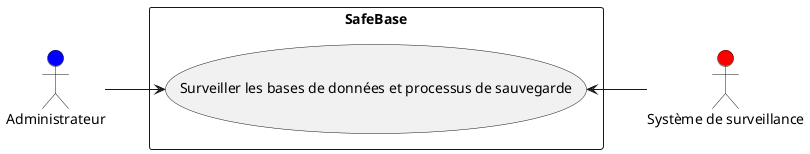

---

### 4.6 Recevoir des alertes en cas d'anomalies

**Acteur principal** : Administrateur  
**Acteur secondaire** : Système de surveillance  
**Pré-conditions** : Authentification requise, alertes configurées  
**Post-conditions** : Alerte envoyée à l'administrateur

**Scénario** :  

1. Une anomalie est détectée par le système de surveillance.  
2. L'alerte est envoyée à l'administrateur pour action corrective.

**Diagramme UML** :

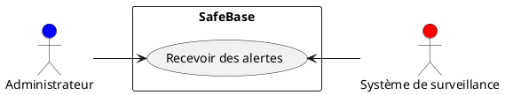

[Retour au sommaire](#table-des-matières)

## 5. Cas d'Utilisation Supplémentaires

### 5.1 Gérer les utilisateurs et permissions

**Acteur principal** : Administrateur  
**Pré-conditions** : Administrateur authentifié  
**Post-conditions** : Utilisateurs créés, modifiés ou supprimés avec succès

**Scénario** :  

1. L'administrateur crée un nouvel utilisateur ou modifie un compte existant.  
2. Il attribue un rôle à l'utilisateur (Administrateur ou Utilisateur standard).  
3. Le système enregistre les modifications et met à jour les permissions.

**Diagramme UML** :

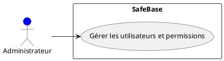

---

### 5.2 Consulter les logs et rapports système

**Acteur principal** : Administrateur  
**Pré-conditions** : Administrateur authentifié  
**Post-conditions** : Logs consultés avec succès

**Scénario** :  

1. L'administrateur accède aux logs et rapports d'activité dans SafeBase.  
2. Il sélectionne les logs spécifiques (logs de bases de données, sauvegardes, erreurs).  
3. Le système affiche les logs correspondants.

**Diagramme UML** :

---

### 5.3 Configurer les alertes

**Acteur principal** : Administrateur  
**Pré-conditions** : Administrateur authentifié  
**Post-conditions** : Alertes configurées avec succès

**Scénario** :  

1. L'administrateur sélectionne les types d'alertes à recevoir (erreurs, succès de sauvegarde).  
2. Il configure les canaux de notification (e-mail, notifications).  
3. Le système enregistre et active les alertes.

**Diagramme UML** :

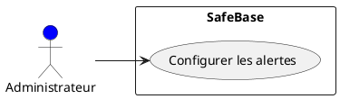

---

### 5.4 Exporter et importer des bases de données

**Acteur principal** : Administrateur  
**Pré-conditions** : Administrateur authentifié, fichiers disponibles pour import  
**Post-conditions** : Bases de données exportées ou importées avec succès

**Scénario** :  

1. L'administrateur sélectionne une base de données pour l'exportation (génération de fichier SQL).  
2. Il importe une base de données en sélectionnant un fichier SQL externe.  
3. Le système valide et exécute l'importation.

**Diagramme UML** :

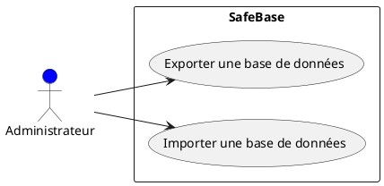

---

### 5.5 Gérer les quotas de stockage pour les sauvegardes

**Acteur principal** : Administrateur  
**Pré-conditions** : Administrateur authentifié  
**Post-conditions** : Quotas de stockage définis avec succès

**Scénario** :  

1. L'administrateur configure les limites de stockage pour les sauvegardes.  
2. Le système applique les quotas et vérifie l'espace disponible lors de la création de nouvelles sauvegardes.  
3. En cas de dépassement de quota, le système génère une alerte.

**Diagramme UML** :

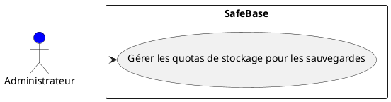

---

Cette **section 5** couvre les **cas d'utilisation supplémentaires** avec une présentation concise et axée sur les diagrammes UML.

Si vous êtes satisfait de cette partie, nous pourrons passer à la **conclusion** du document. Dites-moi quand vous êtes prêt à continuer !

[Retour au sommaire](#table-des-matières)

## 6. Conclusion

Le système **SafeBase** offre une solution complète pour la gestion des bases de données, en intégrant des fonctionnalités clés telles que la gestion CRUD, la planification et l'automatisation des sauvegardes, la surveillance des processus, et la gestion des utilisateurs et des alertes. Grâce à une interface intuitive et à des systèmes de notification et de quotas bien configurés, SafeBase garantit une gestion efficace des données et des sauvegardes.

### Points essentiels

- **Gérer les bases de données (CRUD)** : Gestion des bases de données avec création, modification, et suppression.
- **Automatiser et effectuer des sauvegardes** : Sauvegardes manuelles ou automatiques avec gestion des versions.
- **Restaurer les bases de données** : Restauration des bases de données à partir de versions sauvegardées.
- **Surveillance et alertes** : Suivi en temps réel et notifications en cas d'anomalies.
- **Gestion des utilisateurs et des permissions** : Contrôle des rôles et accès pour les différents utilisateurs du système.

Le présent document a présenté l'ensemble des cas d'utilisation sous forme de diagrammes UML, en mettant en évidence les interactions entre les acteurs et les principales fonctionnalités du système.

[Retour au sommaire](#table-des-matières)
