# **Étude UML des Cas d'Utilisation pour le Projet SafeBase**

## Table des matières

1. [Introduction](#1-introduction)
2. [Contexte du projet](#2-contexte-du-projet)
3. [Diagramme de Cas d'Utilisation Global](#3-diagramme-de-cas-dutilisation-global)
4. [Description détaillée des Cas d'Utilisation](#4-description-détaillée-des-cas-dutilisation)
   - [Gérer les bases de données (CRUD)](#41-gérer-les-bases-de-données-crud)
   - [Automatiser les sauvegardes](#42-automatiser-les-sauvegardes)
   - [Effectuer une sauvegarde manuelle](#43-effectuer-une-sauvegarde-manuelle)
   - [Restaurer une base de données](#44-restaurer-une-base-de-données)
   - [Surveiller le système (bases de données et processus de sauvegarde)](#45-surveiller-le-système-bases-de-données-et-processus-de-sauvegarde)
   - [Recevoir des alertes en cas d'anomalies](#46-recevoir-des-alertes-en-cas-danomalies)
5. [Cas d'Utilisation Supplémentaires](#5-cas-dutilisation-supplémentaires)
   - [Gérer les utilisateurs et permissions](#51-gérer-les-utilisateurs-et-permissions)
   - [Consulter les logs et rapports système](#52-consulter-les-logs-et-rapports-système)
   - [Configurer les alertes](#53-configurer-les-alertes)
   - [Exporter et importer des bases de données](#54-exporter-et-importer-des-bases-de-données)
   - [Gérer les quotas de stockage pour les sauvegardes](#55-gérer-les-quotas-de-stockage-pour-les-sauvegardes)
6. [Conclusion](#6-conclusion)

## 1. Introduction

Le projet **SafeBase** a pour objectif de fournir une solution complète de gestion des bases de données, en mettant l'accent sur l'automatisation des sauvegardes, la gestion des versions sauvegardées, et la surveillance en temps réel des bases de données. Ce système est structuré sous forme d'une API REST, et il est conçu pour répondre aux besoins critiques de gestion et de sécurité des données.

SafeBase offre un ensemble de fonctionnalités clés qui incluent :

- La gestion des bases de données MySQL et Postgres.
- L'automatisation des sauvegardes via des tâches CRON.
- La possibilité de restaurer les bases de données à partir de sauvegardes antérieures.
- Un système de surveillance et d'alertes pour notifier les administrateurs en cas d'erreur.

Cette étude présente tous les cas d'utilisation identifiés pour SafeBase, ainsi que leurs relations avec les différents acteurs du système. Elle inclut les diagrammes UML nécessaires à la compréhension de l'architecture et des interactions au sein du système.

[Retour au sommaire](#table-des-matières)

## 2. Contexte du projet

Le projet **SafeBase** est né d'un besoin crucial de gestion centralisée des bases de données, notamment en ce qui concerne la gestion des sauvegardes et la surveillance en temps réel des opérations critiques. Face à la multiplication des bases de données et à la nécessité de garantir la sécurité et la disponibilité des données, SafeBase propose une solution adaptée, facile à intégrer dans des environnements de production variés.

### Objectifs du projet

SafeBase vise à répondre aux exigences suivantes :

- **Automatisation des sauvegardes** : Assurer la sauvegarde régulière des bases de données grâce à des tâches CRON, afin de garantir la disponibilité des données en cas de défaillance.
- **Gestion des versions de sauvegardes** : Maintenir un historique des différentes versions sauvegardées pour permettre des restaurations précises.
- **Surveillance en temps réel** : Intégrer un système de monitoring en temps réel des bases de données et des processus de sauvegarde, capable de générer des alertes en cas de problème.
- **Gestion via une API REST** : Proposer une interface API simple d’utilisation pour que les administrateurs puissent gérer les bases de données et les processus associés à distance et en toute sécurité.

### Technologies utilisées

Le développement de SafeBase repose sur un ensemble d'outils modernes et performants :

- **Backend** : L'API REST est développée avec **Fastify**, un framework léger et performant.
- **Frontend** : Une interface utilisateur est construite avec **Angular** pour fournir un tableau de bord intuitif permettant de surveiller l'état des bases de données.
- **Base de données** : **MySQL** et **Postgres** sont les bases de données cibles pour les fonctionnalités de sauvegarde et de restauration.
- **Automatisation** : Les tâches de sauvegarde sont gérées via **CRON**, permettant une planification automatique.
- **Tests** : Utilisation de **JestJS** pour les tests unitaires et de **Cypress** pour les tests fonctionnels.
- **Containérisation** : Le projet est entièrement containerisé avec **Docker** et **Docker Compose** pour simplifier le déploiement en production.

[Retour au sommaire](#table-des-matières)

## 3. Diagramme de Cas d'Utilisation Global

Le diagramme de cas d'utilisation global présente une vue d'ensemble des interactions entre les différents acteurs du système **SafeBase** et les fonctionnalités principales de l'application.

### Acteurs principaux

1. **Administrateur** : Utilisateur avec les droits complets pour gérer les bases de données, configurer les sauvegardes, et surveiller l’état du système.
2. **Utilisateur** : Utilisateur avec des permissions limitées, lui permettant principalement de consulter l’état des bases de données et de restaurer des sauvegardes.
3. **Système de sauvegarde (Tâche CRON)** : Processus automatisé qui planifie et exécute des sauvegardes régulières des bases de données.
4. **Système de surveillance** : Composant qui surveille en temps réel les bases de données et les processus de sauvegarde et génère des alertes en cas de défaillance.

### Fonctionnalités principales

1. **Gérer les bases de données (CRUD)** : Permet à l’administrateur de gérer (ajouter, modifier, consulter, supprimer) les bases de données MySQL et Postgres.
2. **Automatiser les sauvegardes** : Configuration de tâches CRON pour exécuter des sauvegardes automatiques à des intervalles réguliers.
3. **Effectuer une sauvegarde manuelle** : Sauvegarde immédiate d'une base de données à la demande de l'administrateur.
4. **Restaurer une base de données** : Récupération d'une base de données à partir d'une sauvegarde antérieure.
5. **Surveiller les bases de données et processus de sauvegarde** : Suivi en temps réel des bases de données et des sauvegardes pour détecter toute anomalie.
6. **Recevoir des alertes** : Notification envoyée à l’administrateur en cas de défaillance dans les processus de sauvegarde ou de restauration.

### Diagramme UML Global (PlantUML)

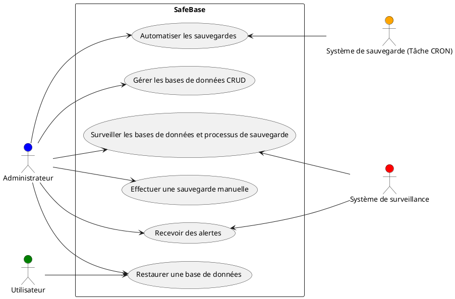

[Retour au sommaire](#table-des-matières)

## 4. **Description détaillée des Cas d'Utilisation**

### 4.1 **Gérer les bases de données (CRUD)**

#### Description

Ce cas d'utilisation permet à l'**Administrateur** de gérer les bases de données en effectuant des opérations CRUD (Création, Lecture, Mise à jour, Suppression) sur les bases de données MySQL et Postgres. Ces opérations sont nécessaires pour la gestion et le maintien des bases de données au sein de SafeBase.

#### Acteurs impliqués

- **Acteur principal** : Administrateur.

#### Pré-conditions

- L'Administrateur est authentifié et connecté à l'interface de gestion de SafeBase.
- Le système SafeBase est opérationnel et les bases de données sont accessibles.

#### Post-conditions

- Les bases de données ont été ajoutées, modifiées, consultées ou supprimées avec succès.

#### Scénario principal

1. **Administrateur** accède à l'interface de gestion des bases de données dans SafeBase.
2. Il sélectionne une base de données existante ou en ajoute une nouvelle.
3. Le système affiche les détails de la base de données sélectionnée ou permet la création d'une nouvelle base.
4. L'Administrateur modifie les informations de la base de données ou la supprime.
5. Le système enregistre les modifications et confirme le succès de l'opération.
6. L'Administrateur reçoit une confirmation visuelle ou un message de réussite.

#### Extensions

- **Erreur de connexion à la base de données** : Si la connexion à la base de données échoue, un message d'erreur est affiché, et l'action est annulée.
- **Base de données introuvable** : Si la base de données à modifier ou supprimer n'est pas trouvée, un message d'erreur est renvoyé à l'Administrateur.

#### Fréquence d'utilisation

- Utilisé fréquemment par l'Administrateur pour la gestion quotidienne des bases de données.

#### Diagramme UML du Cas d'Utilisation

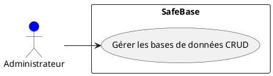

[Retour au sommaire](#table-des-matières)

### 4.2 **Automatiser les sauvegardes**

#### Description

Ce cas d'utilisation permet à l'**Administrateur** de configurer des tâches CRON afin d'automatiser les sauvegardes régulières des bases de données. Une fois ces tâches configurées, le système effectue les sauvegardes automatiquement selon un planning prédéfini, sans intervention manuelle. Cette fonctionnalité garantit la régularité et la fiabilité des sauvegardes pour minimiser les risques de perte de données.

#### Acteurs impliqués

- **Acteur principal** : Administrateur.
- **Acteur secondaire** : Système de sauvegarde (Tâche CRON).

#### Pré-conditions

- L'Administrateur est authentifié et connecté à l'interface de gestion de SafeBase.
- Les bases de données à sauvegarder sont accessibles et configurées correctement.
- Le système SafeBase est opérationnel et peut exécuter des tâches CRON.

#### Post-conditions

- Les tâches CRON de sauvegarde sont configurées et prêtes à être exécutées automatiquement.
- Des rapports sont générés après chaque sauvegarde, confirmant la réussite ou signalant un échec.

#### Scénario principal

1. **Administrateur** accède à l'interface de configuration des sauvegardes automatiques.
2. Il sélectionne les bases de données à sauvegarder et configure les paramètres de sauvegarde (fréquence, intervalle, heure de début).
3. Le système enregistre la configuration et programme les tâches CRON pour automatiser les sauvegardes.
4. À l'heure programmée, le **Système de sauvegarde (Tâche CRON)** exécute automatiquement la sauvegarde des bases de données sélectionnées.
5. Le système génère un rapport de sauvegarde, envoyé à l'Administrateur, confirmant le succès de la sauvegarde ou signalant tout problème rencontré.

#### Extensions

- **Erreur de planification CRON** : Si une tâche CRON est mal configurée ou contient des erreurs, le système affiche un message d'avertissement à l'Administrateur pour corriger la planification.
- **Base de données indisponible** : Si la base de données n'est pas accessible au moment de la sauvegarde, le système envoie une alerte à l'Administrateur pour signaler le problème.

#### Fréquence d'utilisation

- Utilisé régulièrement pour automatiser les sauvegardes des bases de données. La fréquence peut être quotidienne, hebdomadaire, ou autre selon la configuration définie par l'Administrateur.

#### Diagramme UML du Cas d'Utilisation

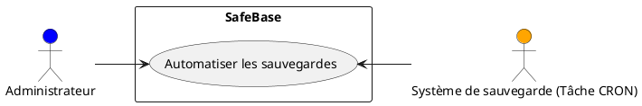

[Retour au sommaire](#table-des-matières)

### 4.3 **Effectuer une sauvegarde manuelle**

#### Description

Ce cas d'utilisation permet à l'**Administrateur** d'exécuter une sauvegarde manuelle d'une base de données à la demande. Contrairement aux sauvegardes automatiques programmées, l'Administrateur peut décider de lancer une sauvegarde à tout moment pour répondre à un besoin immédiat ou en cas d'urgence.

#### Acteurs impliqués

- **Acteur principal** : Administrateur.

#### Pré-conditions

- L'Administrateur est authentifié et connecté à l'interface de gestion de SafeBase.
- La base de données à sauvegarder est définie et accessible.

#### Post-conditions

- La base de données est sauvegardée avec succès et un rapport de sauvegarde est généré pour l'Administrateur.

#### Scénario principal

1. **Administrateur** accède à l'interface de sauvegarde manuelle dans SafeBase.
2. Il sélectionne la base de données qu'il souhaite sauvegarder immédiatement.
3. Le système vérifie que la base de données est accessible et prête à être sauvegardée.
4. L'Administrateur déclenche la sauvegarde.
5. Le système exécute la sauvegarde de la base de données et génère un rapport de succès ou d'échec.
6. L'Administrateur reçoit une notification confirmant le succès de la sauvegarde ou un message d'erreur en cas de problème.

#### Extensions

- **Base de données inaccessible** : Si la base de données sélectionnée n'est pas accessible ou rencontre un problème, le système affiche un message d'erreur et la sauvegarde est annulée.
- **Erreur pendant la sauvegarde** : Si une erreur survient pendant la sauvegarde, un rapport détaillé est envoyé à l'Administrateur pour diagnostiquer le problème.

#### Fréquence d'utilisation

- Utilisé ponctuellement par l'Administrateur lorsqu'il souhaite effectuer une sauvegarde immédiate en dehors des sauvegardes automatiques programmées.

#### Diagramme UML du Cas d'Utilisation

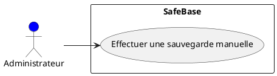

[Retour au sommaire](#table-des-matières)

### 4.4 **Restaurer une base de données**

#### Description

Ce cas d'utilisation permet à l'**Administrateur** ou à un **Utilisateur** de restaurer une base de données à partir d'une version sauvegardée antérieure. Cette fonctionnalité est essentielle en cas de corruption de données, d'erreur humaine, ou pour revenir à un état antérieur de la base de données.

#### Acteurs impliqués

- **Acteur principal** : Administrateur, Utilisateur.

#### Pré-conditions

- L'utilisateur (Administrateur ou Utilisateur) est authentifié et connecté à l'interface de gestion de SafeBase.
- Il existe au moins une version sauvegardée de la base de données disponible pour la restauration.
- La base de données cible est accessible et prête à être restaurée.

#### Post-conditions

- La base de données est restaurée avec succès à partir de la version sélectionnée, et un rapport de restauration est généré.

#### Scénario principal

1. **Utilisateur (Administrateur ou Utilisateur)** accède à l'interface de restauration des bases de données.
2. Il sélectionne la base de données à restaurer et choisit la version de sauvegarde à utiliser.
3. Le système vérifie que la base de données cible est accessible et que la version sélectionnée est valide.
4. L'Utilisateur déclenche le processus de restauration.
5. Le système restaure la base de données à l'état sélectionné et génère un rapport de restauration, confirmant le succès ou signalant un problème.
6. L'Utilisateur reçoit une notification confirmant la réussite de la restauration ou un message d'erreur.

#### Extensions

- **Erreur de version** : Si la version de la sauvegarde sélectionnée est corrompue ou invalide, le système envoie un message d'erreur et propose de choisir une autre version.
- **Base de données inaccessible** : Si la base de données cible est indisponible pour la restauration, un message d'erreur est envoyé à l'Utilisateur, et la restauration est annulée.

#### Fréquence d'utilisation

- Utilisé de manière occasionnelle, principalement en cas de problème nécessitant un retour à un état antérieur des données ou une correction d'erreur.

#### Diagramme UML du Cas d'Utilisation

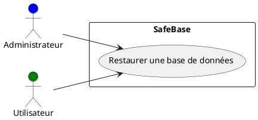

[Retour au sommaire](#table-des-matières)

### 4.5 **Surveiller les bases de données et processus de sauvegarde**

#### Description

Ce cas d'utilisation permet à l'**Administrateur** de surveiller en temps réel l'état des bases de données et des processus de sauvegarde dans SafeBase. Il offre la possibilité de détecter toute anomalie, d'accéder aux logs et de vérifier l'état des sauvegardes pour s'assurer que tout fonctionne correctement.

#### Acteurs impliqués

- **Acteur principal** : Administrateur.
- **Acteur secondaire** : Système de surveillance.

#### Pré-conditions

- L'Administrateur est authentifié et connecté à l'interface de gestion de SafeBase.
- Le système de surveillance est configuré et opérationnel.

#### Post-conditions

- L'état des bases de données et des processus de sauvegarde est surveillé, et des alertes sont générées en cas d'anomalie.

#### Scénario principal

1. **Administrateur** accède à l'interface de surveillance des bases de données et des processus de sauvegarde.
2. Il consulte l'état en temps réel des bases de données, incluant les processus de sauvegarde en cours ou achevés.
3. Le système affiche les logs associés aux bases de données et aux sauvegardes, indiquant les événements récents, les succès ou les échecs.
4. L'Administrateur peut analyser les logs et les métriques pour identifier d'éventuels problèmes ou anomalies.
5. En cas de problème, des alertes sont générées automatiquement par le **Système de surveillance**, et des recommandations sont affichées à l'Administrateur.

#### Extensions

- **Anomalies détectées** : Si une anomalie (échec de sauvegarde, problème d'accès à la base de données, etc.) est détectée, une alerte est envoyée à l'Administrateur avec des informations détaillées sur l'erreur.
- **Log introuvable** : Si les logs ou les informations de surveillance ne sont pas disponibles, un message d'erreur est affiché, invitant l'Administrateur à réessayer plus tard ou à vérifier la configuration du système.

#### Fréquence d'utilisation

- Utilisé régulièrement par l'Administrateur pour surveiller l'état des bases de données et des sauvegardes, particulièrement dans les environnements critiques nécessitant un contrôle constant.

#### Diagramme UML du Cas d'Utilisation

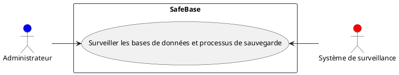

[Retour au sommaire](#table-des-matières)

### 4.6 **Recevoir des alertes en cas d'anomalies**

#### Description

Ce cas d'utilisation permet à l'**Administrateur** de recevoir des alertes automatiques générées par le système lorsque des anomalies sont détectées dans les processus de sauvegarde ou lors de la surveillance des bases de données. Cela permet à l'Administrateur de réagir rapidement et de résoudre les problèmes avant qu'ils ne deviennent critiques.

#### Acteurs impliqués

- **Acteur principal** : Administrateur.
- **Acteur secondaire** : Système de surveillance.

#### Pré-conditions

- L'Administrateur est authentifié et a configuré le système pour recevoir des alertes.
- Le système de surveillance est opérationnel et surveille en temps réel les bases de données et les processus de sauvegarde.

#### Post-conditions

- Des alertes sont envoyées à l'Administrateur en cas d'anomalie, avec les détails nécessaires pour identifier et résoudre le problème.

#### Scénario principal

1. Le **Système de surveillance** détecte une anomalie dans une base de données ou un processus de sauvegarde.
2. Une alerte automatique est générée par le système.
3. L'alerte est envoyée à l'**Administrateur** via les canaux configurés (e-mail, notification, tableau de bord).
4. L'Administrateur consulte l'alerte et reçoit des informations détaillées sur la nature de l'anomalie (échec de sauvegarde, base de données non accessible, etc.).
5. L'Administrateur accède à l'interface de gestion de SafeBase pour résoudre le problème signalé.

#### Extensions

- **Alerte non reçue** : Si, pour une raison quelconque, l'alerte n'est pas envoyée ou reçue, le système réessaye ou indique une erreur dans l'envoi de l'alerte.
- **Problème résolu automatiquement** : Dans certains cas, si le système parvient à résoudre automatiquement l'anomalie (ex. redémarrage automatique d'un processus), une alerte de résolution est envoyée à l'Administrateur.

#### Fréquence d'utilisation

- Utilisé à chaque fois qu'une anomalie est détectée par le système. La fréquence d'utilisation dépend de la robustesse du système et des éventuels problèmes rencontrés.

#### Diagramme UML du Cas d'Utilisation

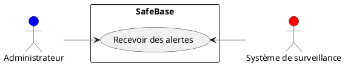

[Retour au sommaire](#table-des-matières)

### 5.1 **Gérer les utilisateurs et permissions**

#### Description

Ce cas d'utilisation permet à l'**Administrateur** de gérer les utilisateurs de SafeBase, en créant de nouveaux comptes utilisateurs, en modifiant les informations des utilisateurs existants et en assignant des rôles et permissions. Cette gestion des utilisateurs permet de définir des niveaux d'accès au système en fonction des responsabilités et besoins des différents utilisateurs.

#### Acteurs impliqués

- **Acteur principal** : Administrateur.

#### Pré-conditions

- L'Administrateur est authentifié et dispose des permissions nécessaires pour gérer les utilisateurs.

#### Post-conditions

- Les utilisateurs sont créés, modifiés ou supprimés avec succès, et leurs rôles et permissions sont correctement définis.

#### Scénario principal

1. **Administrateur** accède à l'interface de gestion des utilisateurs dans SafeBase.
2. Il crée un nouveau compte utilisateur ou sélectionne un utilisateur existant pour modifier ses informations.
3. L'Administrateur assigne un rôle à l'utilisateur (ex. : Administrateur ou Utilisateur standard).
4. Le système enregistre les modifications et met à jour les permissions associées au rôle de l'utilisateur.
5. L'Administrateur reçoit une confirmation de succès.

#### Extensions

- **Erreur de création** : Si un utilisateur ne peut être créé (par exemple, si un compte avec la même adresse e-mail existe déjà), un message d'erreur est renvoyé à l'Administrateur.
- **Rôles non modifiables** : Certains rôles, comme le rôle Super Administrateur, peuvent être immuables et ne peuvent pas être modifiés par un autre utilisateur.

#### Fréquence d'utilisation

- Utilisé occasionnellement par l'Administrateur pour créer de nouveaux utilisateurs, modifier des comptes existants ou gérer les permissions.

#### Diagramme UML du Cas d'Utilisation

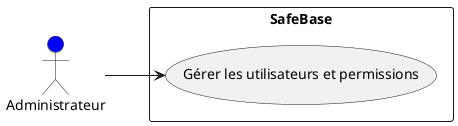

[Retour au sommaire](#table-des-matières)

### 5.2 **Consulter les logs et rapports système**

#### Description

Ce cas d'utilisation permet à l'**Administrateur** de consulter les logs et rapports générés par le système SafeBase. Ces logs incluent des informations sur les opérations effectuées sur les bases de données, les processus de sauvegarde, ainsi que les éventuelles erreurs rencontrées. Cette fonctionnalité est essentielle pour le diagnostic des problèmes et le suivi de l'intégrité des processus.

#### Acteurs impliqués

- **Acteur principal** : Administrateur.

#### Pré-conditions

- L'Administrateur est authentifié et dispose des permissions nécessaires pour accéder aux logs du système.

#### Post-conditions

- Les logs et rapports sont consultés avec succès, et l'Administrateur peut extraire les informations pertinentes.

#### Scénario principal

1. **Administrateur** accède à l'interface des logs et rapports dans SafeBase.
2. Il sélectionne le type de logs qu'il souhaite consulter (logs de bases de données, logs de sauvegarde, logs d'erreurs).
3. Le système affiche les logs correspondants, triés par date et heure.
4. L'Administrateur analyse les logs et peut filtrer ou rechercher des informations spécifiques pour diagnostiquer un problème.
5. Si nécessaire, l'Administrateur peut exporter les logs sous forme de rapport pour un examen plus approfondi.

#### Extensions

- **Logs indisponibles** : Si les logs ne sont pas disponibles pour une raison quelconque (par exemple, problème de stockage), un message d'erreur est affiché à l'Administrateur.
- **Erreur de filtrage** : Si aucun log ne correspond aux critères de filtrage ou de recherche, un message d'information est affiché indiquant qu'aucune donnée n'a été trouvée.

#### Fréquence d'utilisation

- Utilisé régulièrement pour consulter l'historique des activités du système, en particulier lors du diagnostic d'erreurs ou pour vérifier les processus de sauvegarde.

#### Diagramme UML du Cas d'Utilisation

[Retour au sommaire](#table-des-matières)

### 5.3 **Configurer les alertes**

#### Description

Ce cas d'utilisation permet à l'**Administrateur** de configurer des alertes dans SafeBase afin de recevoir des notifications en cas de détection d'anomalies, de succès ou d'échecs lors des processus de sauvegarde ou de restauration. L'Administrateur peut personnaliser les types d'alertes à recevoir ainsi que les canaux de communication (e-mail, notifications dans l'application, etc.).

#### Acteurs impliqués

- **Acteur principal** : Administrateur.

#### Pré-conditions

- L'Administrateur est authentifié et dispose des permissions nécessaires pour configurer les alertes.

#### Post-conditions

- Les alertes sont configurées avec succès, et le système est prêt à notifier l'Administrateur en cas d'anomalies ou d'événements spécifiques.

#### Scénario principal

1. **Administrateur** accède à l'interface de configuration des alertes dans SafeBase.
2. Il sélectionne les événements qui doivent déclencher une alerte (ex. : échec de sauvegarde, base de données non accessible, réussite d'une restauration).
3. L'Administrateur définit les paramètres de notification (canal de communication, fréquence des alertes).
4. Le système enregistre la configuration des alertes et les active.
5. L'Administrateur reçoit une confirmation de la réussite de la configuration.

#### Extensions

- **Erreur de configuration** : Si une erreur survient lors de la configuration des alertes (ex. : un canal de communication n'est pas disponible), un message d'erreur est affiché et l'Administrateur est invité à corriger la configuration.
- **Canal non disponible** : Si le canal de communication sélectionné est temporairement indisponible (ex. : serveur d'e-mail hors ligne), un message d'avertissement est envoyé à l'Administrateur.

#### Fréquence d'utilisation

- Utilisé régulièrement lors de la mise en place ou de la modification des alertes système.

#### Diagramme UML du Cas d'Utilisation

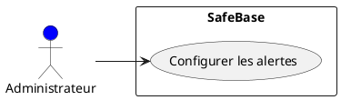

[Retour au sommaire](#table-des-matières)

### 5.4 **Exporter et importer des bases de données**

#### Description

Ce cas d'utilisation permet à l'**Administrateur** d'exporter une base de données existante sous forme de fichier (généralement au format SQL) et d'importer une base de données à partir d'un fichier existant. Cette fonctionnalité est utile pour sauvegarder manuellement des bases de données, effectuer des migrations ou restaurer des bases de données à partir de fichiers.

#### Acteurs impliqués

- **Acteur principal** : Administrateur.

#### Pré-conditions

- L'Administrateur est authentifié et dispose des permissions nécessaires pour exporter ou importer des bases de données.
- Les fichiers nécessaires pour l'importation doivent être disponibles et au bon format.

#### Post-conditions

- La base de données est exportée ou importée avec succès, et un rapport de confirmation est généré.

#### Scénario principal

##### Exporter une base de données

1. **Administrateur** accède à l'interface d'exportation des bases de données.
2. Il sélectionne la base de données à exporter.
3. Le système génère un fichier SQL de la base de données sélectionnée.
4. L'Administrateur télécharge le fichier généré et reçoit une confirmation du succès de l'exportation.

##### Importer une base de données

1. **Administrateur** accède à l'interface d'importation des bases de données.
2. Il sélectionne un fichier SQL ou un autre format de sauvegarde pour importer la base de données.
3. Le système vérifie la validité du fichier.
4. Le système importe la base de données à partir du fichier sélectionné.
5. L'Administrateur reçoit une confirmation du succès de l'importation ou un rapport détaillant les erreurs.

#### Extensions

- **Erreur lors de l'exportation** : Si la base de données ne peut pas être exportée (ex. : problème de connexion à la base), un message d'erreur est affiché, et l'exportation est annulée.
- **Erreur lors de l'importation** : Si le fichier est corrompu ou non conforme au format attendu, le système affiche un message d'erreur et l'importation échoue.

#### Fréquence d'utilisation

- Utilisé occasionnellement lors de la migration de bases de données, pour des sauvegardes manuelles ou lors de restaurations à partir de fichiers externes.

#### Diagramme UML du Cas d'Utilisation

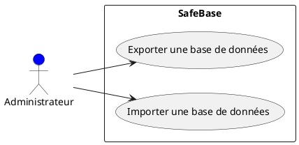

[Retour au sommaire](#table-des-matières)

### 5.5 **Gérer les quotas de stockage pour les sauvegardes**

#### Description

Ce cas d'utilisation permet à l'**Administrateur** de gérer les quotas de stockage disponibles pour les sauvegardes des bases de données. SafeBase offre la possibilité de définir des limites de stockage pour les sauvegardes afin de prévenir une utilisation excessive de l'espace disque et d'assurer une gestion efficace des ressources.

#### Acteurs impliqués

- **Acteur principal** : Administrateur.

#### Pré-conditions

- L'Administrateur est authentifié et dispose des permissions nécessaires pour gérer les quotas de stockage.
- Le système SafeBase doit être configuré pour surveiller l'espace de stockage disponible et les sauvegardes existantes.

#### Post-conditions

- Les quotas de stockage sont définis, modifiés ou ajustés avec succès, et les bases de données respectent ces limites lors de la création de nouvelles sauvegardes.

#### Scénario principal

1. **Administrateur** accède à l'interface de gestion des quotas de stockage dans SafeBase.
2. Il configure les limites de stockage autorisées pour les sauvegardes en fonction des besoins (ex. : définir une taille maximale pour les sauvegardes ou un nombre maximal de versions à conserver).
3. Le système enregistre les quotas définis et applique ces limites aux futures sauvegardes.
4. L'Administrateur reçoit une confirmation de la configuration réussie des quotas.
5. Lors de la création d'une nouvelle sauvegarde, le système vérifie que l'espace disponible est suffisant et applique les règles définies par l'Administrateur.

#### Extensions

- **Quota dépassé** : Si le quota de stockage est dépassé lors d'une nouvelle sauvegarde, le système génère un message d'avertissement et propose à l'Administrateur de supprimer d'anciennes sauvegardes pour libérer de l'espace.
- **Alerte de faible espace disque** : Si l'espace disque disponible atteint un seuil critique, une alerte est envoyée à l'Administrateur pour ajuster les quotas ou supprimer des sauvegardes inutiles.

#### Fréquence d'utilisation

- Utilisé occasionnellement pour définir ou ajuster les quotas de stockage, en particulier lorsque l'espace disque disponible est limité ou lorsque le nombre de sauvegardes augmente.

#### Diagramme UML du Cas d'Utilisation

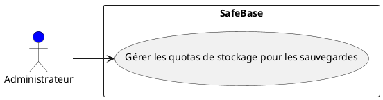

[Retour au sommaire](#table-des-matières)

## 6. **Conclusion**

Le système **SafeBase** offre une solution robuste et complète pour la gestion des bases de données, la surveillance, et la gestion des sauvegardes. Grâce à son architecture modulaire et ses fonctionnalités clés, il garantit une gestion efficace des données critiques, tout en facilitant la tâche des administrateurs et en assurant une sécurité renforcée pour les bases de données.

### Récapitulatif des fonctionnalités clés :

1. **Gérer les bases de données (CRUD)** : SafeBase permet aux administrateurs de gérer toutes les opérations essentielles sur les bases de données, telles que la création, la modification, la suppression et la consultation.
2. **Automatiser les sauvegardes** : Grâce à l'intégration des tâches CRON, les administrateurs peuvent automatiser les sauvegardes pour garantir la régularité des copies de sécurité.
3. **Effectuer des sauvegardes manuelles** : En plus des sauvegardes automatiques, il est possible de lancer des sauvegardes manuelles à tout moment, selon les besoins spécifiques.
4. **Restaurer les bases de données** : SafeBase permet de restaurer les bases de données à partir de sauvegardes existantes, offrant ainsi une solution en cas de corruption de données ou de besoin de retour à un état précédent.
5. **Surveiller les bases de données et les processus de sauvegarde** : SafeBase propose une interface de surveillance en temps réel des bases de données et des processus de sauvegarde, permettant de réagir rapidement en cas d'anomalie.
6. **Recevoir des alertes en cas d'anomalies** : Les administrateurs peuvent configurer des alertes pour être notifiés immédiatement en cas de problème dans les processus de sauvegarde ou de gestion des bases de données.
7. **Gérer les utilisateurs et permissions** : SafeBase offre la possibilité de gérer les comptes utilisateurs et d'attribuer des rôles spécifiques, garantissant un accès sécurisé et contrôlé aux fonctionnalités du système.
8. **Consulter les logs et rapports système** : Les administrateurs peuvent consulter les logs détaillés pour analyser les événements récents et identifier les éventuels problèmes.
9. **Configurer les alertes** : Les administrateurs peuvent personnaliser les types d'alertes qu'ils souhaitent recevoir et choisir les canaux de communication pour être informés en temps réel.
10. **Exporter et importer des bases de données** : SafeBase permet d'exporter et d'importer des bases de données pour faciliter les migrations et les restaurations à partir de fichiers externes.
11. **Gérer les quotas de stockage pour les sauvegardes** : Afin de prévenir une utilisation excessive des ressources, les administrateurs peuvent définir des quotas de stockage pour les sauvegardes.

### Conclusion finale :

Grâce à son ensemble de fonctionnalités diversifiées, **SafeBase** répond aux besoins critiques de gestion des bases de données, tout en intégrant des mécanismes de surveillance, de sauvegarde et de restauration pour assurer une haute disponibilité des données. Cette étude des cas d'utilisation a permis de modéliser les interactions entre les acteurs du système et de représenter les différentes fonctionnalités via des diagrammes UML, offrant ainsi une vision claire de la structure du projet.

[Retour au sommaire](#table-des-matières)
