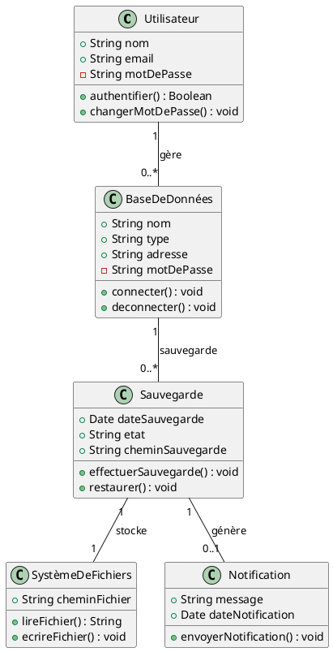

# **Document des Diagrammes de Classes - SafeBase**

## **1. Introduction**

### **1.1 Objectif de l'Étude**

L'objectif de cette étude est de fournir une modélisation UML détaillée des classes de l'application **SafeBase**. Le diagramme de classes modélise la structure statique du système en définissant les principales entités, leurs attributs, méthodes, et relations. Cette modélisation permettra de guider la conception et le développement de l’application en garantissant une cohérence entre les besoins fonctionnels et la structure technique.

### **1.2 Contexte du Projet**

SafeBase est une application web conçue pour automatiser la gestion des sauvegardes des bases de données pour les entreprises. L’application supporte MySQL et PostgreSQL, et permet aux utilisateurs de gérer des bases de données, planifier des sauvegardes automatiques, restaurer des données, et recevoir des notifications en temps réel.

Le **diagramme de classes** est crucial dans la conception de SafeBase, car il définit la structure des entités et leurs interactions. Il est complémentaire aux diagrammes de cas d'utilisation et de séquence, et traduit les exigences fonctionnelles en éléments concrets pour la phase de développement.

---

## **2. Présentation Générale des Classes**

### **2.1 Vue d’Ensemble des Classes**

Les principales classes identifiées dans SafeBase sont :

- **Utilisateur** : Gère l'authentification, les rôles et permissions.
- **BaseDeDonnées** : Représente une base MySQL ou PostgreSQL, permettant la connexion et la gestion.
- **Sauvegarde** : Gère la création, planification, et restauration des sauvegardes.
- **SystèmeDeFichiers** : Gère le stockage des fichiers de sauvegarde.
- **Notification** : Envoie des alertes en cas de succès ou échec des opérations de sauvegarde.

Ces classes couvrent les domaines suivants :

- **Gestion des utilisateurs**
- **Gestion des bases de données**
- **Gestion des sauvegardes**
- **Système de notifications**

### **2.2 Liens avec les Exigences Fonctionnelles**

Chaque classe est liée aux **exigences fonctionnelles** :

- **Utilisateur** : Répond à la gestion des utilisateurs et des permissions.
- **BaseDeDonnées** : Liée à la gestion des bases de données et des connexions.
- **Sauvegarde** : Gère les sauvegardes automatiques, conformément à l'exigence de protection des données.
- **SystèmeDeFichiers** : Assure la gestion des fichiers de sauvegarde.
- **Notification** : Génère des alertes en fonction des événements critiques.

---

## **3. Description Détailée des Classes**

### **3.1 Classe Utilisateur**

- **Rôle** : Gestion des informations d’identification.
- **Attributs** : `nom`, `email`, `motDePasse`, `role`.
- **Méthodes** : `authentifier()`, `changerMotDePasse()`.

### **3.2 Classe BaseDeDonnées**

- **Rôle** : Gestion des bases de données.
- **Attributs** : `nom`, `type`, `adresse`, `motDePasse`.
- **Méthodes** : `connecter()`, `deconnecter()`.

### **3.3 Classe Sauvegarde**

- **Rôle** : Gestion des sauvegardes.
- **Attributs** : `dateSauvegarde`, `etat`, `cheminSauvegarde`.
- **Méthodes** : `effectuerSauvegarde()`, `restaurer()`.

### **3.4 Classe SystèmeDeFichiers**

- **Rôle** : Gestion du stockage des fichiers de sauvegarde.
- **Attributs** : `cheminFichier`.
- **Méthodes** : `lireFichier()`, `ecrireFichier()`.

### **3.5 Classe Notification**

- **Rôle** : Envoi des alertes.
- **Attributs** : `message`, `dateNotification`.
- **Méthodes** : `envoyerNotification()`.

---

## **4. Représentation Visuelle : Diagramme de Classes UML**

### **4.1 Présentation du Diagramme de Classes Global**

Le diagramme suivant modélise les entités principales de SafeBase et leurs relations :

### **4.2 Explication des Associations**

- **Utilisateur - BaseDeDonnées** : Un utilisateur peut gérer plusieurs bases de données.
- **BaseDeDonnées - Sauvegarde** : Une base de données peut avoir plusieurs sauvegardes associées.
- **Sauvegarde - SystèmeDeFichiers** : Une sauvegarde utilise un système de fichiers pour stocker ses fichiers (composition).
- **Sauvegarde - Notification** : Une sauvegarde peut générer une notification en cas de succès ou d’échec.

---

## **5. Synthèse des Scénarios et Cas d'Utilisation**

### **5.1 Rappel des Cas d'Utilisation Pertinents**

- **Gestion des Bases de Données** : Ajout et modification de bases de données via la classe `Utilisateur`.
- **Planification et Exécution des Sauvegardes** : Gestion par la classe `Sauvegarde` pour l'exécution des sauvegardes.
- **Notification des Événements** : Envoi d’alertes via la classe `Notification` après une sauvegarde.

### **5.2 Interactions entre les Classes**

Les interactions incluent :

- Un utilisateur crée une base de données via `Utilisateur`.
- La classe `Sauvegarde` effectue des sauvegardes et stocke les fichiers via `SystèmeDeFichiers`.
- Des notifications sont envoyées en cas d’échec ou de succès d’une sauvegarde via `Notification`.

---

### **6. Conclusion**

Le diagramme de classes de SafeBase modélise la structure statique de l’application et ses interactions principales. Ce modèle garantit une implémentation alignée avec les besoins fonctionnels et offre une vue d’ensemble des entités essentielles du système, facilitant ainsi la phase de développement.
