# **Diagrammes de Séquence pour SafeBase**

## **1. Introduction**

### **1.1. Objectif**

L'objectif des diagrammes de séquence est de décrire les interactions entre les composants du système SafeBase. Ils permettent de visualiser le flux des actions dans des cas d'utilisation critiques, en particulier dans un contexte de gestion de bases de données.

### **1.2. Utilité dans SafeBase**

Les diagrammes de séquence sont utilisés pour illustrer :

- Les opérations de gestion des utilisateurs.
- Les processus de sauvegarde et restauration des bases de données.
- Les interactions avec les systèmes externes.

Ces diagrammes facilitent la compréhension des flux du système pour les développeurs.

---

### **1.3. Structure du document**

Ce document est structuré comme suit :

- Chaque section traite d'un processus clé, accompagné d'un diagramme de séquence.
- Les diagrammes mettent en lumière les interactions entre les différents composants du système.

## **2. Diagrammes de Séquence des Cas d'Utilisation**

### **2.1. Gérer les Bases de Données (CRUD)**

#### **Résumé**

Ce diagramme de séquence illustre le processus CRUD (Créer, Lire, Mettre à jour, Supprimer) pour la gestion des bases de données dans SafeBase. Il décrit les interactions entre l'Administrateur, l'API REST SafeBase et la base de données.

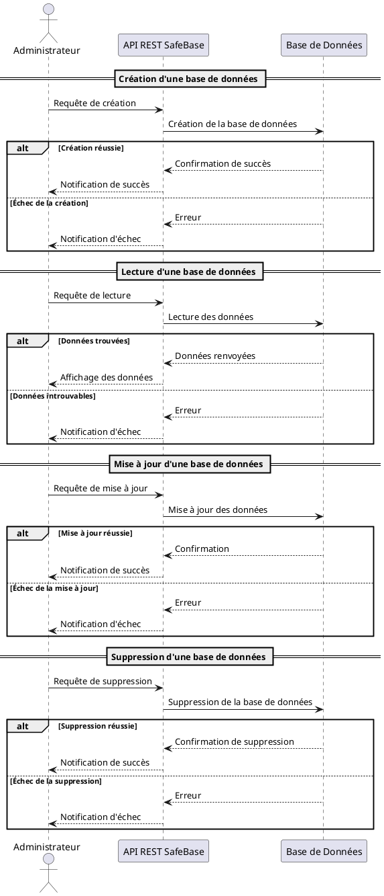

#### **Étapes Clés**

1. **Création** : L'administrateur envoie une requête pour créer une base de données, l'API l'enregistre dans la base de données.
2. **Lecture** : L'administrateur demande à lire les données, l'API renvoie les résultats de la base de données.
3. **Mise à jour** : L'administrateur modifie les données, l'API met à jour la base de données.
4. **Suppression** : L'administrateur demande la suppression d'une base de données, l'API exécute la suppression dans la base.

### **2.2. Automatiser les Sauvegardes**

#### **Résumé**

Ce diagramme montre le processus d'automatisation des sauvegardes dans SafeBase. Les sauvegardes sont déclenchées automatiquement via un planificateur (ex. : CRON), sans intervention manuelle.

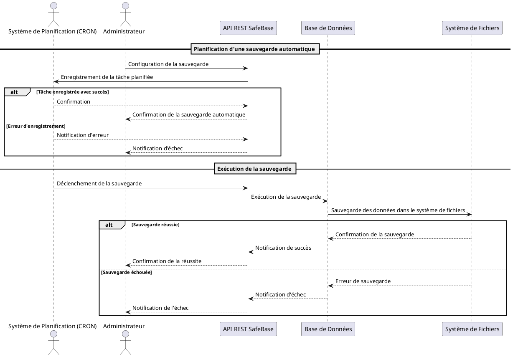

#### **Étapes Clés**

1. **Planification** : L'administrateur configure une tâche de sauvegarde via l'API, et le planificateur (ex. : CRON) l'enregistre.
2. **Exécution** : Le planificateur déclenche la sauvegarde, et l'API exécute l'opération sur la base de données.
3. **Stockage des données** : La base de données sauvegarde les données dans le système de fichiers.
4. **Succès ou échec** : En cas de succès ou d'échec, une notification est envoyée à l'Administrateur.

### **2.3. Effectuer une Sauvegarde Manuelle**

#### **Résumé**

Ce diagramme illustre le processus d'exécution d'une sauvegarde manuelle d'une base de données à la demande par l'Administrateur.

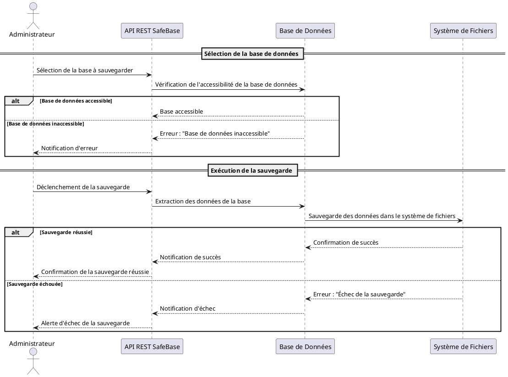

#### **Étapes Clés**

1. **Sélection de la base** : L'administrateur sélectionne la base de données à sauvegarder manuellement.
2. **Vérification de l'accessibilité** : L'API vérifie que la base de données est accessible.
3. **Exécution de la sauvegarde** : Si la base est accessible, l'API déclenche la sauvegarde et les données sont exportées dans le système de fichiers.
4. **Succès ou échec** : Une notification est envoyée à l'Administrateur, en fonction du résultat de la sauvegarde.

### **2.4. Restaurer une Base de Données**

#### **Résumé**

Ce diagramme décrit le processus de restauration d'une base de données à partir d'une sauvegarde existante, initiée par l'Administrateur.

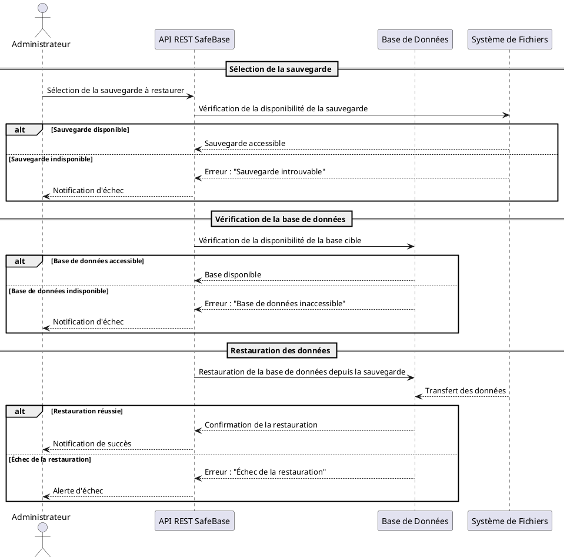

#### **Étapes Clés**

1. **Sélection de la sauvegarde** : L'administrateur choisit la sauvegarde à restaurer.
2. **Vérification de la disponibilité** : L'API vérifie si la sauvegarde et la base cible sont accessibles.
3. **Restauration des données** : Si tout est en ordre, l'API exécute la restauration à partir du fichier de sauvegarde.
4. **Succès ou échec** : Une notification de succès ou d'échec est envoyée à l'Administrateur.

### **2.5. Surveiller les Bases de Données et les Processus de Sauvegarde**

#### **Résumé**

Ce diagramme illustre le processus de surveillance continue des bases de données et des sauvegardes dans SafeBase. Il inclut la détection des anomalies et la génération d'alertes en cas de problème.

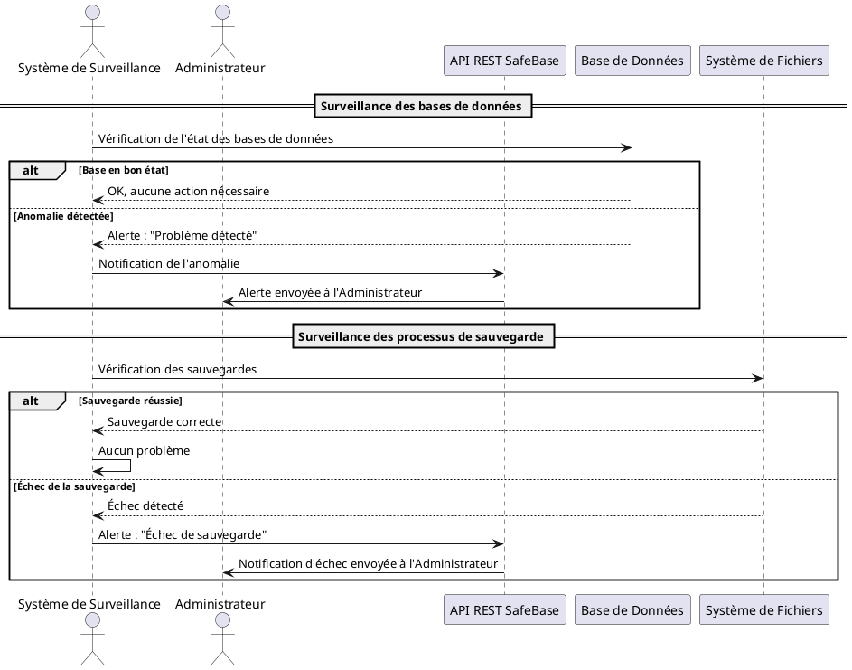

#### **Étapes Clés**

1. **Surveillance des bases de données** : Le système surveille l'état des bases de données et détecte les anomalies.
2. **Surveillance des sauvegardes** : Le système vérifie l'état des sauvegardes et identifie les échecs éventuels.
3. **Génération des alertes** : En cas de problème, une alerte est envoyée à l'Administrateur via l'API SafeBase.

### **2.6. Recevoir des Alertes en cas d'Anomalies**

#### **Résumé**

Ce diagramme montre le processus de génération et de réception d'alertes lorsqu'une anomalie est détectée dans le système SafeBase, par exemple en cas d'échec de sauvegarde ou de problème sur une base de données.

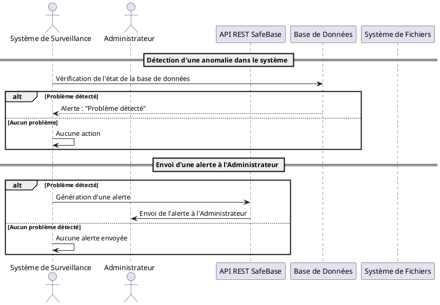

#### **Étapes Clés**

1. **Détection d'anomalies** : Le système de surveillance surveille les bases de données et détecte les anomalies.
2. **Génération d'une alerte** : Si une anomalie est détectée, une alerte est générée par l'API.
3. **Envoi d'alerte** : L'alerte est envoyée à l'Administrateur en cas de détection de problème.

## **3. Cas d'Utilisation Supplémentaires**

### **3.1. Gérer les Utilisateurs et Permissions**

#### **Résumé**

Ce diagramme illustre le processus de gestion des utilisateurs dans SafeBase, incluant l'ajout, la modification et la suppression d'utilisateurs, ainsi que l'attribution des permissions.

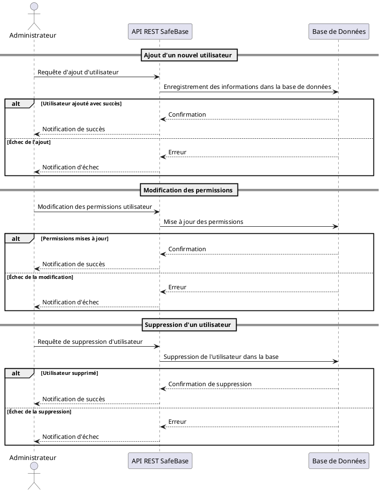

#### **Étapes Clés**

1. **Ajout d'un utilisateur** : L'administrateur envoie une requête pour ajouter un utilisateur, l'API enregistre les informations dans la base de données.
2. **Modification des permissions** : L'administrateur modifie les permissions d'un utilisateur, l'API met à jour les permissions dans la base.
3. **Suppression d'un utilisateur** : L'administrateur peut supprimer un utilisateur, l'API exécute la suppression dans la base.

### **3.2. Consulter les Logs et Rapports Système**

#### **Résumé**

Ce diagramme montre le processus permettant à l'Administrateur de consulter les logs et les rapports générés par SafeBase, tels que les historiques des sauvegardes et des restaurations.

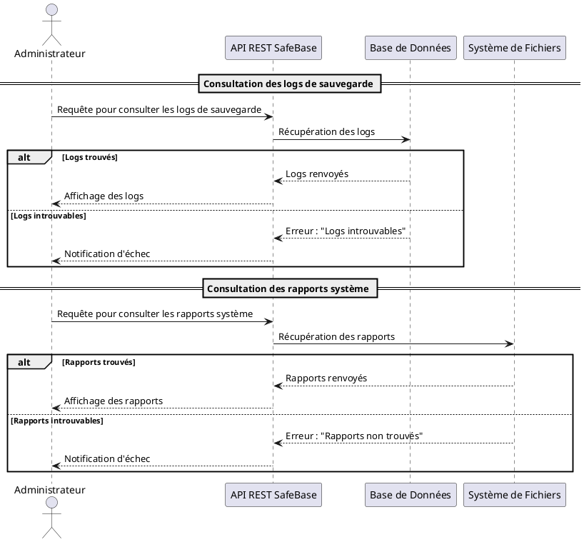

#### **Étapes Clés**

1. **Requête des logs** : L'administrateur demande les logs de sauvegarde, l'API récupère les logs depuis la base de données.
2. **Affichage des logs** : Si les logs sont trouvés, ils sont affichés à l'Administrateur ; sinon, une notification d'échec est envoyée.
3. **Consultation des rapports** : L'Administrateur peut consulter les rapports système, et l'API récupère ces rapports depuis le système de fichiers.
4. **Succès ou échec** : Les rapports sont affichés si trouvés ; sinon, une notification d'échec est envoyée.

### **3.3. Configurer les Alertes**

#### **Résumé**

Ce diagramme montre le processus permettant à l'Administrateur de configurer les alertes dans SafeBase, pour être informé en temps réel des événements critiques (échecs de sauvegarde, problèmes de base de données, etc.).

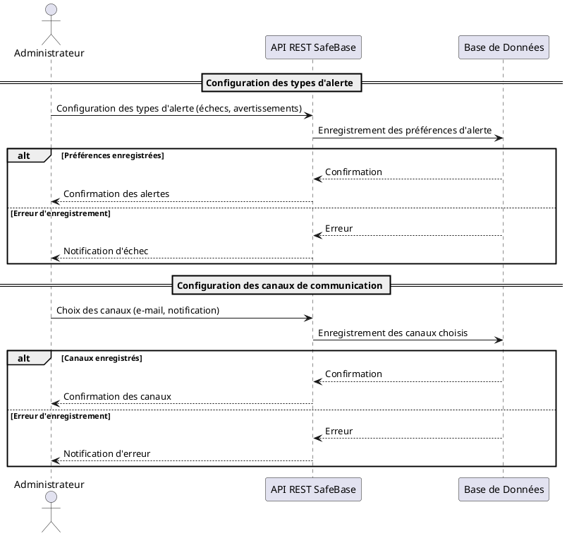

#### **Étapes Clés**

1. **Configuration des alertes** : L'Administrateur configure les types d'alertes à recevoir (échecs, avertissements).
2. **Choix des canaux de communication** : L'Administrateur sélectionne les canaux pour recevoir les alertes (e-mails, notifications).
3. **Succès ou échec** : En cas de succès ou d'erreur lors de l'enregistrement des configurations, une notification est envoyée à l'Administrateur.

### **3.4. Exporter et Importer des Bases de Données**

#### **3.4.1. Description**

Le cas d'utilisation "Exporter et Importer des Bases de Données" permet à l'Administrateur d'extraire une copie complète des données d'une base de données (exportation) ou de restaurer ces données à partir d'un fichier (importation). Cette fonctionnalité est essentielle pour la migration des données, la sauvegarde manuelle, ou pour déplacer les données d'un environnement à un autre (ex. : de la production à un environnement de test).

#### **3.4.2. Diagramme de Séquence**

Ce diagramme illustre les processus d'exportation et d'importation de bases de données, incluant les scénarios de succès et d'échec.

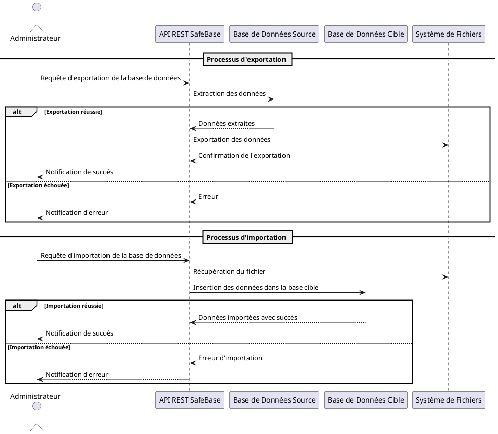

#### **3.4.3. Explication**

Voici les étapes détaillées pour l'exportation et l'importation dans SafeBase :

##### **Exportation**

1. **Requête d'exportation** : L'Administrateur envoie une demande via l'API pour exporter une base de données.
2. **Extraction des données** : L'API récupère les données de la base de données source.
3. **Enregistrement** : Les données sont sauvegardées dans un fichier sur le système de fichiers.
4. **Gestion des erreurs** : En cas d'échec, l'Administrateur est notifié.

##### **Importation**

1. **Requête d'importation** : L'Administrateur demande l'importation des données.
2. **Récupération du fichier** : L'API récupère le fichier de données à partir du système de fichiers.
3. **Insertion dans la base cible** : Les données sont insérées dans une nouvelle ou ancienne base de données.
4. **Gestion des erreurs** : En cas d'échec, une notification d'erreur est envoyée à l'Administrateur.

### **3.5. Gérer les Quotas de Stockage pour les Sauvegardes**

#### **3.5.1. Description**

Ce cas d'utilisation permet à l'Administrateur de gérer les quotas de stockage pour les sauvegardes. Cela inclut la configuration des limites de stockage, la surveillance de l'utilisation de l'espace disque et la réception d'alertes lorsque ces quotas sont atteints ou dépassés.

#### **3.5.2. Diagramme de Séquence**

Ce diagramme montre le processus de gestion des quotas de stockage, ainsi que la génération d'alertes en cas de dépassement du quota.

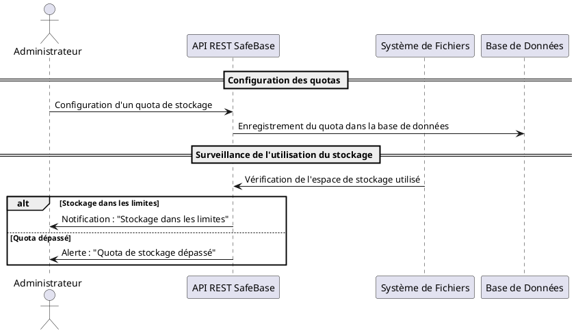

#### **3.5.3. Explication**

1. **Configuration des quotas** : L'Administrateur configure un quota de stockage via l'API REST SafeBase, et ce quota est enregistré dans la base de données.
2. **Surveillance continue** : Le système vérifie régulièrement l'utilisation du stockage en temps réel.
3. **Notification** : Lorsque l'espace de stockage utilisé dépasse les limites fixées, une alerte est envoyée à l'Administrateur pour qu'il prenne des mesures correctives.

### **3.6. Interactions avec les Systèmes Externes**

#### **3.6.1. Description**

Ce cas d'utilisation décrit comment SafeBase interagit avec des systèmes externes, comme des serveurs de fichiers ou des solutions cloud, pour stocker ou récupérer des données. Ces interactions sont essentielles pour garantir une flexibilité dans la gestion des sauvegardes et la migration des données entre différentes infrastructures.

#### **3.6.2. Diagramme de Séquence**

Ce diagramme illustre le processus d'interaction avec un service externe pour sauvegarder les données dans le cloud.

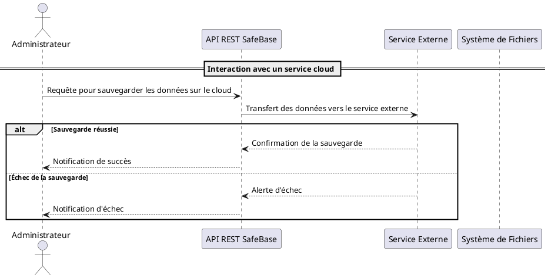

#### **3.6.3. Explication**

1. **Requête d'interaction** : L'Administrateur envoie une requête pour sauvegarder les données sur un service externe (ex. : cloud).
2. **Transmission de la requête** : L'API REST SafeBase transfère les données vers le service externe pour stockage.
3. **Résultat de l'interaction** : Le service externe renvoie une confirmation de succès ou une alerte en cas d'échec, avec une notification correspondante envoyée à l'Administrateur.

## **4. Conclusion**

### **4.1. Récapitulatif des diagrammes**

Dans ce document, nous avons examiné différents processus critiques de SafeBase à travers une série de diagrammes de séquence. Chaque diagramme a permis de représenter les interactions entre les acteurs principaux (Administrateur, API, Base de Données, Système de Fichiers, Systèmes Externes). Les cas couverts incluent :

- **Gérer les utilisateurs et permissions** : Gestion des utilisateurs et des permissions.
- **Sauvegardes manuelles et automatiques** : Illustration des processus de sauvegarde.
- **Restauration des bases de données** : Processus de restauration depuis une sauvegarde existante.
- **Surveillance des bases de données et des processus de sauvegarde** : Détection d’anomalies et génération d'alertes.
- **Gestion des quotas de stockage** : Limitation et surveillance de l'utilisation du stockage.
- **Interactions avec des systèmes externes** : Communication avec des services de cloud ou autres systèmes externes.

### **4.2. Importance des diagrammes de séquence dans la compréhension du système**

Les diagrammes de séquence sont essentiels pour clarifier le fonctionnement des processus critiques du système. Ils aident à comprendre comment les composants interagissent entre eux, facilitant ainsi la communication entre développeurs et concepteurs. Pour une équipe de développeurs en formation, ces diagrammes sont particulièrement précieux, car ils fournissent une vue d'ensemble visuelle et facilement compréhensible des flux d'information.

### **4.3. Bonnes pratiques pour la conception de diagrammes**

Lors de la conception de diagrammes de séquence, il est recommandé de suivre quelques bonnes pratiques :

1. **Simplicité et lisibilité** : Se concentrer sur l'essentiel et éviter de surcharger les diagrammes.
2. **Organisation claire** : Utilisation de fragments combinés (`alt`, `opt`, etc.) pour représenter les scénarios alternatifs.
3. **Gestion des erreurs** : Inclure des scénarios de gestion des échecs et des alternatives pour mieux appréhender les flux d’erreur.
4. **Mise à jour régulière** : Les diagrammes doivent refléter les évolutions du système pour rester pertinents.
