# **Diagrammes de Séquence pour SafeBase**

# **1. Introduction**

## **1.1. Objectif**

Ce document a pour objectif de présenter les diagrammes de séquence utilisés dans le projet **SafeBase**. Ces diagrammes sont essentiels pour modéliser les interactions dynamiques entre les différents composants du système, illustrant ainsi le déroulement des processus critiques comme la gestion des bases de données, la sauvegarde et la restauration. Le but est d'offrir à l'équipe de développement une vision claire et structurée des échanges entre les acteurs, l'API et les bases de données.

## **1.2. Structure du document**

Le document est structuré autour des cas d'utilisation identifiés dans le projet SafeBase. Chaque cas d'utilisation est détaillé avec un diagramme de séquence qui illustre les interactions principales entre les différents composants du système. Les diagrammes sont accompagnés d'explications pour faciliter leur compréhension.

La structure est la suivante :

1. **Introduction** : Présente le rôle des diagrammes de séquence dans SafeBase.
2. **Diagrammes de séquence des cas d'utilisation** : Pour chaque cas d'utilisation, un diagramme de séquence est fourni avec une explication et les scénarios alternatifs.
3. **Cas d'utilisation supplémentaires** : D'autres cas d'utilisation comme la gestion des utilisateurs ou des quotas de stockage sont également couverts.
4. **Conclusion** : Récapitule les points clés du document et offre des conseils pour la conception de diagrammes.
5. **Annexes et ressources supplémentaires** : Propose des ressources pour approfondir la modélisation UML.

## **1.3. Notions clés**

Un diagramme de séquence est un outil UML qui illustre les échanges entre différents acteurs ou composants d’un système dans un ordre chronologique. Voici quelques notions importantes :

- **Acteurs** : Ce sont les utilisateurs ou systèmes externes qui interagissent avec SafeBase.
- **Objets** : Les composants internes de SafeBase (ex. : l'API REST, la base de données).
- **Messages** : Les interactions ou appels effectués entre les acteurs et les objets du système.
- **Lignes de vie** : Représentent l'existence d'un acteur ou objet pendant le déroulement du scénario.
- **Activation** : Indique la durée pendant laquelle un objet ou acteur est en activité (exécution d’une tâche).

## **1.4. Notation UML**

Les diagrammes de séquence dans ce document utilisent les éléments standard de notation UML :

- **Acteurs** : Représentés par des icônes ou symboles (souvent sous forme de stick figures) qui interagissent avec le système.
- **Messages synchrones** : Représentés par des flèches pleines, indiquant que l'émetteur attend une réponse avant de continuer.
- **Messages asynchrones** : Représentés par des flèches en pointillés, indiquant que l'émetteur n'attend pas de réponse immédiate.
- **Activation** : Une barre verticale sur la ligne de vie qui montre combien de temps un objet reste actif dans le scénario.
- **Retour de message** : Représenté par une flèche pointant vers l'émetteur d'origine après un message synchrone ou asynchrone.

## **2. Diagrammes de Séquence des Cas d'Utilisation**

### **2.1. Gérer les Bases de Données (CRUD)**

#### **2.1.1. Description**

Le cas d'utilisation "Gérer les Bases de Données (CRUD)" permet à l'Administrateur de créer, lire, mettre à jour et supprimer des bases de données (MySQL ou PostgreSQL) via l'API REST de SafeBase. Ces opérations permettent de maintenir et de gérer les bases de données du système de manière efficace.

Les étapes incluent :

1. L'Administrateur sélectionne l'opération (Créer, Lire, Mettre à jour, Supprimer).
2. L'API REST SafeBase interagit avec la base de données pour effectuer l'opération demandée.
3. Un message de confirmation est envoyé à l'Administrateur en cas de succès ou un rapport d'erreur est généré en cas d'échec.

#### **2.1.2. Diagramme de Séquence**

Le diagramme de séquence ci-dessous illustre le processus de création d'une nouvelle base de données. Le processus pour les autres opérations (Lire, Mettre à jour, Supprimer) suit des étapes similaires avec des variations dans la requête envoyée à l'API :

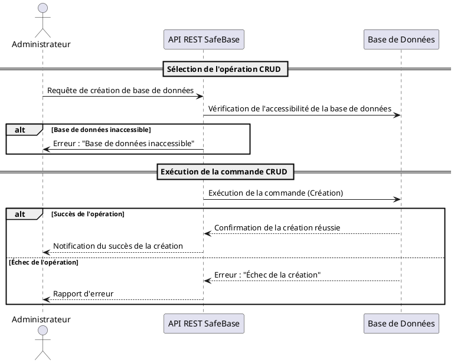

#### **2.1.3. Explication**

Voici les étapes du processus pour effectuer une opération CRUD (exemple avec **création d'une base de données**) :

1. **Sélection de l'opération CRUD** : L'Administrateur choisit l'opération souhaitée (par exemple, créer une nouvelle base de données) et envoie la requête via l'API REST SafeBase.

2. **Vérification de l'accessibilité de la base de données** : Avant d'exécuter l'opération, l'API vérifie que la base de données cible est accessible. Si ce n'est pas le cas, un message d'erreur est envoyé à l'Administrateur, et l'opération est annulée.

3. **Exécution de la commande CRUD** : Si la base de données est accessible, l'API exécute la commande (ici, création de la base de données). Une confirmation est renvoyée à l'Administrateur en cas de succès, ou un rapport d'erreur en cas d'échec.

#### **2.1.4. Scénarios alternatifs et gestion des erreurs**

Voici deux scénarios alternatifs possibles dans la gestion des opérations CRUD :

1. **Base de données inaccessible** : Si l'API SafeBase ne peut pas accéder à la base de données cible, une erreur est immédiatement signalée à l'Administrateur, et l'opération est annulée.

2. **Échec de la commande CRUD** : Si une erreur survient pendant l'exécution de l'opération CRUD (par exemple, si la création échoue en raison de paramètres incorrects), un rapport d'erreur détaillé est envoyé à l'Administrateur.

### **2.2. Automatiser les Sauvegardes**

#### **2.2.1. Description**

Le cas d'utilisation "Automatiser les Sauvegardes" permet d'exécuter des sauvegardes régulières des bases de données via un processus automatisé, déclenché par un ordonnanceur de tâches (comme CRON). Cela garantit que les bases de données sont sauvegardées de manière périodique, sans intervention manuelle. Ce processus est essentiel pour assurer la protection des données en cas d'incident ou de panne.

Les étapes incluent :

1. Le système de sauvegarde (par exemple, via CRON) déclenche automatiquement la sauvegarde à des intervalles planifiés.
2. L'API REST SafeBase gère la communication avec la base de données pour effectuer la sauvegarde.
3. Le fichier de sauvegarde est stocké dans un emplacement sécurisé.
4. Une notification est envoyée à l'administrateur indiquant le succès ou l'échec de la sauvegarde.

#### **2.2.2. Diagramme de Séquence**

Le diagramme de séquence ci-dessous illustre le processus de sauvegarde automatique, y compris les scénarios de succès et d'échec :

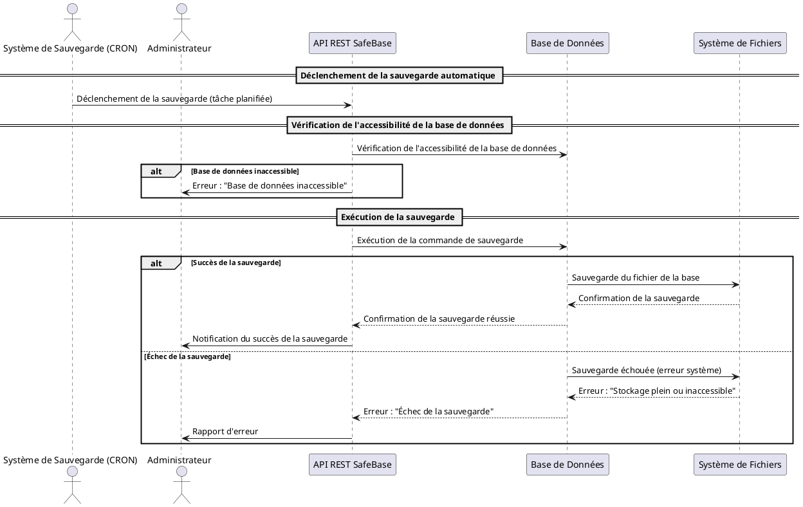

#### **2.2.3. Explication**

Le processus d'automatisation des sauvegardes suit les étapes suivantes :

1. **Déclenchement de la sauvegarde** : Une tâche planifiée via un ordonnanceur (comme CRON) déclenche automatiquement la sauvegarde à des intervalles réguliers, sans intervention de l'Administrateur.

2. **Vérification de l'accessibilité de la base de données** : Avant d'exécuter la sauvegarde, l'API SafeBase vérifie que la base de données est accessible. Si elle ne l'est pas, une alerte est envoyée à l'Administrateur, et le processus est annulé.

3. **Exécution de la sauvegarde** : Si la base de données est accessible, l'API communique avec la base de données pour exécuter la sauvegarde. Le fichier de sauvegarde est ensuite enregistré dans un répertoire sécurisé.

4. **Succès ou échec de la sauvegarde** :
   - **Succès** : Si la sauvegarde est effectuée avec succès, une confirmation est envoyée à l'Administrateur.
   - **Échec** : Si une erreur survient pendant le processus (par exemple, en raison d'un espace de stockage insuffisant), une alerte est envoyée à l'Administrateur avec un rapport détaillé.

#### **2.2.4. Scénarios alternatifs et gestion des erreurs**

Voici les scénarios alternatifs pour la gestion des erreurs durant le processus de sauvegarde automatique :

1. **Base de données inaccessible** : Si la base de données n'est pas accessible au moment où la tâche est déclenchée, une alerte est immédiatement envoyée à l'Administrateur, et la sauvegarde est annulée.

2. **Échec de la sauvegarde en raison d'une erreur de stockage** : Si le système de fichiers ne peut pas stocker le fichier de sauvegarde (par exemple, à cause d'un stockage plein ou inaccessible), un rapport d'erreur est généré, et une alerte est envoyée à l'Administrateur.

### **2.3. Effectuer une Sauvegarde Manuelle**

#### **2.3.1. Description**

Ce cas d'utilisation permet à l'Administrateur d'exécuter une sauvegarde manuelle d'une base de données à la demande. Contrairement aux sauvegardes automatiques programmées, l'Administrateur peut déclencher une sauvegarde à tout moment, notamment avant une modification majeure ou en cas d'urgence.

Les étapes incluent :

1. L'Administrateur sélectionne la base de données à sauvegarder.
2. L'API REST SafeBase vérifie l'accessibilité de la base de données.
3. Si la base est accessible, la sauvegarde est effectuée.
4. Le fichier de sauvegarde est stocké dans un emplacement sécurisé.
5. Une notification est envoyée à l'Administrateur avec l'état de la sauvegarde (succès ou échec).

#### **2.3.2. Diagramme de Séquence**

Le diagramme de séquence ci-dessous illustre le processus de sauvegarde manuelle, y compris les scénarios de succès et d'échec, sans l'authentification préalable :

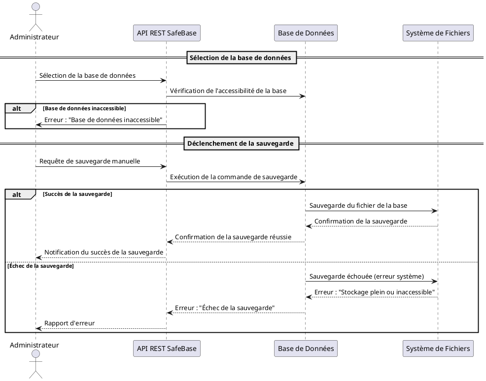

#### **2.3.3. Explication**

Le processus de sauvegarde manuelle se déroule de la manière suivante :

1. **Sélection de la base de données** : L'Administrateur sélectionne la base de données qu'il souhaite sauvegarder via l'API REST SafeBase. L'API vérifie si la base de données est accessible.

2. **Déclenchement de la sauvegarde** : Si la base de données est accessible, l'Administrateur déclenche la sauvegarde manuelle. L'API exécute la commande de sauvegarde sur la base de données.

3. **Sauvegarde réussie ou échouée** :
   - **Succès** : La base de données sauvegarde les données dans un système de fichiers sécurisé. Une confirmation est envoyée à l'Administrateur.
   - **Échec** : Si une erreur survient (par exemple, stockage plein ou inaccessible), un rapport d'erreur est transmis à l'Administrateur.

#### **2.3.4. Scénarios Alternatifs et Gestion des Erreurs**

Les principaux scénarios alternatifs sont les suivants :

1. **Base de données inaccessible** : Si la base de données n'est pas accessible lors de la vérification initiale, une erreur est immédiatement signalée à l'Administrateur, et la sauvegarde est annulée.

2. **Échec de la sauvegarde** : Si une erreur survient pendant le processus de sauvegarde (par exemple, en raison d'un espace de stockage insuffisant), une notification d'échec est envoyée à l'Administrateur avec un rapport détaillé.

### **2.4. Restaurer une Base de Données**

#### **2.4.1. Description**

Le cas d'utilisation "Restaurer une Base de Données" permet à l'Administrateur de restaurer une base de données à partir d'une sauvegarde existante. Cette fonctionnalité est cruciale en cas de corruption de données, d'erreur humaine ou d'incident nécessitant un retour à une version précédente de la base de données.

Les étapes incluent :

1. L'Administrateur sélectionne une base de données et une version de sauvegarde à restaurer.
2. L'API REST SafeBase vérifie l'accessibilité de la base de données et la validité de la sauvegarde choisie.
3. La restauration de la base de données est effectuée.
4. Un rapport de succès ou d'échec est envoyé à l'Administrateur.

#### **2.4.2. Diagramme de Séquence**

Le diagramme de séquence ci-dessous illustre le processus de restauration d'une base de données à partir d'une sauvegarde existante, en prenant en compte les scénarios de succès et d'échec :

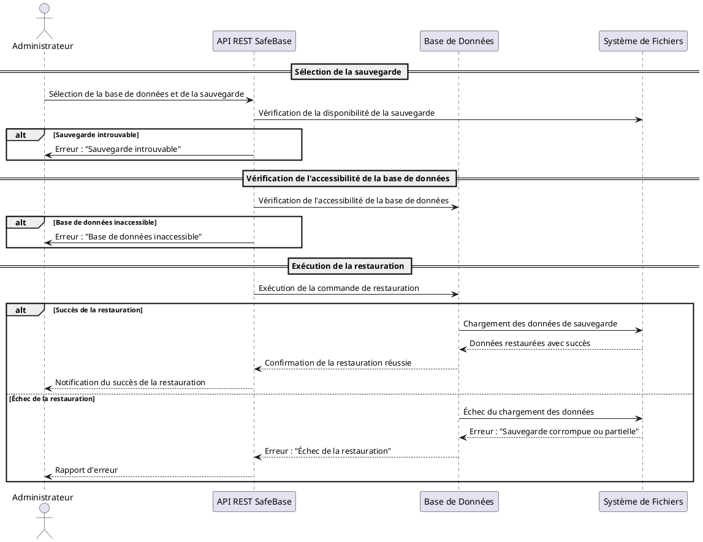

#### **2.4.3. Explication**

Voici les étapes détaillées du processus de restauration d'une base de données à partir d'une sauvegarde existante :

1. **Sélection de la sauvegarde** : L'Administrateur sélectionne la base de données qu'il souhaite restaurer ainsi que la version de la sauvegarde à utiliser. L'API SafeBase vérifie la disponibilité de cette sauvegarde dans le système de fichiers.

2. **Vérification de la disponibilité de la sauvegarde** : Si la sauvegarde n'est pas trouvée (par exemple, si elle a été supprimée ou déplacée), une erreur est immédiatement envoyée à l'Administrateur.

3. **Vérification de l'accessibilité de la base de données** : L'API vérifie que la base de données est accessible pour la restauration. Si la base de données est inaccessible (par exemple, si le serveur est hors ligne), le processus est annulé, et l'Administrateur reçoit une notification d'échec.

4. **Exécution de la restauration** : Si la sauvegarde est disponible et que la base de données est accessible, l'API REST SafeBase lance la restauration en récupérant les données depuis le fichier de sauvegarde et en les réintégrant dans la base de données.

5. **Succès ou échec de la restauration** :
   - **Succès** : Si la restauration est effectuée correctement, la base de données est restaurée à son état précédent, et une confirmation est envoyée à l'Administrateur.
   - **Échec** : Si une erreur survient pendant le processus (par exemple, si la sauvegarde est corrompue ou partielle), un rapport d'erreur détaillé est envoyé à l'Administrateur.

#### **2.4.4. Scénarios alternatifs et gestion des erreurs**

Voici les scénarios alternatifs et les situations d'échec qui peuvent survenir lors du processus de restauration d'une base de données :

1. **Sauvegarde introuvable** : Si la sauvegarde sélectionnée par l'Administrateur n'est pas trouvée dans le système de fichiers (par exemple, si elle a été supprimée ou corrompue), l'API renvoie une erreur à l'Administrateur, et le processus est annulé.

2. **Base de données inaccessible** : Si l'API ne peut pas se connecter à la base de données pour effectuer la restauration (par exemple, si le serveur de la base de données est hors ligne ou en panne), l'Administrateur reçoit une notification d'échec, et aucune tentative de restauration n'est effectuée.

3. **Échec de la restauration** : Si une erreur survient pendant la restauration (par exemple, si la sauvegarde est corrompue ou si les données sont partiellement restaurées), l'API SafeBase envoie un rapport d'erreur à l'Administrateur, détaillant la nature du problème.

### **2.5. Surveiller les Bases de Données et les Processus de Sauvegarde**

#### **2.5.1. Description**

Le cas d'utilisation "Surveiller les Bases de Données et les Processus de Sauvegarde" permet à l'Administrateur de suivre en temps réel l'état des bases de données et des processus de sauvegarde. Cette surveillance est essentielle pour détecter rapidement les anomalies, comme une défaillance d'une base de données ou une sauvegarde échouée. Si une anomalie est détectée, le système génère une alerte pour que l'Administrateur puisse intervenir rapidement.

Les étapes incluent :

1. Le Système de Surveillance surveille en continu l'état des bases de données et des sauvegardes.
2. Lorsqu'une anomalie est détectée, une alerte est générée et envoyée à l'Administrateur.
3. L'Administrateur peut prendre les mesures nécessaires en fonction de l'alerte reçue.

#### **2.5.2. Diagramme de Séquence**

Le diagramme de séquence ci-dessous illustre le processus de surveillance continue des bases de données et des sauvegardes, ainsi que la génération d'alertes en cas d'anomalie :

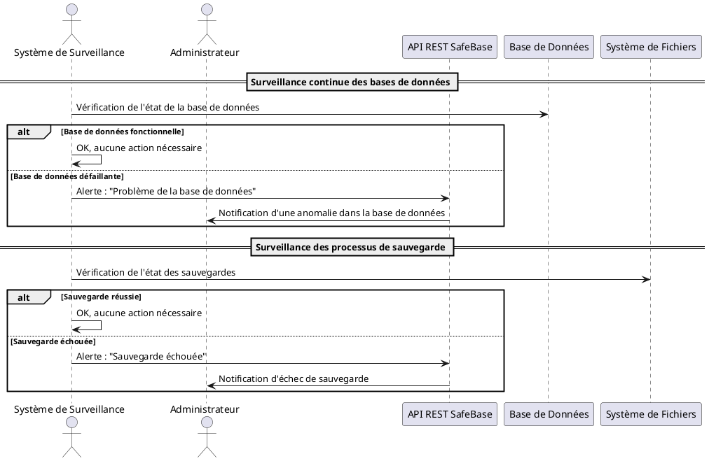

#### **2.5.3. Explication**

Le processus de surveillance se déroule en plusieurs étapes, décrites ci-dessous :

1. **Surveillance des bases de données** : Le Système de Surveillance interroge régulièrement les bases de données pour vérifier leur état. Si une base de données est défaillante (par exemple, si elle est hors ligne ou si une erreur de connexion se produit), une alerte est générée et envoyée à l'Administrateur via l'API SafeBase.

2. **Surveillance des processus de sauvegarde** : Le système surveille également les processus de sauvegarde pour vérifier s'ils ont réussi ou échoué. En cas d'échec de sauvegarde (par exemple, une erreur de stockage ou une interruption), une alerte est générée et envoyée à l'Administrateur.

3. **Notifications et gestion des alertes** : Lorsque des anomalies sont détectées (soit dans une base de données, soit dans un processus de sauvegarde), l'Administrateur reçoit une notification avec des informations sur le problème, lui permettant de réagir rapidement.

#### **2.5.4. Scénarios alternatifs et gestion des erreurs**

1. **Base de données défaillante** : Si une base de données surveillée devient défaillante (par exemple, en cas de perte de connexion ou d'un incident serveur), une alerte est immédiatement envoyée à l'Administrateur pour l'informer du problème. Le diagramme illustre ce scénario via le fragment `alt`.

2. **Sauvegarde échouée** : Si un processus de sauvegarde échoue pendant la surveillance (par exemple, si le stockage est plein ou inaccessible), le système génère une alerte et l'Administrateur est informé. Le diagramme montre également ce scénario dans un fragment `alt`.

3. **Absence d'anomalie** : Si la surveillance ne détecte aucun problème (les bases de données et les sauvegardes fonctionnent correctement), aucune action n'est nécessaire, et le Système de Surveillance continue son cycle de vérification.

### **2.6. Recevoir des Alertes en cas d'Anomalies**

#### **2.6.1. Description**

Le cas d'utilisation "Recevoir des Alertes en cas d'Anomalies" permet à l'Administrateur d'être informé en temps réel lorsqu'une anomalie est détectée dans le système. Ces anomalies peuvent inclure des problèmes liés aux bases de données, des échecs de sauvegarde, ou d'autres incidents qui peuvent compromettre le bon fonctionnement du système SafeBase. La génération d'alertes permet à l'Administrateur d'intervenir rapidement pour résoudre les problèmes avant qu'ils n'aient un impact majeur.

Les étapes incluent :

1. Le système de surveillance détecte une anomalie dans la base de données ou le processus de sauvegarde.
2. Une alerte est générée par l'API REST SafeBase.
3. L'alerte est envoyée à l'Administrateur, qui reçoit une notification décrivant l'anomalie.
4. L'Administrateur consulte l'alerte et prend les mesures nécessaires pour résoudre le problème.

#### **2.6.2. Diagramme de Séquence**

Le diagramme de séquence ci-dessous illustre le processus de génération et d'envoi des alertes lorsqu'une anomalie est détectée dans le système :

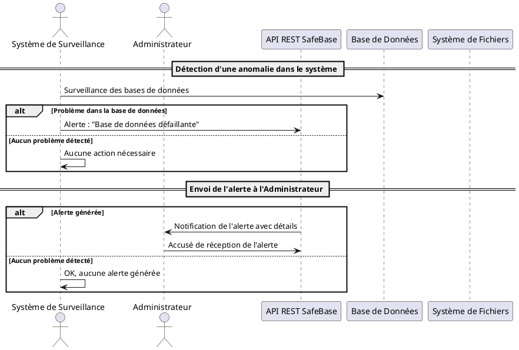

#### **2.6.3. Explication**

Voici les étapes détaillées du processus de réception des alertes en cas d'anomalies :

1. **Détection d'anomalies** : Le Système de Surveillance effectue des vérifications régulières des bases de données et des processus de sauvegarde. Lorsque le système détecte un problème, comme une base de données défaillante ou une sauvegarde échouée, il génère une alerte.

2. **Génération d'une alerte** : L'API REST SafeBase reçoit l'alerte émise par le Système de Surveillance et la prépare pour l'envoi à l'Administrateur. L'alerte contient des informations détaillées sur l'anomalie détectée (exemple : "Base de données défaillante" ou "Sauvegarde échouée").

3. **Envoi de l'alerte à l'Administrateur** : L'API REST SafeBase envoie une notification à l'Administrateur pour l'informer de l'anomalie. Cette notification peut être reçue sous forme de message dans l'interface utilisateur, par e-mail, ou par un autre canal de communication configuré.

4. **Réaction de l'Administrateur** : Après avoir reçu la notification d'alerte, l'Administrateur consulte les détails de l'anomalie et décide des actions à entreprendre pour résoudre le problème. Il peut, par exemple, vérifier les logs, relancer le processus de sauvegarde, ou redémarrer la base de données.

#### **2.6.4. Scénarios alternatifs et gestion des erreurs**

1. **Problème dans la base de données** : Si une base de données devient défaillante pendant la surveillance (par exemple, en raison d'une panne ou d'une erreur de connexion), le système génère une alerte que l'API SafeBase envoie immédiatement à l'Administrateur.

2. **Aucun problème détecté** : Si le Système de Surveillance ne détecte aucune anomalie lors des vérifications régulières, aucune alerte n'est générée, et le système continue de fonctionner normalement sans intervention de l'Administrateur.

3. **Accusé de réception de l'alerte** : Lorsque l'Administrateur reçoit une alerte, il peut envoyer un accusé de réception pour confirmer qu'il a bien pris connaissance du problème. Cette étape permet de suivre l'état des alertes dans le système.

## **3. Cas d'Utilisation Supplémentaires**

### **3.1. Gérer les Utilisateurs et Permissions**

#### **3.1.1. Description**

Le cas d'utilisation "Gérer les Utilisateurs et Permissions" permet à l'Administrateur de gérer les utilisateurs du système SafeBase, ainsi que leurs rôles et permissions. Cette fonctionnalité est essentielle pour contrôler l'accès aux ressources critiques et s'assurer que seuls les utilisateurs autorisés peuvent effectuer certaines actions sensibles (ex. : création de sauvegardes, restauration de bases de données).

Les étapes incluent :

1. L'Administrateur ajoute, modifie ou supprime un utilisateur via l'API REST SafeBase.
2. L'API SafeBase vérifie les informations fournies et effectue l'opération de gestion des utilisateurs.
3. En cas de succès ou d'échec, l'Administrateur reçoit une notification indiquant le résultat de l'opération.
4. Les permissions de l'utilisateur sont ensuite définies ou mises à jour en fonction des rôles.

#### **3.1.2. Validation des Données d'Entrée**

Avant de créer ou de modifier un utilisateur, l'API REST SafeBase effectue une validation des données d'entrée. Voici quelques exemples de validation :

- **Adresse email** : L'API vérifie que l'adresse email fournie est bien formatée.
- **Nom d'utilisateur unique** : L'API vérifie que le nom d'utilisateur n'est pas déjà utilisé dans le système.
- **Permissions valides** : Les permissions fournies sont vérifiées pour s'assurer qu'elles correspondent aux rôles prédéfinis dans SafeBase.

#### **3.1.3. Rôles et Permissions**

SafeBase utilise un ensemble de **rôles prédéfinis** pour faciliter la gestion des utilisateurs. Chaque rôle est associé à un ensemble de permissions spécifiques, permettant de définir précisément ce que chaque utilisateur peut ou ne peut pas faire dans le système :

- **Administrateur** : Accès complet à toutes les fonctionnalités, y compris la gestion des sauvegardes, des restaurations et des utilisateurs.
- **Utilisateur standard** : Accès limité, avec des permissions pour consulter les bases de données et lancer des sauvegardes.
- **Visiteur** : Accès en lecture seule aux données du système, sans possibilité de modification.

#### **3.1.4. Diagramme de Séquence**

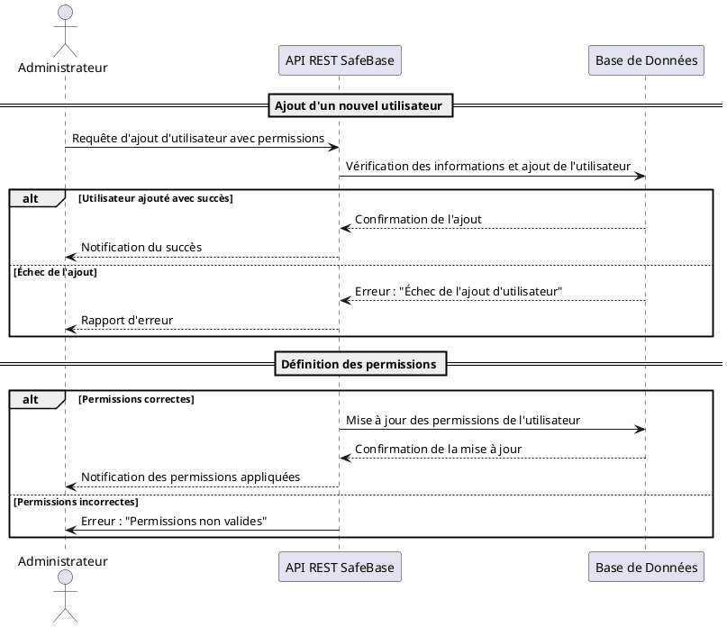

#### **3.1.5. Sécurité et Gestion des Permissions**

La gestion des utilisateurs et des permissions dans SafeBase est un élément essentiel pour garantir la sécurité du système. Seuls les utilisateurs disposant des permissions adéquates peuvent accéder aux fonctionnalités sensibles comme la gestion des sauvegardes et restaurations. Lorsqu'un utilisateur avec des privilèges élevés (comme un Administrateur) est ajouté ou modifié, il est recommandé de notifier les autres administrateurs pour assurer un suivi des modifications critiques.

#### **3.1.6. Scénarios alternatifs et gestion des erreurs**

1. **Échec de l'ajout d'utilisateur** : Si l'API ne parvient pas à ajouter l'utilisateur (par exemple, en raison de doublons ou d'erreurs dans les informations fournies), un rapport d'erreur est immédiatement envoyé à l'Administrateur. Celui-ci peut alors corriger les informations et tenter à nouveau l'ajout.

2. **Permissions non valides** : Si les permissions fournies pour l'utilisateur ne sont pas reconnues ou si elles ne correspondent pas aux rôles existants, une alerte est envoyée à l'Administrateur, et les permissions ne sont pas appliquées tant que les corrections ne sont pas apportées.

3. **Modification ou suppression d'utilisateur** : Le processus de modification ou de suppression d'un utilisateur suit des étapes similaires à celles de l'ajout. L'Administrateur envoie une requête pour modifier les informations ou supprimer l'utilisateur, et l'API SafeBase interagit avec la base de données pour effectuer l'opération.

### **3.2. Consulter les Logs et Rapports Système**

#### **3.2.1. Description**

Le cas d'utilisation "Consulter les Logs et Rapports Système" permet à l'Administrateur d'accéder aux journaux du système (logs) et aux rapports pour surveiller l'activité des bases de données, des sauvegardes, et d'autres opérations critiques. Ces journaux sont essentiels pour diagnostiquer les problèmes, surveiller l'utilisation du système, et s'assurer du bon fonctionnement des sauvegardes et restaurations.

Les étapes incluent :

1. L'Administrateur envoie une requête pour consulter les logs via l'API REST SafeBase.
2. L'API récupère les logs depuis le système de fichiers ou la base de données selon la requête.
3. Les logs ou rapports sont renvoyés à l'Administrateur avec la possibilité de filtrer par type, date ou d'autres critères.
4. En cas d'échec (par exemple, si les logs sont introuvables), un message d'erreur est renvoyé.

#### **3.2.2. Diagramme de Séquence**

Le diagramme suivant illustre le processus de consultation des logs et rapports système par l'Administrateur, en utilisant des **cadres d'interaction** pour structurer le flux d'actions, ainsi que des **fragments combinés** pour gérer les scénarios de succès et d'échec.

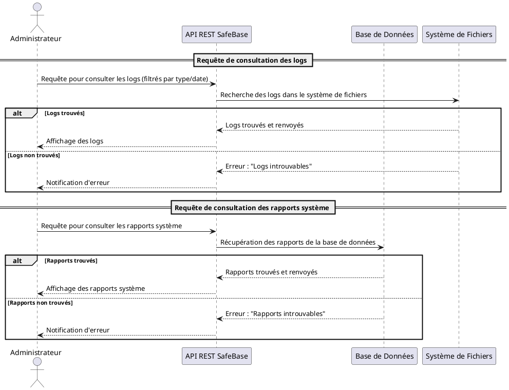

#### **3.2.3. Explication**

Voici les étapes détaillées du processus de consultation des logs et rapports système :

1. **Requête de consultation des logs** : L'Administrateur envoie une requête à l'API REST SafeBase pour consulter les logs du système. Cette requête peut inclure des filtres pour afficher des logs spécifiques (par exemple, logs d'erreurs, logs d'activité des bases de données) ou pour une période donnée (par exemple, logs des 24 dernières heures).

2. **Recherche des logs dans le système de fichiers** : L'API interagit avec le système de fichiers pour rechercher les logs demandés. Si les logs sont trouvés, ils sont renvoyés à l'Administrateur sous forme de tableau, fichier ou tout autre format consultable. Si les logs sont introuvables, une erreur est renvoyée.

3. **Requête de consultation des rapports système** : L'Administrateur peut également demander à consulter les rapports système générés par SafeBase, tels que les rapports d'état des sauvegardes et des restaurations. Ces rapports sont généralement stockés dans la base de données, et l'API REST SafeBase interagit avec cette dernière pour récupérer les informations.

4. **Récupération des rapports système** : Si les rapports sont trouvés, ils sont renvoyés à l'Administrateur. Si les rapports sont introuvables (par exemple, si aucune opération récente n'a généré de rapport), une notification d'erreur est renvoyée.

#### **3.2.4. Scénarios alternatifs et gestion des erreurs**

1. **Logs introuvables** : Si les logs demandés ne sont pas disponibles dans le système de fichiers (par exemple, si les logs ont été supprimés ou archivés), l'API renvoie une erreur à l'Administrateur indiquant que les logs sont introuvables.

2. **Rapports système introuvables** : Si l'API ne parvient pas à récupérer les rapports système (par exemple, si aucun rapport n'a été généré pour la période demandée), une erreur est renvoyée à l'Administrateur, et il est invité à vérifier les paramètres de la requête.

3. **Affichage des logs et rapports** : En cas de succès, les logs et rapports sont affichés à l'Administrateur dans un format consultable (tableau, fichier texte, etc.), lui permettant d'analyser les informations.

#### **3.2.5. Fragments combinés et cadres d'interaction**

1. **Cadres d'interaction** : Les cadres d'interaction structurent les différentes requêtes effectuées par l'Administrateur : d'une part, la consultation des logs, et d'autre part, la consultation des rapports système. Ces cadres permettent de séparer clairement les différentes étapes du processus.

2. **Fragments combinés (alt)** : Les fragments combinés `alt` sont utilisés pour gérer les scénarios alternatifs. Le diagramme montre les résultats possibles (succès ou échec) pour chaque requête (logs et rapports). Si les données sont trouvées, elles sont renvoyées à l'Administrateur, sinon une notification d'erreur est générée.

### **3.3. Configurer les Alertes**

#### **3.3.1. Description**

Le cas d'utilisation "Configurer les Alertes" permet à l'Administrateur de personnaliser les alertes générées par SafeBase. Cette fonctionnalité est essentielle pour s'assurer que l'Administrateur est informé en temps réel des événements critiques, tels que les échecs de sauvegarde ou les problèmes de connexion à la base de données. L'Administrateur peut définir les types d'événements qui déclenchent une alerte, choisir les canaux de communication (par exemple, e-mail ou notification dans l'application), et configurer la fréquence des alertes.

Les étapes incluent :

1. L'Administrateur accède à l'interface de gestion des alertes et configure les types d'événements à surveiller.
2. L'API REST SafeBase enregistre les préférences d'alerte dans la base de données.
3. Les alertes sont envoyées à l'Administrateur via les canaux de communication choisis en fonction des événements détectés.

#### **3.3.2. Diagramme de Séquence**

Le diagramme ci-dessous illustre le processus de configuration des alertes par l'Administrateur, avec une gestion des événements de configuration réussie ou échouée. Il utilise des **fragments combinés** pour décrire les scénarios alternatifs (succès ou échec).

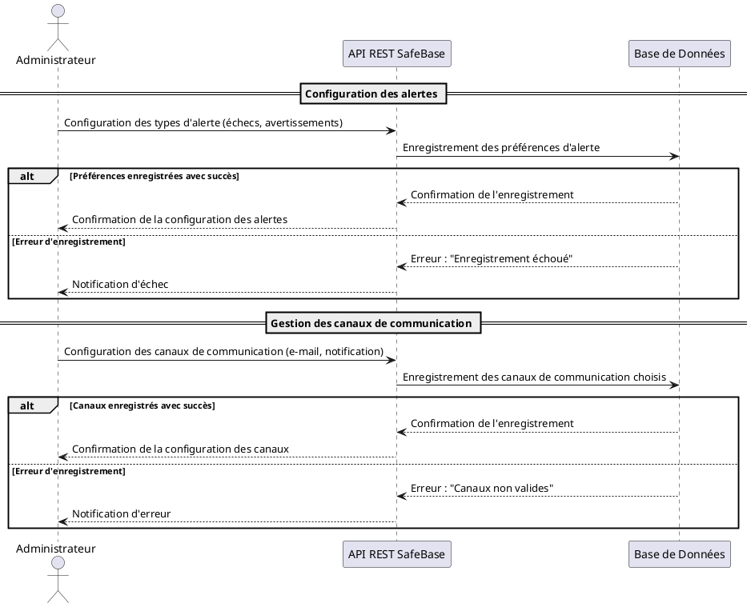

#### **3.3.3. Explication**

Voici les étapes détaillées du processus de configuration des alertes dans SafeBase :

1. **Configuration des types d'alerte** : L'Administrateur sélectionne les types d'événements qui déclencheront une alerte, tels que les échecs de sauvegarde, les avertissements sur l'espace de stockage ou les erreurs de connexion à la base de données. L'API REST SafeBase enregistre ces préférences dans la base de données.

2. **Gestion des canaux de communication** : L'Administrateur configure les canaux par lesquels il souhaite recevoir les alertes, comme par e-mail ou via des notifications dans l'application. L'API REST SafeBase enregistre ces canaux dans la base de données.

3. **Scénarios alternatifs** :
   - **Succès de la configuration** : Si les préférences et les canaux de communication sont correctement enregistrés, une confirmation est envoyée à l'Administrateur.
   - **Échec de la configuration** : Si une erreur se produit lors de l'enregistrement (par exemple, en raison d'un canal de communication non valide), un message d'erreur est envoyé à l'Administrateur.

#### **3.3.4. Scénarios alternatifs et gestion des erreurs**

1. **Erreur lors de l'enregistrement des alertes** : Si l'API ne parvient pas à enregistrer les préférences d'alerte (par exemple, en raison d'une erreur dans les données), un message d'erreur est renvoyé à l'Administrateur, qui est invité à corriger les informations.

2. **Canaux de communication non valides** : Si un canal de communication sélectionné par l'Administrateur (par exemple, un serveur e-mail) n'est pas valide ou accessible, une erreur est affichée, et l'Administrateur est invité à choisir un autre canal.

### **3.4. Exporter et Importer des Bases de Données**

#### **3.4.1. Description**

Le cas d'utilisation "Exporter et Importer des Bases de Données" permet à l'Administrateur d'extraire une copie complète des données d'une base de données (exportation) ou de restaurer ces données à partir d'un fichier (importation). Cette fonctionnalité est essentielle pour la migration des données, la sauvegarde manuelle ou pour déplacer les données d'un environnement à un autre (ex. : de la production à un environnement de test).

Les étapes incluent :

- **Exportation** : L'Administrateur demande à SafeBase d'exporter une base de données vers un fichier externe qui peut être sauvegardé, déplacé ou importé ailleurs.
- **Importation** : L'Administrateur peut ensuite utiliser ce fichier pour importer les données dans une base de données existante ou nouvelle.

#### **3.4.2. Diagramme de Séquence**

Le diagramme suivant illustre les processus d'exportation et d'importation de bases de données, avec des scénarios de succès et d'échec, en utilisant des **fragments combinés** pour gérer les résultats alternatifs.

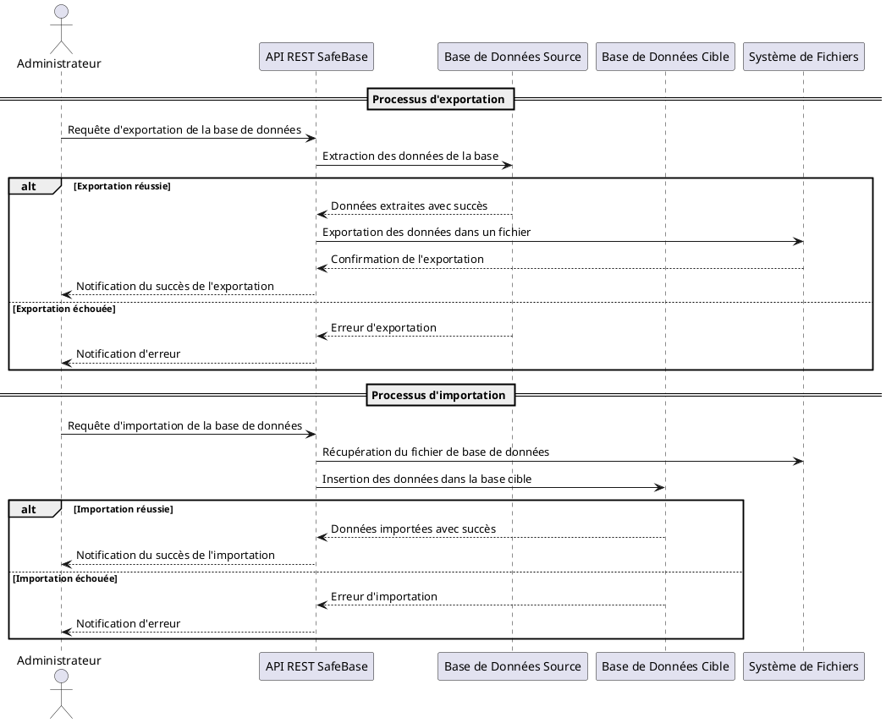

#### **3.4.3. Explication**

Voici les étapes détaillées du processus d'exportation et d'importation de bases de données dans SafeBase :

##### **Exportation**

1. **Requête d'exportation** : L'Administrateur demande à SafeBase d'exporter une base de données. Cette demande est envoyée via l'API REST SafeBase.
2. **Extraction des données** : L'API communique avec la base de données source pour extraire les données. Si l'exportation réussit, un fichier contenant les données est généré.
3. **Enregistrement des données** : Les données extraites sont sauvegardées dans un fichier sur le système de fichiers. Si l'opération réussit, l'Administrateur est informé du succès.
4. **Gestion des erreurs** : Si une erreur survient (par exemple, en raison d'un problème de connexion avec la base de données source), une notification d'erreur est renvoyée à l'Administrateur.

##### **Importation**

1. **Requête d'importation** : L'Administrateur envoie une requête à l'API REST SafeBase pour importer des données dans une base de données cible à partir d'un fichier existant.
2. **Récupération du fichier** : L'API récupère le fichier contenant les données exportées précédemment à partir du système de fichiers.
3. **Insertion des données dans la base cible** : L'API interagit avec la base de données cible pour insérer les données. Si l'importation réussit, une confirmation est envoyée à l'Administrateur.
4. **Gestion des erreurs** : Si une erreur survient pendant l'importation (par exemple, en raison d'un fichier corrompu ou d'une base cible inaccessible), une notification d'erreur est envoyée à l'Administrateur.

#### **3.4.4. Scénarios alternatifs et gestion des erreurs**

1. **Erreur lors de l'exportation** : Si l'API ne parvient pas à exporter les données (par exemple, en raison d'une défaillance dans la base de données source ou d'un problème d'écriture sur le système de fichiers), l'Administrateur reçoit une notification d'erreur et l'exportation est annulée.

2. **Erreur lors de l'importation** : Si l'API ne peut pas importer les données (par exemple, en raison d'un fichier corrompu, d'un format de fichier non valide ou d'une base de données cible non accessible), une notification d'erreur est envoyée à l'Administrateur pour qu'il prenne des mesures correctives.

### **3.5. Gérer les Quotas de Stockage pour les Sauvegardes**

#### **3.5.1. Description**

Le cas d'utilisation "Gérer les Quotas de Stockage pour les Sauvegardes" permet à l'Administrateur de surveiller et de gérer l'espace de stockage alloué aux sauvegardes dans SafeBase. Cette gestion est essentielle pour éviter que le système ne manque de stockage, ce qui pourrait entraîner des échecs dans les sauvegardes futures. L'Administrateur peut définir des limites de stockage (quotas) et recevoir des alertes lorsque ces limites sont atteintes ou dépassées.

Les étapes incluent :

1. L'Administrateur configure un quota de stockage pour les sauvegardes.
2. Le système surveille en temps réel l'utilisation de l'espace de stockage.
3. Des notifications sont envoyées lorsque l'espace de stockage approche ou dépasse le quota défini.

#### **3.5.2. Diagramme de Séquence**

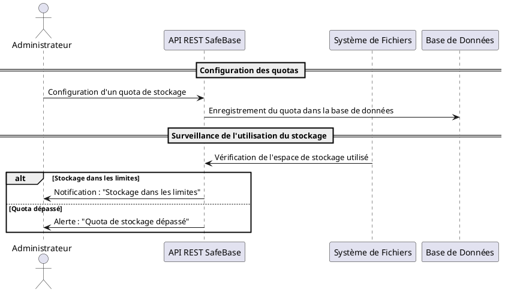

#### **3.5.3. Explication**

1. **Configuration des quotas** : L'Administrateur configure un quota de stockage pour les sauvegardes via l'API REST SafeBase, qui enregistre ce quota dans la base de données.
2. **Surveillance continue** : Le système surveille régulièrement l'utilisation de l'espace de stockage et compare avec le quota défini.
3. **Gestion des alertes** : Si l'espace de stockage dépasse le quota défini, une alerte est envoyée à l'Administrateur.

---

### **3.6. Interactions avec les Systèmes Externes**

#### **3.6.1. Description**

Le cas d'utilisation "Interactions avec les Systèmes Externes" décrit la manière dont SafeBase interagit avec des systèmes externes, tels que des serveurs de fichiers ou des solutions cloud, pour stocker ou récupérer des données, effectuer des sauvegardes, ou synchroniser des informations. Cela permet une gestion flexible des données tout en offrant la possibilité d'utiliser des infrastructures de stockage distantes.

Les étapes incluent :

1. L'Administrateur initie une requête pour interagir avec un système externe (par exemple, pour une sauvegarde cloud).
2. L'API SafeBase transmet la requête au service externe.
3. Le service externe répond en confirmant le succès ou l'échec de l'opération.

#### **3.6.2. Diagramme de Séquence**

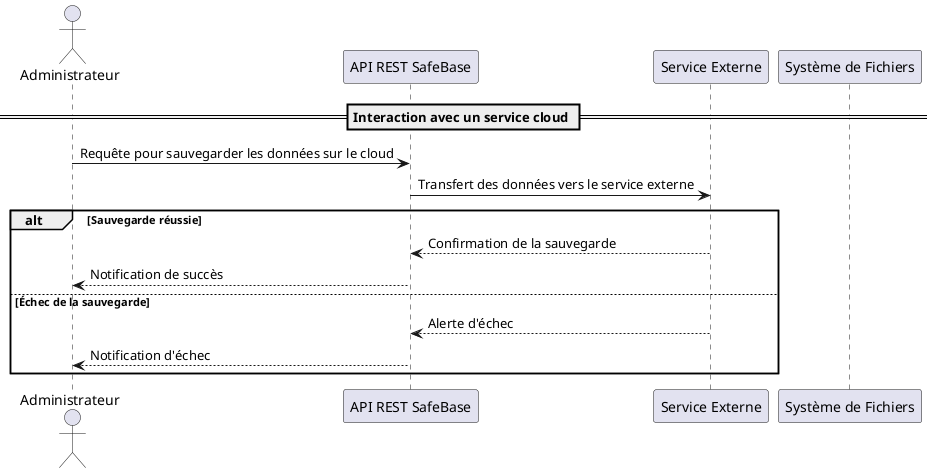

#### **3.6.3. Explication**

1. **Requête d'interaction** : L'Administrateur initie une requête pour interagir avec un système externe, telle qu'une sauvegarde sur le cloud.
2. **Transmission de la requête** : L'API REST SafeBase envoie la requête au service externe pour stocker ou récupérer des données.
3. **Réponse du service externe** : Le service externe répond à l'API avec une confirmation de succès ou une alerte d'échec, et l'Administrateur est notifié en conséquence.

## **4. Conclusion**

### **4.1. Récapitulatif des diagrammes**

Dans ce document, nous avons exploré et illustré divers processus critiques à travers des diagrammes de séquence. Chaque diagramme représente un flux d'interactions entre l'Administrateur, les composants du système SafeBase (API REST, base de données, système de fichiers, etc.) et, dans certains cas, des systèmes externes.

Voici un récapitulatif des processus abordés et leurs représentations par diagramme de séquence :

- **Gérer les utilisateurs et permissions** : Ce diagramme a illustré l'ajout, la modification et la suppression d'utilisateurs, ainsi que la gestion des permissions associées.
- **Exporter et importer des bases de données** : Le diagramme a montré le processus d'extraction d'une base de données vers un fichier, puis sa réinsertion dans une autre base.
- **Surveiller les bases de données et les processus de sauvegarde** : Ce diagramme a représenté la surveillance continue des bases de données et des sauvegardes, avec des alertes en cas d'anomalie.
- **Gérer les quotas de stockage** : Le diagramme a illustré comment configurer des quotas de stockage et générer des alertes lorsque ces limites sont dépassées.
- **Interactions avec les systèmes externes** : Ce diagramme a mis en évidence les interactions de SafeBase avec des services externes, comme des solutions cloud pour les sauvegardes.

Ces diagrammes ont permis de clarifier les interactions complexes et d'apporter une vue d'ensemble des différents processus dans SafeBase.

### **4.2. Importance des diagrammes de séquence dans la compréhension du système**

Les diagrammes de séquence jouent un rôle essentiel dans la compréhension et la modélisation d'un système. Ils permettent de :

- **Visualiser clairement les interactions** : Les diagrammes de séquence offrent une représentation graphique des échanges entre les acteurs (comme l'Administrateur) et les composants du système, facilitant ainsi la compréhension des flux de travail.
- **Mettre en évidence les dépendances** : Ces diagrammes aident à repérer les dépendances critiques entre les composants du système, ce qui est particulièrement utile pour identifier les points de défaillance potentiels.
- **Aider à la formation des développeurs** : Les diagrammes de séquence sont un outil de formation puissant pour les développeurs, en particulier ceux en formation. Ils permettent d'appréhender la complexité du système sans se perdre dans les détails du code. Pour des développeurs juniors, cette visualisation est primordiale afin de bien comprendre la chronologie et la nature des interactions.
- **Faciliter le débogage et le développement** : Une fois les flux de processus représentés sous forme de diagrammes, il est plus facile de déboguer et de comprendre le comportement du système en temps réel, notamment en cas d'anomalie ou de dysfonctionnement.

### **4.3. Bonnes pratiques pour la conception de diagrammes**

Pour garantir l'efficacité des diagrammes de séquence, voici quelques bonnes pratiques à suivre lors de leur conception :

1. **Simplicité** : Les diagrammes doivent rester simples et ne pas surcharger d'informations. Se concentrer sur l'essentiel et limiter le nombre de participants et d'interactions permet d'assurer une meilleure lisibilité.

2. **Lisibilité** : Organisez les éléments de manière claire et espacée. Utilisez des **fragments combinés** (`alt`, `opt`, etc.) pour gérer les scénarios alternatifs, et des **cadres d'interaction** pour regrouper les étapes logiques, tout en gardant une structure fluide.

3. **Clarté des rôles** : Assurez-vous que les rôles de chaque acteur (administrateur, base de données, API, etc.) sont bien définis et visibles dans le diagramme. N'oubliez pas d'utiliser des **noms explicites** pour les acteurs et composants afin d'éviter toute confusion.

4. **Gestion des erreurs** : Les diagrammes de séquence doivent inclure des scénarios alternatifs en cas d'échec (par exemple, un message d'erreur en cas de quota de stockage dépassé ou de sauvegarde échouée). Cela permet de mieux appréhender les flux d'erreur et d'améliorer la résilience du système.

5. **Éviter la complexité excessive** : Si un diagramme devient trop complexe, envisagez de le diviser en plusieurs sous-diagrammes, chacun représentant une partie spécifique du processus. Cela évite l'encombrement visuel et rend chaque diagramme plus facile à interpréter.

6. **Mise à jour régulière** : Les diagrammes doivent être mis à jour régulièrement pour refléter les évolutions du système. Un diagramme obsolète peut induire en erreur et rendre la maintenance du système plus difficile.

---
