# **Guide UML 2.0 d'une application web full stack**

## **1. Introduction à UML 2.0 pour les applications web**

### **1.1 Qu'est-ce que l'UML dans le contexte d'une application web full stack ?**

L'UML, ou Unified Modeling Language (Langage de Modélisation Unifié), est un langage graphique permettant de modéliser et de représenter visuellement les composants d'un système, en particulier dans le domaine du développement de logiciels. Utilisé principalement dans les projets de développement logiciel, l'UML permet de structurer les systèmes complexes en différents diagrammes afin d'améliorer la compréhension des interactions entre les différentes parties d'un système.

Dans le contexte d'une **application web full stack**, UML permet de modéliser l'ensemble de l'architecture, des interactions entre le **front-end** (partie visible par l'utilisateur) et le **back-end** (partie serveur, traitement des données), ainsi que les échanges avec la base de données et les systèmes externes (API). Il est donc possible de représenter graphiquement les flux de données, les composants applicatifs, les interactions entre les utilisateurs et le système, ainsi que le processus de déploiement dans des environnements cloud.

UML se révèle particulièrement utile dans les applications web full stack car il aide à structurer les multiples couches d'une application distribuée (présentation, logique métier, et persistance des données) et permet de visualiser les dépendances entre les composants, ce qui est essentiel pour la gestion d'une architecture moderne.

---

### **1.2 Évolution d'UML pour les systèmes web distribués**

Depuis sa création dans les années 1990, UML a évolué pour s'adapter aux nouveaux défis posés par les systèmes modernes et distribués. Avec l'essor des architectures microservices, des API RESTful, des Progressive Web Apps (PWA) et des infrastructures cloud, UML a permis de capturer et de modéliser ces nouvelles complexités.

**UML 2.0** a apporté des améliorations significatives, permettant une meilleure modularité, l'ajout de nouveaux types de diagrammes (comme les diagrammes de communication et de timing), et la possibilité de gérer des systèmes distribués, où les composants sont disséminés sur plusieurs serveurs ou déployés dans le cloud. Cela permet aux développeurs et aux architectes de modéliser non seulement les aspects logiciels d'une application, mais aussi ses infrastructures physiques et logiques.

Dans le cadre du développement d'applications web, ces évolutions d'UML facilitent la gestion des composants indépendants, l'optimisation des interactions entre les clients et les serveurs, et la modélisation de systèmes qui doivent être à la fois performants et résilients face aux changements fréquents et aux évolutions technologiques.

---

### **1.3 Pourquoi UML 2.0 est adapté aux applications web modernes ?**

L'UML 2.0 est particulièrement adapté aux applications web modernes pour plusieurs raisons :

1. **Complexité des interactions client-serveur** : Avec UML, il est facile de représenter les flux de données entre le front-end (navigateur ou application mobile) et le back-end (serveurs, bases de données), ainsi que les appels à des API REST ou GraphQL.

2. **Modélisation des architectures multi-couches** : UML permet de modéliser les trois couches principales des applications web modernes — présentation, logique métier, et données — facilitant ainsi la visualisation et la gestion des interactions entre ces différentes couches.

3. **Adaptabilité aux architectures modernes** : Les architectures microservices, qui reposent sur la séparation des services indépendants communiquant entre eux via des API, peuvent être modélisées facilement avec des diagrammes de composants, de déploiement et de communication.

4. **Gestion des workflows et des processus** : Avec UML, il est possible de représenter les flux de travail utilisateur (login, gestion des commandes, etc.) à travers des diagrammes d'activités et des diagrammes d'état. Cela permet de modéliser la logique métier des applications web.

5. **Support des systèmes distribués et cloud** : UML permet de modéliser le déploiement d'une application web dans des environnements distribués, comme le cloud (AWS, Azure, etc.). Les diagrammes de déploiement peuvent illustrer comment les différentes parties d'une application sont distribuées sur des serveurs, conteneurs, ou services cloud.

En résumé, UML 2.0 offre une flexibilité et une précision essentielles pour modéliser les applications web full stack, en assurant une communication claire entre les parties prenantes techniques et non techniques, et en facilitant l'architecture des systèmes évolutifs.

---

## **2. Concepts de base d'UML 2.0 pour les applications web**

### **2.1 Modélisation de l'architecture web : front-end, back-end, base de données et cache**

Dans une application web full stack, l'architecture est généralement divisée en trois grandes parties : le **front-end**, le **back-end**, et la **base de données**. Pour garantir des performances optimales, un **cache** peut être ajouté pour stocker temporairement certaines données.

- **Le front-end** : Il correspond à la partie visible par l'utilisateur, souvent développée avec des technologies comme HTML, CSS, JavaScript, et des frameworks modernes tels que React, Angular ou Vue.js. Le front-end envoie des requêtes au back-end pour récupérer des données ou déclencher des actions via des API.

- **Le back-end** : C'est la partie qui traite les requêtes, applique la logique métier et communique avec la base de données. Le back-end est souvent construit avec des frameworks comme Node.js, Django, Laravel ou Spring Boot. Il expose des API (REST, GraphQL) pour permettre au front-end de récupérer les données ou de modifier l'état du système.

- **La base de données** : Elle stocke les données de l'application. Une application web peut utiliser des bases de données relationnelles (MySQL, PostgreSQL) ou non relationnelles (MongoDB, Redis), selon les besoins de l'application.

- **Le cache** : Le cache est une couche intermédiaire permettant de stocker temporairement des données souvent demandées (comme des requêtes API répétées) pour réduire les temps de réponse. Des systèmes de cache comme Redis ou Memcached sont souvent utilisés.

#### **Modélisation UML de cette architecture**

En UML, on peut représenter cette architecture en utilisant plusieurs types de diagrammes :

- **Diagrammes de composants** pour montrer la séparation entre les différents modules du front-end, back-end et des bases de données.
- **Diagrammes de déploiement** pour illustrer comment ces composants sont hébergés sur différents serveurs ou dans des environnements cloud (comme AWS, Azure, ou Google Cloud).
- **Diagrammes de séquence** pour modéliser les interactions entre le front-end et le back-end, en mettant en avant les appels API et les réponses.

Cette modélisation permet de visualiser comment les différentes couches interagissent pour accomplir des tâches utilisateur, par exemple l'affichage d'une page web ou l'envoi d'une commande.

---

### **2.2 UML et le développement multi-couches (Présentation, logique métier, données)**

Les applications web modernes suivent généralement une architecture **multi-couches**. UML permet de modéliser clairement ces couches et leurs interactions :

- **Couche présentation (front-end)** : C'est la couche visible de l'application, généralement développée avec des frameworks comme React ou Angular. UML permet de modéliser cette couche en mettant en avant les composants interactifs (boutons, formulaires) et les événements utilisateurs qui déclenchent des actions (par exemple, le clic d'un bouton envoyant une requête API).

- **Couche logique métier (back-end)** : Cette couche contient les règles métiers et est responsable du traitement des données. Elle peut être modélisée à travers des **diagrammes de classes** (pour montrer les objets métiers) et des **diagrammes d'activités** (pour illustrer le flux des actions lors du traitement d'une requête).

- **Couche données (base de données)** : C'est la couche qui gère la persistance des données. UML permet de modéliser la structure de la base de données avec des **diagrammes de classes**, en mettant en avant les entités (tables) et leurs relations.

Les **diagrammes de séquence** sont également cruciaux pour modéliser la façon dont une requête utilisateur traverse ces couches, par exemple lorsqu'un utilisateur soumet un formulaire sur le front-end, la requête est transmise au back-end, traitée, et les résultats sont stockés ou récupérés dans la base de données.

---

### **2.3 Modélisation des architectures RESTful et GraphQL avec UML**

Les **API RESTful** et **GraphQL** sont des standards courants pour permettre la communication entre le front-end et le back-end d'une application web.

- **API RESTful** : Elles fonctionnent sur le protocole HTTP et sont basées sur des ressources (URI) et des méthodes HTTP (GET, POST, PUT, DELETE). La modélisation des appels RESTful en UML se fait généralement à travers des **diagrammes de séquence**, qui montrent comment une requête est envoyée par le client, reçue par le serveur, traitée et comment une réponse est renvoyée au client. On peut aussi utiliser des **diagrammes de composants** pour représenter l'organisation des services REST.

- **GraphQL** : Contrairement à REST, GraphQL permet au client de spécifier exactement les données dont il a besoin. En UML, cela peut également être modélisé via des **diagrammes de séquence**, où l'on montre les requêtes envoyées à un serveur GraphQL, la récupération des données et la réponse en fonction de la requête du client.

Dans les deux cas, les **diagrammes de communication** permettent de montrer comment les composants du système interagissent via des requêtes API pour répondre à des besoins spécifiques de l'utilisateur.

---

### **2.4 Architectures modernes : microservices et serverless dans une application web full stack**

Les architectures **microservices** et **serverless** sont des paradigmes modernes de développement qui permettent une grande flexibilité et scalabilité des applications web.

- **Microservices** : Dans une architecture microservices, l'application est divisée en petits services indépendants, chacun étant responsable d'une fonction spécifique (par exemple, un service de paiement, un service de gestion d'utilisateurs, etc.). Chaque service est déployé indépendamment et communique avec les autres via des API. En UML, cela peut être modélisé avec des **diagrammes de composants**, montrant les services indépendants et leurs interactions, ainsi que des **diagrammes de déploiement** illustrant comment ces services sont déployés sur différentes machines ou conteneurs.

- **Serverless** : Avec une architecture serverless, le code est exécuté dans des environnements gérés par des services cloud (par exemple AWS Lambda), où l'infrastructure est automatiquement gérée par le fournisseur cloud. Cela permet de ne pas s'occuper des serveurs, de réduire les coûts et d'optimiser les performances. En UML, cela peut être modélisé via des **diagrammes de séquence**, montrant l'exécution de fonctions serverless déclenchées par des événements, ou des **diagrammes de déploiement** pour montrer comment les fonctions sont hébergées dans le cloud.

Ces deux architectures facilitent le développement d'applications web scalables et résilientes, tout en simplifiant la gestion et le déploiement des composants.

---

## **3. Les diagrammes dans UML 2.0 pour les applications web**

### **3.1 Vue d'ensemble des diagrammes utilisés dans le développement web**

Dans le cadre du développement d'une application web full stack, UML 2.0 propose une variété de diagrammes permettant de modéliser les aspects structurels et comportementaux du système. Voici un aperçu des principaux types de diagrammes utilisés dans ce contexte :

- **Diagrammes de cas d'utilisation (Use Case Diagrams)** : Illustrent les interactions entre les utilisateurs (acteurs) et le système, en décrivant les différentes fonctionnalités que l'application offre du point de vue de l'utilisateur.
  
- **Diagrammes de classes (Class Diagrams)** : Modélisent la structure statique du système, incluant les classes, leurs attributs, méthodes et les relations entre elles. Utilisés pour représenter les entités métier et la logique back-end.

- **Diagrammes de séquence (Sequence Diagrams)** : Capturent les interactions temporelles entre les composants du système, montrant comment les requêtes et réponses circulent entre le front-end et le back-end via des API.

- **Diagrammes d'activités (Activity Diagrams)** : Décrivent les flux de travail ou processus métier de l'application, en mettant en évidence les actions réalisées, les décisions et les tâches parallèles ou séquentielles.

- **Diagrammes de composants (Component Diagrams)** : Montrent les composants logiciels et leurs interfaces dans le système, incluant les dépendances entre les services front-end et back-end ainsi que les bases de données.

- **Diagrammes de déploiement (Deployment Diagrams)** : Représentent l'infrastructure matérielle et les environnements de déploiement, souvent utilisés pour visualiser la topologie du système dans un environnement cloud.

- **Diagrammes d'états (State Machine Diagrams)** : Modélisent l'évolution des objets ou composants au fil du temps, en capturant les transitions d'état déclenchées par des événements.

- **Diagrammes de communication (Communication Diagrams)** : Illustrent les interactions et échanges de messages entre les objets ou composants du système.

- **Diagrammes de temps (Timing Diagrams)** : Capturent les aspects temporels des interactions, notamment la gestion des délais et des événements asynchrones.

Ces diagrammes sont complémentaires et permettent de visualiser à la fois la structure statique (composants et relations) et les comportements dynamiques (interactions, processus) d'une application web.

---

### **3.2 Diagrammes de cas d'utilisation : Interactions utilisateur-système via le navigateur**

#### **Introduction aux diagrammes de cas d'utilisation (Use Case Diagrams)**

Les **diagrammes de cas d'utilisation** sont des représentations graphiques qui illustrent comment les utilisateurs (appelés **acteurs**) interagissent avec les différentes fonctionnalités de l'application. Ces diagrammes décrivent les exigences fonctionnelles du système en montrant **ce que** l'application doit faire du point de vue de l'utilisateur, sans entrer dans les détails techniques de l'implémentation.

Dans une **application web full stack**, ces diagrammes sont particulièrement utiles pour visualiser les principales fonctionnalités accessibles via le navigateur et les différents rôles des utilisateurs. Cela permet de définir les fonctionnalités critiques de l'application avant de se plonger dans la modélisation plus technique.

---

#### **Éléments clés des diagrammes de cas d'utilisation**

1. **Acteurs** : Représentent les utilisateurs ou systèmes externes qui interagissent avec l'application. Un acteur peut être une personne (par exemple, un utilisateur), un autre système (comme un service tiers), ou un dispositif externe.

2. **Cas d'utilisation (Use Case)** : Représente une action ou fonctionnalité que l'utilisateur peut exécuter dans le système (par exemple, "Créer un compte", "Passer une commande").

3. **Lignes de communication** : Représentent les interactions entre les acteurs et les cas d'utilisation. Elles montrent quels acteurs utilisent quelles fonctionnalités.

4. **Système** : Le système ou l'application elle-même est souvent représenté par un rectangle englobant les cas d'utilisation, avec les acteurs situés à l'extérieur du rectangle.

5. **Relations** : Différentes relations peuvent exister entre les cas d'utilisation, comme les **relations d'inclusion** (un cas d'utilisation inclut une fonctionnalité d'un autre cas d'utilisation) ou les **relations d'extension** (un cas d'utilisation peut étendre le comportement d'un autre).

---

#### **Exemple concret : Diagramme de cas d'utilisation pour une application e-commerce**

Imaginons une **application web e-commerce**. Les principaux acteurs pourraient être :

- **Client** : Un utilisateur qui achète des produits.
- **Administrateur** : Un utilisateur qui gère les produits et les utilisateurs.
- **Système de paiement** : Un service externe pour traiter les paiements.

Les **cas d'utilisation** incluraient des fonctionnalités telles que :

- **Créer un compte** : Le client peut créer un compte sur le site web.
- **Parcourir les produits** : Le client peut naviguer dans les catalogues de produits.
- **Ajouter au panier** : Le client peut ajouter des produits à son panier.
- **Passer une commande** : Le client peut finaliser sa commande et payer en ligne.
- **Gérer les produits** : L'administrateur peut ajouter, modifier ou supprimer des produits.
- **Traiter les paiements** : Le système de paiement traite la transaction financière.

Voici un diagramme textuel en PlantUML représentant cette interaction :

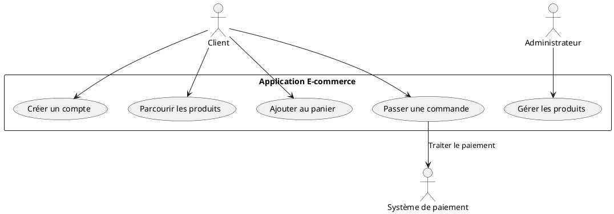

#### **Explication du diagramme**

- **Acteurs** :
  - Le **Client** peut **créer un compte**, **parcourir les produits**, **ajouter des articles à son panier**, et **passer une commande**.
  - L'**Administrateur** est responsable de **gérer les produits** du catalogue (ajout, suppression, modification).
  - Le **Système de paiement** est un acteur externe qui intervient lorsque le client finalise sa commande.

- **Cas d'utilisation** :
  - Chaque fonctionnalité critique de l'application e-commerce est représentée par un cas d'utilisation, comme **Passer une commande**, qui inclut l'interaction avec un système externe pour traiter les paiements.

Ce diagramme offre une vue d'ensemble claire des fonctionnalités offertes par le système du point de vue de l'utilisateur. Il permet de communiquer efficacement avec les parties prenantes pour s'assurer que les besoins fonctionnels sont bien couverts avant de passer à l'implémentation technique.

---

#### **Avantages des diagrammes de cas d'utilisation dans le développement web**

1. **Clarté fonctionnelle** : Les diagrammes de cas d'utilisation offrent une représentation claire des fonctionnalités de l'application du point de vue de l'utilisateur. Ils permettent de documenter les exigences fonctionnelles avant même que l'architecture technique ne soit définie.

2. **Communication avec les parties prenantes** : Ces diagrammes sont faciles à comprendre, même pour les non-techniciens (clients, chefs de produit). Ils facilitent les discussions sur les fonctionnalités attendues et leur priorité.

3. **Structure modulaire** : Chaque fonctionnalité est représentée indépendamment, ce qui permet de voir rapidement quelles parties de l'application sont concernées par les besoins des différents utilisateurs.

4. **Définition des rôles et des responsabilités** : Ils aident à définir les différents rôles des utilisateurs, qu'il s'agisse d'administrateurs ou d'utilisateurs finaux, et leurs interactions respectives avec l'application.

---

#### **Conclusion**

Les **diagrammes de cas d'utilisation** sont un excellent point de départ pour comprendre les interactions entre les utilisateurs et le système dans une application web full stack. Ils permettent de capturer les exigences fonctionnelles et de s'assurer que tous les scénarios d'utilisation principaux sont couverts. Dans une application web, où les utilisateurs interagissent principalement via un navigateur, ces diagrammes aident à définir clairement ce que chaque acteur peut accomplir dans le système.

---

### **3.3 Diagrammes de classes : Modéliser les classes back-end et les objets métier**

#### **Introduction aux diagrammes de classes**

Les **diagrammes de classes** sont des représentations statiques qui montrent la structure du système en illustrant les **classes** (objets), leurs **attributs** (propriétés), leurs **méthodes** (comportements), et leurs **relations** (associations, héritages, compositions, agrégations). Ils sont essentiels dans la conception du back-end d'une application, car ils définissent les objets métier et leurs interactions.

Dans une **application web full stack**, les diagrammes de classes sont principalement utilisés pour modéliser les entités du domaine métier côté serveur (back-end), qui interagissent avec les bases de données, les API, et d'autres services. Ils permettent de formaliser la logique métier avant de passer à l'implémentation.

---

#### **Éléments clés d'un diagramme de classes**

1. **Classes** : Représentent les entités du système. Chaque classe est définie par son nom, ses attributs, et ses méthodes.

2. **Attributs** : Propriétés de la classe, représentant les données ou caractéristiques spécifiques d'une entité.

3. **Méthodes** : Les fonctions ou comportements de la classe, représentant ce que l'entité peut faire.

4. **Associations** : Relations entre les classes. Il peut s'agir d'une association simple, d'une composition (une classe dépend totalement d'une autre) ou d'une agrégation (une relation de groupe entre les classes).

5. **Généralisation** : Relation d'héritage entre une classe parent et ses sous-classes.

6. **Multiplicité** : Indique combien d'instances d'une classe peuvent être liées à une autre (par exemple, un client peut passer plusieurs commandes, mais une commande ne peut appartenir qu'à un seul client).

---

#### **Exemple concret : Diagramme de classes pour une application e-commerce**

Prenons l'exemple d'une application web e-commerce. Le back-end peut gérer des entités telles que **Utilisateur**, **Produit**, **Commande**, et **Panier**. Voici un diagramme de classes en PlantUML qui montre les relations entre ces entités.

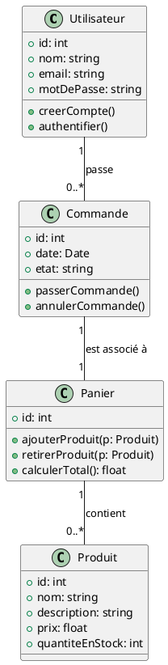

#### **Explication du diagramme**

- **Classes** :
  - **Utilisateur** : Représente un utilisateur enregistré dans le système. Cette classe possède des attributs tels que `nom`, `email`, et `motDePasse`. Elle comporte également des méthodes comme `creerCompte()` et `authentifier()` pour créer un compte et se connecter.
  
  - **Produit** : Modélise un article vendu dans la boutique en ligne, avec des attributs comme `nom`, `description`, et `prix`. Il contient également la quantité disponible en stock.

  - **Panier** : Représente le panier d'achat d'un utilisateur. Il peut contenir plusieurs produits et possède des méthodes pour ajouter ou retirer des produits et calculer le total des articles.

  - **Commande** : Représente une commande passée par l'utilisateur. Elle contient des informations telles que la `date`, l'`etat` de la commande (en cours, livrée, annulée) et des méthodes pour passer ou annuler la commande.

- **Relations** :
  - **Un utilisateur passe plusieurs commandes** : Un utilisateur peut passer plusieurs commandes au cours de sa vie sur le site. Cette relation est représentée par une multiplicité `1` pour l'utilisateur et `0..*` pour les commandes, indiquant qu'un utilisateur peut ne passer aucune commande ou plusieurs commandes.
  
  - **Une commande est associée à un panier** : Chaque commande est liée à un panier unique contenant les produits au moment où la commande est passée. La relation entre **Commande** et **Panier** est `1 à 1`.

  - **Un panier contient plusieurs produits** : Un panier peut contenir plusieurs produits, mais un produit peut être présent dans plusieurs paniers. Cette relation est `0..*` entre **Panier** et **Produit**.

---

#### **Utilisation des diagrammes de classes dans un projet web full stack**

Dans un projet **full stack**, les diagrammes de classes jouent un rôle crucial pour le développement du back-end. Ils permettent de :

1. **Modéliser les objets métier** : Le diagramme de classes définit les objets manipulés par le back-end (par exemple, utilisateurs, commandes, produits). Ces objets sont ensuite traduits en entités dans la base de données ou en objets JavaScript côté client.

2. **Définir les relations entre les entités** : Les diagrammes de classes clarifient comment les différentes entités du système interagissent entre elles. Cela aide à structurer les bases de données relationnelles (par exemple, les clés étrangères pour représenter les relations).

3. **Prendre en charge les transactions et les workflows** : Dans un contexte de back-end, les diagrammes de classes peuvent aider à comprendre comment les objets sont manipulés au fil des transactions (par exemple, création de commandes, mise à jour du panier).

4. **Supporter les frameworks ORM** : Les frameworks ORM (Object-Relational Mapping), tels que Hibernate ou Doctrine, s'appuient directement sur les concepts des diagrammes de classes pour mapper les objets métier aux tables de la base de données.

---

#### **Avantages des diagrammes de classes**

1. **Clarté dans la conception** : Les diagrammes de classes fournissent une représentation visuelle des objets métier et de leurs relations, facilitant la compréhension des structures de données et de la logique métier.

2. **Documentation** : Ils servent de référence pour documenter la structure du système, utile pour les nouveaux développeurs rejoignant le projet ou pour maintenir le code.

3. **Transition vers la base de données** : Les relations et les associations définies dans les diagrammes de classes peuvent être facilement traduites en modèles relationnels pour la base de données (avec des relations de type `one-to-many`, `many-to-many`, etc.).

4. **Préparation à l'implémentation** : Les diagrammes de classes aident à structurer le code du back-end, facilitant l'implémentation dans des langages orientés objet comme Java, C#, ou Python.

---

### **Conclusion**

Les **diagrammes de classes** sont un outil fondamental pour modéliser les objets métier et les relations dans une application web full stack, en particulier dans le back-end. Ils permettent de concevoir la logique métier de manière claire et cohérente, tout en fournissant une structure qui peut être directement traduite en code et en base de données. Grâce à eux, les développeurs peuvent mieux comprendre les interactions entre les entités du système et garantir la robustesse des fonctionnalités de l'application.

---

### **3.4 Diagrammes de séquence : Modéliser les interactions client-serveur, les requêtes HTTP et les API**

#### **Introduction aux diagrammes de séquence**

Les **diagrammes de séquence** sont utilisés pour représenter les interactions **dynamiques** entre les objets ou composants d'un système. Ils illustrent la séquence d'événements ou d'appels, mettant l'accent sur l'ordre des messages échangés et sur les interactions temporelles. Dans une application web full stack, ils sont particulièrement utiles pour modéliser les échanges entre le **front-end** (client) et le **back-end** (serveur), les **requêtes API** (REST ou GraphQL), et les processus **asynchrones** comme les WebSockets.

Les diagrammes de séquence aident à visualiser le déroulement de transactions complexes, telles que la soumission d'un formulaire, le traitement d'une commande ou encore l'authentification utilisateur.

---

#### **Éléments clés des diagrammes de séquence**

1. **Lifelines (lignes de vie)** : Chaque participant (acteur, composant ou objet) dans une interaction est représenté par une ligne de vie verticale. Par exemple, cela peut représenter le **navigateur du client**, le **serveur web**, ou encore la **base de données**.

2. **Messages** : Représentent les appels ou échanges d'informations entre les différents composants. Les messages sont des flèches horizontales indiquant les interactions (par exemple, une requête HTTP envoyée du client au serveur).

3. **Activations** : Représentent la durée pendant laquelle un composant exécute une action après avoir reçu un message. Cela permet de voir combien de temps une action prend.

4. **Retour (response)** : Lorsque le traitement est terminé, une réponse est envoyée au composant d'origine (par exemple, une réponse HTTP contenant un fichier JSON ou un statut de réussite).

5. **Boucles (loops)** : Elles permettent de modéliser des actions répétées, comme des tentatives de connexion ou des appels API successifs.

---

#### **Exemple concret : Diagramme de séquence pour un scénario de connexion d'utilisateur**

Prenons un exemple simple : un utilisateur accède à une application web et se connecte en fournissant ses identifiants. Le navigateur envoie une requête au serveur, qui vérifie les identifiants, et si la vérification est réussie, renvoie une session ou un jeton JWT (JSON Web Token) pour authentifier l'utilisateur.

Voici un diagramme de séquence en PlantUML pour ce scénario :

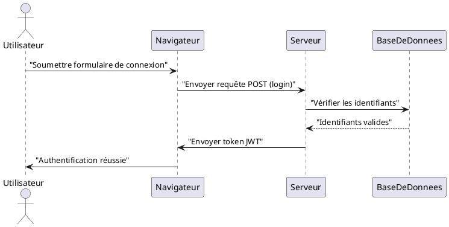

#### **Explication du diagramme**

1. **Lifelines** :
   - **Utilisateur** : L'acteur humain qui initie l'action de connexion.
   - **Navigateur** : Le client web, généralement un navigateur, qui envoie les requêtes au serveur.
   - **Serveur** : Le serveur web qui traite les requêtes.
   - **Base de données (BDD)** : Composant qui stocke les informations d'identifiants et vérifie leur validité.

2. **Messages** :
   - **Soumettre formulaire de connexion** : L'utilisateur soumet ses identifiants via le navigateur.
   - **Requête POST (login)** : Le navigateur envoie une requête HTTP POST avec les informations de connexion au serveur.
   - **Vérifier les identifiants** : Le serveur consulte la base de données pour vérifier si les identifiants fournis sont corrects.
   - **Envoyer token JWT** : Après validation, le serveur renvoie un jeton JWT au navigateur pour authentifier l'utilisateur.
   - **Authentification réussie** : Le navigateur informe l'utilisateur que la connexion a été réussie.

Ce diagramme illustre de manière claire l'ordre des événements lors du processus d'authentification. Il permet de voir les échanges entre les différents composants et d'identifier les points où des erreurs peuvent survenir (par exemple, si les identifiants ne sont pas valides).

---

#### **Exemple plus avancé : Diagramme de séquence pour une commande e-commerce**

Un autre exemple est le processus de **passage d'une commande** dans une application e-commerce. L'utilisateur soumet son panier, une commande est créée, les produits sont réservés, et la transaction est finalisée avec un service de paiement externe.

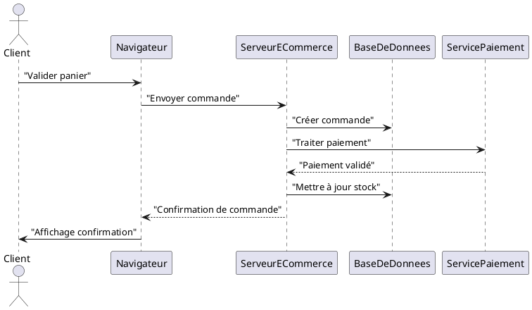

#### **Explication du diagramme**

1. **Messages clés** :
   - **Valider panier** : Le client soumet son panier pour passer une commande.
   - **Envoyer commande** : Le navigateur transmet la requête au serveur e-commerce pour traiter la commande.
   - **Créer commande** : Le serveur enregistre les détails de la commande dans la base de données.
   - **Traiter paiement** : Le serveur communique avec un service de paiement externe pour valider la transaction.
   - **Paiement validé** : Si le paiement est réussi, une réponse positive est envoyée au serveur.
   - **Mettre à jour stock** : Le serveur met à jour la base de données pour refléter les nouvelles quantités de produits disponibles.
   - **Confirmation de commande** : Le serveur envoie une confirmation de commande au navigateur pour informer le client.

Ce diagramme de séquence modélise l'intégralité du processus transactionnel, en illustrant les interactions entre le client, le serveur, la base de données et le service de paiement externe.

---

#### **Utilisation des diagrammes de séquence dans le développement web**

Les diagrammes de séquence sont essentiels pour plusieurs aspects du développement d'une application web full stack :

1. **Modélisation des flux utilisateur** : Ils permettent de visualiser comment les utilisateurs interagissent avec l'application via le navigateur et comment ces actions déclenchent des traitements côté serveur.

2. **Compréhension des processus asynchrones** : Les diagrammes de séquence sont particulièrement adaptés pour modéliser des processus asynchrones, tels que les notifications push, les WebSockets, ou les appels API répétitifs, en montrant la gestion des événements dans le temps.

3. **Débogage des flux de données** : Ils permettent de visualiser les échanges de messages entre les composants du système, facilitant ainsi la détection des goulots d'étranglement ou des erreurs potentielles dans la communication entre le front-end et le back-end.

4. **Intégration avec des services externes** : Les diagrammes de séquence sont très utiles pour modéliser les interactions avec des API ou services externes (comme les services de paiement, les API de livraison, etc.), en montrant comment ces services interviennent dans le flux de travail.

---

#### **Avantages des diagrammes de séquence**

1. **Clarté temporelle** : Ils permettent de visualiser facilement l'ordre chronologique des interactions, rendant les flux de travail plus compréhensibles.

2. **Documentation des processus métier** : Ils servent de documentation pour expliquer les processus métier complexes (comme les paiements, les commandes, ou les retours) aux développeurs et aux parties prenantes.

3. **Outil de communication** : En phase de conception, ces diagrammes permettent de communiquer clairement avec les autres membres de l'équipe ou les parties prenantes pour valider l'ordre des opérations et l'architecture du système.

4. **Support pour les tests** : Les diagrammes de séquence permettent de mieux planifier les tests en indiquant précisément quels composants et quelles interactions doivent être vérifiés.

---

### **Conclusion**

Les **diagrammes de séquence** sont un outil puissant pour modéliser les interactions dynamiques entre les composants d'une application web full stack. Ils fournissent une représentation claire et chronologique des événements, permettant de comprendre comment les différents systèmes (client, serveur, base de données, services externes) interagissent entre eux. Ils sont particulièrement utiles dans les applications web pour illustrer les échanges entre le front-end et le back-end, en particulier les interactions via les API et les processus asynchrones.

---

### **3.5 Diagrammes d'activités : Décrire les flux de travail dans une application web**

#### **Introduction aux diagrammes d'activités**

Les **diagrammes d'activités** sont utilisés pour modéliser les **flux de travail** ou **processus métier** dans un système. Ils permettent de représenter visuellement la séquence d'actions ou d'activités qui se déroulent dans une application, souvent déclenchées par les actions de l'utilisateur ou les événements du système. Les diagrammes d'activités montrent à la fois les flux **séquentiels** et **parallèles**, rendant ces diagrammes particulièrement adaptés pour modéliser des processus complexes avec des conditions et des boucles.

Dans une **application web full stack**, ces diagrammes sont souvent utilisés pour décrire des processus métier complexes, tels que la gestion des commandes, l'authentification utilisateur, ou le traitement des transactions. Ils sont également utiles pour modéliser des workflows qui impliquent des services multiples ou des tâches asynchrones.

---

#### **Éléments clés des diagrammes d'activités**

1. **Activités** : Ce sont les actions ou étapes réalisées dans un processus. Elles sont représentées par des rectangles arrondis.

2. **Flèches de flux** : Indiquent la direction dans laquelle les activités s'enchaînent. Elles relient les activités et montrent le chemin emprunté par le processus.

3. **Décisions (branches)** : Représentent des choix ou des conditions dans le flux de travail. Elles sont souvent représentées par un losange, où plusieurs chemins peuvent être pris en fonction des conditions.

4. **Forks et joins** : Représentent la division d'un flux en plusieurs flux parallèles (fork) ou la synchronisation de flux parallèles en un seul flux (join).

5. **Événements de début et de fin** : Chaque diagramme d'activités commence par un événement de début et se termine par un événement de fin, représentés respectivement par un cercle rempli et un cercle avec un bord épais.

6. **Swimlanes** (couloirs) : Utilisées pour diviser le diagramme en plusieurs sections, chaque section représentant un acteur ou un système. Cela permet de visualiser quelles parties du flux sont réalisées par quels acteurs ou composants.

---

#### **Exemple concret : Diagramme d'activités pour la gestion des commandes dans une application e-commerce**

Prenons un exemple simple : un utilisateur effectue une commande dans une application e-commerce. Ce processus implique plusieurs étapes, comme la validation du panier, la création de la commande, le traitement du paiement, et la mise à jour des stocks. Chaque étape peut avoir des conditions spécifiques (par exemple, paiement validé ou échoué).

Voici un diagramme d'activités en PlantUML pour ce processus :

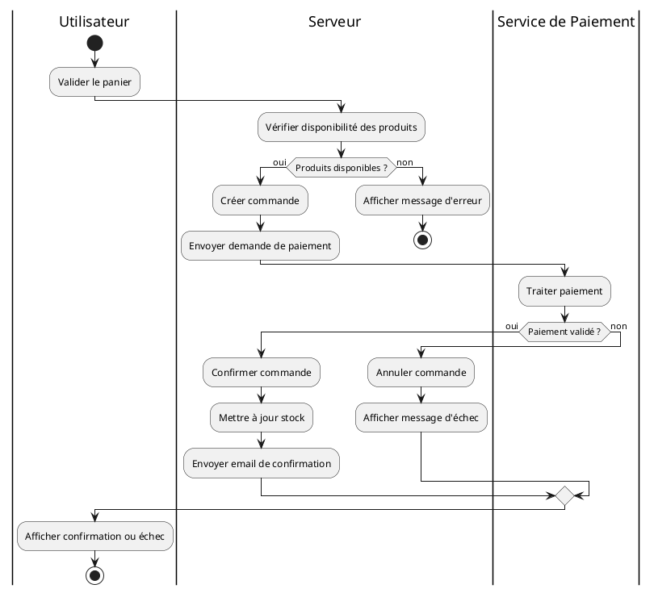

#### **Explication du diagramme**

1. **Swimlanes** :
   - **Utilisateur** : Représente les actions effectuées par l'utilisateur (validation du panier, réception des confirmations).
   - **Serveur** : Les activités exécutées par le serveur, comme la vérification des produits, la création de la commande, et la gestion du stock.
   - **Service de Paiement** : C'est un système externe qui gère le traitement des paiements.

2. **Flux d'activités** :
   - Le processus commence lorsque l'utilisateur valide son panier.
   - Le serveur vérifie ensuite la disponibilité des produits. Si les produits sont disponibles, une commande est créée et une demande de paiement est envoyée. Si les produits ne sont pas disponibles, l'utilisateur reçoit un message d'erreur et le processus s'arrête.
   - Le service de paiement traite ensuite la transaction. Si le paiement est validé, la commande est confirmée et un email de confirmation est envoyé à l'utilisateur. Si le paiement échoue, la commande est annulée et un message d'échec est envoyé à l'utilisateur.

3. **Conditions (branches)** :
   - **Disponibilité des produits** : Si les produits ne sont pas disponibles, l'utilisateur est informé et le processus s'arrête.
   - **Validation du paiement** : Si le paiement échoue, la commande est annulée et un message d'échec est envoyé.

---

#### **Utilisation des diagrammes d'activités dans un projet web full stack**

Les diagrammes d'activités sont très utiles pour décrire les processus complexes qui impliquent plusieurs étapes, acteurs, ou systèmes. Voici quelques cas d'utilisation courants dans le développement web :

1. **Modélisation des processus utilisateur** : Ils permettent de représenter les flux de travail de l'utilisateur dans une application, tels que le parcours d'achat, l'authentification, ou la gestion du compte.

2. **Gestion des processus back-end** : Ces diagrammes sont également utilisés pour décrire les flux métier internes au serveur, comme le traitement des commandes, la gestion des stocks, ou encore l'envoi de notifications.

3. **Illustration des flux asynchrones** : Pour des processus comme la gestion des messages en temps réel (via WebSockets ou des notifications push), les diagrammes d'activités peuvent montrer comment ces événements sont gérés parallèlement aux processus synchrones.

4. **Définition des workflows API** : Dans une architecture où le serveur consomme ou expose des API (REST, GraphQL), les diagrammes d'activités peuvent décrire les flux d'appels API successifs ou parallèles, incluant les réponses reçues et les conditions appliquées.

---

#### **Avantages des diagrammes d'activités**

1. **Visualisation des processus complexes** : Les diagrammes d'activités simplifient la représentation des processus métier complexes, en permettant de visualiser facilement les décisions, les conditions, et les tâches parallèles.

2. **Modélisation des conditions** : Ils permettent de représenter des choix ou des branches logiques, ce qui les rend idéaux pour des processus où le flux change en fonction des résultats intermédiaires (par exemple, succès ou échec du paiement).

3. **Communication inter-équipes** : Ces diagrammes sont très compréhensibles et facilitent la communication entre les développeurs, les chefs de projet, et les parties prenantes non techniques.

4. **Support des tâches parallèles** : Grâce aux **forks** et **joins**, ils permettent de visualiser des tâches exécutées en parallèle, ce qui est courant dans les applications web asynchrones.

---

### **Conclusion**

Les **diagrammes d'activités** sont un outil puissant pour modéliser les flux de travail dans une application web full stack. Ils permettent de capturer à la fois les processus utilisateur et les processus serveur, en représentant les tâches séquentielles et parallèles. Ils sont particulièrement utiles pour décrire des workflows complexes, impliquant plusieurs conditions ou acteurs, comme la gestion des commandes ou des transactions de paiement dans une application e-commerce.

---

### **3.6 Diagrammes de composants : Modéliser les composants front-end (SPA, widgets) et back-end (API, services)**

#### **Introduction aux diagrammes de composants**

Les **diagrammes de composants** sont utilisés pour représenter la structure modulaire d'une application, en modélisant les **composants logiciels** et leurs **interfaces**. Ils permettent de visualiser comment ces composants s'intègrent et interagissent entre eux pour former le système dans son ensemble. Dans le contexte d'une application web full stack, ces diagrammes sont particulièrement utiles pour illustrer :

- La séparation des responsabilités entre le **front-end** (souvent sous la forme d'une Single Page Application ou SPA) et le **back-end** (API REST, services, bases de données).
- Les dépendances entre les différents composants logiciels et leurs **interfaces**.
- L'intégration des **services externes** tels que les services de paiement, les systèmes d'authentification, ou les services tiers via des API.

---

#### **Éléments clés des diagrammes de composants**

1. **Composants** : Représentent les modules logiciels indépendants qui composent le système. Dans une application web, cela inclut des éléments comme la partie **front-end** (SPA, widgets), des **microservices** back-end, et des **services API**.

2. **Interfaces** : Les points d'entrée ou d'interaction des composants avec d'autres systèmes. Elles permettent aux composants de communiquer entre eux, soit en consommant, soit en exposant des API.

3. **Connecteurs** : Représentent les liens ou connexions entre les composants, illustrant les communications ou les dépendances entre eux. Cela peut être des appels API ou des requêtes HTTP entre les modules.

4. **Packages** : Dans certains cas, les composants sont regroupés en **packages** pour organiser de manière claire des sous-systèmes spécifiques (par exemple, le front-end et le back-end peuvent être regroupés).

---

#### **Exemple concret : Diagramme de composants pour une application e-commerce**

Prenons l'exemple d'une application e-commerce qui se compose des modules suivants :

- **Front-end** : Une SPA développée avec React ou Vue.js.
- **Back-end** : Un serveur API exposant des services REST pour gérer les produits, les commandes et les utilisateurs.
- **Service de paiement** : Un service externe (comme Stripe ou PayPal) qui gère les transactions financières.
- **Base de données** : Stocke les informations relatives aux produits, aux utilisateurs et aux commandes.

Voici un diagramme de composants en PlantUML pour cette architecture :

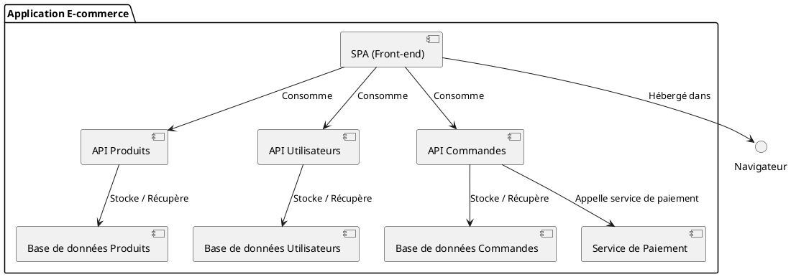

#### **Explication du diagramme**

1. **Composants** :
   - **SPA (Front-end)** : Une Single Page Application qui communique avec plusieurs API via des requêtes HTTP. Le front-end consomme les API pour afficher les produits, gérer les comptes utilisateurs et traiter les commandes.

   - **API Produits, API Utilisateurs, API Commandes** : Ce sont des services back-end exposant des API REST. Chaque service est responsable d'une partie spécifique du système (par exemple, gestion des produits, des utilisateurs et des commandes).

   - **Base de données Produits, Utilisateurs, Commandes** : Chaque API est liée à une base de données où les informations pertinentes sont stockées.

   - **Service de Paiement** : C'est un service externe (comme Stripe ou PayPal) qui gère les transactions financières pour les commandes.

2. **Interfaces et Connecteurs** :
   - Le front-end (SPA) consomme les API via des requêtes HTTP pour récupérer les informations sur les produits, gérer les utilisateurs et passer des commandes.
   - Les API back-end communiquent avec les bases de données pour stocker ou récupérer les données nécessaires.
   - Le service de paiement est appelé par l'API Commandes lors du processus de paiement pour valider la transaction.

Ce diagramme de composants montre la séparation claire des responsabilités entre les différentes parties du système (front-end, back-end, services externes) et les interactions entre elles. Il aide à visualiser comment les différents composants communiquent et s'intègrent pour former l'application complète.

---

#### **Utilisation des diagrammes de composants dans un projet web full stack**

Les diagrammes de composants sont particulièrement utiles pour :

1. **Visualiser l'architecture modulaire** : Ils permettent de voir comment les composants front-end et back-end sont séparés et comment ils interagissent via des interfaces définies. Cela est particulièrement pertinent pour les architectures modernes où le front-end et le back-end sont souvent développés et déployés séparément.

2. **Définir les interfaces API** : Les diagrammes de composants aident à visualiser les API exposées par le back-end et consommées par le front-end. Cela facilite la compréhension des points d'intégration entre le client et le serveur.

3. **Illustrer l'intégration des services externes** : Dans une application web full stack, il est courant d'intégrer des services tiers, comme des services de paiement ou des services d'authentification. Ces diagrammes montrent clairement comment ces services externes sont connectés au système.

4. **Clarifier les dépendances** : Ils permettent d'identifier les dépendances entre les différents composants. Cela est utile pour comprendre quelles parties de l'application dépendent les unes des autres, et pour planifier les mises à jour ou la maintenance.

5. **Préparer le déploiement** : Ces diagrammes fournissent une base pour comprendre comment les composants seront déployés sur différents serveurs ou environnements cloud.

---

#### **Avantages des diagrammes de composants**

1. **Simplicité et modularité** : Ils permettent de représenter facilement des systèmes complexes en montrant les composants de manière modulaire. Cela rend l'architecture plus compréhensible et plus facile à maintenir.

2. **Clarté des interfaces** : Ils aident à identifier les interfaces critiques entre les composants, ce qui est essentiel pour le développement de systèmes distribués et pour l'intégration des services API.

3. **Documentation des dépendances** : Les diagrammes de composants sont une excellente documentation pour comprendre comment les différents modules du système interagissent entre eux.

4. **Planification du déploiement** : Ils fournissent une vue d'ensemble des composants qui doivent être déployés, facilitant ainsi le travail des équipes DevOps ou des administrateurs systèmes.

---

### **Conclusion**

Les **diagrammes de composants** jouent un rôle crucial dans la modélisation d'une application web full stack. Ils offrent une vue d'ensemble claire des composants logiciels et de leurs interactions, en mettant en avant la structure modulaire de l'application et les points d'intégration critiques, comme les API ou les services externes. Grâce à ces diagrammes, les équipes peuvent mieux comprendre l'architecture globale du système, anticiper les dépendances et planifier efficacement le déploiement de chaque composant.

---

### **3.7 Diagrammes de déploiement : Modéliser le déploiement dans des environnements cloud**

#### **Introduction aux diagrammes de déploiement**

Les **diagrammes de déploiement** sont utilisés pour représenter l'infrastructure matérielle ou virtuelle sur laquelle une application est déployée. Ils montrent les **nœuds** (serveurs physiques, machines virtuelles, conteneurs, etc.), les **composants** logiciels déployés sur ces nœuds, ainsi que les **connexions réseau** entre eux. Dans une application web full stack, ces diagrammes sont particulièrement utiles pour visualiser :

- **L'architecture de déploiement** dans des environnements cloud, comme AWS, Azure ou Google Cloud Platform (GCP).
- **La répartition des composants** (back-end, front-end, bases de données) sur des machines ou des conteneurs.
- **Les dépendances réseau** entre les différentes parties du système, telles que les API, bases de données, ou services externes.

Ces diagrammes sont essentiels pour les équipes **DevOps** ou **d'administration système** car ils fournissent une vue d'ensemble de la manière dont l'application est distribuée et déployée.

---

#### **Éléments clés des diagrammes de déploiement**

1. **Nœuds (Nodes)** : Les nœuds représentent les entités physiques ou virtuelles (serveurs, machines virtuelles, conteneurs) sur lesquelles les composants logiciels sont déployés. Ils peuvent être des serveurs dans un datacenter ou des instances EC2 dans le cloud.

2. **Composants déployés** : Ce sont les composants logiciels (API, bases de données, services) qui sont exécutés sur un nœud particulier.

3. **Relations de communication** : Les lignes ou flèches entre les nœuds montrent les **connexions réseau** ou les **flux de communication** entre les composants déployés, souvent via des protocoles comme HTTP, HTTPS, ou TCP.

4. **Artifacts** : Les artefacts sont des fichiers ou des packages (fichiers de configuration, images Docker, etc.) déployés sur les nœuds et exécutés.

---

#### **Exemple concret : Diagramme de déploiement pour une application e-commerce dans un environnement cloud**

Prenons un exemple où une application e-commerce est déployée dans un environnement **AWS**. L'architecture comprend une **SPA** (Single Page Application) hébergée sur un **CDN** (Content Delivery Network), des **API** back-end exécutées sur des conteneurs **Docker** via un service d'orchestration comme **Kubernetes**, et une **base de données** relationnelle gérée via **Amazon RDS**.

Voici un diagramme de déploiement en PlantUML :

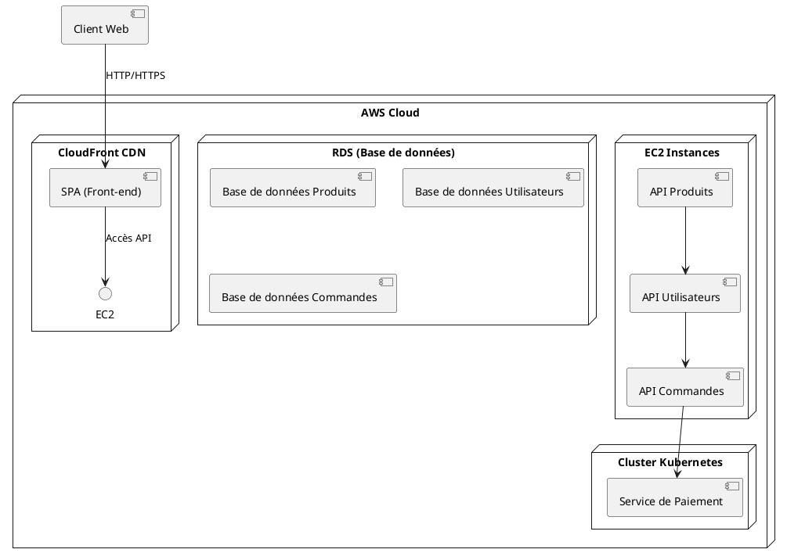

#### **Explication du diagramme**

1. **Nœuds** :
   - **AWS Cloud** : Représente l'environnement de cloud où l'application est déployée.
   - **EC2 Instances** : Des instances de calcul dans AWS exécutant des conteneurs Docker pour gérer les différentes API du back-end (API Produits, API Utilisateurs, API Commandes).
   - **Cluster Kubernetes** : Gère les API Commandes et l'intégration avec un service de paiement externe.
   - **RDS (Relational Database Service)** : Service géré par AWS pour les bases de données relationnelles, stockant les informations sur les produits, les utilisateurs et les commandes.
   - **CloudFront CDN** : Réseau de diffusion de contenu qui héberge et distribue la Single Page Application (SPA).

2. **Composants déployés** :
   - **API Produits**, **API Utilisateurs**, et **API Commandes** sont des microservices déployés sur des conteneurs Docker. Ils sont distribués sur différentes instances EC2 pour la scalabilité.
   - **SPA (Front-end)** : Hébergée sur un CDN, permettant un accès rapide à l'interface utilisateur depuis le navigateur du client.

3. **Relations de communication** :
   - Le **client web** accède à la **SPA** via HTTP/HTTPS. La SPA communique ensuite avec les **API back-end** pour gérer les produits, les utilisateurs et les commandes.
   - Les **API** interagissent entre elles et accèdent aux **bases de données** via des connexions sécurisées dans l'environnement AWS.
   - L'API Commandes interagit avec un **service de paiement** externe pour traiter les transactions.

Ce diagramme de déploiement montre comment les différentes parties de l'application e-commerce sont distribuées dans un environnement cloud, en mettant en évidence les dépendances réseau et les composants déployés sur les nœuds.

---

#### **Utilisation des diagrammes de déploiement dans un projet web full stack**

1. **Visualisation de l'infrastructure cloud** : Les diagrammes de déploiement aident à comprendre comment l'application est hébergée dans des environnements cloud (AWS, Azure, GCP) ou dans des infrastructures on-premises. Cela inclut les serveurs, machines virtuelles, conteneurs et services cloud gérés.

2. **Modélisation des dépendances réseau** : Ils permettent de voir les connexions réseau entre les différents composants logiciels, ce qui est crucial pour comprendre comment les services communiquent entre eux dans une architecture distribuée.

3. **Planification des ressources** : Ces diagrammes aident les équipes DevOps à planifier les ressources nécessaires, comme la répartition des instances de calcul ou la gestion des bases de données. Ils permettent également de planifier la redondance et la haute disponibilité.

4. **Déploiement dans des environnements conteneurisés** : Dans des architectures modernes basées sur des conteneurs, comme Kubernetes ou Docker Swarm, les diagrammes de déploiement montrent comment les conteneurs sont orchestrés et comment ils interagissent avec les autres composants.

5. **Sécurité et gestion des accès** : Ils aident également à modéliser les configurations de sécurité (par exemple, les groupes de sécurité, les pare-feu, les VPN) et les dépendances en matière d'accès réseau entre les services et les bases de données.

---

#### **Avantages des diagrammes de déploiement**

1. **Clarté sur l'infrastructure** : Ils offrent une vue d'ensemble claire de l'infrastructure matérielle ou virtuelle sur laquelle les composants sont déployés, permettant de mieux comprendre l'architecture physique du système.

2. **Planification des déploiements** : Ils facilitent la planification des déploiements dans des environnements complexes, comme des environnements multi-cloud ou hybrides.

3. **Documentation pour les équipes DevOps** : Ces diagrammes fournissent une documentation précieuse pour les équipes d'infrastructure et de DevOps, permettant une meilleure gestion des environnements de production.

4. **Modélisation de la scalabilité** : Ils montrent comment les composants peuvent être répliqués ou mis à l'échelle dans un environnement cloud, comme l'ajout de nouvelles instances EC2 ou de nouveaux pods Kubernetes.

---

### **Conclusion**

Les **diagrammes de déploiement** sont essentiels pour modéliser la manière dont une application web full stack est distribuée dans un environnement physique ou virtuel, en particulier dans des architectures cloud. Ils fournissent une vue d'ensemble de l'infrastructure matérielle et des relations réseau entre les composants, facilitant ainsi la planification, la gestion et le déploiement de systèmes complexes. Grâce à ces diagrammes, les équipes peuvent mieux comprendre comment les différents composants sont interconnectés et comment l'application peut être déployée de manière scalable et résiliente.

---

### **3.8 Diagrammes d'états (State Machine) : Décrire l'état des composants interactifs**

#### **Introduction aux diagrammes d'états**

Les **diagrammes d'états** (aussi appelés **State Machine Diagrams**) sont utilisés pour modéliser l’évolution des **états** d’un objet ou d’un composant au fil du temps en réponse à des événements externes ou internes. Ils sont particulièrement adaptés pour représenter les cycles de vie des objets complexes ou des composants interactifs dans une application web.

Dans une **application web full stack**, les diagrammes d’états peuvent être utilisés pour modéliser des entités comme un **compte utilisateur**, une **commande**, ou l’état d’un **composant d’interface** (comme un formulaire de connexion). Ils permettent de visualiser les différentes étapes ou transitions que traversent ces entités lors de leur interaction avec le système.

---

#### **Éléments clés des diagrammes d’états**

1. **État initial** : L’état dans lequel un objet ou composant se trouve au début de son cycle de vie. Il est représenté par un cercle rempli.

2. **États** : Les différentes étapes ou phases que traverse un objet ou composant. Chaque état est représenté par un rectangle avec le nom de l'état à l'intérieur.

3. **Transitions** : Les changements d’un état à un autre, généralement déclenchés par un événement ou une condition. Les transitions sont représentées par des flèches entre les états.

4. **État final** : L'état dans lequel un objet ou composant termine son cycle de vie. Il est représenté par un cercle avec un contour épais.

5. **Événements déclencheurs** : Ce sont les actions ou événements qui provoquent une transition entre deux états. Par exemple, un **paiement validé** ou une **session expirée** peut déclencher un changement d’état.

---

#### **Exemple concret : Diagramme d’états pour une commande e-commerce**

Prenons un exemple simple d'une **commande e-commerce** dans une application web. Une commande passe par plusieurs états, depuis sa création jusqu’à sa livraison ou annulation. Le processus inclut la validation du paiement, la préparation de la commande, et l'expédition.

Voici un diagramme d’états en PlantUML pour modéliser le cycle de vie d’une commande :

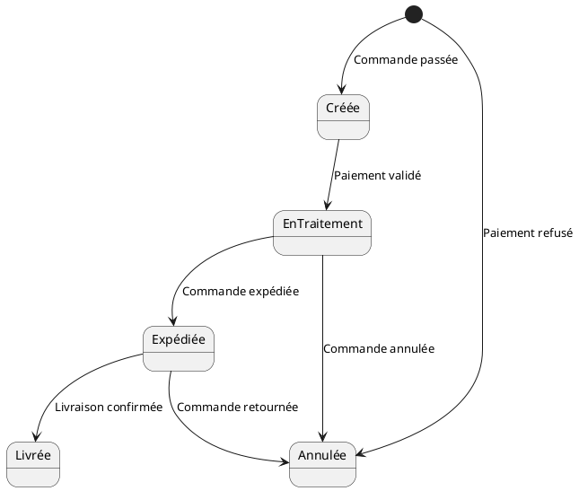

#### **Explication du diagramme**

1. **État initial** : Une commande commence dans l’état **Créée** lorsqu’elle est passée par un utilisateur.

2. **Transitions** :
   - Lorsque le paiement est validé, la commande passe à l’état **EnTraitement**.
   - Si la commande est expédiée, elle passe à l’état **Expédiée**.
   - La commande peut être **Livrée** une fois la livraison confirmée.
   - Si le paiement échoue ou que l’utilisateur annule la commande, elle passe à l’état **Annulée**.
   - Si la commande a été expédiée mais est retournée par le client, elle revient également à l’état **Annulée**.

3. **État final** : Le processus se termine lorsque la commande est soit **Livrée** (succès) soit **Annulée** (échec).

Ce diagramme permet de visualiser clairement les différentes étapes que traverse une commande et les événements qui déclenchent les transitions d'un état à un autre.

---

#### **Utilisation des diagrammes d’états dans un projet web full stack**

Les diagrammes d'états sont utiles dans plusieurs contextes pour une application web :

1. **Modélisation des objets métier** : Les diagrammes d'états permettent de suivre l'évolution des objets métier complexes, tels que les **commandes**, les **comptes utilisateurs**, ou les **produits**. Par exemple, un compte utilisateur peut passer de l'état **inactif** à **actif** après l'activation par email, puis être **suspendu** en cas de problème.

2. **Modélisation des composants d'interface utilisateur** : Les diagrammes d'états sont également utilisés pour modéliser les composants interactifs du **front-end**, comme un formulaire de connexion. Par exemple, un formulaire peut passer de l’état **vide** à **rempli**, puis à **validé** ou **en erreur** en fonction des données saisies.

3. **Suivi des processus métier** : Ils permettent de modéliser des processus métier complexes comme la gestion des retours ou des remboursements, en représentant chaque état possible d'un objet ou d'un processus au fil du temps.

4. **Gestion des sessions utilisateur** : Les diagrammes d’états peuvent représenter le cycle de vie des sessions utilisateur dans une application, depuis la **connexion** jusqu’à la **déconnexion** ou l’**expiration de la session**.

---

#### **Exemple 2 : Diagramme d’états pour un formulaire de connexion**

Voici un autre exemple pour un **formulaire de connexion** dans une application web. Un utilisateur soumet un formulaire avec ses identifiants. Le formulaire peut passer par plusieurs états : vide, rempli, validé ou en échec.

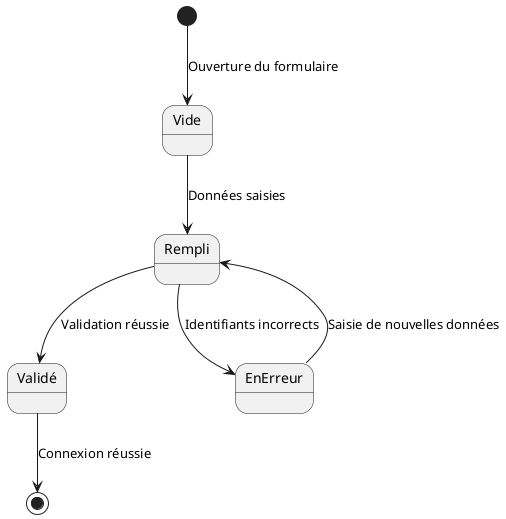

#### **Explication du diagramme**

1. **État initial** : Le formulaire est **vide** lorsque l'utilisateur l'ouvre pour la première fois.

2. **Transitions** :
   - Après que l'utilisateur a saisi ses identifiants, le formulaire passe à l'état **rempli**.
   - Si la validation est réussie, le formulaire passe à l'état **validé**, indiquant que la connexion a réussi.
   - Si les identifiants sont incorrects, il passe à l'état **en erreur**, permettant à l'utilisateur de saisir de nouvelles données.

3. **État final** : Le processus se termine après que l'utilisateur a validé ses informations et s'est connecté avec succès.

---

#### **Avantages des diagrammes d’états**

1. **Clarté dans les transitions complexes** : Les diagrammes d’états fournissent une vue détaillée des transitions d’état que traverse un objet ou un composant, ce qui est particulièrement utile dans des systèmes comportant de nombreux états intermédiaires.

2. **Meilleure gestion des erreurs** : Ils permettent de mieux comprendre et modéliser les erreurs ou exceptions qui peuvent survenir, en capturant les transitions vers des états d'erreur ou d'annulation.

3. **Documentation des cycles de vie** : Ils offrent une excellente documentation pour décrire les cycles de vie des objets dans le système, ce qui aide les développeurs et les parties prenantes à mieux comprendre les différents états d’un objet.

4. **Facilitation du développement** : Pour les développeurs front-end, les diagrammes d'états aident à modéliser les composants interactifs et leurs changements d’état, ce qui est essentiel dans des architectures réactives comme celles développées avec **React** ou **Vue.js**.

---

### **Conclusion**

Les **diagrammes d’états** sont des outils puissants pour modéliser l’évolution des objets ou composants dans une application web full stack. Ils permettent de capturer de manière précise les transitions entre différents états, en fonction des événements ou des actions des utilisateurs. Que ce soit pour suivre le cycle de vie d’une commande, gérer les états d’un compte utilisateur, ou modéliser des composants d'interface utilisateur, les diagrammes d’états offrent une vue complète des transitions possibles, améliorant ainsi la compréhension des processus complexes.

---

### **3.9 Diagrammes de communication : Modéliser les échanges entre le serveur, les clients et les services externes**

#### **Introduction aux diagrammes de communication**

Les **diagrammes de communication** (anciennement appelés **diagrammes de collaboration**) sont utilisés pour modéliser les interactions entre plusieurs composants d'un système en mettant l'accent sur les **liens structurels** et les **messages échangés** entre ces composants. Contrairement aux **diagrammes de séquence** qui se concentrent sur l’ordre temporel des événements, les diagrammes de communication se concentrent davantage sur les **relations** entre les acteurs et les objets ainsi que sur les **messages échangés**.

Dans une application web full stack, ces diagrammes sont particulièrement utiles pour modéliser les interactions entre les différentes parties d'un système distribué, par exemple entre le **client**, le **serveur**, et les **services externes** tels que les API tierces.

---

#### **Éléments clés des diagrammes de communication**

1. **Acteurs et objets** : Les composants, acteurs ou objets qui participent à l'interaction. Ils sont représentés sous forme de boîtes ou d'objets.

2. **Liaisons (links)** : Les connexions entre les objets ou composants, indiquant qu'il existe une relation ou une capacité à échanger des messages entre eux.

3. **Messages** : Les messages échangés entre les composants ou objets sont représentés par des flèches numérotées qui indiquent l'ordre dans lequel les messages sont envoyés. Un message peut être une **requête** ou une **réponse**, une commande, ou un événement envoyé d’un composant à un autre.

---

#### **Exemple concret : Diagramme de communication pour un flux de paiement dans une application e-commerce**

Prenons un exemple où un utilisateur passe une commande dans une application e-commerce. L’application doit interagir avec plusieurs composants pour gérer cette transaction : le **client web**, le **serveur de l’application**, la **base de données**, et un **service de paiement externe**.

Voici un diagramme de communication en PlantUML pour illustrer ces interactions :

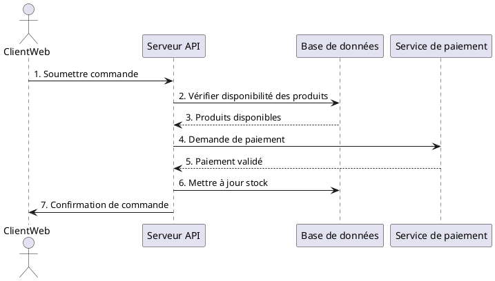

#### **Explication du diagramme**

1. **Acteurs et objets** :
   - **ClientWeb** : L’utilisateur final qui soumet sa commande via l’interface web.
   - **Serveur API** : Le serveur de l’application qui reçoit et traite la commande.
   - **Base de données** : Contient les informations sur les produits et les stocks.
   - **Service de paiement** : Un service externe qui gère les transactions financières.

2. **Messages échangés** :
   - **1. Soumettre commande** : Le client soumet une commande via le navigateur.
   - **2. Vérifier disponibilité des produits** : Le serveur vérifie si les produits sont en stock en interrogeant la base de données.
   - **3. Produits disponibles** : La base de données renvoie une confirmation de la disponibilité des produits.
   - **4. Demande de paiement** : Le serveur envoie une demande de paiement au service de paiement externe.
   - **5. Paiement validé** : Le service de paiement renvoie une validation du paiement.
   - **6. Mettre à jour stock** : Une fois le paiement validé, le serveur met à jour les stocks dans la base de données.
   - **7. Confirmation de commande** : Enfin, le serveur envoie une confirmation de la commande au client web.

Ce diagramme illustre comment plusieurs composants interagissent pour gérer une commande, en mettant en avant les messages échangés entre eux.

---

#### **Utilisation des diagrammes de communication dans un projet web full stack**

Les diagrammes de communication sont particulièrement utiles dans les situations suivantes :

1. **Modélisation des échanges entre composants** : Ils permettent de visualiser les messages échangés entre les composants d’un système distribué, comme les API, bases de données, ou services externes. Par exemple, ils sont utiles pour représenter les interactions entre un **client web** et une **API back-end**, ou entre une API et un **service de paiement**.

2. **Interactions client-serveur** : Ces diagrammes sont idéaux pour modéliser les échanges entre un navigateur (client) et un serveur web, en illustrant comment les **requêtes HTTP** et **réponses** sont traitées.

3. **Orchestration de microservices** : Dans les architectures basées sur des **microservices**, ils peuvent montrer comment les différents services interagissent via des appels API. Cela aide à comprendre quelles parties de l’application sont responsables des différentes tâches.

4. **Dépendances entre systèmes** : Les diagrammes de communication aident à identifier les dépendances entre systèmes externes et internes, comme les services d'authentification (OAuth2) ou les services de gestion des stocks.

5. **Gestion des événements et des notifications** : Ils sont également utiles pour modéliser des systèmes événementiels, où les composants envoient ou reçoivent des **notifications** ou des **événements** en fonction de certains critères.

---

#### **Exemple 2 : Diagramme de communication pour un processus d'authentification utilisateur**

Prenons un autre exemple pour illustrer un processus d'authentification d’utilisateur dans une application web où l’utilisateur entre ses identifiants, et le serveur interagit avec une base de données pour vérifier les informations, puis génère un jeton JWT pour authentifier l’utilisateur.

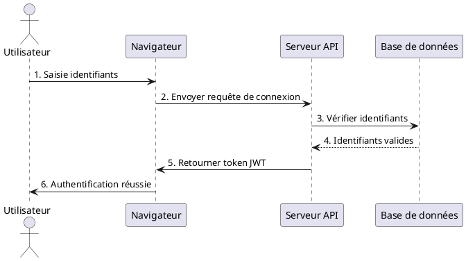

#### **Explication du diagramme**

1. **Acteurs et objets** :
   - **Utilisateur** : L'utilisateur qui interagit avec le navigateur pour se connecter.
   - **Navigateur** : Représente le client web qui transmet les informations au serveur.
   - **Serveur API** : Gère la logique métier de l’authentification.
   - **Base de données** : Contient les informations d'identifiants des utilisateurs.

2. **Messages échangés** :
   - **1. Saisie identifiants** : L'utilisateur entre ses identifiants dans le formulaire de connexion.
   - **2. Envoyer requête de connexion** : Le navigateur envoie une requête HTTP POST au serveur avec les informations d'identifiants.
   - **3. Vérifier identifiants** : Le serveur interroge la base de données pour vérifier les identifiants.
   - **4. Identifiants valides** : La base de données confirme que les identifiants sont corrects.
   - **5. Retourner token JWT** : Le serveur génère un jeton JWT et le retourne au navigateur.
   - **6. Authentification réussie** : Le navigateur informe l’utilisateur que la connexion est réussie.

---

#### **Avantages des diagrammes de communication**

1. **Visualisation des échanges de messages** : Ces diagrammes permettent de représenter de manière claire et concise les échanges de messages entre les composants, ce qui est utile pour comprendre les flux de données dans un système distribué.

2. **Relations entre composants** : Ils offrent une vue d'ensemble des **relations** entre les différents objets ou composants du système, facilitant la compréhension des dépendances.

3. **Documentation des interactions système** : Ils servent de documentation pour montrer comment les composants interagissent entre eux dans le cadre de scénarios métier spécifiques, comme le traitement des commandes ou l'authentification des utilisateurs.

4. **Facilitation du débogage** : En visualisant les messages échangés, les diagrammes de communication permettent d’identifier plus facilement les goulots d’étranglement ou les erreurs dans la communication entre les composants.

---

### **Conclusion**

Les **diagrammes de communication** sont un outil efficace pour modéliser les échanges entre les différents composants d'une application web full stack. Ils offrent une vue claire des interactions entre les objets et les acteurs du système, en se concentrant sur les messages échangés plutôt que sur l'ordre temporel des événements. Ces diagrammes sont particulièrement utiles dans des architectures distribuées ou lorsque l’application doit interagir avec des services externes, des bases de données, ou des microservices.
  
---

### **3.10 Diagrammes de temps (Timing Diagrams) : Gérer les événements et les performances des requêtes asynchrones**

#### **Introduction aux diagrammes de temps**

Les **diagrammes de temps** (ou **Timing Diagrams**) sont utilisés pour modéliser l'évolution des objets ou des composants au fil du temps. Ils sont particulièrement adaptés pour représenter les événements, les états et les **délais de réponse** dans un système. Contrairement aux **diagrammes de séquence**, qui se concentrent sur l’ordre des interactions entre composants, les diagrammes de temps se concentrent sur les **aspects temporels** de ces interactions.

Dans une **application web full stack**, ces diagrammes sont utiles pour modéliser le comportement temporel de systèmes qui impliquent des interactions **asynchrones** (comme les **API**, les **WebSockets**, ou les **requêtes AJAX**) ou pour analyser les **performances des requêtes** dans un environnement réseau.

---

#### **Éléments clés des diagrammes de temps**

1. **Lignes de vie** : Représentent les objets ou les composants impliqués dans l'interaction. Contrairement aux diagrammes de séquence, ces lignes montrent l'évolution de l'état d'un composant ou d'un objet au fil du temps.

2. **Événements** : Les points où un changement d’état ou une interaction se produit. Par exemple, un utilisateur pourrait envoyer une requête HTTP à un serveur, ce qui déclenche un événement.

3. **État** : L’état d’un composant ou d’un objet à un instant donné. Par exemple, un utilisateur peut être en état "connecté" ou "non connecté", et une requête peut être "en attente" ou "traitée".

4. **Axes temporels** : Les diagrammes de temps incluent une représentation explicite du temps, souvent représentée par un axe horizontal, montrant la durée entre les événements.

5. **Durée (Timing constraints)** : Ce sont des contraintes temporelles qui indiquent combien de temps une interaction doit durer ou combien de temps un objet reste dans un certain état avant de passer à l'état suivant.

---

#### **Exemple concret : Diagramme de temps pour une requête API asynchrone**

Prenons un exemple où un client web envoie une requête à une API pour récupérer des données sur les produits. Le serveur reçoit la requête, la traite, et renvoie une réponse après un certain délai. Ce type d’interaction peut inclure des délais dus au traitement de la requête ou à la latence réseau.

Voici un diagramme de temps en PlantUML pour illustrer ce processus :

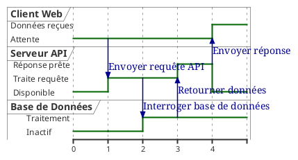

#### **Explication du diagramme**

1. **Lignes de vie** :
   - **Client Web** : L'utilisateur qui envoie une requête API.
   - **Serveur API** : Le serveur qui reçoit la requête et la traite.
   - **Base de données** : La base de données qui stocke les informations requises par le serveur API.

2. **Événements** :
   - **@1** : Le **Client Web** envoie une requête API au **Serveur API**.
   - **@2** : Le **Serveur API** interroge la **Base de données** pour récupérer les informations nécessaires.
   - **@3** : La **Base de données** renvoie les données au **Serveur API**.
   - **@4** : Le **Serveur API** envoie la réponse au **Client Web**.

3. **Durées** :
   - Le diagramme montre le temps que prend chaque interaction, depuis l'envoi de la requête jusqu'à la réception de la réponse. Cela permet d’identifier les éventuels **goulots d'étranglement** ou des temps de latence qui pourraient affecter les performances du système.

---

#### **Utilisation des diagrammes de temps dans un projet web full stack**

Les diagrammes de temps sont particulièrement utiles dans plusieurs scénarios spécifiques :

1. **Analyse des performances** : Ils permettent d'analyser les délais dans les interactions, par exemple le temps que prend une API pour répondre à une requête ou les délais dus à la latence réseau. Cela aide à identifier les **goulots d'étranglement** ou les **délais excessifs** dans le système.

2. **Modélisation des interactions asynchrones** : Ils sont utiles pour modéliser des interactions **asynchrones**, telles que les **notifications push**, les **WebSockets**, ou les requêtes AJAX, en capturant les événements déclenchés et la durée entre ces événements.

3. **Étude des états dans le temps** : Les diagrammes de temps permettent de visualiser comment un composant change d’état au fil du temps, ce qui est essentiel pour comprendre la gestion des **sessions utilisateurs**, les **processus de fond** (back-end) ou les **états d’attente** dans une application.

4. **Synchronisation et parallélisme** : Dans les systèmes qui nécessitent une exécution parallèle ou où plusieurs composants interagissent simultanément, ces diagrammes aident à comprendre comment ces interactions se synchronisent dans le temps.

---

#### **Exemple 2 : Diagramme de temps pour un processus d'authentification utilisateur avec expiration de session**

Prenons un exemple où un utilisateur se connecte à une application, et une session est créée pour lui avec une durée limitée. Si l’utilisateur n’interagit pas pendant un certain temps, la session expire et l’utilisateur doit se reconnecter.

Voici un diagramme de temps pour modéliser ce processus :

```plantuml
robust "Utilisateur" as U
robust "Serveur API" as S

@0
U is "Non connecté"
S is "Disponible"

@1
U -> S : Soumettre identifiants
S is "Vérifie identifiants"

@2
S -> U : Créer session
U is "Connecté"
S is "Gère session"

@10
U is "Inactif"
S is "Session active"

@20
S -> U : Session expirée
U is "Non connecté"
@enduml
```

#### **Explication du diagramme**

1. **Lignes de vie** :
   - **Utilisateur** : L’utilisateur qui tente de se connecter.
   - **Serveur API** : Le serveur qui gère la connexion et la session de l’utilisateur.

2. **Événements** :
   - **@1** : L’utilisateur soumet ses identifiants pour se connecter.
   - **@2** : Le serveur vérifie les identifiants et crée une session pour l’utilisateur.
   - **@10** : L’utilisateur devient inactif, mais la session reste active pendant un certain temps.
   - **@20** : La session expire en raison de l'inactivité, et l’utilisateur est déconnecté.

Ce diagramme montre clairement comment la session utilisateur évolue dans le temps et à quel moment l’utilisateur doit se reconnecter en raison de l'expiration de la session.

---

#### **Avantages des diagrammes de temps**

1. **Analyse temporelle précise** : Ils fournissent une vue détaillée des événements dans le temps, ce qui est crucial pour comprendre les performances du système et les délais dans les interactions entre les composants.

2. **Identification des problèmes de performance** : Ils permettent de repérer facilement les **goulots d’étranglement** ou les problèmes de latence qui pourraient affecter la réactivité de l’application.

3. **Gestion des interactions asynchrones** : Les diagrammes de temps permettent de modéliser les interactions asynchrones et de mieux comprendre comment elles sont traitées dans le système.

4. **Documentation des contraintes temporelles** : Ils sont un excellent outil pour documenter les **contraintes de temps** dans le système, comme les temps d'attente, les délais de traitement, ou la durée de vie d'une session.

---

### **Conclusion**

Les **diagrammes de temps** sont un outil puissant pour modéliser les événements temporels et les performances des interactions dans une application web full stack. Ils permettent d’analyser la durée des interactions asynchrones, de modéliser les transitions d’état au fil du temps et d’identifier les éventuels problèmes de latence ou de performance. Grâce à ces diagrammes, les développeurs et les équipes DevOps peuvent mieux comprendre comment les différents composants de l'application interagissent entre eux dans le temps, et optimiser le système en conséquence.

---

### **Conclusion de la section 3 : Utilisation des diagrammes UML dans une application web full stack**

Nous venons de terminer la **section 3** en détaillant les différents types de diagrammes UML, chacun ayant une utilité spécifique dans le cadre du

 développement d'une application web full stack. Voici un récapitulatif des diagrammes que nous avons abordés :

- **Diagrammes de cas d'utilisation** : Modélisent les interactions utilisateur-système.
- **Diagrammes de classes** : Représentent la structure statique des entités métiers.
- **Diagrammes de séquence** : Illustrent les interactions temporelles entre les composants.
- **Diagrammes d'activités** : Décrivent les flux de travail et processus métier.
- **Diagrammes de composants** : Modélisent l'architecture modulaire des composants logiciels.
- **Diagrammes de déploiement** : Montrent comment les composants sont déployés sur l'infrastructure.
- **Diagrammes d'états** : Représentent les transitions d'état des objets ou composants.
- **Diagrammes de communication** : Visualisent les échanges de messages entre les objets et composants.
- **Diagrammes de temps** : Gèrent les événements et la performance temporelle des interactions.

---

### **4. UML dans le développement d'applications web full stack**

#### **4.1 Modélisation d'une architecture full stack : Interactions client-serveur**

Dans le contexte du développement d'une application web full stack, il est essentiel de comprendre et de modéliser les interactions entre le **front-end** (client) et le **back-end** (serveur). UML offre des outils puissants pour représenter ces interactions de manière claire et structurée, facilitant ainsi la communication entre les équipes et la mise en œuvre des fonctionnalités.

##### **Compréhension de l'architecture full stack**

Une application web full stack est constituée de deux parties principales :

- **Front-end (Client)** : Il s'agit de la partie visible par l'utilisateur, généralement développée avec des technologies comme HTML, CSS, et JavaScript, ainsi que des frameworks tels que React, Angular ou Vue.js. Le front-end est responsable de l'interface utilisateur et de l'expérience globale.

- **Back-end (Serveur)** : C'est la partie qui gère la logique métier, les traitements des données, l'interaction avec la base de données, et les API. Il est souvent développé avec des langages tels que Node.js, Python, Java ou PHP, et utilise des frameworks comme Express, Django, Spring Boot ou Laravel.

##### **Utilisation d'UML pour modéliser les interactions client-serveur**

La modélisation UML peut être utilisée pour représenter les différentes couches de l'application et les interactions entre elles. Voici comment UML peut être appliqué :

1. **Diagrammes de séquence** : Ils sont particulièrement utiles pour modéliser les interactions temporelles entre le client et le serveur. Par exemple, lorsqu'un utilisateur effectue une action sur le front-end, comme cliquer sur un bouton, un diagramme de séquence peut montrer comment cette action déclenche une requête HTTP au serveur, comment le serveur traite cette requête, et comment la réponse est renvoyée au client.

   **Exemple** : Diagramme de séquence pour une requête de consultation de profil utilisateur.

   ```plantuml
   @startuml
   participant Utilisateur
   participant "Navigateur Web" as Navigateur
   participant "Serveur Back-end" as Serveur
   participant "Base de Données" as BDD

   Utilisateur -> Navigateur : Demande profil
   Navigateur -> Serveur : Requête GET /profil
   Serveur -> BDD : SELECT * FROM utilisateurs WHERE id = x
   BDD --> Serveur : Données utilisateur
   Serveur --> Navigateur : Réponse JSON
   Navigateur --> Utilisateur : Affichage du profil
   @enduml
   ```

2. **Diagrammes de composants** : Ils peuvent représenter les composants du front-end et du back-end, ainsi que les interfaces et les protocoles utilisés pour la communication. Cela aide à visualiser les dépendances et les points d'intégration entre les deux couches.

   **Exemple** : Diagramme de composants montrant une SPA (Single Page Application) communiquant avec une API RESTful.

   ```plantuml
   @startuml
   component "SPA Front-end" as FrontEnd
   component "API REST" as API
   component "Base de Données" as Database

   FrontEnd --(HTTP/HTTPS)--> API : Consomme API
   API --(SQL)--> Database : Opérations CRUD
   @enduml
   ```

3. **Diagrammes d'activités** : Ils peuvent modéliser les flux de travail impliquant le client et le serveur. Par exemple, le processus d'authentification, où un utilisateur saisit ses identifiants, le client envoie ces informations au serveur, et le serveur vérifie les informations avant de renvoyer une réponse.

   **Exemple** : Diagramme d'activités pour le processus d'authentification.

   ```plantuml
   @startuml
   start
   :Utilisateur saisit identifiants;
   :Client envoie identifiants au serveur;
   :Serveur vérifie identifiants;
   if (Identifiants valides ?) then (Oui)
     :Serveur crée session;
     :Serveur renvoie confirmation au client;
     :Client redirige vers tableau de bord;
   else (Non)
     :Serveur renvoie erreur au client;
     :Client affiche message d'erreur;
   endif
   stop
   @enduml
   ```

##### **Considérations pour une modélisation efficace**

- **Protocoles de communication** : Il est important de préciser les protocoles utilisés (HTTP, WebSocket, etc.) dans les diagrammes pour clarifier comment les données sont échangées.

- **Gestion des erreurs** : Les scénarios d'erreur doivent être inclus dans les diagrammes pour représenter les cas où les communications échouent, ce qui est crucial pour la robustesse de l'application.

- **Aspects de sécurité** : Inclure des éléments liés à la sécurité, tels que l'authentification, l'autorisation, et le chiffrement, dans la modélisation pour assurer que les interactions client-serveur sont sécurisées.

##### **Exemple approfondi : Interaction lors d'une mise à jour de profil utilisateur**

Imaginons que l'utilisateur souhaite mettre à jour ses informations de profil. Le processus implique une interaction complexe entre le client et le serveur.

**Diagramme de séquence détaillé :**

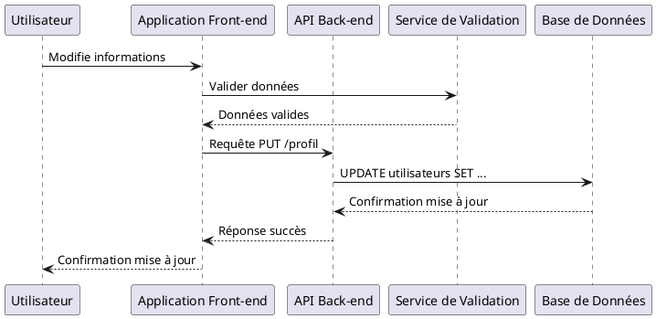

**Explications :**

- **Validation côté client** : Avant d'envoyer les données au serveur, le front-end utilise un service de validation pour s'assurer que les données sont conformes (formats, champs obligatoires).

- **Requête au serveur** : Les données validées sont envoyées au back-end via une requête PUT.

- **Mise à jour en base de données** : Le back-end traite la requête et met à jour les informations en base de données.

- **Retour d'information** : Une fois la mise à jour effectuée, le serveur envoie une réponse au client pour confirmer le succès de l'opération.

##### **Avantages de la modélisation UML pour les interactions client-serveur**

- **Clarté et communication** : Les diagrammes UML fournissent une représentation visuelle qui facilite la compréhension et la communication entre les membres de l'équipe (développeurs front-end, back-end, chefs de projet).

- **Identification des problèmes potentiels** : En modélisant les interactions, il est plus facile de repérer les éventuels problèmes de logique ou de flux de données avant l'implémentation.

- **Documentation** : Les diagrammes servent de documentation vivante du système, utile pour la maintenance et l'évolution de l'application.

##### **Meilleures pratiques pour la modélisation des interactions client-serveur**

- **Maintenir la simplicité** : Les diagrammes doivent être suffisamment détaillés pour être utiles, mais pas trop complexes pour éviter la confusion.

- **Utiliser des standards** : Adhérer aux conventions UML pour assurer que les diagrammes sont compréhensibles par tous les membres de l'équipe.

- **Mettre à jour régulièrement** : Les diagrammes doivent être mis à jour pour refléter les changements dans l'application, surtout dans un environnement agile où les modifications sont fréquentes.

---

### **4.2 Modélisation des API et des flux de données**

Dans une application web full stack, les **API** (Application Programming Interfaces) jouent un rôle central pour permettre la communication entre le **front-end** et le **back-end** ainsi qu'avec des services externes. Les **flux de données** décrivent les chemins que suivent les données lorsqu’elles passent d'un composant à un autre, ce qui inclut la gestion des requêtes, des réponses, et la transformation des données entre les différentes couches de l'application.

L'UML offre plusieurs types de diagrammes qui permettent de modéliser efficacement les API et les flux de données. Ces diagrammes permettent aux développeurs et aux architectes de visualiser les interactions entre les composants et de comprendre comment les données transitent dans le système.

---

#### **Modélisation des API avec UML**

Les **API** sont des interfaces qui permettent aux différents composants d'une application web de communiquer entre eux. Elles exposent des services que d’autres composants ou systèmes peuvent consommer, comme des requêtes HTTP dans le cadre d'une API RESTful ou des appels de méthodes pour une API GraphQL.

##### **Diagrammes de composants pour modéliser les API**

Un **diagramme de composants** UML peut représenter les différents modules de l'application, y compris les API, en montrant les interactions entre le front-end, le back-end et les services externes.

**Exemple** : Modélisation d'une architecture avec des API RESTful pour une application de gestion de comptes utilisateurs.

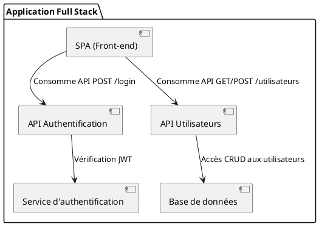

Dans ce diagramme, nous voyons que :

- Le **front-end** consomme deux API : une API d'authentification (qui gère les requêtes de connexion) et une API de gestion des utilisateurs (pour les requêtes de création, consultation, modification des utilisateurs).
- L'API d'authentification interagit avec un **service d'authentification externe** (comme un service OAuth2) pour vérifier et générer des jetons JWT (JSON Web Tokens).
- L'API utilisateurs interagit avec une **base de données** pour effectuer des opérations CRUD (Create, Read, Update, Delete) sur les utilisateurs.

##### **Diagrammes de séquence pour modéliser les interactions API**

Les **diagrammes de séquence** permettent de modéliser le flux temporel des interactions entre un client et une API, ainsi que les réponses reçues. Ils sont utiles pour visualiser comment une requête API est traitée par les différentes couches de l'application.

**Exemple** : Diagramme de séquence pour l'authentification d'un utilisateur via une API RESTful.

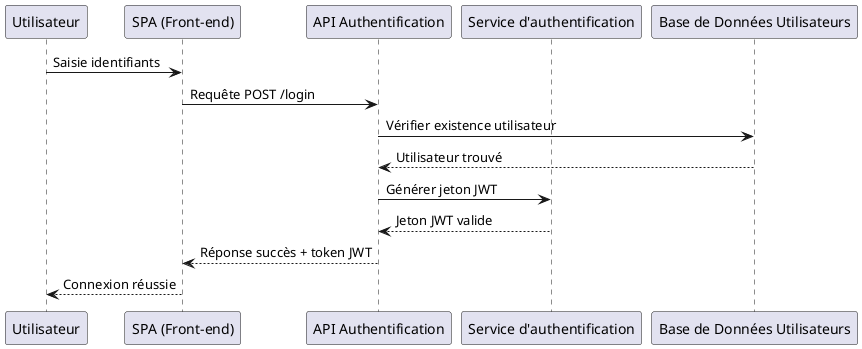

Dans ce diagramme, on observe que :

- L'utilisateur entre ses identifiants dans le front-end.
- Le front-end envoie une requête POST à l'API d'authentification.
- L'API vérifie l'existence de l'utilisateur dans la base de données et génère un jeton JWT en utilisant un service d'authentification.
- L'API renvoie ensuite une réponse au front-end avec le jeton JWT si l'authentification est réussie.

Ce diagramme montre comment l'authentification d'un utilisateur est gérée en plusieurs étapes, en mettant en évidence les interactions entre le client, l'API et les services back-end.

---

#### **Modélisation des flux de données**

Les **flux de données** sont les chemins que suivent les informations dans le système, entre le client, le serveur et les bases de données. Dans une application web, cela inclut les requêtes effectuées par le client (via HTTP), les traitements effectués par le serveur, et la gestion des réponses envoyées au client.

##### **Diagrammes d'activités pour les flux de données**

Les **diagrammes d'activités** UML permettent de modéliser les flux de données dans un processus métier ou une fonctionnalité spécifique. Par exemple, dans un processus de mise à jour des informations d'un utilisateur, un diagramme d'activités peut montrer comment les données sont manipulées du début à la fin.

**Exemple** : Diagramme d'activités pour la mise à jour des informations d'un utilisateur via une API.

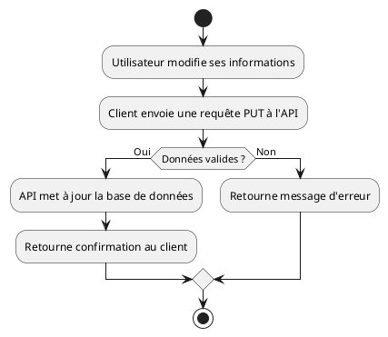

Dans ce diagramme, les données sont soumises par l'utilisateur, envoyées à l'API via une requête PUT, et, si elles sont valides, mises à jour dans la base de données. Sinon, un message d'erreur est retourné.

##### **Diagrammes d'états pour modéliser les transitions des données**

Les **diagrammes d'états** peuvent être utilisés pour modéliser les transitions des données au fil du temps, comme les états d'un objet ou d'un composant de données. Par exemple, un compte utilisateur peut passer par différents états au cours de son cycle de vie (actif, suspendu, supprimé).

**Exemple** : Diagramme d'états pour un compte utilisateur.

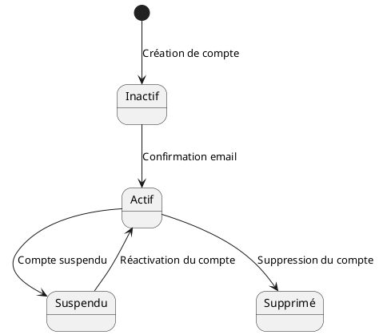

Ce diagramme montre les différentes transitions possibles pour un compte utilisateur au cours de son cycle de vie dans le système.

---

#### **Avantages de la modélisation UML pour les API et les flux de données**

1. **Clarté des interactions** : UML permet de clarifier comment les différents composants interagissent avec les API et de visualiser le flux de données à travers le système, facilitant ainsi la compréhension globale de l'architecture.

2. **Détection des erreurs potentielles** : En modélisant les flux de données et les API, il est plus facile d'identifier les erreurs potentielles (comme des problèmes de validation des données ou des erreurs de gestion de session) avant l'implémentation.

3. **Documentation des interfaces** : Les diagrammes UML fournissent une documentation visuelle des API et des interfaces, ce qui est utile pour les développeurs front-end et back-end, ainsi que pour les parties prenantes non techniques.

4. **Amélioration des performances** : En modélisant les flux de données, il est possible de repérer des inefficacités dans le traitement des requêtes ou dans la gestion des transactions, permettant ainsi d'optimiser les performances de l'application.

---

### **Conclusion**

La modélisation des **API** et des **flux de données** avec UML est une pratique essentielle pour tout projet de développement web full stack. Les diagrammes UML permettent de clarifier les interactions entre le front-end et le back-end, d’identifier les flux de données critiques, et de documenter les interfaces API. Grâce à ces outils, les développeurs peuvent concevoir des systèmes plus robustes, mieux documentés, et plus faciles à maintenir.

---
  
### **4.3 UML pour modéliser un pipeline CI/CD et l'intégration continue**

#### **Introduction à l'intégration continue et au déploiement continu (CI/CD)**

Dans le cadre du développement moderne d'une application web full stack, les pratiques d'**intégration continue** (CI) et de **déploiement continu** (CD) sont essentielles pour garantir la livraison fréquente et fiable du code en production.

- **Intégration continue (CI)** : Elle permet aux développeurs de fusionner fréquemment leur code dans un dépôt central, avec des tests automatisés exécutés à chaque changement pour détecter les erreurs rapidement.
- **Déploiement continu (CD)** : Il consiste à automatiser la livraison des changements validés en production, minimisant ainsi les risques d'erreurs humaines et les temps de mise en production.

Un **pipeline CI/CD** décrit l'ensemble des étapes automatisées depuis l'écriture du code jusqu'à son déploiement sur un serveur de production. UML permet de modéliser ces pipelines pour visualiser les différentes phases du cycle de développement, les tests, et les déploiements.

---

#### **Modélisation du pipeline CI/CD avec UML**

##### **Diagrammes d'activités pour modéliser le pipeline CI/CD**

Le **diagramme d'activités** UML est particulièrement adapté pour modéliser un pipeline CI/CD. Il permet de représenter chaque étape du processus et d’illustrer les décisions ou les conditions qui déterminent la progression du code à travers le pipeline.

**Exemple** : Modélisation d'un pipeline CI/CD pour une application web.

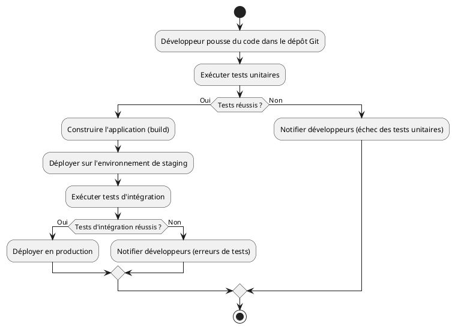

#### **Explication du diagramme**

1. **Poussée de code** : Le développeur pousse une nouvelle version de son code dans le dépôt Git.
2. **Exécution des tests unitaires** : Les tests unitaires sont exécutés automatiquement pour vérifier que les composants du code fonctionnent correctement de manière isolée.
3. **Phase de build** : Si les tests unitaires réussissent, le code est compilé ou packagé pour être déployé.
4. **Déploiement sur staging** : L'application est déployée dans un environnement de **staging** (pré-production) pour vérifier son comportement dans un cadre proche de la production.
5. **Tests d'intégration** : Des tests d'intégration sont effectués pour vérifier que les différents composants de l'application fonctionnent ensemble.
6. **Déploiement en production** : Si tous les tests réussissent, l'application est déployée en production. Si des erreurs surviennent à n'importe quel moment, le pipeline notifie les développeurs.

Ce diagramme illustre les différentes étapes du pipeline CI/CD ainsi que les décisions basées sur les résultats des tests. Il permet de visualiser l'automatisation du processus de développement et de déploiement.

---

##### **Diagrammes de composants pour modéliser l'infrastructure CI/CD**

Un **diagramme de composants** peut être utilisé pour modéliser les différentes parties de l'infrastructure CI/CD, incluant les outils et les services utilisés pour automatiser le pipeline.

**Exemple** : Diagramme de composants pour une architecture CI/CD utilisant Git, Jenkins, Docker et Kubernetes.

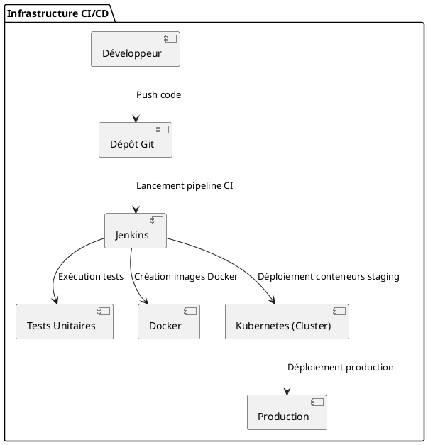

#### **Explication du diagramme**

- **Dépôt Git** : Les développeurs poussent leur code dans un dépôt Git, qui déclenche automatiquement le pipeline CI dans Jenkins.
- **Jenkins** : Cet outil CI/CD est utilisé pour gérer le pipeline. Il exécute les tests unitaires, génère des images Docker et orchestre les déploiements.
- **Docker** : Les images Docker sont créées par Jenkins et sont prêtes à être déployées sur un cluster Kubernetes.
- **Kubernetes** : Kubernetes est utilisé pour déployer et gérer les conteneurs Docker dans l'environnement de **staging** et de **production**.

Ce diagramme illustre les relations entre les différents outils de l'infrastructure CI/CD et montre comment ils interagissent pour automatiser le processus de développement et de déploiement.

---

#### **Phases importantes dans un pipeline CI/CD**

1. **Intégration continue (CI)** :
   - **Poussée du code** : Un pipeline CI commence lorsqu'un développeur pousse du code dans un dépôt source, comme Git. Cela déclenche automatiquement le processus.
   - **Compilation/Build** : Le code est compilé ou transformé en artefacts prêts à être déployés (comme des fichiers binaires ou des images Docker).
   - **Tests automatisés** : Des tests automatisés (unitaires, d'intégration, etc.) sont exécutés pour s'assurer que le code fonctionne correctement.
   - **Notifications** : En cas de succès ou d'échec, des notifications sont envoyées aux développeurs via des outils comme Slack ou par email.

2. **Déploiement continu (CD)** :
   - **Environnement staging** : Le code est déployé sur un environnement de staging pour s'assurer qu'il fonctionne comme prévu dans un environnement similaire à celui de production.
   - **Tests d'intégration et E2E** : Des tests d'intégration ou de bout en bout (E2E) sont exécutés pour valider l'application dans son ensemble.
   - **Déploiement en production** : Une fois validé en staging, le code est automatiquement déployé en production.

---

#### **Avantages de la modélisation d'un pipeline CI/CD avec UML**

1. **Visualisation des étapes critiques** : Les diagrammes UML permettent de visualiser les étapes clés d'un pipeline CI/CD, depuis la poussée du code jusqu'au déploiement en production, facilitant ainsi la communication entre les équipes de développement et d'opérations.

2. **Automatisation et optimisation** : En modélisant les pipelines CI/CD, les équipes peuvent identifier des étapes qui pourraient être automatisées ou optimisées pour améliorer l'efficacité du processus.

3. **Détection rapide des erreurs** : Les pipelines CI/CD incluent des tests automatisés à chaque étape. La modélisation UML permet de comprendre comment et quand les erreurs seront détectées et corrigées avant qu'elles n'atteignent l'environnement de production.

4. **Documentation** : UML fournit une documentation claire du pipeline CI/CD, ce qui est essentiel pour la maintenance et pour intégrer de nouveaux membres dans l'équipe.

---

### **Conclusion**

Les pipelines **CI/CD** sont essentiels pour le développement rapide et fiable des applications web full stack. Les **diagrammes d'activités** et **diagrammes de composants** UML permettent de modéliser les différentes étapes du pipeline, incluant les tests, les phases de validation et les déploiements automatisés. Cette modélisation aide à comprendre les processus d'automatisation, à identifier les points d'amélioration et à documenter l'infrastructure de développement.

---

### **4.4 UML pour modéliser la gestion des erreurs et la résilience dans les applications web distribuées**

#### **Introduction à la gestion des erreurs et à la résilience**

Dans une architecture **web distribuée**, la gestion des erreurs et la résilience sont des aspects cruciaux pour garantir que l'application continue de fonctionner correctement, même en cas de défaillance partielle. Une application web full stack doit être capable de **détecter** les erreurs, de **réagir** de manière appropriée et, dans la mesure du possible, de **se rétablir** automatiquement, sans impact significatif pour les utilisateurs.

La **résilience** implique la capacité d'un système à gérer les erreurs de manière proactive et à rétablir rapidement le service après une défaillance. Les diagrammes UML peuvent aider à modéliser ces processus, en illustrant les **flux d’erreurs**, les **points de défaillance potentiels**, et les **mécanismes de reprise**.

---

#### **Gestion des erreurs avec UML**

Les erreurs peuvent survenir à différents niveaux dans une architecture full stack : du **front-end** (par exemple, un échec de requête API) au **back-end** (par exemple, une défaillance de base de données ou une erreur de service externe). La gestion des erreurs nécessite des mécanismes robustes pour identifier et traiter ces erreurs de manière efficace.

##### **Diagrammes d'activités pour modéliser les flux d'erreurs**

Les **diagrammes d'activités** sont particulièrement adaptés pour modéliser les flux d'erreurs, en montrant comment un système détecte et réagit aux erreurs à différents niveaux. Ils permettent également de modéliser les processus de **gestion des exceptions** et de **reprise**.

**Exemple** : Modélisation du flux d'erreurs lors de la soumission d'un formulaire d'authentification.

```plantuml
@startuml
start
:Utilisateur soumet le formulaire de connexion;
:Client envoie requête POST à l'API;
if (Erreur dans la requête ?) then (Oui)
  :Afficher message d'erreur (ex: identifiants invalides);
  stop
else (Non)
  :API traite la requête;
  if (Erreur serveur ?) then (Oui)
    :Afficher message d'erreur (ex: serveur indisponible);
    stop
  else (Non)
    :Connexion réussie;
    :Redirection vers tableau de bord;
  endif
endif
stop
@enduml
```

#### **Explication du diagramme**

1. **Flux d'erreurs** : Lors de la soumission d’un formulaire de connexion, plusieurs types d’erreurs peuvent survenir. Si l’utilisateur entre des identifiants incorrects, un message d'erreur est affiché. Si le serveur est indisponible, une erreur serveur est renvoyée, et l'utilisateur est informé.
2. **Reprise** : En cas de succès, l'utilisateur est redirigé vers son tableau de bord. Le système gère les erreurs en fournissant un retour d'information clair et en essayant de maintenir l'expérience utilisateur fluide.

---

##### **Diagrammes de séquence pour modéliser la propagation des erreurs**

Les **diagrammes de séquence** permettent de modéliser comment les erreurs se propagent à travers les différents composants d'une application distribuée. Par exemple, une requête API qui échoue peut entraîner une cascade d'erreurs jusqu'au client.

**Exemple** : Propagation d'une erreur lors d'une requête d'API pour récupérer des données utilisateur.

```plantuml
@startuml
participant Client
participant "Serveur API" as Serveur
participant "Base de Données" as BDD

Client -> Serveur : Requête GET /profil
Serveur -> BDD : SELECT * FROM utilisateurs WHERE id = x
BDD --> Serveur : Erreur (base de données indisponible)
Serveur -> Client : Réponse erreur 500 (serveur indisponible)
Client -> Utilisateur : Afficher message d'erreur
@enduml
```

#### **Explication du diagramme**

1. **Propagation des erreurs** : Lorsque le client envoie une requête pour récupérer le profil d'un utilisateur, le serveur interroge la base de données. Si la base de données est indisponible, une erreur est renvoyée au serveur, qui à son tour renvoie une réponse d'erreur au client (code HTTP 500).
2. **Gestion côté client** : Le client affiche un message d'erreur à l'utilisateur pour l'informer que le serveur est indisponible, sans interrompre le reste de l'application.

---

#### **Résilience dans les systèmes distribués**

La **résilience** est la capacité d'un système à continuer à fonctionner malgré des erreurs ou des défaillances. Cela peut inclure des mécanismes comme le **retraitement automatique** des tâches échouées, la **dégradation gracieuse** (graceful degradation), ou encore des solutions comme les **circuit breakers** et les **fallbacks** pour éviter une surcharge des services en cas de défaillance.

##### **Diagrammes d'états pour modéliser la résilience**

Les **diagrammes d'états** peuvent être utilisés pour modéliser les transitions entre les différents états d'un composant dans un système résilient. Par exemple, un **circuit breaker** (interrupteur de circuit) est une technique utilisée pour empêcher qu'un service défaillant ne surchauffe et ne provoque des défaillances en cascade. Le circuit breaker passe par différents états selon la disponibilité du service.

**Exemple** : Diagramme d'états pour un circuit breaker.

```plantuml
@startuml
[*] --> Fermé : Service disponible
Fermé --> Ouvert : Défaillance du service détectée
Ouvert --> Semi-ouvert : Période d'attente avant la tentative de reprise
Semi-ouvert --> Fermé : Service restauré
Semi-ouvert --> Ouvert : Échec de la tentative
@enduml
```

#### **Explication du diagramme**

- **Fermé** : Le circuit est fermé, le service fonctionne normalement.
- **Ouvert** : Si une défaillance est détectée, le circuit est ouvert et les appels au service sont bloqués pour éviter une surcharge.
- **Semi-ouvert** : Après un certain temps, une tentative de reprise est effectuée. Si le service fonctionne à nouveau, le circuit se ferme, sinon il retourne à l'état "ouvert".

Cette modélisation permet de visualiser comment le système réagit à une défaillance et tente de récupérer sans surcharger les composants défaillants.

---

#### **Modélisation des mécanismes de reprise automatique (retry)**

Dans un système résilient, certaines tâches échouées peuvent être **retraitées** automatiquement après un certain délai. Les **diagrammes d'activités** peuvent modéliser ces mécanismes de reprise pour illustrer les conditions dans lesquelles le système tente de retraiter les tâches.

**Exemple** : Modélisation du mécanisme de reprise d'une tâche échouée.

```plantuml
@startuml
start
:Exécuter tâche;
if (Tâche réussie ?) then (Oui)
  :Fin de l'exécution;
else (Non)
  :Enregistrer l'erreur;
  :Attendre 5 minutes;
  :Réessayer;
endif
stop
@enduml
```

Dans ce diagramme, si une tâche échoue, le système enregistre l’erreur, attend un certain temps, puis tente de réessayer l’opération. Ce mécanisme permet de gérer les erreurs temporaires, comme une surcharge réseau ou une défaillance de service ponctuelle.

---

#### **Avantages de la modélisation UML pour la gestion des erreurs et la résilience**

1. **Clarté des flux d'erreurs** : UML permet de visualiser les différents flux d'erreurs dans le système, facilitant ainsi la conception de mécanismes de gestion d'erreurs robustes.
2. **Détection précoce des problèmes** : En modélisant les erreurs et leur propagation, il devient plus facile de détecter les problèmes potentiels et de concevoir des solutions avant que l'application ne soit en production.
3. **Documentation des stratégies de résilience** : Les diagrammes UML peuvent documenter les stratégies de résilience, telles que les **circuit breakers** ou les **reprises automatiques**, afin de garantir que le système reste fonctionnel en cas de défaillance.
4. **Amélioration de la robustesse du système** : En modélisant la résilience, les développeurs peuvent mieux comprendre comment le système se comporte face aux erreurs et optimiser les mécanismes de récupération.

---

### **Conclusion**

La gestion des erreurs et la résilience sont des aspects cruciaux des architectures web distribuées modernes. Les diagrammes UML, tels que les **diagrammes d'activités**, les **diagrammes de séquence** et les **diagrammes d'états**, offrent des outils puissants pour modéliser les flux d'erreurs et les stratégies de résilience. Ils permettent de comprendre comment les erreurs se propagent à travers les composants et comment le système peut se rétablir automatiquement après une défaillance.

---

## **5. Modélisation avancée pour les applications web full stack**

### **5.1 Modélisation des Progressive Web Apps (PWA) : Cycle de vie, cache, offline**

#### **Introduction aux Progressive Web Apps (PWA)**

Les **Progressive Web Apps** (PWA) combinent le meilleur des applications web et mobiles pour offrir aux utilisateurs une expérience enrichie. Elles permettent d’accéder aux fonctionnalités natives des appareils tout en étant développées avec des technologies web classiques (HTML, CSS, JavaScript). Les PWA sont conçues pour être **rapides**, **fiables** et **engageantes**, même dans des conditions de réseau instables ou lorsque l’utilisateur est hors ligne.

Les concepts clés des PWA incluent :

- **Cycle de vie** de l’application : La gestion des états de l’application depuis son installation jusqu'à sa mise à jour.
- **Mécanismes de cache** : Utilisation des **Service Workers** pour intercepter les requêtes réseau et gérer les réponses, permettant le fonctionnement offline.
- **Fonctionnalité offline** : La capacité de fonctionner sans connexion réseau en utilisant les données mises en cache et les bases de données locales.

---

#### **Modélisation du cycle de vie d'une PWA**

Le **cycle de vie d'une PWA** comporte plusieurs phases importantes qui peuvent être modélisées à l'aide d'UML. Chaque phase correspond à un état dans lequel l'application se trouve, allant de son installation à sa mise à jour ou suppression.

##### **Diagramme d'états pour le cycle de vie d'une PWA**

Un **diagramme d'états** peut être utilisé pour représenter les différentes phases du cycle de vie d'une PWA, comme son **enregistrement**, son **installation**, et sa **mise à jour** via les Service Workers.

**Exemple** : Cycle de vie d’une PWA avec Service Workers.

```plantuml
@startuml
[*] --> NonEnregistré : PWA ouverte dans un navigateur

NonEnregistré --> EnregistrementSW : Installation du Service Worker
EnregistrementSW --> Installé : Service Worker actif

Installé --> Activé : L'application est fonctionnelle
Activé --> MiseAJourDisponible : Nouvelle version détectée
MiseAJourDisponible --> MiseAJourSW : Mise à jour du Service Worker
MiseAJourSW --> Activé : Application mise à jour

Activé --> Désinstallé : Suppression de l'application
@enduml
```

#### **Explication du diagramme**

1. **NonEnregistré** : L’application est ouverte dans un navigateur, mais n’est pas encore installée en tant que PWA.
2. **EnregistrementSW** : Un **Service Worker** est enregistré, et l’application devient une PWA.
3. **Installé** : Le Service Worker est actif et l’application est maintenant disponible en tant que PWA.
4. **Activé** : L’application est en état de fonctionnement normal. Elle peut intercepter des requêtes, gérer le cache et fonctionner offline.
5. **MiseAJourDisponible** : Si une nouvelle version de la PWA est disponible, le Service Worker se met en mise à jour.
6. **MiseAJourSW** : Le Service Worker est mis à jour pour gérer les nouvelles versions de la PWA.
7. **Désinstallé** : L’application est supprimée de l’appareil, et le Service Worker est désactivé.

Ce diagramme permet de visualiser comment la PWA évolue au fil du temps, de son installation à sa désinstallation, en passant par les mises à jour.

---

#### **Modélisation des mécanismes de cache dans les PWA**

Les **Service Workers** jouent un rôle clé dans la gestion du cache pour les PWA. Ils interceptent les requêtes réseau et permettent de renvoyer des ressources à partir du cache, ce qui garantit une **performance accrue** et une **expérience utilisateur stable**, même en cas de connexion réseau instable ou inexistante.

##### **Diagramme de séquence pour le mécanisme de cache avec Service Workers**

Un **diagramme de séquence** peut être utilisé pour modéliser comment une PWA intercepte une requête réseau et renvoie une réponse à partir du cache ou d'une ressource en ligne.

**Exemple** : Interception d’une requête par le Service Worker pour servir du contenu en cache.

```plantuml
@startuml
actor Utilisateur
participant "PWA (Front-end)" as PWA
participant "Service Worker" as SW
participant "Cache local" as Cache
participant "Serveur" as Serveur

Utilisateur -> PWA : Demande de page
PWA -> SW : Requête interceptée
SW -> Cache : Vérifier cache
alt Ressource trouvée dans le cache
  Cache --> SW : Renvoyer ressource
  SW --> PWA : Servir la page depuis le cache
else Ressource non trouvée
  SW -> Serveur : Requête au serveur
  Serveur --> SW : Renvoyer ressource
  SW -> Cache : Stocker ressource dans le cache
  SW --> PWA : Servir la page depuis le serveur
end
@enduml
```

#### **Explication du diagramme**

1. **Interception par le Service Worker** : Lorsque l'utilisateur fait une demande de page via la PWA, le Service Worker intercepte la requête.
2. **Vérification du cache** : Le Service Worker vérifie d’abord si la ressource demandée est disponible dans le cache local.
   - Si la ressource est disponible, elle est servie depuis le cache, garantissant ainsi une réponse rapide.
   - Si la ressource n’est pas disponible dans le cache, le Service Worker effectue une requête au serveur pour la récupérer.
3. **Mise à jour du cache** : Lorsque le Service Worker récupère la ressource depuis le serveur, il la stocke dans le cache pour des utilisations futures.

Ce diagramme montre comment une PWA tire parti du cache pour améliorer les performances et garantir la disponibilité du contenu, même hors ligne.

---

#### **Modélisation des fonctionnalités offline dans les PWA**

Les PWA sont conçues pour fonctionner en mode **offline** en utilisant les **données mises en cache** et les **bases de données locales** comme IndexedDB. Les utilisateurs peuvent ainsi continuer à interagir avec l'application même sans connexion réseau.

##### **Diagramme d'activités pour la gestion du mode offline**

Un **diagramme d'activités** peut être utilisé pour modéliser les processus impliqués dans la gestion du mode offline d'une PWA.

**Exemple** : Modélisation du flux de travail lors d’une interaction en mode offline.

```plantuml
@startuml
start
:Utilisateur effectue une action;
if (Connexion réseau disponible ?) then (Oui)
  :Envoyer requête au serveur;
  :Mettre à jour les données dans le cache;
else (Non)
  :Utiliser les données du cache local;
  :Afficher données mises en cache;
endif
if (Modification des données ?) then (Oui)
  :Stocker modifications en local;
  :Envoyer au serveur dès que la connexion est rétablie;
endif
stop
@enduml
```

#### **Explication du diagramme**

1. **Vérification de la connexion réseau** : Si une connexion réseau est disponible, la requête est envoyée au serveur, et les données récupérées sont stockées dans le cache pour une future utilisation.
2. **Utilisation des données en cache** : Si l’utilisateur est hors ligne, les données sont récupérées à partir du cache local et affichées dans l'application.
3. **Gestion des modifications** : Si l'utilisateur effectue des modifications sur les données, celles-ci sont stockées localement jusqu'à ce que la connexion réseau soit rétablie. À ce moment-là, les modifications sont envoyées au serveur.

---

#### **Avantages de la modélisation UML pour les PWA**

1. **Clarté du cycle de vie** : UML permet de modéliser le cycle de vie complet d'une PWA, depuis l'installation jusqu'à la mise à jour, en passant par les interactions offline. Cela aide à mieux comprendre les transitions d’état et les événements qui déclenchent ces transitions.

2. **Gestion des cas complexes** : Les diagrammes UML aident à modéliser des scénarios complexes, comme les interactions avec le cache et la gestion des requêtes hors ligne, ce qui est essentiel pour comprendre comment optimiser la performance et la fiabilité des PWA.

3. **Documentation précise** : UML fournit une documentation visuelle claire des fonctionnalités clés d'une PWA, ce qui est utile pour les développeurs et les parties prenantes pour suivre l’évolution du projet.

4. **Résilience et performance** : En modélisant les mécanismes de cache et les stratégies de récupération des données, les développeurs peuvent mieux concevoir des solutions résilientes et améliorer la performance de l'application.

---

### **Conclusion**

La modélisation UML joue un rôle clé dans la conception et la compréhension des **Progressive Web Apps**. En utilisant des diagrammes d'états pour représenter le cycle de vie des PWA, des diagrammes de séquence pour modéliser les interactions avec le cache, et des diagrammes d'activités pour gérer le mode offline, UML aide à clarifier les mécanismes internes d'une PWA et à en améliorer les performances et la résilience.

---

### **5.2 Modélisation des microservices : Services indépendants et transactions**

#### **Introduction aux microservices**

L'architecture **microservices** est une approche qui consiste à décomposer une application en une série de **services autonomes**, chacun ayant une responsabilité spécifique. Chaque microservice fonctionne de manière **indépendante**, peut être déployé et mis à jour séparément, et communique avec d'autres services via des **APIs** ou des **protocoles de messagerie**. Cette approche est particulièrement adaptée aux applications web full stack complexes nécessitant une forte **scalabilité** et une **résilience**.

Les principaux défis de l'architecture microservices incluent la **gestion des transactions distribuées**, la **communication inter-services**, et le **maintien de la cohérence** des données à travers plusieurs services.

---

#### **Modélisation des microservices avec UML**

Dans une architecture microservices, UML peut être utilisé pour représenter :

- Les **composants indépendants** (les microservices eux-mêmes).
- Les **interactions entre les services** (API REST, messages asynchrones, événements).
- La **gestion des transactions** entre les services (transactions distribuées).
- Les **dépendances** et la **communication** entre les microservices.

##### **Diagrammes de composants pour représenter les microservices**

Le **diagramme de composants** est particulièrement adapté pour modéliser une architecture microservices, car il montre comment les services sont structurés de manière autonome tout en interagissant les uns avec les autres.

**Exemple** : Modélisation d'une architecture e-commerce en microservices.

```plantuml
@startuml
package "Architecture E-commerce" {
    [Service Commandes]
    [Service Produits]
    [Service Paiements]
    [Service Utilisateurs]

    Service Commandes --> Service Produits : Consomme API
    Service Commandes --> Service Paiements : Envoie requête de paiement
    Service Commandes --> Service Utilisateurs : Vérifie utilisateur
    Service Produits --> BaseDeDonnéesProduits : Accès CRUD
    Service Paiements --> ServiceExternePaiement : Traite paiement
}
@enduml
```

#### **Explication du diagramme**

1. **Services autonomes** :
   - **Service Commandes** : Responsable de la gestion des commandes des utilisateurs.
   - **Service Produits** : Gère le catalogue de produits, y compris la mise à jour et la consultation des informations produit.
   - **Service Paiements** : Responsable du traitement des paiements, en s'interfaçant avec un service de paiement externe.
   - **Service Utilisateurs** : Gère les informations des utilisateurs, telles que l'authentification et les préférences.

2. **Interactions entre les services** :
   - Le **Service Commandes** consomme l'API du **Service Produits** pour vérifier la disponibilité des produits.
   - Le **Service Paiements** est utilisé pour valider les transactions financières.
   - Le **Service Utilisateurs** est sollicité pour vérifier les informations des clients avant de finaliser une commande.

Ce diagramme de composants montre comment une application e-commerce peut être construite autour de plusieurs microservices indépendants qui communiquent entre eux via des API, tout en restant découplés les uns des autres.

---

#### **Modélisation des transactions distribuées**

Dans une architecture monolithique, une transaction peut souvent être gérée au sein d'une seule base de données. Cependant, dans une architecture microservices, où chaque service possède généralement sa propre base de données, les **transactions distribuées** sont nécessaires. Le défi consiste à garantir la **cohérence des données** à travers plusieurs services, même en cas d’échec d’une partie du processus.

##### **Diagramme de séquence pour une transaction distribuée**

Les **diagrammes de séquence** peuvent modéliser le flux d'une transaction impliquant plusieurs services, en illustrant comment chaque service participe à une transaction distribuée.

**Exemple** : Transaction de commande dans une architecture microservices.

```plantuml
@startuml
actor Utilisateur
participant "Service Commandes" as SC
participant "Service Produits" as SP
participant "Service Paiements" as SPaiements
participant "Service Utilisateurs" as SU

Utilisateur -> SC : Passer commande
SC -> SU : Vérifier utilisateur
SU --> SC : Confirmation utilisateur
SC -> SP : Vérifier stock produit
SP --> SC : Stock disponible
SC -> SPaiements : Envoi requête paiement
SPaiements --> SC : Paiement validé
SC -> SP : Mettre à jour stock produit
SC --> Utilisateur : Confirmation de commande
@enduml
```

#### **Explication du diagramme**

1. **Déclenchement de la transaction** : L'utilisateur passe une commande via le **Service Commandes**.
2. **Vérification de l’utilisateur** : Le **Service Utilisateurs** est sollicité pour vérifier les informations du client.
3. **Vérification des produits** : Le **Service Produits** est interrogé pour vérifier la disponibilité du stock.
4. **Validation du paiement** : Le **Service Paiements** traite la transaction financière.
5. **Mise à jour du stock** : Si tout est validé, le stock est mis à jour, et la commande est confirmée auprès de l'utilisateur.

Ce diagramme montre comment une transaction est gérée entre plusieurs microservices de manière coordonnée, chaque service jouant un rôle spécifique dans la validation et la confirmation de la commande.

---

#### **Gestion des transactions dans une architecture distribuée**

Dans les architectures microservices, il n'est souvent pas possible de gérer les transactions de manière atomique comme dans une architecture monolithique. Des techniques telles que les **Sagas** sont utilisées pour gérer les transactions distribuées.

##### **Diagramme d'activités pour modéliser une saga**

Le **modèle de saga** est une approche pour gérer les **transactions longues** dans un environnement distribué. Chaque étape de la transaction est un service autonome, et si une étape échoue, des **compensations** (rollback) sont exécutées pour annuler les étapes précédentes.

**Exemple** : Modélisation d'une saga pour une commande e-commerce.

```plantuml
@startuml
start
:Passer commande (Service Commandes);
:Vérifier stock (Service Produits);
if (Stock disponible ?) then (Oui)
  :Réserver stock;
  :Vérifier paiement (Service Paiements);
  if (Paiement validé ?) then (Oui)
    :Confirmer commande;
    stop
  else (Non)
    :Annuler réservation du stock;
    stop
  endif
else (Non)
  :Annuler commande;
  stop
endif
@enduml
```

#### **Explication du diagramme**

1. **Vérification du stock** : Le service vérifie si les produits sont disponibles.
2. **Réservation et paiement** : Si le stock est disponible, il est réservé, et une demande de paiement est envoyée. Si le paiement est validé, la commande est confirmée.
3. **Compensation** : En cas d'échec à une étape quelconque, une action de compensation est déclenchée. Par exemple, si le paiement échoue, la réservation du stock est annulée.

Ce diagramme d'activités montre comment un système gère les transactions distribuées avec des actions de compensation pour maintenir la cohérence des données.

---

#### **Avantages de la modélisation UML pour les microservices**

1. **Visualisation claire des services indépendants** : UML permet de modéliser des **services autonomes** tout en montrant leurs **interactions**, ce qui est crucial pour concevoir des architectures microservices efficaces.

2. **Gestion des transactions complexes** : Grâce aux **diagrammes de séquence** et aux **diagrammes d'activités**, UML facilite la modélisation des **transactions distribuées**, y compris les mécanismes de rollback avec les sagas.

3. **Documentation et évolutivité** : UML fournit une **documentation visuelle** qui aide les équipes à comprendre l’architecture distribuée, à gérer les interdépendances entre services, et à planifier l'évolution des microservices.

4. **Modularité et flexibilité** : Les microservices étant déployés et mis à jour indépendamment, la modélisation avec UML permet de suivre l'évolution de chaque composant tout en garantissant la cohérence globale du système.

---

### **Conclusion**

Les architectures **microservices** sont de plus en plus populaires pour les applications web full stack en raison de leur flexibilité, leur scalabilité, et leur résilience. Les **diagrammes de composants**, **diagrammes de séquence**, et **diagrammes d'activités** UML permettent de modéliser les interactions entre services, de gérer les **transactions distribuées**, et d'assurer une cohérence des données dans un système réparti. Ces outils aident à mieux concevoir, comprendre, et maintenir une architecture microservices, tout en assurant une gestion optimale des transactions.

---

### **5.3 Modélisation des sessions utilisateur et de l'authentification sécurisée (OAuth2, JWT)**

#### **Introduction à l'authentification sécurisée**

Dans les applications web full stack, l'authentification et la gestion des **sessions utilisateur** sont des aspects critiques pour garantir la sécurité des interactions entre le client et le serveur. Les protocoles tels que **OAuth2** et les **JSON Web Tokens (JWT)** sont largement utilisés pour offrir une authentification sécurisée et une gestion des sessions basée sur des jetons, ce qui permet d'accéder aux ressources du serveur de manière sécurisée sans avoir à transmettre des identifiants à chaque requête.

- **OAuth2** : Un protocole d'autorisation standard utilisé pour déléguer l'accès aux ressources utilisateur sans exposer les informations sensibles (mots de passe). Il est largement utilisé pour l'authentification avec des services tiers comme Google, Facebook, etc.
- **JWT (JSON Web Token)** : Un format de jeton sécurisé, souvent utilisé avec OAuth2, permettant de transporter des informations d'authentification entre le client et le serveur de manière sécurisée.

---

#### **Modélisation des sessions utilisateur avec JWT**

Le mécanisme de session basé sur **JWT** repose sur des jetons générés par le serveur et envoyés au client après une authentification réussie. Ce jeton est ensuite envoyé avec chaque requête pour vérifier l'identité de l'utilisateur.

##### **Diagramme de séquence pour l'authentification avec JWT**

Un **diagramme de séquence** peut modéliser le processus d'authentification d'un utilisateur via une API utilisant des jetons JWT. Le diagramme montre comment l'utilisateur se connecte, reçoit un jeton, et utilise ce jeton pour accéder à des ressources protégées.

**Exemple** : Authentification utilisateur avec JWT.

```plantuml
@startuml
actor Utilisateur
participant "Front-end (SPA)" as SPA
participant "API Back-end" as API
participant "Service Authentification" as AuthService
participant "Base de Données" as BDD

Utilisateur -> SPA : Saisie identifiants
SPA -> API : Requête POST /login
API -> AuthService : Vérification des identifiants
AuthService -> BDD : Vérification dans la base de données
BDD --> AuthService : Utilisateur trouvé
AuthService -> API : Génération du jeton JWT
API --> SPA : Retourne token JWT
SPA -> Utilisateur : Connexion réussie
Utilisateur -> SPA : Demande de ressource protégée
SPA -> API : Requête avec JWT
API -> AuthService : Vérification du JWT
AuthService --> API : Jeton valide
API --> SPA : Accès à la ressource
SPA --> Utilisateur : Ressource protégée affichée
@enduml
```

#### **Explication du diagramme**

1. **Saisie des identifiants** : L'utilisateur entre ses identifiants dans l'interface du front-end (SPA).
2. **Requête d'authentification** : Le front-end envoie une requête POST à l'API pour vérifier les identifiants.
3. **Vérification des identifiants** : Le service d'authentification vérifie les informations dans la base de données.
4. **Génération du JWT** : Si les informations sont correctes, un **jeton JWT** est généré par le serveur d'authentification et renvoyé au client.
5. **Accès aux ressources protégées** : Le client utilise ce jeton JWT pour accéder à des ressources protégées. Le serveur vérifie la validité du jeton avant de fournir l'accès aux ressources demandées.

Ce diagramme montre comment l'authentification est gérée à l'aide de JWT, avec une séparation claire entre le **processus de connexion** et l'**accès aux ressources sécurisées**.

---

#### **Modélisation de l'authentification OAuth2**

Le protocole **OAuth2** est utilisé lorsque des applications externes doivent accéder aux ressources d'un utilisateur sans partager ses identifiants. OAuth2 délègue l'autorisation à un **fournisseur d'identité** (comme Google, Facebook), qui délivre des **jetons d'accès** permettant à l'application d'accéder aux ressources de l'utilisateur de manière sécurisée.

##### **Diagramme de séquence pour OAuth2**

Un **diagramme de séquence** peut modéliser le processus d'authentification OAuth2, en montrant les interactions entre l'utilisateur, l'application, et le fournisseur d'identité.

**Exemple** : Authentification OAuth2 avec un fournisseur externe.

```plantuml
@startuml
actor Utilisateur
participant "Front-end (SPA)" as SPA
participant "API Back-end" as API
participant "Fournisseur d'Identité (Google)" as IDP
participant "Service Authentification" as AuthService

Utilisateur -> SPA : Se connecter via Google
SPA -> IDP : Rediriger vers page de connexion Google
IDP -> Utilisateur : Saisie identifiants Google
Utilisateur -> IDP : Soumission identifiants
IDP -> SPA : Redirection avec code d'autorisation
SPA -> API : Envoi code d'autorisation
API -> IDP : Échanger code contre token d'accès
IDP --> API : Retourne token d'accès
API -> AuthService : Génération JWT local
API --> SPA : Retourne token JWT
SPA -> Utilisateur : Connexion réussie
@enduml
```

#### **Explication du diagramme**

1. **Connexion via un fournisseur externe** : L'utilisateur choisit de se connecter via Google.
2. **Redirection vers le fournisseur d'identité** : Le front-end redirige l'utilisateur vers la page de connexion de Google.
3. **Échange de code d'autorisation** : Après la soumission des identifiants, Google renvoie un **code d'autorisation** à l'application. Ce code est échangé contre un **token d'accès**.
4. **Génération du JWT** : Le serveur API génère ensuite un **JWT local** basé sur le token d'accès fourni par Google, ce qui permet de sécuriser les interactions entre le front-end et le back-end.
5. **Connexion réussie** : L'utilisateur est connecté avec un jeton JWT et peut accéder aux ressources protégées.

Ce diagramme montre comment OAuth2 permet à une application d'utiliser un fournisseur d'identité externe pour authentifier un utilisateur, sans partager ses identifiants directement avec l'application.

---

#### **Gestion des sessions et expiration des JWT**

Les **JSON Web Tokens** sont souvent configurés avec une durée d'expiration limitée pour des raisons de sécurité. Une fois expiré, un JWT ne peut plus être utilisé, et l'utilisateur doit être redirigé vers une nouvelle authentification ou un **refresh token** doit être utilisé pour obtenir un nouveau JWT.

##### **Diagramme d'états pour la gestion des sessions avec JWT**

Un **diagramme d'états** peut être utilisé pour représenter la gestion des sessions utilisateur, en particulier la durée de vie du JWT et le processus de rafraîchissement de session.

**Exemple** : Gestion des sessions utilisateur avec expiration de JWT.

```plantuml
@startuml
[*] --> NonConnecté
NonConnecté --> Connecté : Authentification réussie

state Connecté {
    [*] --> Actif
    Actif --> Inactif : Expiration du JWT
    Inactif --> Actif : Rafraîchissement du token
    Inactif --> NonConnecté : Echec du refresh token
}

Connecté --> NonConnecté : Déconnexion
@enduml
```

#### **Explication du diagramme**

1. **Non connecté** : L'utilisateur est non connecté jusqu'à ce qu'il s'authentifie avec succès.
2. **Connecté et actif** : Après une authentification réussie, l'utilisateur est connecté avec un JWT actif.
3. **Inactif (JWT expiré)** : Lorsque le JWT expire, l'utilisateur passe à l'état "inactif". À ce moment-là, un **refresh token** peut être utilisé pour obtenir un nouveau JWT et rétablir la session.
4. **Déconnexion ou échec de la session** : Si le refresh token échoue ou si l'utilisateur se déconnecte, il retourne à l'état "non connecté".

Ce diagramme d'états montre comment gérer les **sessions utilisateurs** dans une application web full stack en tenant compte des **durées d'expiration** des JWT et des mécanismes de rafraîchissement.

---

#### **Avantages de la modélisation UML pour les sessions et l'authentification**

1. **Clarté des processus d'authentification** : UML permet de visualiser les étapes et les flux complexes des processus d'authentification basés sur **JWT** ou **OAuth2**, ce qui améliore la compréhension des interactions entre le client et le serveur.

2. **Gestion de la sécurité** : En modélisant la gestion des sessions et des **jetons d'accès**, les diagrammes UML aident à identifier les points critiques où des mécanismes de sécurité supplémentaires peuvent être appliqués (comme la gestion des expirations ou des refresh tokens).

3. **Documentation et suivi des flux de sécurité** : UML fournit une documentation visuelle du processus de gestion des sessions et de l'authentification, ce

 qui est utile pour les développeurs, les équipes de sécurité, et les parties prenantes.

4. **Modélisation de la durée de vie des jetons** : Les diagrammes d'états permettent de représenter la durée de vie des JWT et les transitions possibles entre différents états d'une session utilisateur, en prenant en compte les expirations et les rafraîchissements de tokens.

---

### **Conclusion**

L'authentification et la gestion des sessions sont des aspects essentiels des applications web full stack modernes. Grâce aux **diagrammes de séquence**, **diagrammes d'états**, et **modèles de composants** UML, il est possible de modéliser efficacement les mécanismes d'authentification sécurisée avec **OAuth2** et **JWT**, tout en prenant en compte la gestion des sessions et des jetons. Cette modélisation permet de garantir la **sécurité**, la **clarté** et la **cohérence** dans le traitement des utilisateurs et des données sensibles.

---
  
### **5.4 Modélisation des flux asynchrones : WebSockets et notifications en temps réel**

#### **Introduction aux flux asynchrones**

Dans une application web full stack moderne, les **flux asynchrones** sont utilisés pour établir une communication bidirectionnelle et en temps réel entre le client et le serveur, sans que le client ait besoin de déclencher explicitement chaque interaction. Cela permet d'offrir des fonctionnalités avancées comme les **notifications en temps réel**, les **mises à jour instantanées** de contenu, ou les **systèmes de chat**. Les technologies comme **WebSockets** sont souvent utilisées pour implémenter ces flux asynchrones.

Les **WebSockets** permettent d'établir une connexion persistante entre le client et le serveur, permettant un échange de messages en temps réel. Cela contraste avec les requêtes HTTP traditionnelles, qui sont synchrone et limitées à une requête-réponse à chaque interaction.

---

#### **Modélisation de la communication via WebSockets**

Dans une communication basée sur **WebSockets**, le client et le serveur maintiennent une connexion ouverte qui permet des échanges continus de messages en temps réel. Cette architecture est idéale pour des cas d'utilisation comme le chat en direct, les mises à jour de tableaux de bord ou les notifications push.

##### **Diagramme de séquence pour une communication via WebSockets**

Un **diagramme de séquence** peut modéliser les interactions entre le client et le serveur dans le cadre d'une connexion WebSocket, en montrant comment des messages sont échangés en temps réel.

**Exemple** : Communication bidirectionnelle avec WebSockets.

```plantuml
@startuml
actor Utilisateur
participant "Client (SPA)" as Client
participant "Serveur WebSocket" as Serveur

Utilisateur -> Client : Ouvre connexion WebSocket
Client -> Serveur : Demande de connexion WebSocket
Serveur --> Client : Connexion établie

loop Échange de messages en temps réel
    Client -> Serveur : Envoie message
    Serveur --> Client : Envoie réponse ou notification
end

Client -> Serveur : Ferme la connexion
Serveur --> Client : Connexion fermée
@enduml
```

#### **Explication du diagramme**

1. **Établissement de la connexion** : L'utilisateur ouvre une connexion WebSocket, et le client envoie une requête pour établir cette connexion avec le serveur.
2. **Échange de messages en temps réel** : Une fois la connexion établie, le client et le serveur peuvent échanger des messages en continu, sans avoir besoin de rouvrir de nouvelles connexions.
3. **Fermeture de la connexion** : Lorsque l'utilisateur termine l'interaction, le client ferme la connexion WebSocket.

Ce diagramme montre comment les WebSockets permettent une communication bidirectionnelle continue et efficace, ce qui est particulièrement utile pour des fonctionnalités en temps réel.

---

#### **Modélisation des notifications en temps réel**

Les **notifications en temps réel** sont couramment utilisées pour informer les utilisateurs d'événements instantanés, comme un nouveau message, une alerte, ou une mise à jour de contenu. Ces notifications peuvent être envoyées via WebSockets ou d'autres mécanismes comme les **notifications push**.

##### **Diagramme d'activités pour une notification en temps réel**

Un **diagramme d'activités** peut modéliser le processus de gestion des notifications en temps réel depuis le serveur vers le client.

**Exemple** : Modélisation d'une notification en temps réel pour informer un utilisateur d'un nouveau message.

```plantuml
@startuml
start
:Événement déclencheur (nouveau message);
:Serveur prépare notification;
if (Client connecté ?) then (Oui)
  :Envoyer notification via WebSocket;
  :Afficher notification sur le client;
else (Non)
  :Envoyer notification push;
  :Afficher notification push sur le client;
endif
stop
@enduml
```

#### **Explication du diagramme**

1. **Déclenchement d'un événement** : Un événement se produit sur le serveur, comme la réception d'un nouveau message.
2. **Envoi de la notification** : Si le client est connecté via WebSocket, la notification est envoyée en temps réel. Si le client n'est pas connecté, une notification push est envoyée à l'appareil de l'utilisateur.
3. **Affichage de la notification** : Le client reçoit la notification et l'affiche à l'utilisateur.

Ce diagramme montre comment les notifications en temps réel sont gérées dans une application web, en tenant compte de l'état de connexion du client.

---

#### **Gestion des connexions persistantes et des états**

Dans les systèmes asynchrones, il est crucial de modéliser les **états de connexion** et de gérer les cas où la connexion est interrompue. Les **diagrammes d'états** peuvent être utilisés pour représenter les différents états de la connexion et la manière dont les transitions se produisent en cas de perte de connexion ou de reconnexion.

##### **Diagramme d'états pour la gestion des connexions WebSocket**

Un **diagramme d'états** peut être utilisé pour modéliser les états d'une connexion WebSocket, y compris les interruptions et les tentatives de reconnexion.

**Exemple** : Gestion des états d'une connexion WebSocket.

```plantuml
@startuml
[*] --> Déconnecté : Connexion fermée

Déconnecté --> ConnexionEnCours : Tentative d'établissement de connexion
ConnexionEnCours --> Connecté : Connexion réussie
Connecté --> Déconnecté : Connexion interrompue
Connecté --> Fermé : Fermeture par l'utilisateur
Fermé --> Déconnecté : Connexion complètement fermée
@enduml
```

#### **Explication du diagramme**

1. **État déconnecté** : L'utilisateur n'a pas encore établi de connexion ou la connexion a été fermée.
2. **État de connexion en cours** : Une tentative de connexion est en cours. Si elle réussit, l'utilisateur passe à l'état **Connecté**.
3. **État connecté** : Le client est connecté via WebSocket et peut échanger des messages en temps réel.
4. **Fermeture de la connexion** : La connexion peut être fermée par l'utilisateur ou interrompue en raison d'une perte de réseau.

Ce diagramme aide à visualiser les différents états possibles d'une connexion WebSocket et à comprendre comment gérer les transitions entre ces états.

---

#### **Modélisation des flux asynchrones avec les événements et les file d'attente**

Dans les architectures asynchrones complexes, les messages peuvent être envoyés via des **queues** ou des **événements** qui sont gérés par des systèmes de message comme **Kafka** ou **RabbitMQ**. Ces mécanismes garantissent que les messages sont traités de manière fiable, même en cas d'interruptions ou de délais.

##### **Diagramme de composants pour modéliser les queues et les événements**

Un **diagramme de composants** peut être utilisé pour modéliser un système de notification asynchrone qui utilise des **queues de messages** pour traiter les événements en temps réel.

**Exemple** : Utilisation de Kafka pour traiter des événements en temps réel.

```plantuml
@startuml
package "Système de notification" {
  [Service Web] --> [Kafka] : Envoie événement
  [Kafka] --> [Service de Notification] : Publie événement
  [Service de Notification] --> [WebSocket Serveur] : Envoie notification
  [WebSocket Serveur] --> [Client] : Notification en temps réel
}
@enduml
```

#### **Explication du diagramme**

1. **Envoi de l'événement** : Le service web envoie un événement à une queue Kafka lorsqu'une action spécifique est réalisée (par exemple, un nouveau message ou une mise à jour).
2. **Traitement de l'événement** : Le service de notification reçoit l'événement depuis Kafka et déclenche une notification via WebSocket.
3. **Notification en temps réel** : Le serveur WebSocket envoie la notification en temps réel au client connecté.

Ce diagramme montre comment un système asynchrone basé sur des queues de messages et des WebSockets permet de traiter et d'envoyer des notifications en temps réel.

---

#### **Avantages de la modélisation UML pour les flux asynchrones**

1. **Clarté des flux en temps réel** : Les diagrammes UML permettent de clarifier les interactions complexes entre le client et le serveur dans des scénarios asynchrones, améliorant ainsi la compréhension des flux en temps réel.

2. **Gestion des états de connexion** : Les **diagrammes d'états** aident à visualiser la manière dont les connexions WebSocket sont établies, maintenues, et fermées, y compris la gestion des interruptions et des reconnexions.

3. **Documentation des systèmes asynchrones** : UML fournit une documentation claire des **systèmes de messagerie asynchrone**, des **queues** et des **événements**, ce qui est essentiel pour les équipes de développement et d'infrastructure.

4. **Fiabilité des notifications** : En modélisant les mécanismes de gestion des événements et des queues de messages, les développeurs peuvent garantir la fiabilité des notifications en temps réel, même en cas de surcharge ou d'interruptions réseau.

---

### **Conclusion**

Les **flux asynchrones** sont essentiels pour

 les fonctionnalités en temps réel des applications web full stack, notamment pour les notifications instantanées, les mises à jour dynamiques et les systèmes de chat. Les **WebSockets** et les **queues de messages** offrent des solutions robustes pour établir des communications bidirectionnelles et gérer les événements. Grâce aux **diagrammes de séquence**, **diagrammes d'états**, et **diagrammes de composants** UML, il est possible de modéliser efficacement ces interactions asynchrones, en s'assurant que les connexions sont gérées de manière fiable et les messages traités en temps voulu.

---

### **Conclusion du chapitre 5** : Modélisation avancée pour les applications web full stack

Ce chapitre a exploré des aspects avancés du développement d’applications web full stack, avec un focus sur la modélisation des **Progressive Web Apps**, des **microservices**, des **sessions utilisateur et authentifications sécurisées**, ainsi que des **flux asynchrones**. L’utilisation d’UML pour ces concepts complexes permet de mieux comprendre et visualiser les architectures et processus sous-jacents, tout en améliorant la robustesse et la sécurité des systèmes développés.

---

## **6. Profils UML et extensions pour le développement web**

### **6.1 Création de profils UML pour les architectures microservices et cloud-native**

#### **Introduction aux profils UML**

Les **profils UML** permettent d’étendre les capacités standard d’UML pour répondre à des besoins spécifiques dans certains domaines ou technologies. Ils permettent d'ajouter des **stéréotypes**, des **valeurs attributaires** (tagged values), et des **contraintes** qui reflètent les spécificités d'une architecture ou d'une technologie particulière. Dans le contexte des **microservices** et des **architectures cloud-native**, la création de profils UML permet de mieux représenter les concepts propres à ces paradigmes, tels que les conteneurs, les services autonomes, la scalabilité, et la résilience.

Une **architecture cloud-native** repose sur des pratiques comme le **déploiement continu**, la **containerisation**, et l'**orchestration** via des plateformes comme **Kubernetes**. Les profils UML peuvent donc être adaptés pour modéliser ces aspects spécifiques des microservices et des environnements cloud.

---

#### **Création de profils UML pour les architectures microservices**

Les **microservices** sont des services indépendants et déployables de manière autonome, communiquant entre eux via des API. En utilisant un **profil UML**, il est possible de définir des **stéréotypes** qui représentent les éléments spécifiques des microservices, tels que les **services**, les **APIs**, les **dépendances inter-services**, ou encore les **pools de services** pour la gestion de la haute disponibilité.

##### **Exemple de profil UML pour les microservices**

Un profil UML pour les microservices peut inclure des **stéréotypes** comme `<<Service>>`, `<<API>>`, `<<Base de données>>`, ou encore `<<LoadBalancer>>`. Cela permet de rendre explicite, dans les diagrammes UML, le type de composant représenté.

**Exemple** : Utilisation de stéréotypes pour modéliser une architecture microservices.

```plantuml
@startuml
package "Architecture Microservices" {
  component [Service Utilisateurs] <<Service>>
  component [Service Commandes] <<Service>>
  component [API Gateway] <<API>>
  component [Base de données Commandes] <<Base de données>>
  component [LoadBalancer] <<LoadBalancer>>

  [Service Utilisateurs] --> [API Gateway] : Consomme API
  [Service Commandes] --> [API Gateway] : Consomme API
  [API Gateway] --> [LoadBalancer] : Routage des requêtes
  [Service Commandes] --> [Base de données Commandes] : Opérations CRUD
}
@enduml
```

#### **Explication du diagramme**

1. **Stéréotypes spécifiques** : Les composants sont marqués avec des stéréotypes spécifiques comme `<<Service>>` pour les microservices, `<<API>>` pour les points d’accès, et `<<LoadBalancer>>` pour représenter les éléments qui gèrent la distribution des requêtes.
2. **Dépendances explicites** : Le diagramme montre les relations entre les services, l’API Gateway et les bases de données, avec des composants spécifiques à chaque fonction.

Les stéréotypes ajoutés au diagramme facilitent la compréhension des responsabilités de chaque composant dans une architecture microservices.

---

#### **Création de profils UML pour les architectures cloud-native**

Une **architecture cloud-native** se caractérise par l'utilisation intensive de services déployés dans le cloud, souvent conteneurisés et orchestrés par des plateformes comme **Kubernetes**. Les profils UML peuvent être étendus pour intégrer des concepts spécifiques aux environnements cloud-native, tels que les **pods**, les **services Kubernetes**, les **volumes persistants**, ou encore les **images Docker**.

##### **Exemple de profil UML pour les architectures cloud-native**

Un profil UML pour les architectures cloud-native peut inclure des stéréotypes comme `<<Pod>>`, `<<Cluster>>`, `<<Service Kubernetes>>`, ou encore `<<Volume>>`. Cela permet de modéliser les environnements de déploiement et d’orchestration des services dans le cloud.

**Exemple** : Utilisation de stéréotypes pour modéliser une architecture cloud-native sur Kubernetes.

```plantuml
@startuml
package "Déploiement sur Kubernetes" {
  component [Pod Commandes] <<Pod>>
  component [Pod Paiements] <<Pod>>
  component [Cluster Kubernetes] <<Cluster>>
  component [Service Kubernetes] <<Service Kubernetes>>
  component [Volume Persistance] <<Volume>>

  [Pod Commandes] --> [Service Kubernetes] : Exposition des services
  [Pod Paiements] --> [Service Kubernetes]
  [Service Kubernetes] --> [Cluster Kubernetes] : Gestion des pods
  [Pod Commandes] --> [Volume Persistance] : Stockage persistant
}
@enduml
```

#### **Explication du diagramme**

1. **Stéréotypes cloud-native** : Les `<<Pod>>`, `<<Cluster>>`, et `<<Service Kubernetes>>` sont des concepts natifs de Kubernetes. Le diagramme montre clairement l'infrastructure cloud-native et la manière dont les pods, services et volumes sont interconnectés.
2. **Volume persistant** : Le `<<Volume>>` représente le stockage persistant associé à un pod, permettant de conserver les données même après la suppression ou le redémarrage d'un pod.

Ces extensions permettent de visualiser comment les microservices sont orchestrés dans un environnement cloud-native, en explicitant les relations entre les différents composants de Kubernetes.

---

#### **Bénéfices des profils UML dans les architectures microservices et cloud-native**

1. **Adaptation aux concepts spécifiques** : Les profils UML permettent de représenter des concepts spécifiques aux architectures microservices et cloud-native (comme les services, les API, les pods, etc.), qui ne sont pas directement pris en charge par UML standard.

2. **Clarté et communication** : En utilisant des stéréotypes comme `<<Service>>` ou `<<Pod>>`, les diagrammes UML deviennent plus clairs et adaptés aux environnements modernes, facilitant la communication entre les développeurs, les architectes, et les équipes d'opérations.

3. **Flexibilité et évolutivité** : Les profils UML sont extensibles et peuvent être ajustés en fonction des besoins spécifiques d'une organisation ou d'un projet, en intégrant des concepts supplémentaires si nécessaire.

4. **Standardisation des architectures** : En utilisant des stéréotypes, les équipes peuvent standardiser la manière dont elles représentent les composants cloud-native ou microservices dans les diagrammes UML, ce qui améliore la cohérence entre les équipes.

---

### **Conclusion**

Les **profils UML** sont un puissant outil d'extension pour adapter UML aux besoins spécifiques des architectures **microservices** et **cloud-native**. Grâce à l’ajout de stéréotypes spécifiques tels que `<<Service>>`, `<<API>>`, `<<Pod>>`, et `<<Cluster>>`, UML peut mieux refléter les concepts clés de ces architectures, facilitant ainsi la modélisation, la compréhension et la gestion des systèmes distribués modernes.

---

### **6.2 Stéréotypes pour les composants front-end et back-end**

#### **Introduction à la séparation front-end/back-end**

Dans les applications web full stack, la séparation des responsabilités entre les composants **front-end** (côté client) et **back-end** (côté serveur) est essentielle. Chaque partie de l'application gère des aspects différents :

- Le **front-end** se concentre sur l'interface utilisateur et l'expérience client, souvent avec des frameworks comme **React**, **Angular**, ou **Vue.js**.
- Le **back-end** gère la logique métier, la gestion des données, l'authentification, et la communication avec les bases de données et services tiers. Il est souvent construit à l'aide de frameworks comme **Node.js**, **Django**, ou **Spring Boot**.

Dans UML, l'utilisation de **stéréotypes** permet d'apporter une distinction claire entre ces deux couches et d’ajouter des informations contextuelles sur les composants front-end et back-end, ainsi que leurs interactions.

---

#### **Création de stéréotypes pour les composants front-end**

Le **front-end** est généralement conçu pour interagir avec les utilisateurs, offrant des interfaces dynamiques et réactives. Les stéréotypes UML peuvent être utilisés pour modéliser les différentes parties d'une architecture front-end, comme les **interfaces utilisateur**, les **services d'authentification** front-end, ou encore les **API REST** consommées par l’interface.

##### **Exemple de stéréotypes pour le front-end**

Voici quelques exemples de stéréotypes que l’on peut utiliser dans UML pour modéliser des composants front-end :

- `<<UI Component>>` : Pour les composants de l'interface utilisateur.
- `<<SPA>>` : Pour représenter une **Single Page Application**.
- `<<API Consumer>>` : Pour les composants front-end qui consomment des APIs.

**Exemple** : Modélisation d'une architecture front-end avec des stéréotypes.

```plantuml
@startuml
package "Front-end" {
  component [SPA] <<SPA>>
  component [Composant Authentification] <<UI Component>>
  component [Service Notifications] <<UI Component>>
  component [API Gateway] <<API Consumer>>

  [SPA] --> [Composant Authentification] : Utilisation
  [SPA] --> [Service Notifications] : Interaction
  [SPA] --> [API Gateway] : Consommation de l'API
}
@enduml
```

#### **Explication du diagramme**

1. **Stéréotypes spécifiques au front-end** : Les composants front-end sont marqués avec des stéréotypes comme `<<SPA>>` pour indiquer qu'il s'agit d'une Single Page Application, et `<<UI Component>>` pour représenter des composants de l’interface utilisateur.
2. **Consommation des APIs** : Le front-end interagit avec une **API Gateway**, ce qui est un point d'accès commun aux services back-end dans une architecture full stack.

Ce diagramme montre comment les stéréotypes UML aident à identifier rapidement les responsabilités des différents composants front-end.

---

#### **Création de stéréotypes pour les composants back-end**

Le **back-end** se concentre sur la logique métier, la gestion des données et la fourniture de services au front-end. Les stéréotypes UML pour les composants back-end peuvent inclure des éléments comme les **services**, les **API REST**, les **bases de données**, et les **services externes**.

##### **Exemple de stéréotypes pour le back-end**

Voici des exemples de stéréotypes que l’on peut utiliser dans UML pour modéliser des composants back-end :

- `<<Service>>` : Pour un service métier spécifique (gestion des utilisateurs, des commandes, etc.).
- `<<Database>>` : Pour une base de données utilisée par un service.
- `<<API>>` : Pour une API REST qui expose les services du back-end.

**Exemple** : Modélisation d'une architecture back-end avec des stéréotypes.

```plantuml
@startuml
package "Back-end" {
  component [Service Utilisateurs] <<Service>>
  component [Service Commandes] <<Service>>
  component [API Back-end] <<API>>
  component [Base de Données Utilisateurs] <<Database>>
  component [Base de Données Commandes] <<Database>>

  [Service Utilisateurs] --> [API Back-end] : Exposition API
  [Service Commandes] --> [API Back-end] : Exposition API
  [Service Utilisateurs] --> [Base de Données Utilisateurs] : Accès données
  [Service Commandes] --> [Base de Données Commandes] : Accès données
}
@enduml
```

#### **Explication du diagramme**

1. **Stéréotypes spécifiques au back-end** : Les composants sont marqués avec des stéréotypes comme `<<Service>>` pour les services du back-end (gestion des utilisateurs et des commandes) et `<<Database>>` pour les bases de données associées.
2. **API exposées** : Le **Service Utilisateurs** et le **Service Commandes** exposent des **APIs** via un **API Gateway**, permettant la consommation de leurs services par le front-end ou d'autres services.

Ce diagramme clarifie les responsabilités des services back-end, ainsi que leurs dépendances vis-à-vis des bases de données.

---

#### **Modélisation des interactions entre front-end et back-end**

Les interactions entre le front-end et le back-end sont cruciales dans une application web full stack. Ces interactions peuvent être modélisées à l'aide de stéréotypes pour mieux représenter les flux de données, les appels d'API, et les relations entre les composants.

##### **Exemple de diagramme d'interaction front-end/back-end**

En combinant les stéréotypes front-end et back-end, on peut modéliser une interaction complète entre les deux couches.

**Exemple** : Interaction entre front-end et back-end via des APIs.

```plantuml
@startuml
package "Application Full Stack" {
  component [SPA Front-end] <<SPA>>
  component [Composant Utilisateur] <<UI Component>>
  component [API Gateway] <<API Consumer>>

  component [Service Utilisateurs] <<Service>>
  component [Base de Données Utilisateurs] <<Database>>
  component [API Back-end] <<API>>

  [SPA Front-end] --> [Composant Utilisateur] : Utilisation
  [Composant Utilisateur] --> [API Gateway] : Requête API
  [API Gateway] --> [API Back-end] : Transfert requête
  [API Back-end] --> [Service Utilisateurs] : Requête donnée utilisateur
  [Service Utilisateurs] --> [Base de Données Utilisateurs] : Accès données
  [Service Utilisateurs] --> [API Back-end] : Retour des données
}
@enduml
```

#### **Explication du diagramme**

1. **Interaction front-end/back-end** : La **SPA** front-end et le **Composant Utilisateur** interagissent avec le **back-end** via une **API Gateway**.
2. **Accès aux données utilisateurs** : Le **Service Utilisateurs** dans le back-end accède à la **base de données des utilisateurs** et retourne les données via l'API au front-end.

Cette modélisation montre comment les composants front-end consomment des services fournis par le back-end via des APIs.

---

#### **Avantages de l'utilisation de stéréotypes pour le front-end et le back-end**

1. **Clarté des responsabilités** : En utilisant des stéréotypes spécifiques pour les composants **front-end** et **back-end**, UML permet de visualiser clairement les responsabilités et les interactions dans une architecture full stack.

2. **Standardisation des représentations** : Les stéréotypes fournissent un moyen standard de représenter les éléments courants dans une architecture web full stack, facilitant ainsi la communication entre les équipes de développement.

3. **Séparation des préoccupations** : La distinction claire entre le front-end et le back-end permet de modéliser les deux parties de manière indépendante tout en montrant leurs interconnexions.

4. **Documentation visuelle des architectures** : Les diagrammes UML annotés avec des stéréotypes offrent une documentation précise des composants d’une application web, ce qui facilite la maintenance et l’évolution du système.

---

### **Conclusion**

Les **stéréotypes UML** sont un excellent moyen de modéliser la séparation entre les composants **front-end** et **back-end** dans une application web full stack. En utilisant des stéréotypes tels que `<<UI Component>>`, `<<Service>>`, et `<<API>>`, il devient plus facile de représenter et de comprendre les responsabilités de chaque couche et leurs interactions. Cela permet d'améliorer la lisibilité des diagrammes et de faciliter la collaboration entre les équipes front-end et back-end.

---

### **6.3 Modélisation des interactions serverless**

#### **Introduction à l’architecture serverless**

L’**architecture serverless** repose sur des services où l'infrastructure sous-jacente est entièrement gérée par des fournisseurs de cloud, permettant aux développeurs de se concentrer sur le code sans avoir à se soucier de la gestion des serveurs. Les **fonctions serverless**, telles que **AWS Lambda**, **Google Cloud Functions**, ou **Azure Functions**, sont déclenchées par des événements et ne fonctionnent que pendant la durée nécessaire à l'exécution de la tâche. Cela offre une **scalabilité automatique** et une **facturation à l'utilisation**, ce qui est idéal pour les applications modernes qui nécessitent des réponses rapides à des événements dynamiques.

Les principales caractéristiques d'une architecture serverless incluent :

- **Événements déclencheurs** : Les fonctions sont déclenchées par des événements tels que des requêtes HTTP, des messages dans une file d'attente, ou des modifications dans une base de données.
- **Fonctions stateless** : Chaque fonction est autonome et stateless, ce qui signifie qu’elle ne conserve pas de données entre les exécutions.
- **Interopérabilité avec d'autres services cloud** : Les fonctions serverless interagissent souvent avec des bases de données, des files d’attente, ou d’autres services cloud.

---

#### **Modélisation des interactions dans une architecture serverless**

Dans une architecture **serverless**, les interactions sont souvent déclenchées par des événements externes et gérées par des fonctions. Les **diagrammes UML** peuvent être utilisés pour modéliser ces interactions, en représentant les **événements déclencheurs**, les **fonctions serverless**, et les **services** avec lesquels ces fonctions interagissent.

##### **Diagramme de séquence pour une interaction serverless**

Les **diagrammes de séquence** sont particulièrement utiles pour modéliser le flux des interactions dans un système serverless, en illustrant comment une requête est traitée par une fonction déclenchée par un événement.

**Exemple** : Requête HTTP déclenchant une fonction AWS Lambda.

```plantuml
@startuml
actor Utilisateur
participant "API Gateway" as APIGW
participant "Lambda Function" as Lambda
participant "Base de Données" as DB

Utilisateur -> APIGW : Requête HTTP
APIGW -> Lambda : Invocation de la fonction Lambda
Lambda -> DB : Interroger la base de données
DB --> Lambda : Retourner les données
Lambda --> APIGW : Retourner la réponse
APIGW --> Utilisateur : Réponse HTTP avec les données
@enduml
```

#### **Explication du diagramme**

1. **Requête HTTP** : L'utilisateur envoie une requête HTTP via une **API Gateway**.
2. **Invocation de la fonction serverless** : L'API Gateway déclenche une **fonction Lambda** pour traiter la requête.
3. **Accès à la base de données** : La fonction Lambda interroge une **base de données** pour obtenir les informations demandées.
4. **Retour de la réponse** : La fonction renvoie les données à l'API Gateway, qui les transmet ensuite à l'utilisateur.

Ce diagramme montre comment les fonctions serverless sont déclenchées par des événements, interagissent avec d’autres services, et retournent des résultats de manière asynchrone.

---

#### **Modélisation des événements déclencheurs dans les architectures serverless**

Les **événements déclencheurs** dans une architecture serverless peuvent être divers : requêtes HTTP, messages dans des queues, événements de stockage, etc. Ces événements sont essentiels pour activer des fonctions serverless et lancer des processus spécifiques en fonction de l'événement reçu.

##### **Diagramme d'activités pour modéliser les déclencheurs**

Un **diagramme d'activités** peut être utilisé pour modéliser les processus déclenchés par un événement dans une architecture serverless. Il montre comment un événement initial peut déclencher une série d'actions.

**Exemple** : Modélisation d'un processus déclenché par un ajout de fichier dans un service de stockage cloud (ex: AWS S3).

```plantuml
@startuml
start
:Événement déclencheur (ajout de fichier dans S3);
:Appeler fonction Lambda pour traiter le fichier;
if (Type de fichier valide ?) then (Oui)
  :Analyser le fichier;
  :Stocker les résultats dans la base de données;
else (Non)
  :Ignorer ou enregistrer une erreur;
endif
stop
@enduml
```

#### **Explication du diagramme**

1. **Événement déclencheur** : L’ajout d’un fichier dans un service de stockage (comme **S3**) déclenche une **fonction Lambda**.
2. **Traitement des fichiers** : La fonction analyse le fichier. Si le type de fichier est valide, elle le traite et stocke les résultats dans une **base de données**. Sinon, elle ignore le fichier ou enregistre une erreur.

Ce diagramme illustre un flux simple dans lequel un événement de stockage déclenche le traitement d'une fonction serverless.

---

#### **Modélisation des architectures serverless avec des files d'attente**

Dans certaines architectures serverless, les **queues de messages** sont utilisées pour gérer les événements en attente et garantir que les fonctions serverless ne sont pas submergées en cas de pics d'activité. Un message placé dans une file d'attente peut déclencher une fonction à traiter les événements au fur et à mesure de leur arrivée.

##### **Diagramme de composants pour modéliser les files d'attente**

Un **diagramme de composants** peut être utilisé pour modéliser l'architecture d'une application serverless utilisant une **queue** pour gérer les événements asynchrones.

**Exemple** : Architecture serverless avec une file d'attente de messages (ex: AWS SQS).

```plantuml
@startuml
package "Architecture Serverless" {
  component "API Gateway" <<API>>
  component "File d'attente (SQS)" <<Queue>>
  component "Lambda Function" <<Function>>
  component "Base de Données" <<Database>>

  [API Gateway] --> [File d'attente (SQS)] : Envoi de message
  [File d'attente (SQS)] --> [Lambda Function] : Message reçu, déclenche la fonction
  [Lambda Function] --> [Base de Données] : Traitement et enregistrement des données
}
@enduml
```

#### **Explication du diagramme**

1. **API Gateway** : L'API Gateway envoie un message à une **file d'attente** (par exemple, **AWS SQS**).
2. **File d'attente** : La file d'attente stocke les messages jusqu'à ce qu'ils soient traités par une fonction Lambda.
3. **Fonction Lambda** : Lorsqu’un message est reçu, la fonction Lambda est déclenchée pour traiter les données, interagir avec une base de données, et enregistrer les résultats.

Ce diagramme montre comment les files d'attente sont intégrées dans une architecture serverless pour gérer efficacement les événements asynchrones.

---

#### **Modélisation des architectures serverless basées sur des événements**

Dans une architecture **event-driven** (pilotée par les événements), chaque événement peut déclencher une chaîne de processus distribués, où chaque fonction réagit à des événements émis par d'autres fonctions ou services. Ces événements peuvent être orchestrés de manière asynchrone via des **brokers de messages** (comme **AWS SNS** ou **Kafka**).

##### **Exemple de flux d’événements avec serverless**

Les **diagrammes de séquence** ou **diagrammes de composants** peuvent être utilisés pour modéliser les flux d'événements et les interactions entre différentes fonctions.

**Exemple** : Flux d’événements avec SNS (Amazon Simple Notification Service).

```plantuml
@startuml
package "Système de gestion d'événements" {
  component "S3 Bucket" <<Storage>>
  component "SNS Topic" <<Event Dispatcher>>
  component "Lambda Function 1" <<Function>>
  component "Lambda Function 2" <<Function>>
  component "Base de Données" <<Database>>

  [S3 Bucket] --> [SNS Topic] : Événement (nouveau fichier)
  [SNS Topic] --> [Lambda Function 1] : Notifier fonction 1
  [Lambda Function 1] --> [Base de Données] : Enregistrer les métadonnées du fichier
  [SNS Topic] --> [Lambda Function 2] : Notifier fonction 2
  [Lambda Function 2] --> [Base de Données] : Traiter le fichier et stocker le résultat
}
@enduml
```

#### **Explication du diagramme**

1. **Déclenchement d’un événement** : L’ajout d’un fichier dans un **bucket S3** déclenche un événement qui est publié dans un **SNS Topic**.
2. **Notification des fonctions** : Deux fonctions Lambda distinctes sont notifiées par **SNS** pour traiter cet événement. Chaque fonction a un rôle spécifique, comme l’enregistrement des métadonnées ou le traitement des fichiers.

Ce diagramme illustre comment les événements sont gérés de manière asynchrone dans une architecture **event-driven** avec plusieurs fonctions réagissant à un même événement.

---

#### **Avantages de la modélisation UML pour les architectures serverless**

1. **Clarté des flux asynchrones** :

 Les diagrammes UML permettent de visualiser clairement les interactions entre les composants serverless, les événements déclencheurs, et les services connectés, ce qui est crucial pour comprendre des architectures asynchrones complexes.

2. **Gestion des événements** : UML facilite la modélisation des **événements déclencheurs** et des flux de traitement serverless, en fournissant une vue détaillée des déclenchements et des réponses aux événements.

3. **Documentation des architectures scalables** : En représentant les interactions entre **fonctions Lambda**, **queues** et **services**, UML fournit une documentation précise des systèmes serverless, facilitant ainsi la gestion et l’évolution de l'infrastructure.

4. **Simplicité et évolutivité** : Les diagrammes UML permettent de représenter des architectures serverless très évolutives, tout en restant simples à comprendre et à maintenir.

---

### **Conclusion**

Les **architectures serverless** offrent une approche hautement **scalable** et **élastique** pour le développement d’applications modernes. Grâce aux **diagrammes de séquence**, **diagrammes d'activités**, et **diagrammes de composants** UML, il est possible de modéliser efficacement les **interactions serverless**, les **événements déclencheurs**, et les **files d'attente**. Ces outils aident à visualiser et à comprendre les flux asynchrones, ce qui est essentiel pour la gestion des applications basées sur des événements dans un environnement cloud.

---
  
### **6.4 Extensions UML pour représenter les architectures cloud (Kubernetes, Docker)**

#### **Introduction aux architectures cloud-native**

Les architectures cloud-native sont conçues pour tirer parti des environnements **cloud** et des technologies comme **Docker** pour la containerisation et **Kubernetes** pour l'orchestration des conteneurs. Ces technologies permettent de créer des applications hautement **scalables**, **flexibles** et **résilientes**, en exploitant la virtualisation des infrastructures et la gestion dynamique des ressources.

Les extensions UML permettent de modéliser les composants spécifiques des architectures **Docker** et **Kubernetes**, comme les **conteneurs**, les **pods**, les **services**, les **volumes**, et les **clusters**. Grâce à ces extensions, les équipes peuvent visualiser la manière dont les applications sont déployées, orchestrées, et évoluent dans des environnements cloud.

---

#### **Modélisation des conteneurs Docker avec UML**

Docker permet de **containeriser** des applications et leurs dépendances dans des environnements isolés et portables, appelés **conteneurs**. Ces conteneurs peuvent être déployés et orchestrés sur des machines virtuelles ou physiques, assurant ainsi la scalabilité et l'isolement.

##### **Exemple de profil UML pour Docker**

Les **stéréotypes** UML peuvent être étendus pour représenter les composants spécifiques de Docker :

- `<<Container>>` : Pour modéliser un conteneur Docker.
- `<<Image Docker>>` : Pour représenter une image Docker utilisée pour créer des conteneurs.
- `<<Volume>>` : Pour les volumes utilisés pour persister les données au-delà du cycle de vie des conteneurs.

**Exemple** : Modélisation d'une architecture utilisant Docker pour le déploiement des microservices.

```plantuml
@startuml
package "Application déployée avec Docker" {
  component "Service Web" <<Container>>
  component "Service API" <<Container>>
  component "Base de Données" <<Container>>
  component "Image Docker Web" <<Image Docker>>
  component "Image Docker API" <<Image Docker>>
  component "Volume Persistance" <<Volume>>

  [Service Web] --> [Image Docker Web] : Basé sur
  [Service API] --> [Image Docker API] : Basé sur
  [Service API] --> [Volume Persistance] : Accès aux données
  [Service API] --> [Base de Données] : Requête SQL
}
@enduml
```

#### **Explication du diagramme**

1. **Stéréotypes Docker** : Les `<<Container>>` et `<<Image Docker>>` permettent de modéliser les composants Docker utilisés pour exécuter les services. Chaque service est basé sur une image Docker spécifique.
2. **Volumes persistants** : Le **Service API** utilise un volume persistant pour stocker des données, garantissant que les données restent accessibles même si les conteneurs sont recréés ou redémarrés.

Ce diagramme montre comment les conteneurs Docker peuvent être utilisés pour déployer des services web et des API dans une architecture cloud-native.

---

#### **Modélisation des pods et services Kubernetes**

Kubernetes est une plateforme d'orchestration de conteneurs qui permet de déployer, gérer et scaler automatiquement les conteneurs dans un cluster. Les composants clés de Kubernetes incluent les **pods**, les **services**, et les **volumes**.

##### **Exemple de profil UML pour Kubernetes**

Les **stéréotypes** spécifiques à Kubernetes peuvent inclure :

- `<<Pod>>` : Pour représenter un pod, qui contient un ou plusieurs conteneurs.
- `<<Service Kubernetes>>` : Pour modéliser un service qui expose des pods à d'autres services ou au monde extérieur.
- `<<Namespace>>` : Pour organiser les ressources dans Kubernetes.

**Exemple** : Modélisation d'une architecture déployée sur Kubernetes.

```plantuml
@startuml
package "Cluster Kubernetes" {
  component "Pod Web" <<Pod>>
  component "Pod API" <<Pod>>
  component "Service Web" <<Service Kubernetes>>
  component "Service API" <<Service Kubernetes>>
  component "Volume Persistance" <<Volume>>
  component "Namespace Production" <<Namespace>>

  [Namespace Production] --> [Pod Web]
  [Namespace Production] --> [Pod API]
  [Pod API] --> [Volume Persistance] : Accès au stockage
  [Service Web] --> [Pod Web] : Load balancing
  [Service API] --> [Pod API] : Exposition API
}
@enduml
```

#### **Explication du diagramme**

1. **Stéréotypes Kubernetes** : Les `<<Pod>>` et `<<Service Kubernetes>>` sont utilisés pour représenter les composants de Kubernetes, tels que les **pods** (qui contiennent des conteneurs) et les **services** qui équilibrent la charge entre les pods.
2. **Namespace** : Le **Namespace Production** regroupe plusieurs ressources Kubernetes sous un même espace de noms, facilitant leur gestion et leur isolation.

Ce diagramme montre comment un cluster Kubernetes est utilisé pour orchestrer les conteneurs et exposer les services aux utilisateurs finaux.

---

#### **Modélisation des interactions entre Docker et Kubernetes**

Dans de nombreuses architectures cloud-native, **Docker** est utilisé pour containeriser les applications, et **Kubernetes** pour orchestrer et gérer ces conteneurs. La modélisation UML peut représenter ces deux technologies en interaction, illustrant comment les images Docker sont déployées dans des pods Kubernetes, et comment ces pods sont orchestrés au sein d’un cluster.

##### **Diagramme d'interaction Docker/Kubernetes**

**Exemple** : Déploiement d'une image Docker dans un pod Kubernetes.

```plantuml
@startuml
package "Déploiement Cloud-Native" {
  component "Image Docker Web" <<Image Docker>>
  component "Pod Web" <<Pod>>
  component "Service Kubernetes Web" <<Service Kubernetes>>
  component "Cluster Kubernetes" <<Cluster>>

  [Image Docker Web] --> [Pod Web] : Déploiement
  [Pod Web] --> [Service Kubernetes Web] : Exposition du pod
  [Service Kubernetes Web] --> [Cluster Kubernetes] : Gestion et orchestration
}
@enduml
```

#### **Explication du diagramme**

1. **Image Docker déployée dans un pod** : L'image Docker est utilisée pour créer un **pod** Kubernetes, qui contient les conteneurs nécessaires pour exécuter le service.
2. **Orchestration par Kubernetes** : Le **pod** est exposé par un **service Kubernetes**, qui gère la distribution des requêtes et l'orchestration du pod au sein du **cluster**.

Ce diagramme montre l'interaction entre Docker et Kubernetes pour déployer des services de manière scalable et résiliente.

---

#### **Gestion des volumes et stockage dans Kubernetes**

Kubernetes permet également de gérer des volumes persistants, qui sont attachés aux pods pour fournir un stockage persistant. Les volumes permettent aux applications de conserver leurs données même si les pods sont supprimés ou redéployés.

##### **Exemple de profil UML pour les volumes Kubernetes**

Le stéréotype `<<Volume>>` peut être utilisé pour représenter le stockage persistant dans un environnement Kubernetes.

**Exemple** : Utilisation des volumes dans un pod Kubernetes.

```plantuml
@startuml
package "Cluster Kubernetes" {
  component "Pod API" <<Pod>>
  component "Volume Persistance" <<Volume>>
  component "Service API" <<Service Kubernetes>>

  [Pod API] --> [Volume Persistance] : Stockage des données
  [Service API] --> [Pod API] : Accès via service
}
@enduml
```

#### **Explication du diagramme**

1. **Volume persistant** : Le **Pod API** utilise un **volume persistant** pour stocker les données, garantissant leur disponibilité même après le redéploiement du pod.
2. **Accès via le service Kubernetes** : Le **Service API** permet aux clients d'accéder au pod via un point d'entrée exposé par Kubernetes.

Ce diagramme montre comment Kubernetes gère les données persistantes dans une architecture containerisée.

---

#### **Avantages de la modélisation UML pour les architectures Docker et Kubernetes**

1. **Visualisation des composants spécifiques** : Les **stéréotypes** permettent de représenter explicitement les composants **Docker** et **Kubernetes**, tels que les conteneurs, les pods, et les services, facilitant la compréhension des architectures cloud-native.

2. **Clarté dans l’orchestration des services** : En modélisant l'orchestration des pods et des services dans un cluster Kubernetes, UML aide à visualiser la manière dont les applications sont déployées, gérées et scalées.

3. **Gestion des dépendances et des volumes** : Les volumes persistants et les relations entre les services peuvent être modélisés de manière explicite, offrant une vue claire des interactions entre les composants.

4. **Documentation des architectures cloud-native** : Les extensions UML permettent de fournir une documentation précise des déploiements Docker et Kubernetes, ce qui est essentiel pour les équipes de développement et d’opérations dans les environnements cloud.

---

### **Conclusion**

Les **extensions UML** permettent de modéliser efficacement les **architectures cloud-native** utilisant **Docker** pour la containerisation et **Kubernetes** pour l'orchestration des conteneurs. Grâce aux **stéréotypes**

 comme `<<Container>>`, `<<Pod>>`, `<<Service Kubernetes>>`, et `<<Volume>>`, il est possible de représenter les différents composants, leurs relations, et leurs interactions dans un environnement cloud. Ces outils UML facilitent la conception, la gestion, et l’évolution des infrastructures cloud.

---

### **Conclusion du chapitre 6** : Profils UML et extensions pour le développement web

Ce chapitre a montré comment les **profils UML** et les **extensions** peuvent être utilisés pour représenter des architectures **cloud-native**, **microservices**, **serverless**, et **conteneurisées**. L'utilisation des stéréotypes UML permet d'adapter UML aux besoins des architectures modernes, améliorant ainsi la modélisation et la communication autour des systèmes complexes déployés dans le cloud.

## **7. Études de cas et exemples pratiques**

### **7.1 Exemple d'une application web avec architecture microservices**

#### **Introduction à l'architecture microservices**

Une **architecture microservices** divise une application en une série de **services indépendants**, chacun ayant une responsabilité bien définie et communiquant entre eux via des **API**. Contrairement à une architecture monolithique, où toutes les fonctionnalités sont regroupées dans une seule application, les microservices sont **autonomes**, peuvent être déployés et mis à jour individuellement, et permettent une **scalabilité** et une **flexibilité** accrues.

Dans cet exemple, nous allons modéliser une application web de gestion d'e-commerce en utilisant une architecture microservices. Les composants essentiels incluront :

- **Service Produits** : Gère le catalogue de produits.
- **Service Commandes** : Traite les commandes des clients.
- **Service Utilisateurs** : Gère les informations des utilisateurs et l'authentification.
- **Service Paiements** : Responsable du traitement des paiements.

Chacun de ces services sera indépendant et communiquera via des **API REST**. Nous illustrerons cette architecture à l'aide de différents diagrammes UML.

---

#### **Modélisation des composants d'une application e-commerce en microservices**

Le **diagramme de composants** est idéal pour représenter la structure d'une architecture microservices, en mettant en évidence les services, les bases de données, et les relations entre eux.

##### **Diagramme de composants pour une application e-commerce en microservices**

```plantuml
@startuml
package "Application e-commerce" {
  component "Service Produits" <<Service>> {
    [Catalogue Produits]
  }
  component "Service Commandes" <<Service>> {
    [Gestion des Commandes]
  }
  component "Service Utilisateurs" <<Service>> {
    [Gestion Utilisateurs]
  }
  component "Service Paiements" <<Service>> {
    [Gestion Paiements]
  }

  [Service Produits] --> [Service Commandes] : API de validation des produits
  [Service Commandes] --> [Service Utilisateurs] : API pour vérifier les utilisateurs
  [Service Commandes] --> [Service Paiements] : API pour traiter les paiements
  [Service Utilisateurs] --> [Base de Données Utilisateurs] : Accès aux données
  [Service Commandes] --> [Base de Données Commandes] : Stockage des commandes
  [Service Produits] --> [Base de Données Produits] : Stockage des produits
  [Service Paiements] --> [Service de Paiements Externe] : Interaction avec des services externes
}
@enduml
```

#### **Explication du diagramme**

1. **Services indépendants** : Les services **Produits**, **Commandes**, **Utilisateurs**, et **Paiements** sont des services indépendants qui gèrent chacun un aspect spécifique de l'application.
2. **Communication via API** : Chaque service communique avec d'autres services via des **API REST**. Par exemple, le **Service Commandes** appelle le **Service Utilisateurs** pour vérifier les informations du client avant de traiter une commande.
3. **Stockage décentralisé** : Chaque service possède sa propre **base de données**, suivant le principe du **découplage** dans les architectures microservices. Cela permet une meilleure indépendance des services et une meilleure gestion des données.
4. **Intégration avec des services externes** : Le **Service Paiements** interagit avec des **services externes** pour traiter les transactions financières.

Ce diagramme montre comment une application e-commerce peut être construite autour de plusieurs microservices, chacun étant autonome et responsable d'une fonctionnalité précise.

---

#### **Modélisation des interactions entre les microservices**

Les **diagrammes de séquence** sont utiles pour modéliser les interactions entre les différents microservices. Dans cet exemple, nous allons modéliser le processus de **passage d'une commande**, où plusieurs services interagissent pour valider et traiter la commande.

##### **Diagramme de séquence pour le traitement d'une commande**

```plantuml
@startuml
actor Client
participant "Service Commandes" as SC
participant "Service Produits" as SP
participant "Service Utilisateurs" as SU
participant "Service Paiements" as SPaiements
participant "Base de Données Commandes" as BDC

Client -> SC : Passer commande
SC -> SU : Vérifier utilisateur
SU --> SC : Utilisateur valide
SC -> SP : Vérifier disponibilité des produits
SP --> SC : Produits disponibles
SC -> SPaiements : Envoi requête de paiement
SPaiements --> SC : Paiement validé
SC -> BDC : Enregistrer la commande
SC --> Client : Confirmation de commande
@enduml
```

#### **Explication du diagramme**

1. **Passage de la commande** : Le client passe une commande, et le **Service Commandes** prend en charge la requête.
2. **Vérification de l'utilisateur** : Le **Service Commandes** interroge le **Service Utilisateurs** pour s'assurer que l'utilisateur est bien authentifié.
3. **Disponibilité des produits** : Le **Service Commandes** consulte ensuite le **Service Produits** pour vérifier la disponibilité des articles commandés.
4. **Paiement** : Une fois les vérifications effectuées, le **Service Paiements** est sollicité pour traiter la transaction.
5. **Enregistrement de la commande** : Une fois le paiement validé, la commande est enregistrée dans la **Base de Données Commandes**, et une confirmation est envoyée au client.

Ce diagramme de séquence illustre le **flux de traitement des commandes** dans une architecture microservices, où plusieurs services doivent coopérer pour compléter une requête.

---

#### **Gestion des transactions distribuées avec des microservices**

Dans une architecture microservices, les transactions sont **distribuées** à travers plusieurs services, ce qui peut poser des défis en matière de **cohérence** et de **gestion des erreurs**. Les transactions **saga** sont une approche commune pour gérer ces transactions.

##### **Diagramme d'activités pour une saga de commande**

Une **saga** divise une transaction longue en plusieurs étapes. Chaque étape est indépendante et peut inclure une action de **compensation** en cas d’échec d’une partie de la transaction.

```plantuml
@startuml
start
:Passer commande;
:Vérifier utilisateur;
if (Utilisateur valide ?) then (Oui)
  :Réserver les produits;
  :Traiter le paiement;
  if (Paiement réussi ?) then (Oui)
    :Enregistrer la commande;
    stop
  else (Non)
    :Annuler la réservation des produits;
    stop
  endif
else (Non)
  :Annuler la commande;
  stop
endif
@enduml
```

#### **Explication du diagramme**

1. **Vérification utilisateur** : Si l'utilisateur est valide, la commande est traitée. Sinon, la commande est annulée.
2. **Réservation des produits et paiement** : Si le paiement réussit, la commande est enregistrée. En cas d’échec, la réservation des produits est annulée pour assurer la cohérence des données.

Ce diagramme montre comment les **transactions distribuées** peuvent être gérées via une approche **saga**, avec des actions de compensation en cas d’échec d'une partie de la transaction.

---

#### **Avantages de l'architecture microservices dans une application e-commerce**

1. **Modularité** : Chaque service est autonome, ce qui facilite le développement, le déploiement et la maintenance.
2. **Scalabilité** : Les services peuvent être **scalés** indépendamment en fonction des besoins de l'application.
3. **Résilience** : Si un service tombe en panne, les autres services peuvent continuer à fonctionner, ce qui augmente la résilience du système.
4. **Flexibilité technologique** : Chaque service peut être développé avec des technologies différentes, en fonction des besoins spécifiques.

---

### **Conclusion**

Cet exemple d'application e-commerce en **architecture microservices** montre comment diviser une application en services autonomes, chacun ayant des responsabilités bien définies. Les **diagrammes de composants** et **diagrammes de séquence** aident à visualiser l'organisation des services et les interactions entre eux, facilitant ainsi la conception, le développement, et la maintenance de l'application.

---

### **7.2 Modélisation d'une PWA avec fonctionnalités offline et WebSockets**

#### **Introduction aux Progressive Web Apps (PWA)**

Les **Progressive Web Apps (PWA)** combinent le meilleur des applications web et mobiles pour offrir une expérience utilisateur fluide et performante. Elles fonctionnent en mode **offline** grâce à l'utilisation de **Service Workers** et sont capables de maintenir des interactions en temps réel via des technologies comme les **WebSockets**. Ces fonctionnalités améliorent l’expérience utilisateur en garantissant une disponibilité continue et des mises à jour en temps réel, même en cas de connexion réseau instable.

Dans cette section, nous allons modéliser une PWA de messagerie avec :

- **Fonctionnalité offline** : Permet à l'utilisateur de continuer à utiliser l'application même sans connexion.
- **WebSockets** : Pour des notifications et des messages en temps réel.

---

#### **Modélisation du cycle de vie d'une PWA**

Le **cycle de vie** d'une PWA est géré par des **Service Workers**, qui interceptent les requêtes réseau et fournissent des réponses à partir du cache lorsque l’utilisateur est hors ligne. Ils permettent aussi de gérer les mises à jour de l’application.

##### **Diagramme d'états pour le cycle de vie d'une PWA**

```plantuml
@startuml
[*] --> NonEnregistré : Application ouverte pour la première fois

NonEnregistré --> EnregistrementSW : Enregistrement du Service Worker
EnregistrementSW --> Installé : Service Worker actif
Installé --> Activé : Application en cours d'utilisation

Activé --> MiseAJourDisponible : Nouvelle version disponible
MiseAJourDisponible --> MiseAJourSW : Service Worker mis à jour
MiseAJourSW --> Activé : Mise à jour terminée

Activé --> Offline : Perte de connexion réseau
Offline --> Activé : Connexion restaurée
@enduml
```

#### **Explication du diagramme**

1. **NonEnregistré** : La PWA est ouverte pour la première fois, sans enregistrement du Service Worker.
2. **EnregistrementSW** : Un **Service Worker** est enregistré pour permettre la gestion du cache et des requêtes réseau.
3. **Installé et activé** : Une fois enregistré, le Service Worker est **activé**, et l'application peut fonctionner en ligne ou hors ligne.
4. **Mise à jour** : Lorsqu'une nouvelle version de la PWA est disponible, le Service Worker est mis à jour pour prendre en compte les nouvelles ressources.
5. **Offline et activé** : Si l’utilisateur perd la connexion, l'application passe en mode **offline**, et elle reprend une activité normale lorsque la connexion est rétablie.

Ce diagramme montre le cycle de vie complet d'une PWA, depuis son installation jusqu'à la gestion des mises à jour et du mode hors ligne.

---

#### **Modélisation des interactions WebSockets en temps réel**

Les **WebSockets** permettent une communication bidirectionnelle en temps réel entre le client et le serveur. Dans une PWA, cela peut être utilisé pour gérer des **notifications** ou des **messages instantanés**.

##### **Diagramme de séquence pour une communication via WebSockets**

```plantuml
@startuml
actor Utilisateur
participant "PWA (Front-end)" as PWA
participant "Serveur WebSocket" as Serveur

Utilisateur -> PWA : Ouvre l'application
PWA -> Serveur : Ouvre une connexion WebSocket
Serveur --> PWA : Connexion établie

loop Échange de messages
    PWA -> Serveur : Envoie message
    Serveur --> PWA : Envoie réponse ou notification
end

Utilisateur -> PWA : Ferme l'application
PWA -> Serveur : Ferme la connexion WebSocket
Serveur --> PWA : Connexion fermée
@enduml
```

#### **Explication du diagramme**

1. **Ouverture de la connexion WebSocket** : L'utilisateur ouvre l'application PWA, qui établit une connexion WebSocket avec le serveur.
2. **Échange en temps réel** : Une fois la connexion WebSocket établie, les messages peuvent être échangés en temps réel entre le client et le serveur sans réouverture de nouvelles connexions.
3. **Fermeture de la connexion** : Lorsque l'utilisateur ferme l'application, la connexion WebSocket est fermée proprement.

Ce diagramme montre comment une PWA utilise **WebSockets** pour gérer des interactions en temps réel, comme des messages ou des notifications.

---

#### **Modélisation du mode offline d'une PWA**

Lorsque l'utilisateur perd sa connexion réseau, la PWA doit être capable de continuer à fonctionner en mode **offline** en utilisant les données mises en cache.

##### **Diagramme d'activités pour gérer le mode offline**

```plantuml
@startuml
start
:Utilisateur effectue une action;
if (Connexion réseau disponible ?) then (Oui)
  :Envoyer requête au serveur;
  :Mettre à jour les données dans le cache;
else (Non)
  :Utiliser les données du cache;
  :Afficher données mises en cache;
endif
if (Modification des données ?) then (Oui)
  :Stocker modifications en local;
  :Envoyer au serveur dès que la connexion est rétablie;
endif
stop
@enduml
```

#### **Explication du diagramme**

1. **Vérification de la connexion** : Si une connexion réseau est disponible, l'application envoie une requête au serveur et met à jour les données en cache.
2. **Mode offline** : Si l'utilisateur est hors ligne, les données sont récupérées à partir du cache et affichées à l'utilisateur.
3. **Stockage des modifications** : Si l'utilisateur effectue des modifications (comme envoyer un message), elles sont stockées localement et seront envoyées au serveur lorsque la connexion sera rétablie.

Ce diagramme montre comment une PWA gère efficacement les interactions en mode **offline**, en s'appuyant sur les données du cache et en synchronisant les modifications lorsque la connexion est restaurée.

---

#### **Avantages des PWA avec fonctionnalités offline et WebSockets**

1. **Expérience utilisateur améliorée** : Les **PWA** avec des fonctionnalités **offline** garantissent une continuité d’utilisation même sans connexion, améliorant ainsi l'expérience utilisateur.
2. **Temps réel avec WebSockets** : L’utilisation des **WebSockets** permet de gérer les interactions en temps réel, ce qui est particulièrement utile pour des applications de messagerie ou de notification instantanée.
3. **Fiabilité et performance** : Les **Service Workers** assurent une gestion efficace du cache, ce qui permet de charger rapidement les ressources, même en cas de connexion instable.

---

### **Conclusion**

Cet exemple montre comment modéliser une **PWA** avec des fonctionnalités **offline** et **WebSockets** en utilisant des diagrammes UML. Le **cycle de vie de la PWA**, la **gestion du cache** via les **Service Workers**, et les **communications en temps réel** via les **WebSockets** sont des éléments clés pour améliorer l'expérience utilisateur et garantir la fiabilité de l'application dans des conditions réseau fluctuantes.

---

### **7.3 Diagrammes de séquence pour modéliser un cycle de requêtes API RESTful**

#### **Introduction aux API RESTful**

Les **API RESTful** (Representational State Transfer) permettent de créer des systèmes distribués en offrant une interface standardisée pour la communication entre un client et un serveur. Les API RESTful sont couramment utilisées dans les applications web modernes pour permettre des interactions entre le front-end et le back-end. Elles se basent sur les méthodes HTTP comme **GET**, **POST**, **PUT**, **DELETE** pour manipuler les ressources.

Dans cette section, nous allons modéliser un cycle complet de requêtes et réponses entre un client et une API RESTful, en utilisant un **diagramme de séquence** pour illustrer le processus de création, lecture, mise à jour, et suppression de données (CRUD).

---

#### **Modélisation d’un cycle de requêtes CRUD via une API RESTful**

Un **diagramme de séquence** permet de représenter les interactions entre un client et un serveur dans le cadre de requêtes **CRUD** (Create, Read, Update, Delete). Chaque type de requête HTTP peut être modélisé pour montrer comment le client interagit avec le serveur et les réponses correspondantes.

##### **Exemple de diagramme de séquence pour des requêtes CRUD**

Dans cet exemple, nous modélisons les opérations de base d'une API RESTful dans le cadre d'une gestion de profil utilisateur, où le client peut créer, lire, mettre à jour ou supprimer un profil via l'API.

```plantuml
@startuml
actor Utilisateur
participant "Client (Front-end)" as Client
participant "API Back-end" as API
participant "Base de Données" as DB

== Création d'un profil ==
Utilisateur -> Client : Soumettre formulaire
Client -> API : POST /api/profil
API -> DB : INSERT INTO profils (données)
DB --> API : Succès
API --> Client : 201 Created

== Lecture d'un profil ==
Utilisateur -> Client : Consulter profil
Client -> API : GET /api/profil/{id}
API -> DB : SELECT * FROM profils WHERE id = {id}
DB --> API : Données du profil
API --> Client : 200 OK (données)

== Mise à jour d'un profil ==
Utilisateur -> Client : Modifier profil
Client -> API : PUT /api/profil/{id}
API -> DB : UPDATE profils SET données WHERE id = {id}
DB --> API : Succès
API --> Client : 200 OK

== Suppression d'un profil ==
Utilisateur -> Client : Supprimer profil
Client -> API : DELETE /api/profil/{id}
API -> DB : DELETE FROM profils WHERE id = {id}
DB --> API : Succès
API --> Client : 200 OK
@enduml
```

#### **Explication du diagramme**

1. **Création d’un profil** : L'utilisateur soumet un formulaire avec ses informations, que le **Client** envoie à l'API via une requête **POST**. L'API insère les données dans la base de données, et si tout est correct, renvoie un code **201 Created**.
2. **Lecture d’un profil** : L'utilisateur souhaite consulter un profil spécifique. Le **Client** fait une requête **GET** à l'API, qui interroge la base de données pour obtenir les informations du profil correspondant et les renvoie au **Client** avec un code **200 OK**.
3. **Mise à jour d’un profil** : L'utilisateur modifie les informations de son profil. Le **Client** envoie une requête **PUT** à l'API avec les nouvelles données. L'API met à jour les informations dans la base de données, puis renvoie une réponse **200 OK**.
4. **Suppression d’un profil** : Lorsque l'utilisateur supprime son profil, le **Client** fait une requête **DELETE**. L'API supprime les données du profil dans la base de données et renvoie un code **200 OK** en confirmation.

---

#### **Modélisation d’un cycle de requêtes avec pagination et filtres**

Une API RESTful peut également fournir des fonctionnalités de **pagination** et de **filtrage** pour permettre au client de naviguer dans de grandes quantités de données.

##### **Diagramme de séquence pour une requête avec pagination**

```plantuml
@startuml
actor Utilisateur
participant "Client (Front-end)" as Client
participant "API Back-end" as API
participant "Base de Données" as DB

== Requête avec pagination ==
Utilisateur -> Client : Rechercher des produits
Client -> API : GET /api/produits?page=2&limit=10&categorie={categorie}
API -> DB : SELECT * FROM produits WHERE categorie = {categorie} LIMIT 10 OFFSET 10
DB --> API : Données paginées
API --> Client : 200 OK (résultats page 2)
@enduml
```

#### **Explication du diagramme**

1. **Requête avec pagination** : L'utilisateur souhaite consulter des produits de la catégorie spécifiée. Le **Client** fait une requête GET à l'API avec des paramètres de pagination (**page=2** et **limit=10**).
2. **Résultats paginés** : L'API interroge la base de données en appliquant un **offset** et une **limite** pour récupérer les résultats de la deuxième page. Elle renvoie les données paginées au **Client** avec un code **200 OK**.

Ce diagramme montre comment l'API RESTful peut gérer efficacement de grandes quantités de données en appliquant des techniques de pagination et de filtrage.

---

#### **Gestion des erreurs dans les API RESTful**

Dans les systèmes RESTful, la gestion des erreurs est cruciale pour informer le client des problèmes survenus pendant le traitement de la requête. Les erreurs sont généralement représentées par des **codes de statut HTTP** comme **400 Bad Request**, **404 Not Found**, ou **500 Internal Server Error**.

##### **Diagramme de séquence pour la gestion des erreurs**

```plantuml
@startuml
actor Utilisateur
participant "Client (Front-end)" as Client
participant "API Back-end" as API
participant "Base de Données" as DB

== Erreur lors de la création d'un profil ==
Utilisateur -> Client : Soumettre formulaire
Client -> API : POST /api/profil
API -> DB : INSERT INTO profils (données)
DB --> API : Erreur de validation
API --> Client : 400 Bad Request (données invalides)
@enduml
```

#### **Explication du diagramme**

1. **Erreur de validation** : Lorsque l'utilisateur soumet un formulaire avec des données invalides, la requête **POST** est envoyée à l'API. Cependant, la base de données renvoie une erreur, et l'API retourne un code **400 Bad Request** au client pour indiquer que la requête contenait des erreurs.

La gestion des erreurs dans une API RESTful permet d'assurer une communication claire entre le client et le serveur en cas de problème.

---

#### **Avantages des diagrammes de séquence pour modéliser les API RESTful**

1. **Clarté des interactions** : Les **diagrammes de séquence** permettent de visualiser clairement le flux des interactions entre le client et le serveur, ainsi que les actions entreprises par chaque partie.
2. **Modélisation des cycles CRUD complets** : Les opérations **CRUD** peuvent être modélisées pour montrer les différentes requêtes HTTP (GET, POST, PUT, DELETE) et comment elles sont traitées par l'API.
3. **Gestion des erreurs** : UML aide à illustrer les scénarios où des erreurs se produisent, en montrant comment l'API doit répondre avec des codes d’erreur HTTP appropriés.
4. **Documentation des API** : Ces diagrammes servent de documentation pour les développeurs, permettant une compréhension partagée des API et des interactions client-serveur.

---

### **Conclusion**

Les **API RESTful** jouent un rôle essentiel dans la communication entre les clients et les serveurs des applications web modernes. Les **diagrammes de séquence UML** sont particulièrement utiles pour modéliser les interactions entre un client et une API RESTful, en illustrant les différentes opérations CRUD, les requêtes avec pagination, et la gestion des erreurs. Cela facilite la conception, le développement et la maintenance des systèmes distribués basés sur REST.

---

### **7.4 Déploiement d'une application cloud avec Docker et Kubernetes**

#### **Introduction à Docker et Kubernetes**

**Docker** permet de créer des conteneurs qui encapsulent des applications avec toutes leurs dépendances, offrant ainsi une solution portable et cohérente pour exécuter des applications. **Kubernetes**, quant à lui, est une plateforme d'orchestration qui permet de gérer des déploiements de conteneurs à grande échelle. Il automatise la gestion des ressources, le déploiement, la mise à l'échelle et la récupération des conteneurs dans un **cluster**.

Dans cette section, nous allons modéliser le processus de déploiement d’une application web full stack dans un environnement **Kubernetes** en utilisant **Docker** pour la containerisation. L'architecture inclura plusieurs services déployés sous forme de **pods** et orchestrés par Kubernetes.

---

#### **Modélisation des conteneurs Docker**

Avant de passer à l'orchestration avec Kubernetes, il est essentiel de comprendre comment **Docker** est utilisé pour créer et gérer des conteneurs. Un conteneur Docker encapsule une application et ses dépendances dans une **image Docker**, qui est ensuite utilisée pour lancer des instances de cette application.

##### **Diagramme de composants pour une architecture Docker**

```plantuml
@startuml
package "Application Dockerisée" {
  component "Service Web" <<Container>>
  component "Service API" <<Container>>
  component "Base de Données" <<Container>>
  component "Image Docker Web" <<Image Docker>>
  component "Image Docker API" <<Image Docker>>
  component "Volume Persistance" <<Volume>>

  [Service Web] --> [Image Docker Web] : Basé sur
  [Service API] --> [Image Docker API] : Basé sur
  [Service API] --> [Volume Persistance] : Accès aux données
  [Service API] --> [Base de Données] : Interrogation SQL
}
@enduml
```

#### **Explication du diagramme**

1. **Images Docker** : Les **images Docker** pour le **Service Web** et le **Service API** encapsulent l'application et ses dépendances. Elles sont utilisées pour lancer des **conteneurs**.
2. **Volumes** : Le **Service API** utilise un **volume** pour persister les données, garantissant que les données restent disponibles au-delà de la durée de vie du conteneur.
3. **Base de données** : Le **Service API** interagit avec une **base de données** pour stocker et récupérer les informations.

Ce diagramme montre comment les services d'une application web peuvent être déployés dans des conteneurs Docker.

---

#### **Orchestration avec Kubernetes**

Après avoir encapsulé les applications dans des conteneurs Docker, Kubernetes est utilisé pour orchestrer leur déploiement dans un **cluster**. Kubernetes permet de gérer des **pods** (groupes de conteneurs), de les exposer via des **services**, et de les distribuer de manière scalable à travers un cluster.

##### **Diagramme de composants pour une architecture Kubernetes**

```plantuml
@startuml
package "Cluster Kubernetes" {
  component "Pod Web" <<Pod>>
  component "Pod API" <<Pod>>
  component "Service Web" <<Service Kubernetes>>
  component "Service API" <<Service Kubernetes>>
  component "Volume Persistance" <<Volume>>
  component "Namespace Production" <<Namespace>>

  [Namespace Production] --> [Pod Web]
  [Namespace Production] --> [Pod API]
  [Pod API] --> [Volume Persistance] : Stockage des données
  [Service Web] --> [Pod Web] : Load balancing
  [Service API] --> [Pod API] : Exposition des services API
}
@enduml
```

#### **Explication du diagramme**

1. **Pods Kubernetes** : Les **pods** représentent des instances de conteneurs Docker, déployés dans le **cluster Kubernetes**. Par exemple, le **Pod Web** héberge l'interface utilisateur, tandis que le **Pod API** gère les requêtes du back-end.
2. **Services Kubernetes** : Les **services Kubernetes** exposent les **pods** au monde extérieur ou à d'autres services au sein du cluster. Ils permettent de gérer la répartition de la charge et la découverte des services.
3. **Volume persistant** : Le **Pod API** utilise un **volume persistant** pour stocker des données, garantissant leur disponibilité même si les pods sont redéployés ou déplacés.
4. **Namespace** : Le **Namespace Production** permet de regrouper et d'organiser les ressources du cluster, facilitant la gestion des environnements (production, staging, etc.).

Ce diagramme montre comment Kubernetes orchestre le déploiement des conteneurs Docker et gère les interactions entre les services au sein du cluster.

---

#### **Modélisation du processus de déploiement dans Kubernetes**

Le processus de déploiement dans Kubernetes commence par la création de **manifests** Kubernetes qui définissent comment les conteneurs doivent être déployés et gérés (via des **Deployments**, **Services**, **ConfigMaps**, etc.).

##### **Diagramme d'activités pour le processus de déploiement Kubernetes**

```plantuml
@startuml
start
:Écrire les manifests Kubernetes (YAML);
:Créer un cluster Kubernetes;
:Appliquer les manifests;
if (Images Docker prêtes ?) then (Oui)
  :Déployer les pods avec les images Docker;
else (Non)
  :Construire les images Docker;
  :Pousser les images sur un registre;
  :Déployer les pods;
endif
:Exposer les services via Services Kubernetes;
:Vérifier l'état des pods (kubectl get pods);
:Application disponible;
stop
@enduml
```

#### **Explication du diagramme**

1. **Écriture des manifests** : Les manifests Kubernetes sont définis au format **YAML** et contiennent des informations sur les déploiements, services, volumes, et autres ressources nécessaires.
2. **Déploiement des pods** : Si les **images Docker** sont déjà disponibles, les **pods** sont déployés directement dans le cluster. Sinon, les images Docker sont construites et poussées dans un registre avant d'être déployées.
3. **Exposition des services** : Les **services Kubernetes** sont utilisés pour exposer les **pods** aux utilisateurs finaux ou à d'autres services dans le cluster.
4. **Vérification et disponibilité** : Les administrateurs peuvent vérifier l’état des **pods** avec la commande `kubectl`, et une fois les pods en fonctionnement, l’application devient disponible.

Ce diagramme montre le processus de bout en bout pour déployer une application dans un cluster Kubernetes à l’aide de conteneurs Docker.

---

#### **Scalabilité et gestion des ressources dans Kubernetes**

Kubernetes permet de **scaler** facilement les applications en fonction de la charge de travail en ajustant dynamiquement le nombre de **pods**. Le **Horizontal Pod Autoscaler** (HPA) est utilisé pour gérer automatiquement le nombre de pods en fonction des ressources disponibles (CPU, mémoire).

##### **Diagramme de séquence pour la mise à l'échelle automatique avec Kubernetes**

```plantuml
@startuml
actor Administrateur
participant "Cluster Kubernetes" as Cluster
participant "Horizontal Pod Autoscaler (HPA)" as HPA
participant "API Kubernetes" as API

== Scaling automatique ==
Administrateur -> Cluster : Appliquer les configurations d'autoscaling
Cluster -> HPA : Activer le HPA
HPA -> API : Demander l'état des ressources (CPU, Mémoire)
API --> HPA : Renvoyer les métriques des pods
alt Charge trop élevée
  HPA -> API : Augmenter le nombre de pods
  API --> Cluster : Créer de nouveaux pods
else Charge normale
  HPA -> API : Maintenir le nombre de pods
end
@enduml
```

#### **Explication du diagramme**

1. **Activation du HPA** : L’administrateur configure le **Horizontal Pod Autoscaler** pour surveiller la charge de travail des **pods**.
2. **Collecte des métriques** : Le HPA interroge l’**API Kubernetes** pour obtenir les **métriques** des pods (CPU, mémoire).
3. **Scaling dynamique** : Si la charge est trop élevée, le **HPA** augmente le nombre de **pods** pour gérer la charge. Si la charge est normale, il maintient le nombre actuel de pods.

Ce diagramme montre comment Kubernetes gère automatiquement la scalabilité des applications en fonction de la charge de travail.

---

#### **Avantages de Kubernetes et Docker pour le déploiement d'applications cloud**

1. **Scalabilité automatique** : Kubernetes ajuste dynamiquement le nombre de pods en fonction de la charge de travail, assurant ainsi une disponibilité optimale.
2. **Résilience et récupération automatique** : Kubernetes surveille l'état des pods et redéploie automatiquement ceux qui tombent en panne, assurant une haute disponibilité.
3. **Isolation et portabilité** : Docker encapsule les applications dans des conteneurs, garantissant leur portabilité entre différents environnements.
4. **Orchestration efficace** : Kubernetes automatise la gestion des ressources, simplifiant le déploiement et la mise à jour des applications à grande échelle.

---

### **Conclusion**

Le **déploiement d'une application cloud avec Docker

 et Kubernetes** offre une solution robuste, scalable et portable pour exécuter des applications modernes. Les **diagrammes UML** permettent de visualiser la structure des conteneurs Docker, leur orchestration dans un **cluster Kubernetes**, ainsi que la gestion des ressources et du scaling. Cette approche facilite le déploiement, la maintenance et l'évolution des applications dans un environnement cloud.

---

### **Conclusion du chapitre 7** : Études de cas et exemples pratiques

Ce chapitre a exploré plusieurs exemples concrets de modélisation d'architectures **microservices**, **PWA**, **API RESTful**, et **déploiement cloud**. Grâce aux **diagrammes UML**, ces cas pratiques montrent comment modéliser efficacement les architectures complexes tout en assurant une documentation visuelle des interactions et des processus.

---

## **8. Outils et meilleures pratiques pour le développement web full stack**

### **8.1 Outils UML pour modéliser des systèmes web distribués**

#### **Introduction à la modélisation UML des systèmes web distribués**

La modélisation UML est essentielle pour la conception et la documentation des **systèmes web distribués**, qui incluent souvent des **microservices**, des **API**, des **architectures cloud** et des **bases de données distribuées**. Utiliser des outils adaptés permet de faciliter la création de diagrammes UML complexes, d'assurer la collaboration entre équipes, et de garantir la mise à jour continue des modèles tout au long du cycle de développement.

Les systèmes web distribués présentent des défis particuliers, notamment la gestion de la **scalabilité**, la **répartition des services** et la **sécurité des communications**. Les outils UML doivent non seulement permettre la modélisation de ces aspects, mais aussi s'intégrer aux environnements de développement existants.

---

#### **Outils UML populaires pour les systèmes web distribués**

Voici une liste des outils UML les plus couramment utilisés pour modéliser des systèmes web complexes, avec un accent particulier sur les fonctionnalités qui facilitent le travail dans des environnements distribués et collaboratifs.

##### **1. Lucidchart**

**Lucidchart** est un outil de diagramme en ligne qui permet de créer facilement des diagrammes UML. Il est particulièrement apprécié pour sa simplicité d'utilisation et ses fonctionnalités de collaboration en temps réel.

- **Caractéristiques clés** :
  - Création de diagrammes UML pour des architectures **microservices**, **API**, et **bases de données**.
  - Collaboration en temps réel, avec la possibilité pour plusieurs utilisateurs de travailler simultanément sur un diagramme.
  - Intégration avec des outils de développement comme **Confluence**, **Jira**, **GitHub**, et **Slack**.
  - Support pour plusieurs types de diagrammes : **diagrammes de classes**, **diagrammes de séquence**, **diagrammes de composants**, etc.

- **Utilisation dans les systèmes web distribués** : Lucidchart est idéal pour modéliser des systèmes distribués en collaborant avec différentes équipes en temps réel. Ses intégrations permettent une documentation continue et fluide dans des environnements agiles.

##### **2. Visual Paradigm**

**Visual Paradigm** est un outil UML puissant qui offre un ensemble complet de fonctionnalités pour modéliser des systèmes complexes, y compris des architectures basées sur des **microservices** et des **API REST**.

- **Caractéristiques clés** :
  - Support pour tous les types de diagrammes UML, y compris les **diagrammes de déploiement** et de **composants** utilisés dans les systèmes distribués.
  - Outils de génération de code à partir des modèles UML, facilitant le passage de la conception à l'implémentation.
  - Intégration avec des outils de gestion de projets (Jira, Confluence) et de développement (Eclipse, IntelliJ IDEA).
  - **Architecture microservices** : Visual Paradigm propose des outils spécifiques pour modéliser et documenter les interactions entre services.

- **Utilisation dans les systèmes web distribués** : Visual Paradigm est particulièrement adapté pour modéliser des systèmes **cloud-native** complexes où plusieurs services interagissent, grâce à ses diagrammes UML de **composants** et de **déploiement**.

##### **3. PlantUML**

**PlantUML** est un outil open-source qui permet de créer des diagrammes UML en utilisant une syntaxe textuelle simple. Cet outil est très populaire parmi les développeurs car il s’intègre facilement aux environnements de développement.

- **Caractéristiques clés** :
  - Génération automatique de diagrammes UML à partir de texte.
  - Support pour une variété de diagrammes : **diagrammes de classes**, **diagrammes de séquence**, **diagrammes d’activités**, etc.
  - Intégration avec des IDE comme **IntelliJ IDEA**, **Visual Studio Code**, et des plateformes CI/CD comme **Jenkins**.
  - Support des **architectures cloud** et **microservices** via des extensions et stéréotypes personnalisés.

- **Utilisation dans les systèmes web distribués** : PlantUML est un excellent choix pour les équipes techniques qui souhaitent intégrer la modélisation UML directement dans leurs outils de développement et de déploiement CI/CD.

##### **4. Enterprise Architect**

**Enterprise Architect** est un outil UML hautement complet, souvent utilisé dans les grandes entreprises pour modéliser des architectures complexes, y compris les systèmes distribués et les architectures d’entreprise.

- **Caractéristiques clés** :
  - Outils de modélisation UML complets pour concevoir des systèmes **multi-tiers** et **distribués**.
  - Support pour des **modèles de conception de microservices** et **API REST**.
  - Fonctionnalités avancées de **gestion des exigences** et **suivi des changements**.
  - Intégration avec des outils de gestion de projet et des outils de développement.

- **Utilisation dans les systèmes web distribués** : Enterprise Architect est idéal pour modéliser des systèmes **scalables** et **résilients**, notamment dans des environnements où la traçabilité et la gestion des exigences sont essentielles.

##### **5. IBM Rational Software Architect**

**IBM Rational Software Architect** est un outil de modélisation UML et d’architecture logiciel robuste, conçu pour des projets à grande échelle. Il s’adresse aux architectes qui doivent modéliser des systèmes complexes intégrant des services web et des architectures distribuées.

- **Caractéristiques clés** :
  - Modélisation complète des architectures **multi-tiers** et **microservices**.
  - Outils de génération de code pour plusieurs langages (Java, C#, etc.).
  - Fonctionnalités de simulation des diagrammes UML pour valider les interactions entre les composants distribués.
  - Intégration avec les outils de gestion de cycle de vie (ALM) et des environnements de développement.

- **Utilisation dans les systèmes web distribués** : IBM Rational Software Architect est un choix privilégié pour les projets de grande envergure nécessitant une architecture complexe et une gestion rigoureuse du cycle de vie.

---

#### **Meilleures pratiques pour utiliser les outils UML dans des systèmes web distribués**

1. **Collaboration en temps réel** : Utiliser des outils qui permettent la **collaboration en temps réel** est crucial pour les équipes travaillant sur des projets distribués. Les systèmes web distribués impliquent souvent plusieurs équipes (front-end, back-end, DevOps) qui doivent travailler ensemble sur les modèles.

2. **Documentation continue** : Utiliser des outils UML qui s’intègrent à des plateformes de documentation (Jira, Confluence) permet de garder les modèles UML à jour avec les évolutions du système.

3. **Intégration avec les outils de développement** : Choisir des outils UML qui s’intègrent aux environnements de développement existants (IDE, CI/CD) est essentiel pour assurer une continuité entre la conception, le développement et le déploiement.

4. **Support des architectures cloud et microservices** : Les outils doivent permettre de modéliser des architectures **cloud-native** et des **microservices**, en tenant compte des spécificités telles que l’orchestration des conteneurs (Kubernetes), les services distribués, et les transactions asynchrones.

---

### **Conclusion**

Les outils UML sont essentiels pour modéliser les **systèmes web distribués** et assurer une documentation précise et évolutive des architectures complexes. Que ce soit pour une petite équipe ou pour des projets à grande échelle, des solutions comme **Lucidchart**, **Visual Paradigm**, **PlantUML**, et **Enterprise Architect** permettent de créer des diagrammes UML adaptés aux besoins des environnements **cloud** et **microservices**. Ces outils facilitent la collaboration, la gestion des exigences et l'intégration avec les pipelines de développement.

---

### **8.2 Meilleures pratiques pour modéliser des API (REST, GraphQL)**

#### **Introduction aux API REST et GraphQL**

Les **API** sont le cœur des systèmes web modernes, permettant aux différentes parties d’une application (comme le front-end et le back-end) de communiquer entre elles. Les deux principales approches pour la conception des API sont :

- **API RESTful** (Representational State Transfer) : Utilise des méthodes HTTP standard (GET, POST, PUT, DELETE) pour manipuler des ressources.
- **API GraphQL** : Fournit une flexibilité accrue en permettant aux clients de demander exactement les données dont ils ont besoin, réduisant ainsi les appels multiples et les réponses volumineuses.

Dans cette section, nous verrons comment **modéliser des API** REST et GraphQL en utilisant des **diagrammes UML**. Ces diagrammes aident à visualiser les interactions entre le client et le serveur, les endpoints API, ainsi que les opérations disponibles.

---

#### **Modélisation d'une API RESTful avec UML**

Les **API RESTful** reposent sur un modèle basé sur des **ressources**, où chaque ressource est accessible via un endpoint (URL) et manipulée à l'aide de méthodes HTTP. Pour modéliser une API RESTful, les **diagrammes de classes**, **diagrammes de séquence** et **diagrammes de composants** peuvent être utilisés.

##### **1. Utilisation des diagrammes de classes pour modéliser les ressources REST**

Un **diagramme de classes** peut être utilisé pour représenter les différentes ressources d'une API RESTful, leurs attributs et relations. Chaque classe représente une **ressource** et chaque méthode HTTP correspond à une **opération** sur cette ressource.

**Exemple** : Modélisation des ressources d'une API de gestion de produits.

```plantuml
@startuml
class Produit {
  - id : Int
  - nom : String
  - prix : Float
  + GET /produits/{id}
  + POST /produits
  + PUT /produits/{id}
  + DELETE /produits/{id}
}

class Categorie {
  - id : Int
  - nom : String
  + GET /categories/{id}
  + POST /categories
}

Produit --> Categorie : Appartient à
@enduml
```

#### **Explication du diagramme**

1. **Classe "Produit"** : Représente la ressource **produit** avec ses attributs (id, nom, prix). Les méthodes HTTP (GET, POST, PUT, DELETE) sont associées aux différentes opérations sur cette ressource.
2. **Classe "Categorie"** : Représente une **catégorie**, avec des méthodes similaires pour la gestion des catégories.
3. **Relation Produit-Categorie** : Un produit est lié à une catégorie, indiquant une relation entre les deux ressources.

Ce diagramme de classes montre comment les **ressources REST** et leurs **opérations** peuvent être modélisées de manière claire.

---

##### **2. Utilisation des diagrammes de séquence pour modéliser les interactions REST**

Un **diagramme de séquence** peut être utilisé pour représenter le **cycle de vie** d'une requête API REST, depuis le client jusqu'au serveur, en passant par les différentes étapes de traitement. Ce type de diagramme est particulièrement utile pour montrer les interactions lors des opérations **CRUD**.

**Exemple** : Cycle d'une requête REST pour la création d'un produit.

```plantuml
@startuml
actor Client
participant "API Gateway" as APIGW
participant "Service Produits" as SP
participant "Base de Données Produits" as BDD

Client -> APIGW : POST /api/produits (données)
APIGW -> SP : Appel au service Produits
SP -> BDD : INSERT INTO produits (données)
BDD --> SP : Succès
SP --> APIGW : 201 Created
APIGW --> Client : 201 Created (ID produit)
@enduml
```

#### **Explication du diagramme**

1. **Requête POST** : Le **client** envoie une requête POST à l'**API Gateway** avec les données du nouveau produit.
2. **Appel au service produits** : L'API Gateway transmet la requête au **Service Produits**, qui traite l'insertion dans la base de données.
3. **Enregistrement en base de données** : Le **Service Produits** enregistre les données dans la **base de données produits** et confirme le succès.
4. **Réponse au client** : Une réponse **201 Created** est renvoyée au client avec l'ID du produit nouvellement créé.

Ce diagramme de séquence montre comment une requête API RESTful est traitée de bout en bout.

---

##### **3. Utilisation des diagrammes de composants pour modéliser une API REST**

Les **diagrammes de composants** sont utilisés pour modéliser la structure d’une application web distribuée. Ils montrent comment les **services** API sont connectés les uns aux autres, ainsi que les **bases de données** ou autres ressources externes.

**Exemple** : Modélisation d'une API RESTful dans une architecture microservices.

```plantuml
@startuml
package "API RESTful" {
  component "Service Utilisateurs" <<Service>>
  component "Service Produits" <<Service>>
  component "API Gateway" <<API>>

  [Service Utilisateurs] --> [API Gateway] : Expose API
  [Service Produits] --> [API Gateway] : Expose API
  [Service Produits] --> [Base de Données Produits] : Opérations CRUD
}
@enduml
```

#### **Explication du diagramme**

1. **API Gateway** : L'**API Gateway** expose plusieurs **services** RESTful, dont le **Service Utilisateurs** et le **Service Produits**.
2. **Services** : Les services sont responsables de gérer les requêtes et les opérations sur les données. Par exemple, le **Service Produits** interagit directement avec la **base de données produits**.

Ce diagramme montre comment une API RESTful peut être structurée dans une architecture **microservices**.

---

#### **Modélisation d'une API GraphQL avec UML**

**GraphQL** est une alternative aux API RESTful qui permet aux clients de demander exactement les données dont ils ont besoin via des requêtes personnalisées. Dans GraphQL, les **types** et les **schémas** sont au cœur de la définition des API, et ces éléments peuvent être modélisés à l’aide de diagrammes UML.

##### **1. Utilisation des diagrammes de classes pour modéliser les types GraphQL**

Les **types** GraphQL définissent la structure des objets qui peuvent être interrogés ou modifiés via l'API. Un **diagramme de classes** peut être utilisé pour représenter ces types et leurs relations.

**Exemple** : Modélisation des types GraphQL pour une API de gestion des utilisateurs.

```plantuml
@startuml
class Utilisateur {
  + id : ID
  + nom : String
  + email : String
  + Commandes : [Commande]
}

class Commande {
  + id : ID
  + produit : String
  + quantite : Int
  + date : DateTime
}

Utilisateur --> Commande : A effectué
@enduml
```

#### **Explication du diagramme**

1. **Type "Utilisateur"** : Représente un **utilisateur** avec des attributs tels que l'**ID**, le **nom**, et l'**email**.
2. **Type "Commande"** : Représente une **commande** passée par un utilisateur, avec des attributs comme le produit, la quantité et la date de la commande.
3. **Relation Utilisateur-Commande** : Un **utilisateur** peut avoir une liste de **commandes**.

Ce diagramme modélise les types GraphQL et leurs relations, facilitant ainsi la compréhension de la structure des données que le client peut interroger.

---

##### **2. Modélisation des requêtes GraphQL avec des diagrammes de séquence**

Un **diagramme de séquence** peut être utilisé pour modéliser les interactions entre le client et le serveur GraphQL lors de l'exécution d'une requête.

**Exemple** : Requête GraphQL pour obtenir les informations d’un utilisateur et ses commandes.

```plantuml
@startuml
actor Client
participant "API GraphQL" as API
participant "Service Utilisateurs" as SU
participant "Service Commandes" as SC

Client -> API : query { utilisateur(id: 1) { nom, commandes { produit, quantite } } }
API -> SU : Obtenir utilisateur(id: 1)
SU --> API : Données de l'utilisateur
API -> SC : Obtenir commandes de l'utilisateur
SC --> API : Données des commandes
API --> Client : Résultat { utilisateur { nom, commandes } }
@enduml
```

#### **Explication du diagramme**

1. **Requête GraphQL** : Le **client** envoie une requête pour obtenir le nom d'un utilisateur et ses commandes.
2. **Obtenir l'utilisateur** : L'**API GraphQL** interroge le **Service Utilisateurs** pour obtenir les données de l'utilisateur.
3. **Obtenir les commandes** : L'API interroge ensuite le **Service Commandes** pour récupérer les commandes associées à

 cet utilisateur.
4. **Résultat** : L'API renvoie un objet structuré contenant les informations demandées.

Ce diagramme montre comment une API GraphQL traite une requête complexe et agrège des données provenant de plusieurs services.

---

#### **Meilleures pratiques pour modéliser des API avec UML**

1. **Clarté des ressources** : Lors de la modélisation d'API RESTful, utilisez des **diagrammes de classes** pour représenter clairement les **ressources** et les **opérations** associées.

2. **Modélisation des interactions** : Les **diagrammes de séquence** sont essentiels pour visualiser le **cycle de vie des requêtes** et les interactions entre les services. Cela est valable aussi bien pour REST que pour GraphQL.

3. **Documentation des composants** : Les **diagrammes de composants** permettent de représenter la **structure d'une API** au niveau des services et des bases de données. Utilisez-les pour documenter les interactions entre les services dans les architectures distribuées.

4. **Réutilisation des types dans GraphQL** : Lors de la modélisation d'une API GraphQL, veillez à bien définir les **types** et à représenter les relations de manière claire pour faciliter la compréhension des schémas.

---

### **Conclusion**

Modéliser des **API** avec UML, qu’il s’agisse d’API **RESTful** ou **GraphQL**, est une pratique essentielle pour structurer et comprendre les interactions entre le client et le serveur. Les **diagrammes de classes**, **diagrammes de séquence**, et **diagrammes de composants** offrent une approche méthodique pour représenter les ressources, les opérations, et les interactions. Cela facilite la conception, la documentation et la maintenance des **API** dans les systèmes web distribués.

---

### **8.3 Documentation et mise à jour continue des modèles UML**

#### **Introduction à la documentation des modèles UML**

Dans un projet de développement web full stack, les **modèles UML** jouent un rôle crucial pour documenter les architectures, les flux de données et les interactions entre les différentes parties d'un système. Toutefois, pour que ces modèles restent pertinents et utiles, il est essentiel de mettre en place une stratégie de **mise à jour continue**. La documentation UML ne doit pas être statique : elle doit évoluer avec le système au fil du développement, des modifications d’architecture, et des itérations de l'application.

---

#### **Importance de la mise à jour continue des modèles UML**

Les systèmes web full stack sont souvent complexes et évoluent rapidement. Une documentation UML qui n'est pas régulièrement mise à jour peut devenir obsolète, rendant difficile la compréhension de l'architecture actuelle du système pour les développeurs et les parties prenantes.

Voici pourquoi la **mise à jour continue** est essentielle :

1. **Suivi des évolutions du projet** : Les modèles doivent refléter les changements apportés aux architectures et aux composants tout au long du cycle de vie du projet.
2. **Réduction des erreurs** : Une documentation UML à jour permet de repérer les incohérences entre la conception initiale et l'implémentation réelle.
3. **Facilitation du travail en équipe** : Les membres de l'équipe peuvent mieux comprendre l'état actuel du système et collaborer efficacement en s'appuyant sur une documentation précise.
4. **Transmission des connaissances** : Des modèles UML mis à jour facilitent l'intégration des nouveaux membres de l'équipe, leur permettant de rapidement saisir la structure et les processus du système.

---

#### **Pratiques recommandées pour une documentation UML continue**

Pour maintenir une documentation UML à jour et pertinente, voici quelques **meilleures pratiques** à adopter :

##### **1. Intégration de la modélisation UML dans le processus de développement**

L'un des moyens les plus efficaces de garantir que les modèles UML sont toujours à jour est de les intégrer directement dans le **cycle de développement**. Cela peut se faire en appliquant les principes suivants :

- **Modélisation avant développement** : Avant de commencer une nouvelle fonctionnalité ou un nouveau module, créez ou mettez à jour les diagrammes UML. Cela peut inclure des **diagrammes de classes**, des **diagrammes de composants** et des **diagrammes de séquence** pour mieux comprendre les interactions entre les services.
- **Mise à jour après chaque itération** : Après chaque **sprint** ou **itération**, révisez les modèles UML pour qu’ils reflètent les changements effectués dans le code.
- **Suivi des modifications dans un système de gestion de version** : Les fichiers de diagrammes UML (générés par des outils comme **PlantUML**, **Lucidchart** ou **Visual Paradigm**) peuvent être intégrés dans le **version control system** (comme Git) pour suivre l’évolution des modèles au même rythme que le code source.

##### **2. Utilisation d’outils de génération automatique de modèles UML**

Les outils qui permettent de **générer des diagrammes UML à partir du code** ou des **fichiers de configuration** (comme les fichiers Swagger pour les API RESTful) peuvent jouer un rôle essentiel dans la mise à jour continue de la documentation. Voici quelques exemples :

- **PlantUML** : Permet de générer des **diagrammes UML à partir d'une syntaxe textuelle** qui peut être intégrée dans des fichiers de documentation, facilitant ainsi leur mise à jour automatisée.
- **Visual Paradigm** et **Enterprise Architect** : Ces outils permettent de **générer des diagrammes UML à partir du code existant** dans plusieurs langages (Java, C#, etc.), assurant ainsi une documentation continue en fonction de l’évolution du code.

##### **3. Collaboration en temps réel sur la documentation UML**

Travailler en équipe nécessite une bonne coordination pour garantir que tout le monde utilise la même version des diagrammes UML. Voici quelques pratiques pour une collaboration efficace :

- **Utilisation d’outils collaboratifs** : Des outils comme **Lucidchart**, **Draw.io** ou **Microsoft Visio Online** permettent à plusieurs membres de l’équipe de travailler simultanément sur les mêmes diagrammes UML. Cela assure que les modèles sont mis à jour en temps réel, avec des contributions de plusieurs équipes (développement, test, DevOps).
- **Commentaires et approbations** : Permettre aux membres de l'équipe de laisser des **commentaires** directement dans les diagrammes UML pour expliquer les décisions architecturales ou signaler des améliorations à apporter. Cela permet d’avoir une documentation UML qui reflète non seulement la structure technique mais aussi les **choix conceptuels**.

##### **4. Documentation en lien avec les outils de gestion de projet**

Intégrer les modèles UML directement dans les **outils de gestion de projet** permet de garantir que la documentation est toujours à jour et accessible aux membres de l'équipe. Par exemple :

- **Jira et Confluence** : Ces outils permettent de lier les **tickets de développement** ou les **pages de documentation** aux diagrammes UML. Lorsque des changements sont effectués sur un ticket, les diagrammes liés peuvent être mis à jour pour refléter ces changements.
- **Gestion des exigences** : Les modèles UML peuvent être associés aux **exigences fonctionnelles** et **techniques** du projet. Lorsque les exigences changent, les modèles sont mis à jour en conséquence pour refléter les nouvelles attentes.

---

#### **Exemple d’intégration continue des modèles UML**

Supposons que votre équipe travaille sur une application e-commerce utilisant une architecture **microservices**. Voici comment la **mise à jour continue des modèles UML** peut être intégrée dans le cycle de développement :

1. **Sprint planning** : Lors de chaque sprint planning, les diagrammes UML existants sont révisés pour vérifier s'ils doivent être mis à jour en fonction des nouvelles fonctionnalités à développer.
2. **Mise à jour des diagrammes** : Avant de commencer une nouvelle fonctionnalité, les **diagrammes de composants** et **diagrammes de séquence** sont créés ou mis à jour pour clarifier les interactions entre les services concernés.
3. **Revue du sprint** : Après chaque sprint, les diagrammes UML sont revus pour s'assurer qu'ils reflètent bien les modifications implémentées. Les modèles mis à jour sont ensuite stockés dans un dépôt Git avec le code source.
4. **Documentation continue** : Les diagrammes UML mis à jour sont liés à la documentation de l'application dans **Confluence** ou un autre outil de gestion de la documentation.

---

#### **Automatisation et outils pour la gestion continue des modèles**

##### **1. CI/CD avec génération automatique de diagrammes**

L'intégration continue (CI) et le déploiement continu (CD) peuvent inclure des scripts qui génèrent automatiquement des **diagrammes UML** à partir du code source ou des fichiers de configuration. Ces scripts peuvent être exécutés après chaque commit pour s'assurer que la documentation UML reste à jour.

##### **2. Utilisation d’extensions UML dans les IDE**

Certains IDE, comme **IntelliJ IDEA**, **Eclipse** ou **Visual Studio Code**, offrent des plugins pour visualiser et générer des diagrammes UML directement à partir du code. Ces outils facilitent la synchronisation entre le développement et la documentation UML.

---

### **Conclusion**

La **documentation UML** doit évoluer avec le système pour rester pertinente et utile. En intégrant la modélisation UML dans le cycle de développement, en utilisant des outils de génération automatique et en facilitant la collaboration en temps réel, les équipes peuvent maintenir des **modèles UML à jour**. Cela garantit une meilleure communication, un suivi clair des évolutions, et une documentation précise pour l’ensemble des parties prenantes.

---

### **8.4 Modéliser et gérer l'authentification et la sécurité avec UML**

#### **Introduction à l'authentification et à la sécurité dans les systèmes web distribués**

La **sécurité** est un élément crucial dans le développement d'applications web full stack. Il est essentiel de protéger les données des utilisateurs, de sécuriser les échanges entre les clients et les serveurs, et de garantir une authentification fiable. La modélisation UML permet de représenter clairement les mécanismes d’**authentification**, de **contrôle d’accès** et de **sécurisation des données** dans les systèmes distribués.

Les aspects de la sécurité à modéliser incluent :

- **Authentification** : Vérification de l'identité de l'utilisateur (via OAuth2, JWT, etc.).
- **Autorisation** : Définir les permissions et les accès aux différentes ressources.
- **Sécurité des communications** : Utilisation de **SSL/TLS** pour sécuriser les échanges de données.
- **Protection des données sensibles** : Gestion du chiffrement et des mécanismes de sécurité au niveau des bases de données et des API.

---

#### **Modélisation de l'authentification avec UML**

L'authentification est le processus par lequel un système vérifie l'identité d'un utilisateur ou d'un service. Cela peut être réalisé via des protocoles comme **OAuth2**, **JSON Web Tokens (JWT)**, ou des systèmes traditionnels basés sur des identifiants et des mots de passe.

##### **Diagramme de séquence pour une authentification avec JWT**

Le **JSON Web Token (JWT)** est un mécanisme courant pour l'authentification dans les systèmes web modernes. Après authentification, un **jeton JWT** est délivré et utilisé pour chaque requête ultérieure, évitant de renvoyer les identifiants de l'utilisateur à chaque fois.

**Exemple** : Cycle d’authentification avec JWT.

```plantuml
@startuml
actor Utilisateur
participant "Client (SPA)" as Client
participant "API Auth" as AuthAPI
participant "Service Utilisateurs" as SU
participant "Base de Données" as DB

Utilisateur -> Client : Saisie identifiants
Client -> AuthAPI : Requête POST /login
AuthAPI -> SU : Vérification identifiants
SU -> DB : Recherche utilisateur
DB --> SU : Utilisateur trouvé
SU --> AuthAPI : Identifiants valides
AuthAPI -> Client : Génération et envoi JWT
Client -> Utilisateur : Authentification réussie

Utilisateur -> Client : Accès à ressource protégée
Client -> AuthAPI : Envoi requête avec JWT
AuthAPI -> SU : Vérification validité du JWT
SU --> AuthAPI : JWT valide
AuthAPI --> Client : Accès autorisé
@enduml
```

#### **Explication du diagramme**

1. **Authentification initiale** : L’utilisateur saisit ses identifiants sur le **client** (une application web), qui les transmet au **Service d'authentification** via une requête **POST /login**.
2. **Vérification des identifiants** : Le **Service d'authentification** vérifie les identifiants avec la **base de données** et, en cas de succès, génère un **jeton JWT** qui est renvoyé au client.
3. **Accès à une ressource protégée** : Pour toute requête future à une ressource protégée, le **jeton JWT** est envoyé avec la requête pour authentifier l'utilisateur.

Ce diagramme montre un cycle complet d’**authentification basée sur JWT**, qui est courant dans les architectures modernes d’API RESTful.

---

#### **Modélisation de l'autorisation et des rôles d'accès**

Une fois l'utilisateur authentifié, le système doit gérer les **permissions d'accès** à différentes ressources. Les **rôles** et **permissions** peuvent être modélisés pour définir les droits d'accès aux services et ressources dans l'application.

##### **Diagramme de classes pour la gestion des rôles et permissions**

Un **diagramme de classes** peut être utilisé pour modéliser les relations entre les **utilisateurs**, les **rôles**, et les **permissions** dans un système d'autorisation.

```plantuml
@startuml
class Utilisateur {
  + id : Int
  + nom : String
  + email : String
}

class Role {
  + nom : String
  + description : String
}

class Permission {
  + nom : String
  + description : String
}

Utilisateur --> Role : Possède
Role --> Permission : Accède à
@enduml
```

#### **Explication du diagramme**

1. **Utilisateur** : Chaque **utilisateur** est associé à un ou plusieurs **rôles**.
2. **Rôle** : Les rôles définissent des groupes d'autorisations. Par exemple, un rôle "Administrateur" peut avoir des accès plus étendus qu’un rôle "Utilisateur standard".
3. **Permission** : Chaque rôle est associé à des **permissions** spécifiques, qui définissent les actions ou ressources auxquelles le rôle a accès.

Ce diagramme de classes permet de clarifier la structure d'un système d'autorisation basé sur des **rôles** et **permissions**.

---

#### **Modélisation de la sécurité des communications**

La **sécurisation des communications** est essentielle pour protéger les échanges de données entre le client et le serveur. En général, le protocole **HTTPS (SSL/TLS)** est utilisé pour chiffrer les données en transit.

##### **Diagramme de composants pour la sécurité des communications**

Un **diagramme de composants** permet de modéliser la structure d'un système sécurisé où les communications entre le client et le serveur sont protégées par SSL/TLS.

```plantuml
@startuml
package "Système sécurisé" {
  component "Client (SPA)" as Client
  component "API Gateway" <<SSL/TLS>>
  component "Service Authentification" as Auth
  component "Service Produits" as Produits

  Client -> API Gateway : Requête HTTPS
  API Gateway --> Auth : Authentification
  API Gateway --> Produits : Accès aux produits
}
@enduml
```

#### **Explication du diagramme**

1. **SSL/TLS** : Toutes les communications entre le **client** et l’**API Gateway** sont sécurisées via **SSL/TLS**, garantissant que les données échangées sont chiffrées et protégées contre les attaques.
2. **API Gateway** : L'**API Gateway** agit comme point d'entrée pour toutes les requêtes, assurant à la fois la sécurisation des échanges et la redirection des requêtes vers les services appropriés (authentification, gestion des produits, etc.).

Ce diagramme montre comment les communications dans un système web peuvent être sécurisées à l'aide de **HTTPS** pour protéger les données sensibles en transit.

---

#### **Modélisation de la gestion des données sensibles**

Outre la sécurisation des communications, il est important de **protéger les données sensibles** stockées dans les bases de données, comme les informations personnelles ou les données financières.

##### **Diagramme d'activités pour le chiffrement des données sensibles**

Un **diagramme d'activités** peut être utilisé pour représenter le processus de **chiffrement** et de **décryptage** des données sensibles lors de leur stockage et récupération.

```plantuml
@startuml
start
:Utilisateur soumet des données;
:API reçoit les données;
:Chiffrer les données sensibles;
:Stocker les données chiffrées en base;
:Requête pour récupérer les données;
:Extraire les données chiffrées;
:Déchiffrer les données;
:Envoyer les données au client;
stop
@enduml
```

#### **Explication du diagramme**

1. **Chiffrement des données** : Lorsqu'un utilisateur soumet des données sensibles, celles-ci sont chiffrées avant d'être stockées dans la base de données.
2. **Décryptage à la récupération** : Lorsque ces données sont récupérées, elles sont d'abord extraites puis déchiffrées avant d'être renvoyées au client.

Ce diagramme montre le flux complet de **protection des données sensibles**, garantissant que les informations critiques ne sont accessibles que de manière sécurisée.

---

#### **Meilleures pratiques pour modéliser l'authentification et la sécurité avec UML**

1. **Clarté des processus d'authentification** : Utiliser des **diagrammes de séquence** pour modéliser les différentes étapes de l'authentification, en particulier lorsqu'il s'agit de **JWT** ou d'autres mécanismes de token.

2. **Modélisation des rôles et des permissions** : Représenter les relations entre les **utilisateurs**, **rôles** et **permissions** à l'aide de **diagrammes de classes** permet de clarifier le système d’autorisation.

3. **Protection des communications** : Les **diagrammes de composants** sont parfaits pour modéliser les systèmes distribués où les communications entre les composants doivent être sécurisées par **SSL/TLS**.

4. **Sécurisation des données sensibles** : Utiliser des **diagrammes d'activités** pour illustrer le processus de chiffrement et décryptage des données sensibles, garantissant ainsi la confidentialité des informations stockées.

---

### **Conclusion**

La **modélisation de l'authentification et de la sécurité avec UML** permet de structurer les systèmes de manière claire et efficace, tout en garantissant que les processus critiques sont bien documentés. Des **diagrammes de séquence**, **de classes**, **de composants**, et **d'activités** sont utilisés pour représenter les différentes dimensions de la sécurité : authentification (comme JWT), autorisation basée sur les rôles, sécurisation des communications avec SSL/TLS, et protection des données sensibles.

---

### **Conclusion du chapitre 8** : Outils et meilleures pratiques pour le développement web full stack

Ce chapitre a couvert les **outils UML** pour modéliser des systèmes distribués, les **meilleures pratiques** pour documenter des API REST et GraphQL, l'importance d'une **documentation continue** des modèles UML, et la modélisation des **aspects de sécurité** dans les architectures web full stack. Ces pratiques et outils garantissent la robustesse, la clarté et la sécurité des systèmes complexes.

---

## **9. Conclusion : UML 2.0 pour les applications web modernes**

### **9.1 L'importance d'UML dans les systèmes web évolutifs**

#### **Introduction**

Dans le contexte des **applications web modernes**, les systèmes évoluent rapidement et deviennent de plus en plus complexes, nécessitant des architectures flexibles et adaptables. L'**Unified Modeling Language (UML)** joue un rôle central dans la conception, la communication et la gestion de ces architectures. En particulier, UML est essentiel pour :

- **Modéliser des systèmes distribués** et **scalables** comme les **microservices**.
- Représenter des architectures cloud et **serverless**.
- Documenter les **interactions complexes** entre composants, API et bases de données.

La capacité d’UML à fournir une vue d’ensemble tout en permettant des représentations détaillées des processus internes est cruciale pour assurer une **évolutivité** et une **maintenabilité** à long terme.

---

#### **Évolutivité dans les systèmes web modernes**

L'évolutivité, ou la capacité à augmenter ou réduire les ressources d'un système en fonction des besoins, est un aspect fondamental des applications web modernes. Les systèmes web doivent être capables de gérer des **charges de travail variables**, de supporter des **milliers d'utilisateurs simultanément**, tout en maintenant une performance optimale.

UML aide à concevoir des systèmes évolutifs en permettant :

1. **La modélisation des architectures distribuées** : En représentant les **services indépendants** d'une architecture microservices, UML montre clairement comment les composants peuvent évoluer individuellement.
2. **La représentation des stratégies de mise à l'échelle** : Avec des **diagrammes de composants** ou de **déploiement**, il est possible de modéliser comment les services peuvent être scalés horizontalement (en ajoutant plus d'instances) ou verticalement (en augmentant les capacités d'un serveur).
3. **La documentation des points critiques** : UML aide à identifier les **goulots d'étranglement** potentiels en modélisant les interactions entre les composants, services, bases de données et API. Cela permet aux architectes de mettre en place des stratégies pour anticiper les augmentations de charge.

##### **Exemple : Modélisation d'une architecture scalable avec UML**

Une architecture microservices, par exemple, peut être modélisée avec des **diagrammes de composants**, montrant comment chaque service interagit et peut être **scalé indépendamment**.

```plantuml
@startuml
package "Système scalable" {
  component "Service Utilisateurs" <<Microservice>>
  component "Service Commandes" <<Microservice>>
  component "Service Paiements" <<Microservice>>
  component "Base de Données" <<Database>>

  [Service Utilisateurs] --> [Base de Données] : CRUD sur les utilisateurs
  [Service Commandes] --> [Base de Données] : CRUD sur les commandes
  [Service Paiements] --> [Service Commandes] : Vérification des paiements
}
@enduml
```

#### **Explication**

1. Chaque **microservice** est indépendant et peut être **scalé individuellement**. Par exemple, le **Service Commandes** peut être mis à l'échelle si le volume de commandes augmente, sans affecter le **Service Utilisateurs**.
2. Les interactions entre les services et la base de données sont clairement définies, permettant d'identifier les points où la scalabilité est nécessaire.

---

#### **UML pour la maintenance et l'évolution des systèmes**

En plus de permettre la création de systèmes scalables, UML joue un rôle clé dans la **maintenance** et l'**évolution** des systèmes web à mesure qu'ils grandissent et que leurs exigences changent. Les diagrammes UML permettent de :

- **Visualiser les modifications à venir** : Avant de faire évoluer le système, UML aide à simuler les changements, anticiper les effets et comprendre comment chaque composant sera affecté.
- **Faciliter la collaboration entre équipes** : Les diagrammes UML fournissent une **documentation visuelle** claire qui améliore la compréhension partagée des différents aspects du système.
- **Réduire la dette technique** : UML permet d’éviter la complexité excessive en structurant la conception de manière ordonnée dès le départ, ce qui simplifie les futures évolutions du système.

---

#### **Conclusion**

UML est un atout puissant pour modéliser et concevoir des **systèmes web évolutifs**. Son utilisation permet de structurer des architectures complexes, d'anticiper les besoins de mise à l'échelle, et de gérer l'évolution des systèmes tout en minimisant les risques. UML assure une **clarté** et une **communication** constantes au sein des équipes, ce qui est essentiel pour maintenir et faire évoluer des systèmes distribués dans le temps.

---
 
### **9.2 UML et les défis liés au cloud et aux architectures serverless**

#### **Introduction aux architectures cloud et serverless**

Les **architectures cloud** et **serverless** offrent des avantages considérables en termes de **scalabilité**, de **flexibilité** et de **coût**. Elles permettent de déployer des applications sans avoir à gérer directement l'infrastructure sous-jacente. Le **cloud** permet une scalabilité dynamique, tandis que le modèle **serverless** repose sur l’exécution de code à la demande, sans avoir à se soucier des serveurs physiques.

Cependant, ces architectures introduisent des **défis spécifiques** dans la conception, la gestion et l'évolution des systèmes, tels que :

- **Orchestration des services distribués**.
- **Gestion des événements asynchrones**.
- **Monitoring et debugging d'environnements complexes**.

UML, avec ses **capacités de modélisation visuelle**, est un outil précieux pour représenter ces architectures complexes, anticiper les problèmes, et faciliter la communication au sein des équipes.

---

#### **Défis liés aux architectures cloud**

Les **architectures cloud-native** utilisent des concepts comme les **microservices**, les **conteneurs** (Docker), et les **orchestrateurs** (Kubernetes) pour offrir des environnements flexibles. Cependant, la conception de ces architectures présente plusieurs défis :

1. **Complexité de l'orchestration** : Les applications cloud sont constituées de multiples services distribués qui doivent communiquer de manière fluide.
2. **Scalabilité dynamique** : La gestion de la scalabilité des services et des ressources est souvent plus complexe dans un environnement distribué.
3. **Gestion des dépendances** : Les services dans le cloud sont souvent interconnectés, ce qui crée des **dépendances** qu'il est essentiel de visualiser pour éviter des goulots d'étranglement.

##### **Utilisation d'UML pour modéliser des architectures cloud**

Les **diagrammes de composants** et les **diagrammes de déploiement** UML sont particulièrement utiles pour modéliser la distribution des services et leur orchestration dans le cloud.

**Exemple** : Modélisation d'une architecture cloud utilisant Kubernetes.

```plantuml
@startuml
package "Cluster Kubernetes" {
  component "Pod API" <<Pod>>
  component "Pod Front-end" <<Pod>>
  component "Service API" <<Service Kubernetes>>
  component "Load Balancer" <<LoadBalancer>>
  component "Base de Données" <<Database>>

  [Service API] --> [Pod API] : Expose API
  [Pod API] --> [Base de Données] : Accès aux données
  [Pod Front-end] --> [Service API] : Consommation API
  [Load Balancer] --> [Pod Front-end] : Distribution du trafic
}
@enduml
```

#### **Explication**

1. **Pods et services** : Chaque composant est déployé dans un **pod Kubernetes**. Les **services Kubernetes** assurent la communication entre les pods et exposent les API.
2. **Load Balancer** : Un **équilibreur de charge** distribue le trafic entre les pods front-end, garantissant une haute disponibilité et une bonne performance.

Les **diagrammes de composants UML** permettent de visualiser ces composants distribués et de comprendre comment l'application gère la scalabilité et la résilience.

---

#### **Défis des architectures serverless**

Le modèle **serverless** est basé sur l'exécution de **fonctions** qui sont déclenchées par des événements, sans avoir à gérer directement les serveurs. Bien que ce modèle simplifie la gestion de l'infrastructure, il introduit des défis spécifiques :

1. **Gestion des événements** : Les architectures serverless sont souvent **asynchrones**, avec des événements déclenchant des fonctions indépendantes.
2. **Difficulté de visualisation** : Comme les composants ne sont pas toujours actifs, il est difficile de visualiser les flux d’exécution.
3. **Latence et temps d'exécution** : Les fonctions serverless peuvent souffrir de **cold starts**, ce qui entraîne des temps d'exécution plus longs.

##### **Utilisation d'UML pour modéliser des architectures serverless**

Les **diagrammes d'activités** et **diagrammes de séquence** UML peuvent être utilisés pour modéliser les événements et les interactions entre les fonctions serverless.

**Exemple** : Modélisation d'un workflow serverless avec AWS Lambda.

```plantuml
@startuml
actor Utilisateur
participant "API Gateway" as API
participant "Lambda Function 1" as Lambda1
participant "Lambda Function 2" as Lambda2
participant "Base de Données" as DB

== Déclenchement de la fonction ==
Utilisateur -> API : Requête HTTP
API -> Lambda1 : Invocation Lambda 1
Lambda1 -> DB : Lecture des données
DB --> Lambda1 : Données récupérées
Lambda1 --> API : Réponse avec données
API -> Lambda2 : Déclenchement Lambda 2 pour traitement post-réponse
@enduml
```

#### **Explication**

1. **Invocation de fonctions** : Lorsqu’un utilisateur envoie une requête HTTP, la première fonction **Lambda** est déclenchée pour traiter la requête et interagir avec la base de données.
2. **Enchaînement d'événements** : Une deuxième fonction **Lambda** est déclenchée après la réponse initiale pour effectuer un traitement asynchrone, par exemple la mise à jour d'une statistique ou l'envoi d'une notification.

Les **diagrammes de séquence** UML permettent de visualiser le flux d'événements dans une architecture serverless et d'anticiper les interactions asynchrones entre les composants.

---

#### **Défis de monitoring et de debugging dans le cloud et les systèmes serverless**

Les architectures cloud et serverless introduisent une **opacité** supplémentaire dans le monitoring et le debugging en raison de la distribution des services, des événements asynchrones, et du manque de contrôle direct sur l'infrastructure.

1. **Traçabilité des événements** : Dans les architectures serverless, il peut être difficile de suivre le chemin exact d'un événement entre les services et les fonctions.
2. **Suivi des performances** : La **latence** et les **cold starts** dans le modèle serverless doivent être surveillés pour maintenir de bonnes performances.

##### **Utilisation d'UML pour représenter le monitoring et le debugging**

Les **diagrammes d'états** et les **diagrammes de séquence** peuvent être utilisés pour représenter les différentes étapes du cycle de vie d'une fonction ou d'un service cloud, ainsi que pour modéliser les points de surveillance critiques.

**Exemple** : Modélisation du cycle de vie d'une fonction Lambda avec des points de monitoring.

```plantuml
@startuml
[*] --> Inactif : Fonction Lambda déployée
Inactif --> Déclenchée : Événement reçu
Déclenchée --> En exécution : Traitement des données
En exécution --> Terminé : Réponse envoyée
Terminé --> Inactif : Attente du prochain événement

== Monitoring ==
Déclenchée : Mesurer le temps de démarrage
En exécution : Suivi des performances
Terminé : Enregistrer les logs
@enduml
```

#### **Explication**

1. **Cycle de vie de la fonction Lambda** : Ce diagramme montre le cheminement d'une fonction **Lambda** de son état inactif à son exécution, puis son retour à l'inactivité après la réponse.
2. **Points de monitoring** : À chaque étape du cycle de vie, il est possible d'ajouter des **points de monitoring** pour surveiller les performances et les erreurs.

Ces représentations UML permettent d'identifier les points critiques où les performances doivent être surveillées et les erreurs corrigées.

---

#### **Conclusion**

Les **architectures cloud** et **serverless** présentent des défis uniques, notamment en termes de gestion des événements, d'orchestration et de monitoring. L’utilisation d’UML pour modéliser ces systèmes permet de **visualiser les interactions** complexes entre les services, de **gérer les dépendances**, et d’anticiper les **problèmes de scalabilité**. Les **diagrammes de composants**, **diagrammes de séquence**, et **diagrammes d’activités** sont des outils essentiels pour comprendre et concevoir des systèmes distribués et serverless robustes et évolutifs.

---
 
### **9.3 Perspectives futures pour UML dans le développement web**

#### **Introduction**

Depuis sa création, l'**Unified Modeling Language (UML)** a joué un rôle central dans la **modélisation des systèmes logiciels complexes**. Cependant, avec l’évolution des technologies, notamment le **cloud computing**, les **architectures microservices** et **serverless**, ainsi que les nouveaux paradigmes de développement, UML doit continuer à s’adapter pour répondre aux défis modernes. Dans cette section, nous explorerons les **perspectives futures** pour UML et comment il pourrait continuer à évoluer pour rester pertinent dans le domaine du développement web.

---

#### **L'évolution des besoins en modélisation dans le développement web**

Le développement web a radicalement changé au cours des dernières années avec l'adoption massive des **architectures cloud-native**, des **microservices**, et des **applications serverless**. Ces évolutions technologiques nécessitent une modélisation qui soit :

- **Scalable** : UML doit permettre de représenter clairement des architectures distribuées comprenant plusieurs services indépendants.
- **Asynchrone** : La modélisation doit pouvoir refléter des flux de données asynchrones et des interactions en temps réel.
- **Orientée API** : Avec la montée des **API REST** et **GraphQL**, UML doit inclure des capacités spécifiques pour modéliser les interactions complexes entre les clients et les serveurs.

Ces changements exigent une adaptation de la manière dont UML est utilisé et de son rôle dans la documentation et la conception des systèmes web.

---

#### **Perspectives d'extension d'UML pour le cloud et les microservices**

Les systèmes cloud et **microservices** introduisent une **complexité** croissante dans la manière dont les applications sont déployées, orchestrées et maintenues. Dans ce contexte, UML pourrait évoluer de différentes manières pour mieux prendre en charge ces architectures.

##### **1. Meilleure prise en charge des architectures distribuées**

Les systèmes cloud-native sont souvent composés de plusieurs services qui communiquent entre eux via des API ou des événements. UML pourrait s'enrichir de stéréotypes et d'outils spécifiques pour modéliser des concepts tels que :

- **Services distribués** : Représentation des microservices en tant que composants autonomes avec des interactions définies entre eux.
- **API Gateway et Load Balancers** : Modélisation des points d'entrée dans les systèmes distribués.
- **Events et queues** : Support pour les mécanismes asynchrones comme les files d'attente (RabbitMQ, Kafka) ou les systèmes d'événements (pub/sub).

##### **2. Extensions pour la modélisation des architectures serverless**

Avec la montée des **architectures serverless**, UML devra mieux représenter les interactions basées sur des événements et les exécutions à la demande. L'intégration d'extensions spécifiques pour modéliser :

- **Les déclencheurs d'événements** : Visualisation des relations entre les événements externes (comme les modifications de base de données ou les requêtes API) et les **fonctions serverless**.
- **Le cycle de vie des fonctions** : Représentation des **cold starts** et des exécutions asynchrones dans les systèmes serverless.
  
Ces extensions faciliteraient la modélisation de flux de travail complexes dans des systèmes entièrement gérés par des événements.

---

#### **Modélisation continue et automatisation dans les environnements DevOps**

Avec l’adoption croissante des pratiques **DevOps** et des pipelines **CI/CD** (Continuous Integration/Continuous Deployment), UML pourrait jouer un rôle plus intégré dans le cycle de vie des logiciels. Voici quelques axes d’évolution dans ce domaine :

##### **1. Génération automatique de modèles UML**

La capacité à **générer automatiquement des diagrammes UML** à partir du code ou des configurations devient de plus en plus importante dans les environnements agiles et DevOps. Les outils modernes comme **PlantUML** permettent déjà de créer des diagrammes à partir de fichiers texte. Cependant, UML pourrait aller plus loin en s'intégrant directement aux pipelines CI/CD pour générer des diagrammes à chaque étape du cycle de développement :

- **Génération de diagrammes de classes** à partir des modèles de données.
- **Diagrammes de déploiement** automatiquement créés à partir des fichiers de configuration Kubernetes ou Docker.
  
Cette intégration permettrait une **documentation automatisée** et à jour, facilitant la compréhension des systèmes en évolution constante.

##### **2. UML dans le monitoring et le debugging des systèmes en production**

À l'avenir, UML pourrait être utilisé pour **visualiser en temps réel** le comportement d'un système en production, en affichant des diagrammes dynamiques des composants et des interactions sur la base des **données de monitoring** :

- **Diagrammes d'activités** montrant l'état des processus en cours d'exécution.
- **Diagrammes de séquence** visualisant les interactions entre les services en temps réel.
  
Cette approche pourrait aider les équipes DevOps à identifier plus facilement les **bottlenecks** et les erreurs de configuration dans des systèmes complexes.

---

#### **L'intégration des nouvelles technologies dans UML**

Les technologies émergentes, telles que l'**intelligence artificielle**, le **machine learning** et la **blockchain**, sont de plus en plus intégrées dans les architectures web modernes. UML devra s'adapter pour permettre la modélisation de ces nouveaux systèmes.

##### **1. Modélisation des pipelines de données AI/ML**

Les systèmes basés sur l'**intelligence artificielle** et le **machine learning** (AI/ML) nécessitent des pipelines complexes de traitement de données. UML pourrait évoluer pour mieux représenter :

- **Les flux de données** dans les modèles d'apprentissage machine.
- Les interactions entre les **modèles AI** et les systèmes web.
  
Un exemple pourrait être de modéliser un pipeline de traitement de données AI/ML en intégrant des **stéréotypes** spécifiques pour les modèles d'entraînement, les jeux de données et les API d'inférence.

##### **2. Modélisation des architectures blockchain**

Avec l'adoption croissante de la **blockchain** dans les systèmes distribués, UML pourrait intégrer des outils pour modéliser :

- **Les transactions sur la blockchain** et leur impact sur les systèmes distribués.
- **Les smart contracts** et leurs interactions avec les services web traditionnels.

Ces extensions seraient cruciales pour concevoir des systèmes de plus en plus interconnectés et complexes.

---

#### **Perspectives d’avenir pour UML dans le développement web**

L’avenir d’UML dans le développement web est prometteur, à condition qu'il continue d’évoluer pour s’adapter aux besoins des développeurs. Certaines évolutions potentielles incluent :

- **Meilleure intégration avec les outils modernes** : UML doit s'intégrer plus profondément avec les IDE, les systèmes de contrôle de version (Git), et les outils de CI/CD pour offrir une documentation continue et automatisée.
- **Modélisation plus agile** : Les pratiques agiles exigent des outils de modélisation flexibles qui peuvent être utilisés pour des prototypes rapides tout en étant adaptés à des systèmes plus complexes.
- **Utilisation dans l'observabilité** : Avec la montée de l'**observabilité**, UML pourrait être utilisé pour visualiser les systèmes en temps réel, offrant une vue complète des services distribués, des performances et des erreurs.

---

### **Conclusion**

L’avenir d’UML dans le développement web est étroitement lié à sa capacité à **s’adapter** aux nouvelles technologies et aux nouveaux paradigmes architecturaux. Que ce soit pour modéliser des **architectures cloud-native**, des **systèmes serverless**, ou des **pipelines AI/ML**, UML devra continuer à évoluer pour rester un outil essentiel dans le développement d’applications web modernes. Les pratiques de **DevOps**, l’intégration des outils de **CI/CD**, et l’émergence des **technologies disruptives** offriront à UML de nouvelles opportunités pour s'imposer comme un outil incontournable dans la conception et la gestion des systèmes distribués.

---

### **Conclusion du chapitre 9** : UML 2.0 pour les applications web modernes

Ce chapitre a mis en lumière l'importance d'UML dans le développement de systèmes web modernes, les défis liés aux architectures cloud et serverless, et les perspectives futures pour UML dans l'écosystème web en constante évolution. UML reste un outil puissant et flexible qui, grâce à des extensions et à une meilleure intégration avec les outils modernes, continuera à jouer un rôle clé dans la conception des systèmes web de demain.

---